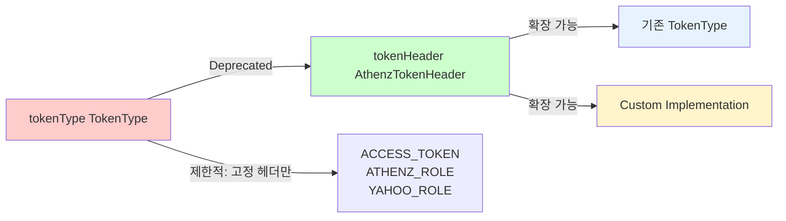
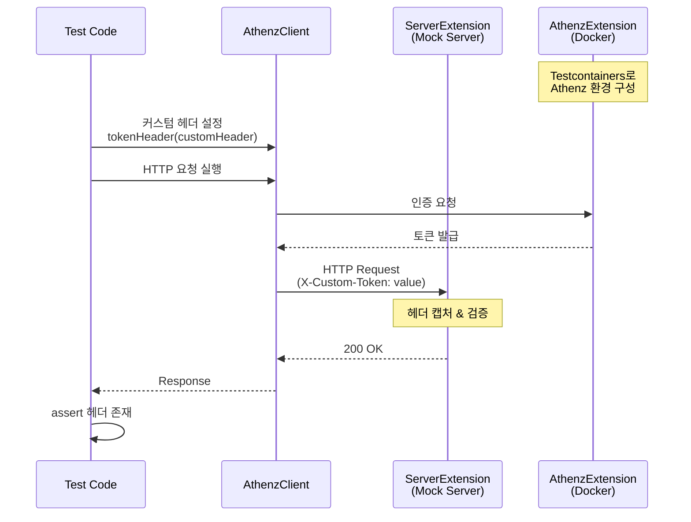
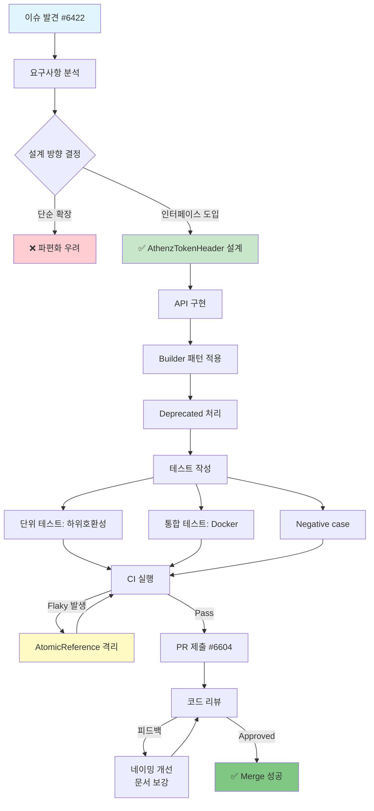

## TL;DR
- **문제:** 기존 `TokenType`에 고정된 Athenz 헤더 제약 때문에, 커스텀 헤더를 사용하는 사내 환경이나 레거시 시스템과의 통합이 어려웠다.
- **해결:** 상위 인터페이스 `AthenzTokenHeader`를 도입하고 기존 `TokenType`이 이를 구현(`implements`)하도록 설계해 **커스텀 헤더 지원 + 하위호환**을 동시에 확보했다.
- **결과:** Docker 기반 통합 테스트, negative case 검증, flaky 테스트 안정화까지 거쳐 PR이 성공적으로 merge 됐다.

---

### 1. 배경: 왜 “커스텀 헤더”가 필요했나 (#6422)
관련 이슈(#6422)의 설명은 비교적 짧았습니다.

> “헤더 이름이 고정되어 있습니다. ACCESS_TOKEN, ATHENZ_ROLE_TOKEN, YAHOO_ROLE_TOKEN.”
>
> “표준 Athenz 헤더 이름 대신 사용자 지정 헤더 이름을 사용하는 것을 선호한다는 내부 피드백을 받았습니다.”

정리하면, 헤더 이름이 프레임워크 내부에 고정되어 있어 사용자 지정 헤더를 사용할 수 없다는 점이 문제였습니다. 이 상태에서 커스텀 헤더를 쓰려면 Armeria의 Athenz 모듈을 온전히 활용하기 어렵고, 클라이언트/서버 단에서 별도의 래퍼(wrapper)를 만들거나 헤더 변환 로직을 덧대는 우회가 필요했습니다.

처음엔 솔직히 “헤더 이름 옵션 하나 추가하면 끝 아님?”이라고 생각했습니다.

---

### 2. 요구사항 정리 (설계 전 체크리스트)
메인테이너가 제시한 요구사항은 크게 두 가지였습니다.

1. 사용자 지정 헤더를 사용할 수 있도록 개선할 것
2. 커스텀 헤더가 `AthenzClient`, `AthenzService`, `@RequiresAthenzRole` 애노테이션 등 모든 경로에서 매끄럽게 지원될 것

두 번째 요구사항을 보고, 단순히 “헤더 이름 문자열”만 인자로 넘기는 방식은 코드가 여기저기 파편화되고 유지보수성이 떨어질 것이라 판단했습니다.

그래서 더 깊이 분석했고, 여기서부터 “아 이건 설계부터 다시 잡아야겠다”로 방향을 틀었습니다. 결론은 **하위호환성은 철저히 유지하면서도 확장성 있게 가져갈 수 있는 상위 추상화(인터페이스) 도입**이었습니다.

---

### 3. 설계: `AthenzTokenHeader`라는 확장 포인트
처음엔 `TokenType` enum 자체에 `headerName` 같은 필드를 조작하는 방식도 떠올렸습니다. 하지만 단순히 “이름”만 늘리는 방식은 확장 포인트로서 한계가 컸고, 토큰 타입에 따라 달라지는 의미(Role/Access 구분, auth scheme 적용 여부 등)를 함께 담아내기 어려웠습니다.

그래서 구조를 근본적으로 바꾸는 방향을 택했습니다. 핵심 아이디어는 다음과 같습니다.

- 기존의 고정 헤더(`TokenType`)는 새롭게 만든 상위 인터페이스(`AthenzTokenHeader`)를 구현하도록 만들어 **하위호환을 완벽히 유지**한다.
- 사용자 지정 헤더가 필요한 경우, 사용자가 직접 `AthenzTokenHeader`를 구현해서 주입할 수 있도록 열어둔다.

```java
public interface AthenzTokenHeader {
    static AthenzTokenHeader ofAccessToken() {
        return TokenType.ACCESS_TOKEN;
    }

    static AthenzTokenHeader ofAthenzRoleToken() {
        return TokenType.ATHENZ_ROLE_TOKEN;
    }

    static AthenzTokenHeader ofYahooRoleToken() {
        return TokenType.YAHOO_ROLE_TOKEN;
    }

    String name();

    AsciiString headerName();

    @Nullable
    String authScheme();

    boolean isRoleToken();
}
```

```
┌─────────────────────────┐
│  AthenzTokenHeader      │ (interface)
│  ─────────────────      │
│  + name()               │
│  + headerName()         │
│  + authScheme()         │
│  + isRoleToken()        │
└───────────▲─────────────┘
            │ implements
    ┌───────┴─────────┐
    │   TokenType     │ (enum)
    │   ─────────     │
    │ • ACCESS_TOKEN  │
    │ • ATHENZ_ROLE   │
    │ • YAHOO_ROLE    │
    └─────────────────┘
```

결과적으로 “기존 사용자(기본 헤더)는 그대로 쓰고, 필요한 사용자만 커스텀 헤더를 끼울 수 있는” 구조가 되었습니다.

---

### 4. 구현: API 표면을 사용자 친화적으로 다듬기
기능 구현 자체보다 더 중요하게 생각한 것은 **“사용자가 잘 쓸 수 있게 만드는 것(Discoverability)”**이었습니다. 새 기능을 쉽게 발견하고 자연스럽게 사용할 수 있어야 하며, 기존 API 사용자들의 마이그레이션 비용은 최소화되어야 합니다.

```java
/**
 * @deprecated Use {@link #tokenHeader(AthenzTokenHeader)} instead.
 */
@Deprecated
public AthenzClientBuilder tokenType(TokenType tokenType) {
    return tokenHeader(tokenType);
}

public AthenzClientBuilder tokenHeader(AthenzTokenHeader tokenHeader) {
    this.tokenHeader = requireNonNull(tokenHeader, "tokenHeader");
    return this;
}
```

Builder에 `AthenzTokenHeader`를 받는 새로운 설정 메서드(`tokenHeader`)를 추가하고, 기존 `tokenType(...)` 계열의 메서드는 `@Deprecated` 처리 후 새 메서드로 포워딩되도록 정리했습니다.

이 과정에서 Javadoc과 IDE 자동완성을 고려해, 사용자가 “어떻게 커스텀 헤더를 끼워 넣는지”를 문서 레벨에서 직관적으로 파악할 수 있도록 신경 썼습니다.

API 마이그레이션 전략을 다이어그램으로 표현하면:



#### 리뷰 과정에서 반영된 포인트
```java
// before: header(...)
// after:
public AthenzServiceBuilder tokenHeader(AthenzTokenHeader tokenHeader) {
    ...
}
```

리뷰 과정 중 “메서드 이름이 너무 범용적이다”라는 피드백이 기억에 남습니다. `header()`라는 이름은 의미가 모호할 수 있기 때문에, `tokenHeader()`처럼 의도를 명확히 드러내는 네이밍으로 개선했습니다.

또한, 팩토리 메서드 추가나 `@Override` 보강 같은 작은 커밋들은 기능과 직접적 연관이 없어 보일 수 있지만, 실수 가능성을 줄이고 라이브러리 사용성을 높이는 데 핵심적인 역할을 했습니다.

---

### 5. 테스트 전략: “써보지 못해도” 동작을 증명하는 방법
이번 PR에서 가장 까다로웠던 부분은 테스트였습니다. Athenz는 인프라 의존성이 커서 PR 작성자가 실제 조직의 인증 환경을 완벽히 재현하기 어렵습니다.

따라서 **“로컬에서 실제 Athenz 서버를 붙여보지 않더라도”** 코드 레벨에서 충분히 신뢰할 수 있는 증거를 남기는 방향으로 테스트를 설계했습니다. 커스텀 헤더의 경우 테스트를 어떻게 접근해야 할지 처음엔 막막했지만, 단위 테스트와 통합 테스트로 나누어 단계적으로 검증했습니다.

#### 5.1 단위 테스트: 하위 호환성 검증
```java
public enum TokenType implements AthenzTokenHeader {
    ACCESS_TOKEN(HttpHeaderNames.AUTHORIZATION, false, "Bearer"),
    ATHENZ_ROLE_TOKEN(HttpHeaderNames.ATHENZ_ROLE_AUTH, true, null),
    YAHOO_ROLE_TOKEN(HttpHeaderNames.YAHOO_ROLE_AUTH, true, null);

    @Override
    public AsciiString headerName() {
        return headerName;
    }

    @Override
    public boolean isRoleToken() {
        return isRoleToken;
    }

    @Override
    @Nullable
    public String authScheme() {
        return authScheme;
    }
}
```

가장 먼저 기존 `TokenType` enum이 새로 도입된 `AthenzTokenHeader` 인터페이스의 스펙을 준수하는지 확인했습니다. `ACCESS_TOKEN`, `ATHENZ_ROLE_TOKEN` 등이 하위 호환성을 유지하며 올바른 `headerName`, `isRoleToken`, `authScheme` 값을 반환하는지 체크하여, 상위 추상화를 도입하더라도 기존 동작이 깨지지 않음을 검증했습니다.

#### 5.2 통합 테스트: 실제 요청/헤더 흐름 검증 (Docker 기반)

테스트 아키텍처는 다음과 같이 구성했습니다:



```java
@EnabledIfDockerAvailable
class AthenzClientTest {
    @Order(1)
    @RegisterExtension
    static final AthenzExtension athenzExtension = new AthenzExtension();

    @Order(2)
    @RegisterExtension
    static ServerExtension server = new ServerExtension() {
        @Override
        protected void configure(ServerBuilder sb) {
            sb.service("/api", (ctx, req) -> {
                // capture headers...
                return HttpResponse.of(HttpStatus.OK);
            });
        }
    };
}
```

실제 환경과 유사한 검증을 위해 Testcontainers(Docker)를 활용한 Athenz 스캐폴드(`AthenzExtension`)를 띄웠습니다. `ServerExtension`을 통해 서버 쪽 API 경로(`/api`)를 구성하고, 클라이언트가 실제 커스텀 헤더를 담아 HTTP 요청을 보내도록 만들었습니다.

서버 내부 캡처 블록에서 헤더가 누락 없이 올바르게 추출되는지 `assert`하여 실제 요청 흐름에서의 정상 동작을 증명했습니다. 즉, “서버가 응답을 잘 준다”가 아니라 **요청에 실제로 어떤 헤더가 실려 갔는지**를 테스트에서 직접 증명했습니다.

#### 5.3 Negative case 추가: 실패해야 할 때 확실하게 실패
```java
@Test
void unauthorizedWithUnknownHeader() {
    final AggregatedHttpResponse response =
            get("/api/custom", new CustomHeader("X-Unknown-Token"), FOO_SERVICE);
    assertThat(response.status()).isEqualTo(HttpStatus.UNAUTHORIZED);
}

@Test
void unauthorizedWithInvalidTokenValue() {
    final BlockingWebClient client = WebClient.builder(server.httpUri()).build().blocking();
    final AggregatedHttpResponse response = client.execute(
            RequestHeaders.builder()
                         .method(HttpMethod.GET)
                         .path("/api/custom")
                         .add("X-Company-Token", "invalid-token")
                         .build());
    assertThat(response.status()).isEqualTo(HttpStatus.UNAUTHORIZED);
}
```

인증/인가 기능인 만큼 “성공”보다 “비정상 요청을 확실히 차단하는가”를 검증하는 것이 필수라고 생각했습니다. 알려지지 않은 토큰 헤더(`X-Unknown-Token`)를 주입하거나, 헤더 키는 맞지만 값이 유효하지 않은(`invalid-token`) 케이스를 테스트에 추가했습니다.

이러한 요청들이 비즈니스 로직에 도달하기 전에 정확히 `401 UNAUTHORIZED` 상태 코드를 반환하며 실패하는 것을 확인했습니다.

#### 5.4 CI에서 터진 테스트와 해결: flaky 제거
```java
private static final AtomicReference<String> capturedHeaderName = new AtomicReference<>();
private static final AtomicReference<String> capturedHeaderValue = new AtomicReference<>();

@BeforeEach
void setUp() {
    capturedHeaderName.set(null);
    capturedHeaderValue.set(null);
}
```

헤더 캡처는 서버 스레드에서 일어나고 assert는 테스트 스레드에서 수행되기 때문에, 스레드 안전하게 값을 공유하려고 `AtomicReference`를 사용했습니다.

다만 통합 테스트를 진행하다 보니, 이 `AtomicReference` 상태가 테스트 간에 공유되면서 CI 환경에서 간헐적으로 테스트가 실패하는 현상(flaky)이 발생했습니다. 이를 해결하기 위해 JUnit의 `@BeforeEach`를 사용하여 매 테스트 시작 전에 캡처 변수들을 명시적으로 `null`로 초기화했습니다.

덕분에 테스트 간 격리성(isolation)을 확보하고 불안정한 빌드 문제를 해결할 수 있었습니다. (덤으로 이번에 `AtomicReference`도 제대로 알게 됐습니다.)

---

### 6. 리뷰/협업: PR이 머지되기까지의 실제 흐름
리뷰를 받으며 가장 인상 깊었던 점은 **“이 오픈소스를 실제로 쓰는 사용자의 경험(문서, API 직관성, 사이드 이펙트 제어)”**을 얼마나 세밀하게 챙겨야 하는지 깨달은 것입니다.

리뷰 코멘트로 실제로 바뀐 것도 있는데, 예를 들어 `header()` 같은 모호한 이름은 `tokenHeader()`로 정리했고, deprecated API는 새 API로 포워딩해서 마이그레이션 경로를 만들었습니다.

Deprecated 처리된 기존 메서드들이 만들 수 있는 사이드 이펙트를 최소화하기 위해 최신 API로 자연스럽게 연결하고, Javadoc 문서를 직접 꼼꼼히 수정하며 레거시 사용자까지 배려해야 했습니다. 메인테이너들과 지속적인 리뷰 핑퐁 끝에 PR이 merge 되었을 때 남겨진 _“Thanks @JAEKWANG97”_ 한 마디는 큰 성취감으로 다가왔습니다.

---

### 마무리: 배운 점 + 다음 개선 아이디어
이번 기여를 통해 오픈소스 생태계에서 **하위 호환성을 해치지 않으면서 확장 포인트를 설계하는 방법**을 깊이 체득할 수 있었습니다. 단순한 기능 구현을 넘어, API 네이밍과 테스트 스캐폴딩, edge case 방어까지 종합적으로 고민하는 귀중한 경험이었습니다.

전체 기여 과정을 정리하면:



**핵심 배운 점:**
- 확장성과 하위호환성의 균형을 인터페이스 설계로 해결
- API 사용성(Discoverability)이 기능 자체만큼 중요
- 인프라 의존성이 큰 기능도 Docker와 Mock으로 충분히 검증 가능
- Negative case와 flaky 테스트 처리가 실전에서 필수

**관련 링크:**
- [Issue #6422](https://github.com/line/armeria/issues/6422)
- [Pull Request #6604](https://github.com/line/armeria/pull/6604)
