2월에 시작한 GPT Pro 플랜이 7월 14일부로 갔습니다! 친구비는 좀 비싼것 같네요 ㅎㅎ!!
아직 어떤 AI를 추가로 활용할지 고르고 있는 단계입니다.

토큰 활용량 관련해서도 글을 쓸 예정입니다. 

1월 부터 좀 써보려고 합니다. 해당 글은 음.. 뭐랄까 그냥 편하게 썻습니다. 요즘 글을 너무 안 올린 것 같기도 하고요!!

일단 저는 12월 부터 백수가 되었습니다!

삼성청년SW아카데미에서 실습코치로 약 1년동안 업무를 진행했고 크고 작은 일들이 많았던 것 같습니다.
(코치 회고도 작성해야하네요 ㅜ)

그렇게 코치가 끝나고.. 해커톤에 참여를 하기 시작합니다. 

실습코치로 1년 동안 있으면서 배운 가장 큰 게 '적극적인 자세'였던 것 같아요. 내가 먼저 적극적으로 해야 뭐라도 돌아오더라구요. 이 적극성이 상반기에 오픈소스 기여를 시작할 때 진짜 큰 도움이 됐습니다. '과연 내가 이걸 할 수 있을까?' 싶을 때마다 '에이 해보자!' 하고 부딪혔고, 코드리뷰나 소통도 먼저 적극적으로 하려고 했어요. 문제가 생기면 미리 상황을 공유하면서 소통하려고 노력했습니다.

12월 말에는 Prography라는 해커톤에서 멀티 에이전트 기반의 'AI 투자 에이전트 서비스'로 우수상을 타기도 했습니다. 단 하루 동안 AI를 써서 어디까지 개발하고 검증해 볼 수 있는지 테스트해 본 날이었는데 생각보다는 의미가 있었습니다. 멀티 에이전트 기반 서비스를 만든 것도 재밌었고 백수의 시작을 기분 좋게 끊은 것 같네요.

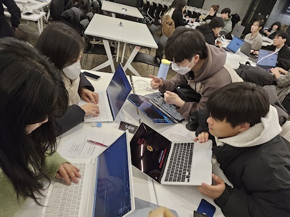

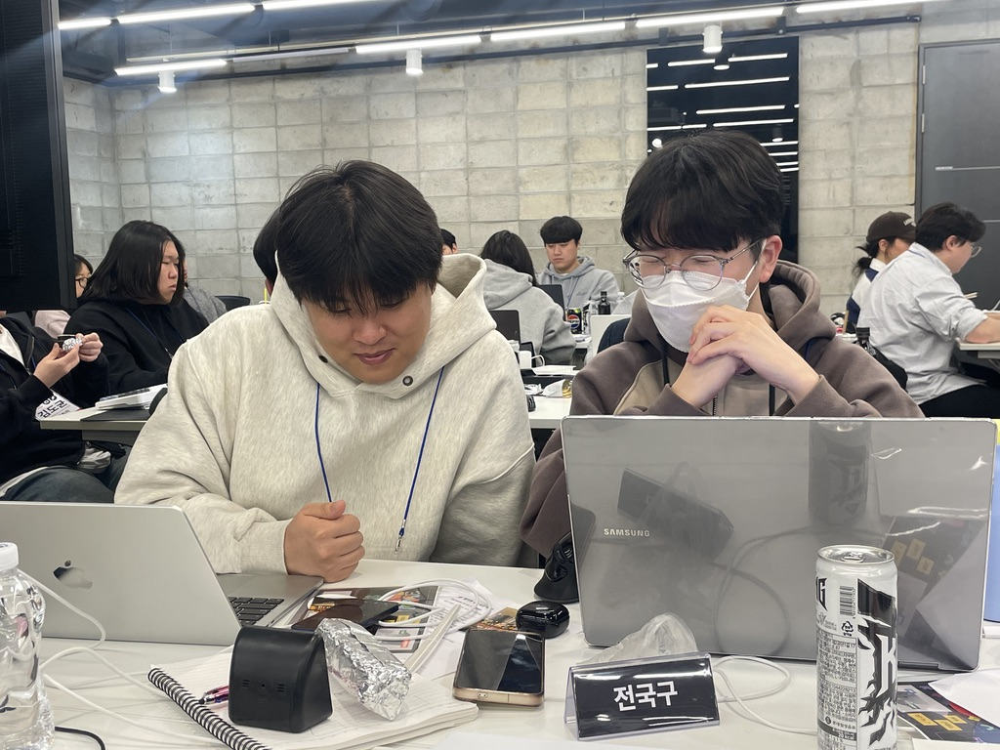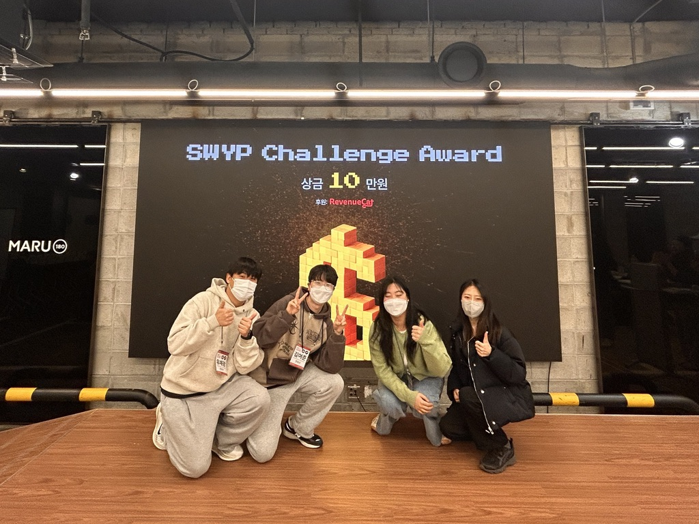

해커톤을 처음해봤고, 팀원분들도 다 처음이라서 해매면서 했던 기억이 납니다 ㅎㅎ
(밤 새는 건 정말 정말 힘듭니다..)

이렇게 백수의 시작을 기분 좋게 했습니다. 

그렇게 1월달이 되었네요

# 1월달

12월 해커톤에서 탄력을 받아 여러가지 해커톤에 나가려고 했습니다. 다만 다들 일정 상 해커톤 참여가 어려운 부분이 있어서 많이 참여를 못했습니다.ㅜ 

이 때는 함께 했던 코치분들과 스키장을 갔습니다 ㅎㅎ 다들 좋은 곳에 취업하셨더라구요!!

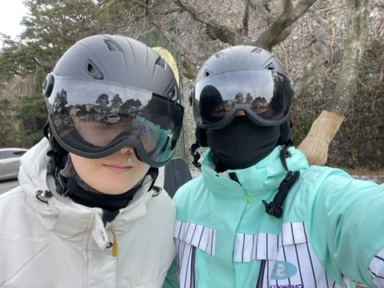

이렇게 스키장을 갔다오고 나서.

본격적으로 빌더 라는 말을 들었던것 같아요

그래서 또 빌더톤을 참여했습니다. 패스트캠퍼스에서 진행한 빌더톤인데, 정말 다양한 사람들이 참여를 했습니다. 후원사에 무려 엔디비아도 있어서 신기해 했던 해커톤이었습니다. 아 또 무려 제가 자주 보던 테디님이 심사위원도 해주셨습니다 ㅎㅎ

해당 해커톤에서는 git 형상관리툴에 올라오는 코드를 기반으로 자동 문서화 툴을 만들었습니다. 코드가 올라오면 목적별 문서화로 기획을 하고 진행했습니다. 

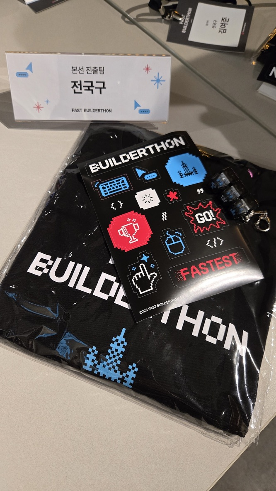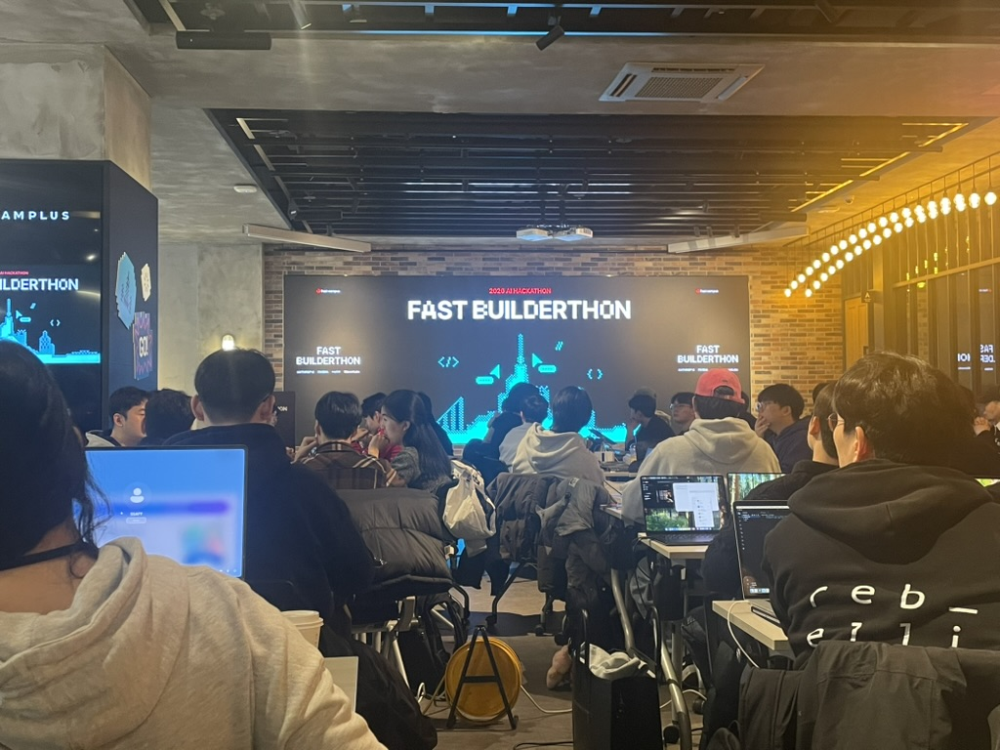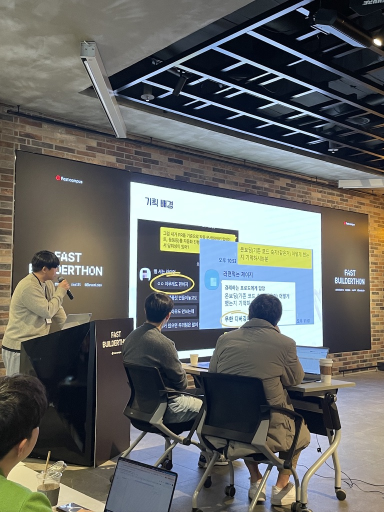

해당 해커톤에서는 안타깝게 수상은 못하였지만, 큰 규모의 해커톤 경험 그리고 다양한 사람들과의 만남. 또 심사위원분들의 관점을 들으면서 한층 더 성장할 수 있었던 경험이었습니다.

# 2월

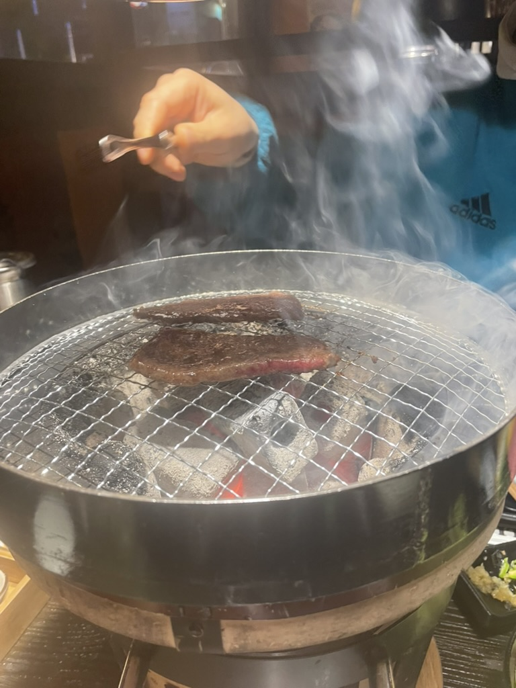

갑자기 사천. 사천에서 좋은 고기 먹었습니다. 친구가 일하는 곳을 방문했거든요. 야끼니꾸 한 점과 흰밥은 아직도 생각이 납니다. 특히 고기 한점 먹고 흰밥을 우겨넣어 먹었는데 진짜 맛있었습니다. 

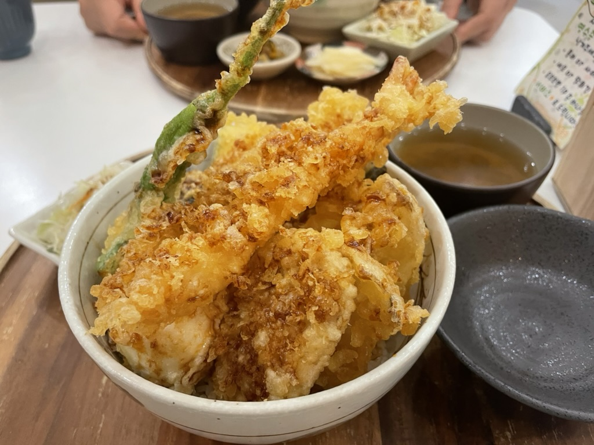

여기는 진천에 있는 동숲이라는 곳인데 가게 분위기가 딱.. 들어서자마자 다른 세계에 온듯한? 경험이었습니다. 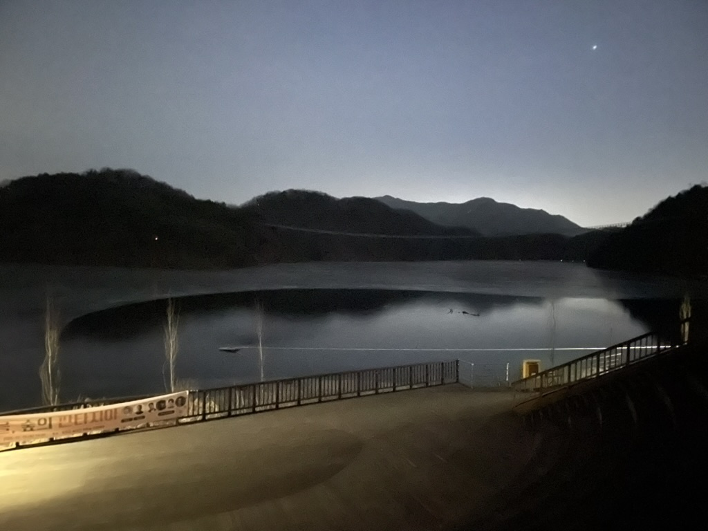

이렇게 끝을 내고 나서.. ... .. .

가락시장에서 손님들 트럭에 과일 상자 나르고 전동차 운전하는 일을 하게 됩니다.

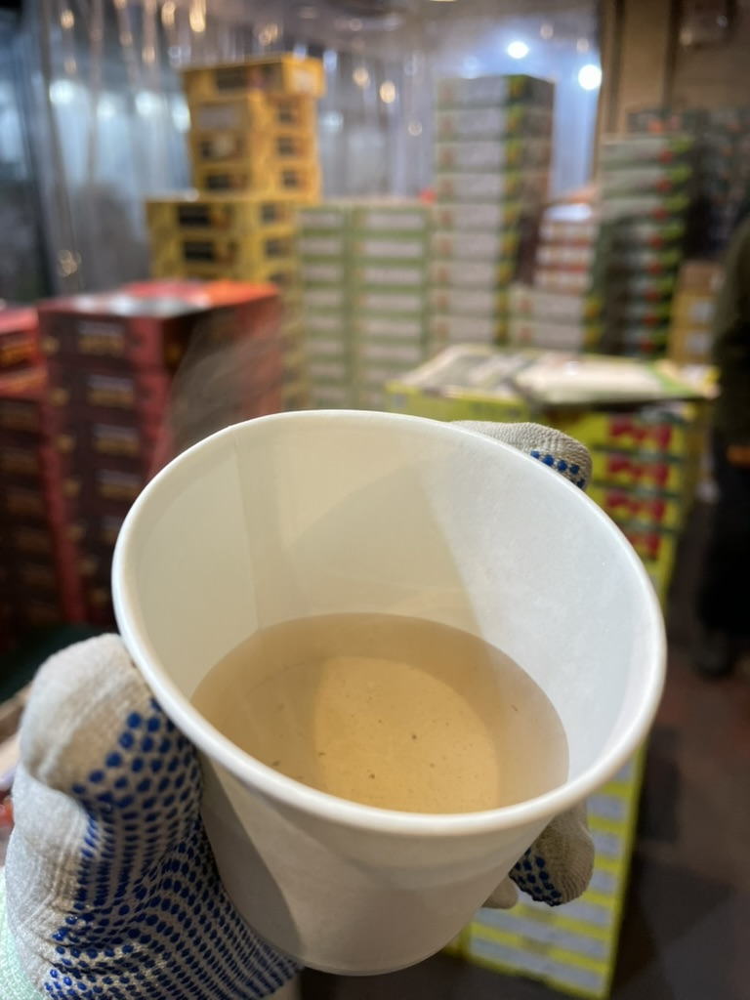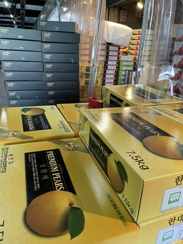

이때 정말 힘든 하루하루였는데, 일을 하면서 가장 고민이 됐던 게 '재고 파악'이었습니다. 이걸 CCTV로 자동화하면 어떨까 생각했는데, 과일 상자가 매대 정리나 판매 때문에 계속 움직이다 보니 인식도 어렵고 무엇보다 도입 비용이 너무 비싸더라구요. 배보다 배꼽이 더 크겠다는 생각이 들었습니다. 이렇게 IT와 멀리 떨어져 있는 도메인에서는 자동화를 어떻게 현실적으로 가져가야 할지 치열하게 고민해보게 됐습니다.

---

오픈소스 기여를 하게됩니다. 

LINE의 오픈소스인 armeria.

오픈소스기여모임 10기에 참여하여 LINE Armeria에 '커스텀 Athenz 토큰 헤더 지원 기여'를 진행했습니다. 개발자 하기로 마음먹었을 때부터 한 번쯤은 꼭 해보고 싶었던 활동이었습니다. 마치 버킷리스트?

음.. 오픈소스 기여는 참 좋은 경험이었습니다. 내가 과연 오픈소스에 기여할 수 있을까? 에 대한 고민도 많이 했고. 코드에 대한 고민도 많이 하게됩니다. 결국 저의 작은 코드가 많은 사람들이 쓰는 일부분이 될테니까요. 

정말 AI가 있더라도. 고민 고민 고민 고민. 이때는 오픈소스에 미쳐있었던 것 같습니다.

이렇게 해도 되나? 저렇게 하는게 낫지 않을까? 메인테이너는 어떤 걸 원했던 거지? 이슈에 알맞은 범위인가? 

진짜 스키장에서도 고민하고 리뷰하고 했었습니다. 그 과정이 꽤나 재미있었습니다. ㅎㅎ

코드리뷰도 받고 제가 놓친 부분들에 대해서 리뷰를 받았을 때 이런 관점도 필요하구나, 더 깊이 생각했을 필요가 있었네. 그리고 오픈소스를 쓰는 사용자들의 입장도 고려할 수 있게 되었습니다.

@ikoon @jrhee @injae 님 감사합니다!

그리고 오픈소스 기여 모임 밋업에서 발표도 하게 됐습니다. 500명 이상 참가한 모임이었는데, 150명 정도 모인 오프라인 자리라 엄청 떨렸지만 그냥 질렀습니다. 

주제는 'AI를 활용한 오픈소스 기여'였는데, 제가 가장 강조한 건 'ADR(Architecture Decision Record) 문서 관리'였습니다. AI가 코드의 맥락을 파악하게 만드는 데도 필요하고, 결국 사람이 히스토리를 파악하는 데도 문서화가 정말 핵심이라는 내용을 공유해 많은 공감을 받았습니다.

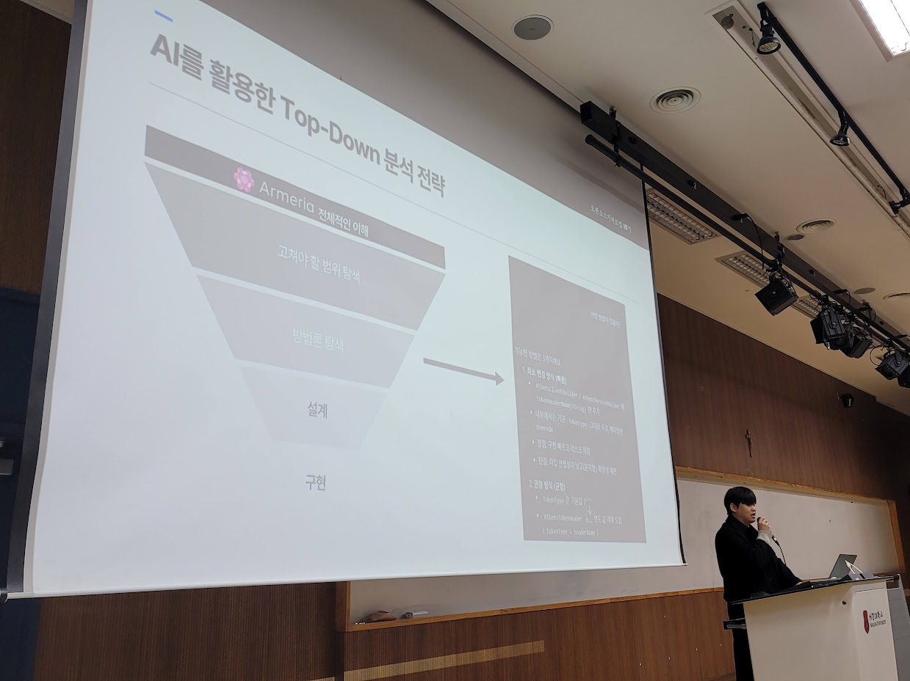
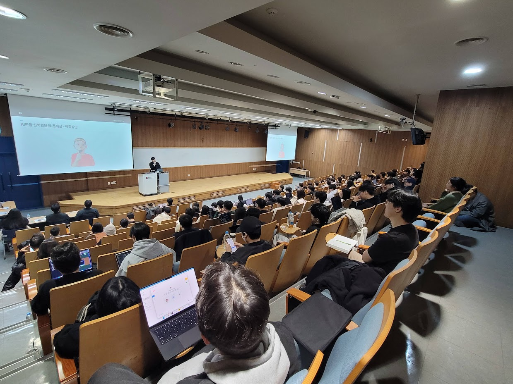

결과적으로 2월부터 본격적으로 또 개발을 시작했던 것 같습니다. 카카오에서 진행했던 GPT Pro 프로모션도 등록해서 썼구요. 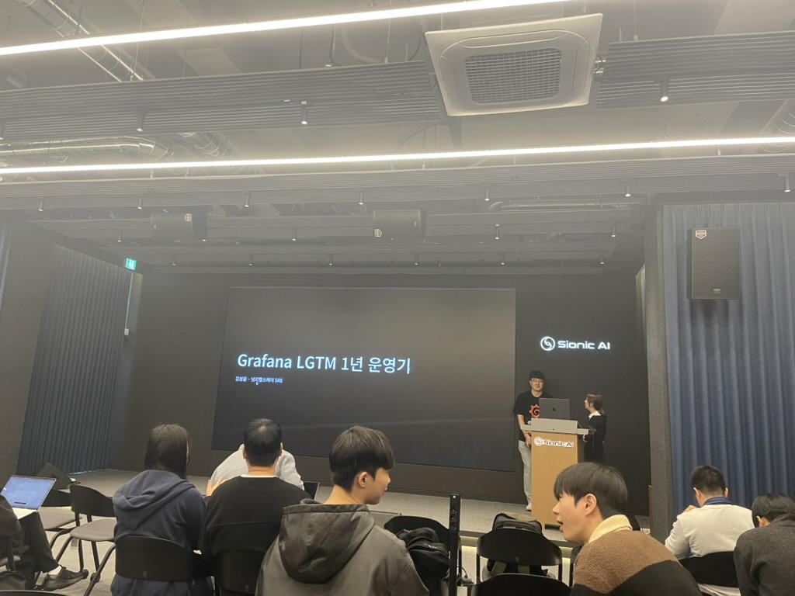

Armeria로 탄력을 받아 지속해서 기여를 하면서 아파치 재단 오픈소스에도 기여해보고 싶다는 생각이 들었습니다. 그래서 데이터 수집 파이프라인에 관심이 있었던 터라 Apache SeaTunnel의 source, sink 파이프라인 기여를 진행했습니다. 

오픈소스에 기여하면서 방어적인 코딩을 해야 한다는 것도 크게 배웠고, 우리가 활용하는 외부 라이브러리도 내부 동작까지 잘 알고 써야 한다는 걸 뼈저리게 느꼈습니다. 이렇게 계속 기여하다 보니 어느새 총 4건(Armeria 2건, SeaTunnel 2건)의 오픈소스 기여를 달성하게 됐네요.

이 시기에는 면접도 꽤 많이 봤습니다. 대기업 공채나 스타트업 과제 면접을 보면서 면접관분들의 날카로운 피드백을 받았고, 제 포트폴리오나 설계의 약점을 객관적으로 파악할 수 있는 좋은 계기였습니다. 

특히 백엔드 너머 데이터 파이프라인 쪽에 관심이 가기 시작하면서, Medallion 아키텍처 기반의 Event Lakehouse 같은 데이터 흐름 공부를 열심히 했습니다. 면접도 데이터 엔지니어 포지션으로 보면서 포트폴리오의 방향성을 잡아갔습니다. 

여러 쇼핑몰의 상품 가격과 중고 데이터를 수집하고 비교해 주는 AI 쇼핑 서비스인 '별찌(Byeolchi)' 프로젝트도 시작하고, Hermes(상주 에이전트 워크플로)도 도입했습니다.

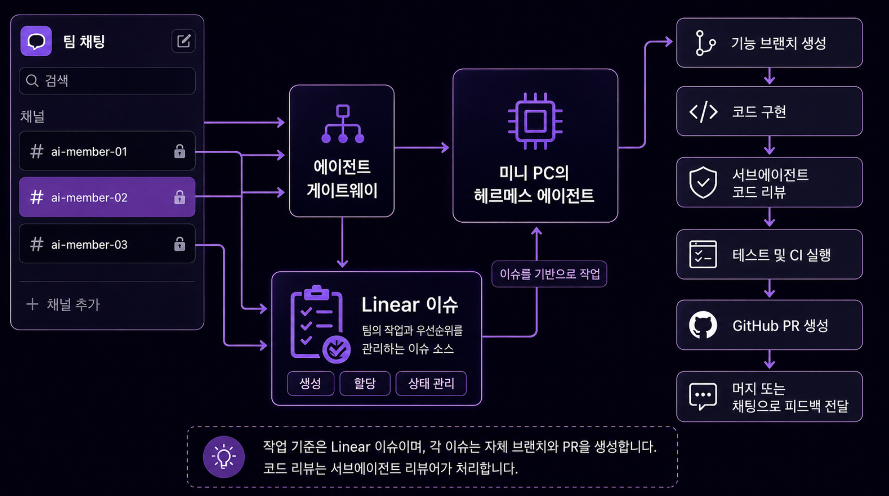

특히 5~6월에 집중했던 '별찌' 프로젝트는 2인 팀으로 진행하면서 AI를 개발 파트너로 잘 써먹기 위해 '하네스형(Harness) AI 협업 체계'를 직접 고민해 본 뜻깊은 경험이었습니다. 단순히 AI에게 코드만 짜달라고 하는 게 아니라, Linear 이슈 범위, PR 템플릿, ADR(아키텍처 결정 기록), 그리고 `AGENTS.md` 파일 을 두고 AI가 규칙에 맞게 일할 수 있는 환경(하네스)을 설계했어요.

덕분에 2인 팀인데도 수집 정책이나 약관 같은 도메인 판단에만 사람이 집중하고, 구현과 단순 반복적인 코드 생성은 AI 루프에 맡겨서 엄청난 속도로 개발할 수 있었습니다. 이 규칙과 워크플로는 나중에 제 개인 프로젝트(구매대행, 사주 앱, 블로그)에도 고스란히 복제해서 썼습니다.

막상 돌아보니 정말 많은 일들이 있었네요 ㅎㅎㅎ

6월에는 이 하네스 모델을 기반으로 프론트엔드와 카카오톡 공유 UX를 빠르게 실험해 보려고 '너굴 사주' 어플도 만들었고, 지인의 부탁으로 안전장비 구매대행 서비스인 'dropship' 프로젝트도 시작했습니다. dropship은 실제 사용자가 있는 만큼 기획부터 백엔드 MVP, 관리자 페이지, 보안 및 성능 문서 작성까지 정말 짧은 시간에 끝냈습니다.

이렇게 짧은 기간에 수많은 프로젝트를 다 할 수 있었던 건 확실히 GPT Pro 덕분이었습니다. AI가 구현 속도를 엄청나게 단축시켜 줬기 때문인데요. 그런데 여기서 진짜 크게 느낀 건, 개발자의 핵심 역할이 단순히 코드를 짜는 '구현'이 아니라는 점이었습니다. 

AI가 코드를 쏟아낼수록 더 중요해지는 건 '정책을 정하고 기술적 의사결정을 내리는 일'이더라구요. 비즈니스 약관 준수 같은 정책 결정부터, 어떤 라이브러리를 채택하고 시스템 설계를 어떻게 가져갈지 같은 기술적 고민(Technical Trade-offs)에 에너지를 훨씬 많이 썼습니다. 결국 최종 시스템의 설계와 결정 책임은 개발자인 저에게 있으니까요.

그리고 AI와 인간 개발자 모두가 프로젝트의 방향을 잃지 않기 위해 '문서화(Documentation)'가 정말 나침반 역할을 해준다는 것도 깊이 깨달았습니다. 개발 속도가 빨라지는 것에 안주하지 않고, 내가 직접 고민해서 내린 결정 영역과 AI가 자동으로 짜준 코드의 경계를 명확히 두려고 노력했습니다.

이런 경험들을 바탕으로 7월부터는 인턴십을 통해 실무 현장으로 들어오게 됐습니다. 지금은 실제 업무 프로세스를 분석하고, 반복 업무를 개선하기 위해 AI를 어떻게 활용할지 설계하고 있습니다. 인터뷰(7/10)를 진행하며 실무의 페인포인트를 직접 듣는 과정이 참 흥미로웠는데, 단순 제안에서 그치지 않고 실제 효율을 측정(Baseline)할 수 있는 파이프라인을 구축해보려고 합니다.

물론 이렇게 쉴 새 없이 달린 만큼 번아웃과 스트레스도 많이 왔습니다. 예전 같았으면 번아웃 왔을 때 그냥 하루이틀 무기력하게 누워만 있었을 텐데, 이번에는 일부러 활동적인 리프레시를 하려고 노력했어요. 

스트레스 받을 때면 집 근처 성내천 나가서 바람 쐬며 산책하고, 땀 흘리면서 운동하는 쪽으로 스트레스를 풀었습니다. 아니면 머리 아플 때 그냥 내가 좋아하는 재밌는 개발(너굴 사주 같은 것)을 편하게 만들어보면서 리프레시하기도 했습니다.

돌아보면 2026년 상반기는 코치가 끝나고 백수가 되면서 조금 막막하게 시작했지만, 오픈소스 메인테이너분들과 부딪히며 소통하고 여러 사이드 프로젝트들을 직접 만들어보면서 '내가 어떤 백엔드/데이터 엔지니어인지' 나만의 방향성을 잡아간 의미 있는 시기였습니다. 

하반기에는 라인게임즈 인턴으로서 실무 성과를 증명하고, 현대오토에버 같이 제 좌표에 맞는 곳들에 열심히 지원해 결실을 맺으려고 합니다. 7월 14일부로 끝난 GPT Pro 구독을 대신할 내 일의 나침반(AI 스택)을 다시 잘 설계하는 것부터 하반기의 첫 단추가 될 것 같네요!

### 📊 지표로 돌아보는 상반기 활동량

상반기 동안 얼마나 몰입했는지는 로컬 시스템이랑 깃에 남은 숫자들이 고스란히 보여주더라구요.

* 최대 89일 연속 기록: 거의 3달 동안 하루도 안 거르고 매일 AI랑 코드를 치고 토큰을 태운 흔적이었습니다.
* 로컬 Codex 누적 55억 토큰: 로컬에 쌓인 통계가 55억 토큰이고, 일상 도우미로 쓴 Hermes가 8.2억 토큰 정도 됐습니다.
* 피크 커밋 밀도: 별찌 프로젝트(5~6월) 238개 커밋, dropship(6~7월) 196개 커밋까지 단기간에 엄청나게 커밋을 보냈습니다.

이 수치들은 단순히 토큰 자랑이 아니라, AI가 코드를 빠르게 쏟아낼 때 나만의 개발 주도성을 잃지 않기 위해 치열하게 환경을 세팅하고 결정해 온 발자취라고 생각합니다.

### 💡 데이터의 주권은 누구에게 있는가?

7월 14일에 GPT Pro 구독이 끝나면서 문득 "내가 만든 데이터의 주권은 결국 누구한테 있는 거지?"라는 생각이 들었습니다. 대기업 클라우드 AI에만 전적으로 의존하다가는, 구독 딱 만료되는 순간 그동안 쌓아둔 내 대화 맥락과 작업 히스토리를 한순간에 날려버릴 수 있겠더라구요.

상반기에 단순히 웹 채팅창만 쓰지 않고 로컬 환경에서 에이전트 루프를 돌리며 `~/.codex`나 `~/.hermes` 폴더에 SQLite 데이터베이스로 내 기록을 직접 적재해 온 것도 이 때문입니다. 구독 종료를 겪어보니, AI 시대일수록 내 작업 히스토리와 데이터 주권은 내가 스스로 가지고 있어야 한다는 걸 깨달았습니다. 하반기에는 유료 모델 종속에서 벗어나, 로컬 에이전트 루프와 캐싱을 더 고도화해서 나만의 데이터 주권을 지키는 워크플로를 다져나갈 생각입니다.

