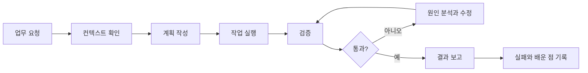

## 들어가며

요즘 AI를 쓰다 보면 가끔 이런 생각이 듭니다.

“분명히 모델은 좋아졌는데, 왜 작업 결과는 여전히 흔들릴까?”

프롬프트를 조금 더 자세히 쓰면 한 번의 답변은 좋아집니다. 하지만 실제 작업에서는 한 번의 좋은 답변보다 더 어려운 문제가 있습니다.

같은 프로젝트를 다음 날 다시 맡겼을 때도 맥락을 기억하는가. 코드를 수정한 뒤 테스트를 실행하는가. 잘못된 패턴을 반복하지 않는가. 위험한 작업 앞에서는 멈추는가. 실패한 경험이 다음 작업 방식에 남는가.

이런 질문을 생각하다 보면 AI 활용의 초점이 조금 달라집니다. “어떤 문장으로 물어볼까?”보다 “AI가 일할 수 있는 환경을 어떻게 만들까?”가 더 중요해집니다.

이때 필요한 관점이 `Harness Engineering`입니다. 저는 이 개념을 “AI에게 일을 잘 시키는 프롬프트 기술”이라기보다, AI가 반복적으로 안정적인 결과를 내도록 만드는 실행 환경 설계로 이해했습니다.

```text
Model   = 능력
Harness = 그 능력을 실제 업무 성과로 바꾸는 실행 체계
```

좋은 모델을 고르는 것만으로는 부족합니다. 모델이 어떤 정보를 보고, 어떤 도구를 쓰고, 어떤 순서로 작업하며, 무엇으로 검증받고, 실패했을 때 어떻게 수정할지까지 함께 설계해야 합니다.

---

## 프롬프트만으로는 부족한 이유

프롬프트는 중요합니다. 좋은 질문은 좋은 답변을 만들 가능성을 높입니다.

그런데 프롬프트는 보통 “이번 한 번의 응답”에 가깝습니다. 반면 실제 일은 한 번의 응답으로 끝나지 않습니다. 요구사항을 읽고, 관련 파일을 찾고, 수정하고, 테스트하고, 실패하면 다시 고치고, 결과를 설명하는 흐름 전체가 필요합니다.

예를 들어 코딩 작업을 맡긴다고 생각해보겠습니다.

“이 버그 고쳐줘”라고만 하면 AI는 바로 코드를 수정하려고 할 수 있습니다. 운이 좋으면 맞을 수도 있지만, 프로젝트의 기존 패턴을 놓치거나 테스트 없이 완료했다고 말할 수도 있습니다.

반대로 작업 환경에 다음 정보가 정리되어 있다면 결과가 달라집니다.

- 이 프로젝트에서 먼저 읽어야 할 문서
- 기존 코드 패턴을 찾는 방법
- 수정 전 확인해야 할 리스크
- 반드시 실행해야 할 테스트 명령
- 변경하면 안 되는 public API
- 실패했을 때 중단하거나 사람에게 물어봐야 하는 기준

이 정도가 있으면 AI는 단순히 답을 생성하는 쪽에서, 정해진 절차를 따라 작업하는 쪽에 가까워집니다.

그래서 프롬프트 엔지니어링과 하네스 엔지니어링은 초점이 조금 다릅니다.

| 구분      | 프롬프트 엔지니어링 | 하네스 엔지니어링                     |
| --------- | ------------------- | ------------------------------------- |
| 초점      | 한 번의 응답 품질   | 반복 가능한 업무 수행 품질            |
| 단위      | 질문, 지시문        | 작업 시스템                           |
| 핵심      | 표현 방식           | 구조, 도구, 검증, 피드백              |
| 실패 처리 | 다시 물어보기       | 실패 원인을 규칙, 문서, 테스트로 반영 |
| 결과      | 좋은 답변           | 재현 가능한 워크플로우                |

프롬프트는 하네스의 일부입니다. 하지만 하네스는 프롬프트보다 넓습니다.

---

## 하네스는 무엇으로 구성될까

하네스라고 하면 조금 거창하게 들릴 수 있습니다. 하지만 실제로는 AI가 일할 때 필요한 주변 장치들을 하나씩 정리하는 일에 가깝습니다.

저는 크게 일곱 가지로 나누어 볼 수 있다고 생각했습니다.

### 1. 컨텍스트 하네스: 무엇을 보고 일할 것인가

AI가 좋은 판단을 하려면 먼저 볼 수 있는 정보가 있어야 합니다.

프로젝트 목적, 아키텍처 원칙, API 계약, 테스트 방법, 금지 패턴, 운영상 주의점이 사람 머릿속이나 메신저에만 있으면 AI 입장에서는 없는 정보와 비슷합니다.

그래서 중요한 프로젝트 지식은 가능하면 repository-local, versioned artifact로 남기는 편이 좋습니다.

```text
AGENTS.md
CLAUDE.md 또는 GEMINI.md
docs/
  ARCHITECTURE.md
  API_SPEC.md
  DECISIONS.md
  QUALITY_RULES.md
  TESTING.md
  TROUBLESHOOTING.md
```

다만 `AGENTS.md` 하나에 모든 것을 몰아넣는 방식은 오래가기 어렵습니다. 저는 `AGENTS.md`는 목차와 행동 규칙에 가깝게 두고, 세부 지식은 `docs/` 아래에 나누는 편이 더 낫다고 봅니다.

예를 들면 `AGENTS.md`에는 이런 것들이 들어갑니다.

```text
- 프로젝트 목적
- 반드시 지켜야 할 아키텍처 원칙
- 주요 문서 위치
- 테스트 실행 명령어
- 금지 패턴
- 작업 완료 기준
```

핵심은 AI가 매번 “처음 보는 프로젝트”처럼 행동하지 않게 만드는 것입니다.

### 2. 도구 하네스: 어떤 도구를 쓸 수 있는가

AI에게 도구를 연결하면 할 수 있는 일이 많아집니다. 파일을 읽고, 코드를 수정하고, 테스트를 실행하고, 브라우저에서 화면을 확인하고, 로그를 분석할 수 있습니다.

하지만 도구는 많을수록 무조건 좋은 것이 아닙니다. 중요한 것은 어떤 작업에 어떤 도구를 써야 하고, 어떤 도구는 쓰면 안 되는지 정하는 것입니다.

예를 들어 이런 구분이 필요합니다.

- 파일 읽기와 코드 수정은 허용한다.
- 테스트 실행과 Git diff 확인은 권장한다.
- 운영 DB 수정, 파일 삭제, 결제 취소 같은 작업은 사람 승인 없이는 하지 않는다.
- 외부 API 호출이나 대량 요청은 비용과 부작용을 먼저 확인한다.

AI에게 자율성을 줄수록 도구 경계도 같이 선명해야 합니다. 그렇지 않으면 편해지려고 붙인 도구가 오히려 위험한 실행 경로가 될 수 있습니다.

### 3. 실행 하네스: 어떤 순서로 일할 것인가

실행 하네스는 작업 절차를 고정하는 일입니다.



이 구조가 없으면 AI는 바로 구현부터 시작하기 쉽습니다. 반대로 실행 순서가 있으면 먼저 요구사항을 요약하고, 관련 파일을 찾고, 영향 범위를 확인하고, 검증 기준을 만든 뒤 작업하게 만들 수 있습니다.

취준생이나 주니어 개발자 입장에서도 이 부분은 꽤 중요합니다. 단순히 “AI가 코드를 짜줬다”가 아니라 “요구사항을 어떤 기준으로 해석했고, 어떤 검증 루프를 거쳤는지”를 설명할 수 있어야 하기 때문입니다.

### 4. 검증 하네스: 무엇으로 완료를 판단할 것인가

AI 결과를 사람이 감으로만 확인하면 불안정합니다. 특히 코드는 “그럴듯해 보이는 것”과 “실제로 동작하는 것” 사이의 차이가 큽니다.

그래서 작업 후 반드시 실행할 검증 명령을 명시해두는 것이 좋습니다.

```bash
./gradlew test
./gradlew check
npm run lint
npm run build
curl http://localhost:8080/actuator/health
```

물론 모든 프로젝트에 완벽한 테스트가 있는 것은 아닙니다. 그래도 최소한 타입 체크, 린트, 단위 테스트, 빌드, 스모크 테스트 중 무엇을 완료 기준으로 볼지 정해두면 AI가 “완료된 것처럼 보이는 결과”에서 멈출 가능성을 줄일 수 있습니다.

검증 하네스는 AI를 믿지 않기 위한 장치라기보다, AI와 사람이 같은 완료 기준을 보게 만드는 장치에 가깝습니다.

### 5. 평가 하네스: 잘했는지를 어떻게 볼 것인가

테스트가 통과한다고 항상 좋은 결과는 아닙니다.

예를 들어 자기소개서, 포트폴리오 README, 설계 리뷰, 면접 답변 같은 작업은 정답이 하나로 정해져 있지 않습니다. 이때는 평가 기준, 즉 루브릭이 필요합니다.

```text
1. 문제 정의가 명확한가
2. 대안을 비교했는가
3. 선택 이유가 근거와 연결되는가
4. 숫자나 검증 결과가 있는가
5. 내 역할이 과장되지 않았는가
6. 읽는 사람이 다음 행동을 이해할 수 있는가
```

이런 기준이 있으면 AI에게 “더 좋게 고쳐줘”라고 막연히 말하는 대신, 어떤 관점에서 부족한지 평가하게 만들 수 있습니다.

특히 포트폴리오나 면접 준비에서는 이 차이가 큽니다. 글이 매끄러운지보다, 주장이 근거와 연결되어 있는지가 더 중요하기 때문입니다.

### 6. 관측 하네스: 왜 그런 결과가 나왔는가

AI 작업은 결과만 보면 원인을 알기 어려울 때가 많습니다. 그래서 요청, 사용한 문서, 실행한 도구, 실패 지점, 재시도 횟수, 검증 결과 같은 기록을 남기는 것이 도움이 됩니다.

```text
요청
사용한 문서
사용한 도구
중간 판단
실패 지점
재시도 횟수
최종 결과
검증 결과
소요 시간과 비용
```

이 기록이 있어야 실패를 다음 하네스 개선으로 연결할 수 있습니다.

“이번에는 왜 틀렸지?”에서 끝나면 다음에도 비슷한 실수를 반복합니다. 하지만 “필수 문서를 읽지 않아서 틀렸다”, “테스트 명령이 명시되어 있지 않았다”, “사람 승인이 필요한 작업 기준이 없었다”처럼 원인을 남기면 규칙이나 문서, 테스트를 보강할 수 있습니다.

### 7. 안전 하네스: 어디서 멈춰야 하는가

AI에게 맡기는 일이 커질수록 안전 장치도 필요합니다.

예를 들어 이런 작업은 자동 실행보다 승인 절차가 먼저 있어야 합니다.

- 파일 대량 삭제
- 운영 DB 수정
- 결제 취소나 환불 처리
- 외부 API 대량 호출
- 개인정보가 포함된 응답 생성
- 보안상 위험한 shell 명령 실행

하네스 엔지니어링은 AI에게 모든 것을 맡기자는 이야기가 아닙니다. 오히려 사람이 붙잡아야 할 판단을 더 분명히 하는 일에 가깝습니다.

문제 정의, 우선순위, 위험 판단, 최종 책임은 사람이 가져야 합니다. AI는 그 기준 안에서 실행력을 높이는 쪽에 가깝습니다.

---

## 내 작업 방식에 적용해보기

이 개념이 흥미로운 이유는, 개인 학습이나 취업 준비에도 바로 적용할 수 있기 때문입니다.

처음부터 거대한 자동화 시스템을 만들 필요는 없습니다. 오히려 개인에게는 작은 하네스부터 시작하는 편이 더 현실적입니다.

### 학습 하네스

AI에게 바로 정답을 묻는 대신, 나를 훈련시키는 방식으로 쓸 수 있습니다.

```text
1. AI가 먼저 개념 질문을 낸다.
2. 내가 답한다.
3. AI가 답변을 평가한다.
4. 부족한 근거를 지적한다.
5. 더 나은 답변 예시를 제시한다.
6. 오답 노트를 만든다.
7. 다음 질문에 반영한다.
```

예를 들어 CS 면접, 시스템 설계, Kafka, Redis, Elasticsearch, AWS, 오픈소스 PR 리뷰 같은 주제에 잘 맞습니다.

중요한 건 AI가 “답변 생성기”가 아니라 “사고를 검증하는 평가자”가 되게 만드는 것입니다.

### 코딩 에이전트 하네스

코딩에서는 “AI가 코드를 많이 짜는 것”보다 “안전하게 변경하는 것”이 더 중요하다고 느낍니다.

그래서 프로젝트마다 최소한 이런 구조를 둘 수 있습니다.

```text
AGENTS.md
docs/
  ARCHITECTURE.md
  CODING_RULES.md
  API_CONTRACT.md
  TESTING.md
  TROUBLESHOOTING.md
scripts/
  test.sh
  lint.sh
  smoke-test.sh
```

그리고 AI에게는 이런 식의 작업 규칙을 줄 수 있습니다.

```text
# 작업 전
요구사항을 요약한다.
관련 파일과 기존 패턴을 먼저 찾는다.
변경 리스크를 말한다.

# 작업 중
최소 변경을 우선한다.
기존 컨벤션을 따른다.
모르는 API를 추측하지 않는다.

# 작업 후
테스트 결과를 제시한다.
변경 diff를 요약한다.
남은 리스크를 명시한다.
```

이런 규칙이 있으면 AI가 만든 결과를 나중에 내가 설명하기도 쉬워집니다. 단순히 “AI가 해줬다”가 아니라, 어떤 기준과 검증 절차 안에서 변경했는지를 말할 수 있기 때문입니다.

### 포트폴리오와 자기소개서 하네스

글쓰기에서도 하네스가 필요합니다.

AI에게 바로 “자소서 써줘”라고 하면 문장은 매끄러워질 수 있지만, 근거 없는 주장이나 과장된 표현이 섞이기 쉽습니다.

그래서 저는 오히려 AI를 편집자나 평가자로 쓰는 편이 더 낫다고 봅니다.

```text
내 프로젝트 설명을 보고 다음 기준으로 평가해줘.

1. 근거 없는 주장
2. 과장된 표현
3. JD와 연결되는 지점
4. 보강해야 할 수치
5. 더 설득력 있는 구조
```

이렇게 쓰면 AI는 글쓰기 대행자가 아니라, 증거 기반 서사를 만들기 위한 검증 도구에 가까워집니다.

취업 준비에서는 이 차이가 중요합니다. 결과물을 멋있게 포장하는 것보다, 내가 왜 그렇게 판단했는지 설명할 수 있어야 하기 때문입니다.

---

## 너무 무거운 하네스는 오히려 방해가 된다

주의할 점도 있습니다. 하네스를 만든다고 해서 처음부터 문서, 평가 시스템, 자동화 파이프라인을 크게 만들 필요는 없습니다.

하네스가 너무 무거우면 AI를 쓰기 전에 준비만 하다가 지칠 수 있습니다. 개인 작업에서는 더더욱 그렇습니다.

그래서 저는 작은 순서로 시작하는 것이 좋다고 봅니다.

1. 내가 자주 하는 작업 하나를 고른다.
2. 그 작업에서 AI가 반복해서 틀리는 지점을 적는다.
3. 그 지점을 막는 규칙이나 체크리스트를 만든다.
4. 가능하면 테스트나 스크립트로 옮긴다.
5. 다음 작업에서 실제로 줄어드는지 확인한다.

예를 들어 개인용으로는 아래 세 파일만 있어도 시작할 수 있습니다.

```text
MY_AI_RULES.md
LEARNING_MODE.md
REVIEW_RUBRIC.md
```

처음부터 완벽한 하네스를 만들기보다, 반복되는 실패가 보일 때마다 하나씩 보강하는 쪽이 더 현실적입니다.

반복 실패는 프롬프트만으로 고치기보다 규칙, 문서, 테스트로 고치는 편이 더 오래 남습니다.

---

## 마무리

저에게 하네스 엔지니어링은 결국 이런 문장으로 정리됩니다.

```text
AI를 답변 생성기로만 쓰지 말고,
나의 사고와 작업을 검증하는 실행 시스템으로 쓴다.
```

AI가 더 똑똑해지면 분명히 할 수 있는 일은 많아질 겁니다. 하지만 모델 성능이 좋아지는 것과 내 작업 결과가 안정적으로 좋아지는 것은 같은 말이 아닙니다.

그 사이에는 맥락, 도구, 절차, 검증, 평가, 기록, 안전 장치가 필요합니다.

취준생이나 주니어 개발자 입장에서는 이 관점이 특히 중요하다고 느낍니다. 이제는 “AI로 무엇을 만들었는가”만으로는 부족합니다. 그 결과를 어떤 기준으로 만들었고, 어떻게 검증했고, 실패를 어떻게 다음 작업 방식에 반영했는지까지 설명할 수 있어야 합니다.

그래서 지금 당장 할 수 있는 가장 현실적인 일은 거대한 자동화 시스템을 만드는 것이 아닙니다.

내가 자주 하는 학습, 코딩, 글쓰기, 포트폴리오 작업 하나를 고르고, 그 작업을 AI가 더 안정적으로 수행할 수 있도록 작은 하네스를 붙이는 것입니다.

좋은 모델을 기다리는 것만큼이나, 좋은 실행 환경을 만드는 것도 중요한 레버리지라고 생각합니다.

## 참고 자료

- Martin Fowler, [Harness engineering for coding agent users](https://martinfowler.com/articles/harness-engineering.html)
- OpenAI, [Harness engineering: leveraging Codex in an agent-first world](https://openai.com/index/harness-engineering/)
- OpenAI Developers, [Build an Agent Improvement Loop with Traces, Evals, and Codex](https://developers.openai.com/cookbook/examples/agents_sdk/agent_improvement_loop)
- Anthropic, [Building Effective AI Agents](https://www.anthropic.com/research/building-effective-agents)
- Model Context Protocol, [Introduction](https://modelcontextprotocol.io/docs/getting-started/intro)
- OpenAI, [Evaluate agent workflows](https://developers.openai.com/api/docs/guides/agent-evals)
