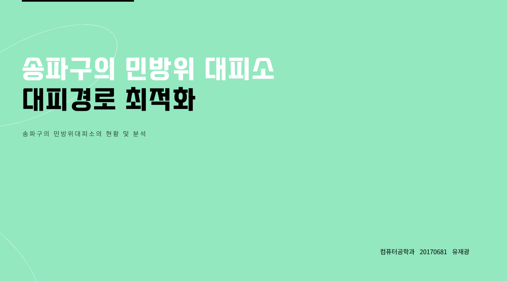
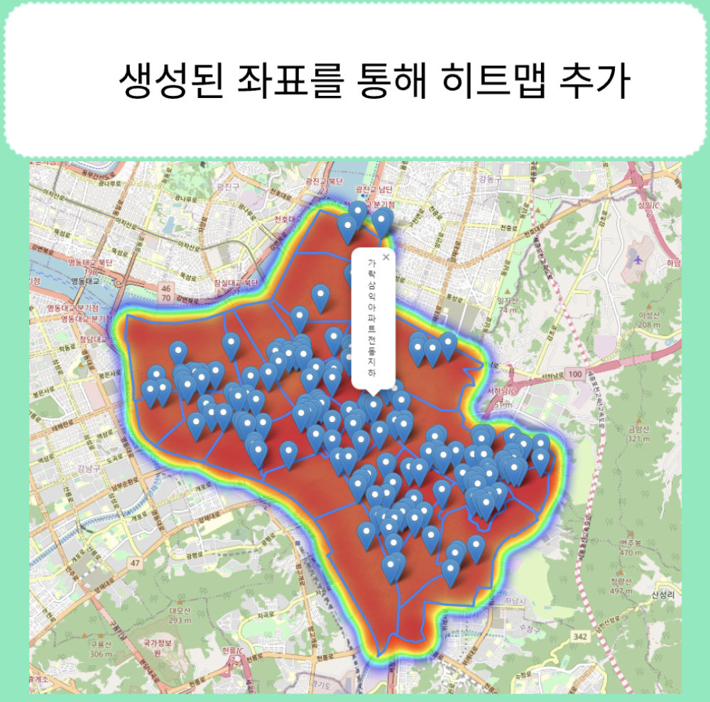
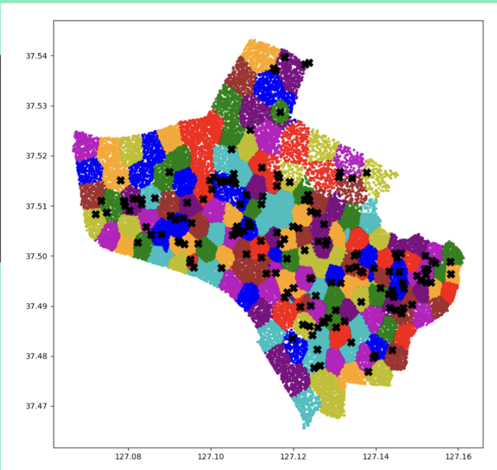
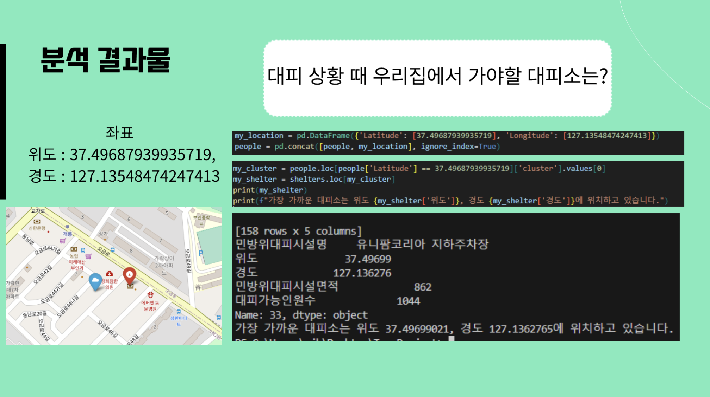
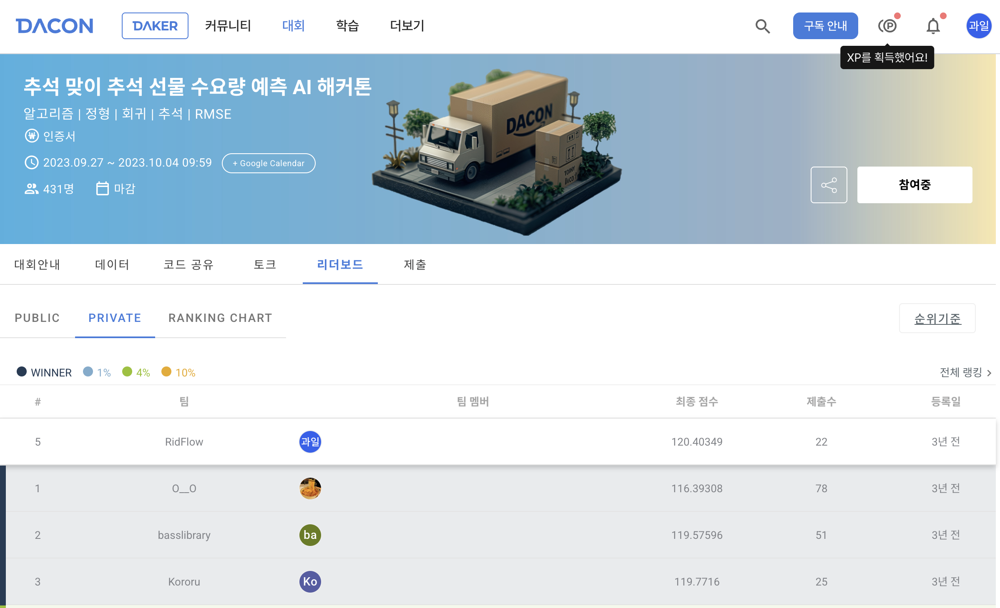
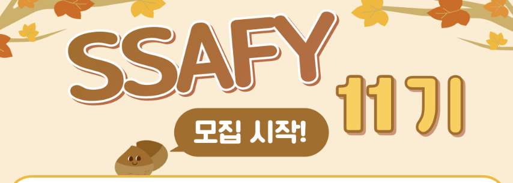
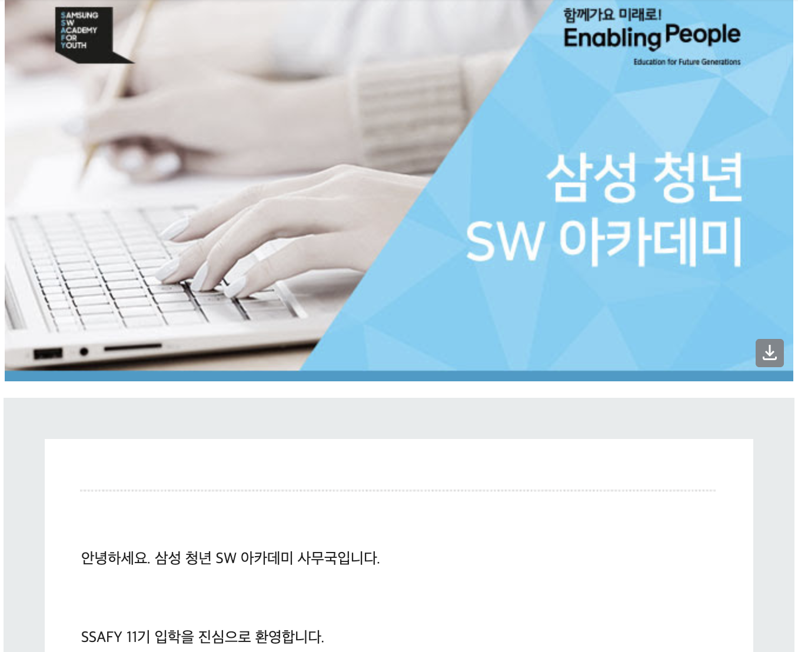
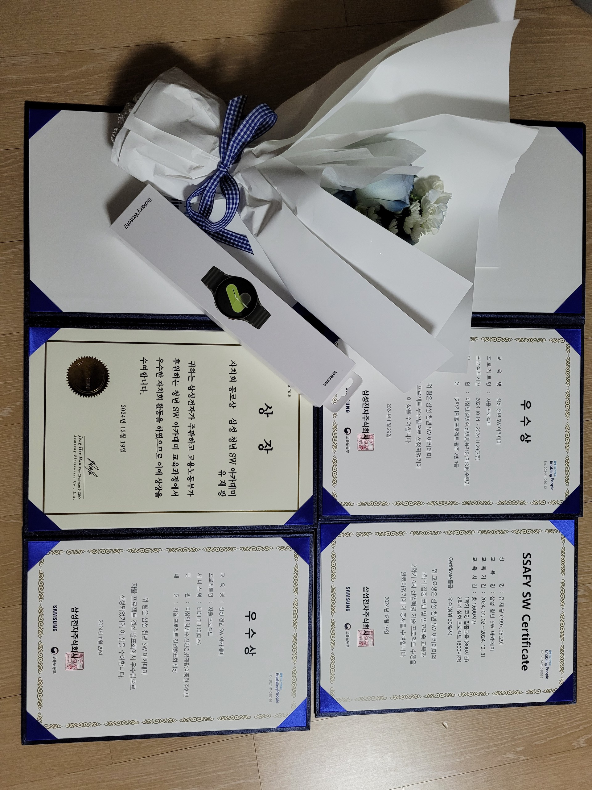

2026년 상반기 회고를 쓰려고 했는데, 막상 적으려니 그 전에 짧게라도 이전 이야기를 남겨두는 게 좋겠다는 생각이 들었습니다.

저는 처음부터 “개발자가 되어야겠다”는 확신이 있었던 사람은 아니었습니다. 학교를 다니면서 전공 수업은 들었지만, 실제 웹 프로젝트를 제대로 해본 경험은 거의 없었습니다. 개발이 재미있다기보다는, 일단 해야 하니까 따라가던 시기가 더 길었던 것 같습니다.

그런데 돌아보면 몇 번의 계기가 있었습니다. 졸업작품을 하면서 처음으로 웹 프로젝트를 급하게 배웠고, 빅데이터마이닝 수업에서 데이터를 다루는 재미를 느꼈고, 데이콘 대회와 SSAFY를 거치면서 조금씩 개발이 제 일처럼 느껴지기 시작했습니다.

이 글은 그 과정을 정리해보는 글입니다.

## 웹도 모르던 상태에서 시작한 졸업작품

2023년쯤 졸업작품을 해야 했습니다.

그때 저는 학부에서 CS 관련 강의는 들었지만, 웹 프로젝트나 다양한 도메인 경험은 거의 없었습니다. 그래도 졸업작품은 해야 했고, 자연스럽게 복학생들과 팀을 꾸리게 됐습니다.

주제는 Git과 비슷한 협업 기능에 WebRTC 기반 회의 기능을 얹은 플랫폼이었습니다. 지금 생각하면 꽤 욕심 있는 주제였는데, 당시의 저는 JavaScript도 잘 모르고, 웹이라는 기술도 잘 모르고, 팀 프로젝트도 처음에 가까웠습니다.

눈앞이 깜깜했습니다.

그나마 같이 졸업작품을 해주신 분들이 어느 정도 웹 개발을 알고 있어서 도움을 받으며 시작할 수 있었습니다. 저는 급하게 React 책을 읽고, Stack Overflow를 찾아보고, 인도 개발자 유튜브를 보면서 필요한 코드를 이해하려고 했습니다.

솔직히 그때는 “코드를 잘 찾아서 붙이는 것도 개발을 잘하는 것 아닌가?”라고 생각하기도 했습니다. 물론 막상 해보니 복사해서 붙이는 것도 그냥 끝나는 일이 아니었습니다. 기존 프로젝트에 맞게 연결해야 했고, 동작하지 않으면 왜 안 되는지 찾아야 했고, 우리 상황에 맞게 고쳐야 했습니다.

그렇게 어찌어찌 졸업작품을 완성했고, 결과도 A+를 받았습니다.

지금 보면 엄청난 기술적 완성도를 가진 프로젝트였다기보다는, 아무것도 모르는 상태에서 끝까지 만들어본 첫 경험에 가까웠습니다. 그래서 더 기억에 남습니다.

지금 돌아보면 이때가 제 개발의 시작에 가까웠던 것 같습니다. 잘해서 시작한 게 아니라, 몰라서 부딪히며 시작한 쪽에 가까웠습니다.

## 데이터가 재미있어지기 시작한 순간

졸업작품 이후에는 빅데이터마이닝이라는 전공 수업을 들었습니다.

그 수업에서 처음으로 “데이터를 통해서 가치를 만든다”는 감각이 꽤 크게 다가왔습니다. 단순히 코드를 짜는 것보다, 어떤 데이터를 보고 어떤 기준으로 문제를 풀지 정하는 과정이 재미있었습니다.

기억에 남는 프로젝트는 대피소 배정 문제였습니다. 대피소의 제한 인원을 넘기지 않으면서, 사람들을 가능한 가까운 대피소로 배정하는 프로젝트였습니다.

당시 팀 프로젝트였는데, 원래는 5~6명이 함께하는 과제였습니다. 그런데 여러 사정이 겹치면서 사실상 저 혼자 진행하게 됐습니다. 발표 당일에도 팀원과 연락이 잘 안 되는 상황이 있었고, 그때는 정말 “이게 말이 되나?” 싶었습니다.

그래도 이상하게 프로젝트 자체는 재미있었습니다. 데이터를 고르고, 알고리즘을 선택하고, 제약 조건에 맞게 조금씩 바꿔보는 과정이 좋았습니다.

혼자 해야 해서 힘들었지만, 동시에 처음으로 “아, 이런 게 개발의 재미일 수도 있겠다”는 생각을 했던 것 같습니다. 누가 시켜서 정해진 답을 구현하는 것보다, 현실의 조건을 보고 기준을 세운 뒤 알고리즘을 맞춰가는 과정이 재미있었습니다.

## 데이콘을 해보면서 데이터 쪽으로 더 기울었다

그 이후 데이터 분석이 재미있어서 혼자 더 공부하기 시작했습니다.

방학 때 Udemy로 Pandas 강의를 듣고, 데이터 분석 강의도 들었습니다. 그러다 데이콘 대회에도 참가했습니다.

결과는 431명 중 5등이었습니다.

지금 와서 모든 과정을 정확히 기억하진 못하지만, 여러 모델을 써보고, 데이터 전처리도 바꿔보고, 원핫인코딩도 해보고, 이것저것 많이 시도했던 기억이 납니다.

| 모델/도구 | 사용 기록 |
|---|---:|
| AutoGluon TabularPredictor | 여러 번 |
| H2O AutoML | 1번 |
| LightGBM / LGBM | 여러 번 |
| CatBoost | 2번 |
| XGBoost | 1번 |
| GBM | 1번 |
| RandomForest | 1번 |
| Baseline | 1번 |
| Sample submission | 1번 |

결국 가장 좋은 점수를 냈던 건 AutoGluon이었던 것 같습니다. 데이터 전처리부터 모델 선택, 앙상블까지 자동으로 해주는 도구라고 이해했는데, 당시에는 그 자체가 꽤 신기했습니다.

나중에 대회 후기나 상위권 사용자들의 접근을 보니 비슷한 도구를 사용한 경우도 있었습니다. 그때는 “모델 선택도 실력이구나”라는 생각을 했습니다.

물론 지금 다시 보면, 단순히 AutoML을 썼다는 것보다 중요한 건 여러 시도를 해보고 결과를 비교했던 경험이었던 것 같습니다. 어떤 방식이 더 나은지 직접 돌려보고 확인하는 과정이 재미있었습니다.

## SSAFY로 이어졌다

그렇게 혼자 공부를 하다가 SSAFY를 알게 됐습니다.

“삼성에서 개발을 알려준다고?”라는 생각이 먼저 들었습니다. 다만 전공자는 코딩 테스트를 준비해야 했고, 그래서 복학생 무리와 함께 알고리즘 공부를 시작했습니다.

결과적으로 합격했습니다.

아쉽게도 같이 준비했던 사람들 중 저만 합격하게 되었지만, 제 입장에서는 개발을 더 본격적으로 배울 수 있는 기회였습니다.

SSAFY에서는 알고리즘, 웹 개발, 프로젝트를 훨씬 더 체계적으로 경험했습니다. 자치회 활동도 했고, 지역대표도 했고, 프로젝트 발표를 전국 교육생 앞에서 해보는 경험도 했습니다.

자치회 공로상으로 시계도 받았습니다.

당시에는 정신없이 지나갔지만, 돌아보면 이때부터 개발을 단순히 “과제를 하기 위한 기술”이 아니라 “내가 계속 해볼 만한 일”로 보기 시작했던 것 같습니다.

## 배운 것을 설명하는 경험으로 이어졌다

SSAFY를 잘 마무리했다고 생각했는데, 운 좋게 실습코치를 하게 되었습니다.

실습코치를 하면서는 또 다른 방식으로 개발을 보게 됐습니다. 내가 직접 만드는 것뿐 아니라, 다른 사람이 막힌 부분을 같이 보고, 오류를 설명하고, 프로젝트 방향을 잡는 일을 하게 됐습니다.

이 경험은 별도의 글로 더 자세히 풀어보고 싶습니다. 단순히 “누군가를 가르쳤다”기보다는, 제가 알고 있다고 생각했던 것들을 다시 설명 가능한 형태로 정리하는 시간이었기 때문입니다.

그렇게 졸업작품, 데이터 수업, 데이콘, SSAFY, 실습코치를 거치며 2025년을 마무리했습니다.

그리고 2026년 상반기가 시작됐습니다. 해커톤도 나가고, 오픈소스 기여도 하고, 오픈소스 밋업에서 발표도 하고, 지원서도 많이 넣어보게 됩니다.

그 이야기는 다음 회고에서 따로 정리해보려고 합니다.

## 마무리

돌아보면 저는 처음부터 확신을 가지고 개발을 시작한 사람은 아니었습니다.

처음에는 웹도 잘 몰랐고, JavaScript도 어려웠고, 팀 프로젝트도 낯설었습니다. 그래도 졸업작품을 만들면서 부딪혔고, 데이터 수업에서 문제를 푸는 재미를 느꼈고, 데이콘에서 여러 시도를 해보며 결과를 비교하는 경험을 했습니다. SSAFY와 실습코치를 거치면서는 개발을 배우는 일과 설명하는 일이 연결되기 시작했습니다.

그래서 지금 제 개발 여정을 한 문장으로 말하면, “처음부터 확신이 있어서 온 길”이라기보다 “부딪히면서 조금씩 재미를 발견해온 길”에 가깝습니다.

2026년 상반기 회고는 이 흐름 위에서 다시 써보려고 합니다.
