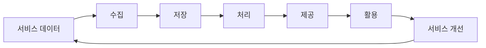

## 들어가며

데이터 엔지니어링 용어를 보다 보면 처음에는 조금 막막합니다.

`ETL`, `ELT`, `Data Warehouse`, `Data Lake`, `Lakehouse`, `OLAP`, `Batch`, `Streaming` 같은 단어들이 계속 나오는데, 하나씩 정의만 보면 알 것 같다가도 전체 그림으로 연결하려고 하면 헷갈립니다.

저도 처음에는 그랬습니다. 단어는 들어봤고, 뜻도 대충은 알겠는데, 막상 “그래서 서비스에서 생긴 데이터가 어디로 흘러가는 건데?”라고 물으면 설명이 매끄럽지 않았습니다.

그래서 저는 이 주제를 단어장처럼 외우기보다, 하나의 질문에서 출발해서 보는 게 더 이해하기 쉽다고 느꼈습니다.

> 서비스에서 생긴 데이터를 어떻게 모으고, 어디에 저장하고, 어떻게 다시 쓸 수 있게 만들까?

이 질문을 중심에 두면 데이터 엔지니어링의 큰 흐름이 조금 보입니다.

서비스에서는 계속 데이터가 생깁니다. 사용자가 회원가입을 하고, 상품을 클릭하고, 검색어를 입력하고, 결제를 하고, 리뷰를 남깁니다. 백엔드 입장에서는 이런 데이터가 처음에는 주로 운영 DB에 쌓입니다.

그런데 시간이 지나면 단순히 “서비스가 잘 동작하는 것”만으로는 부족해집니다.

- 어떤 상품이 많이 조회되는지 보고 싶다.
- 사용자가 어디서 이탈하는지 알고 싶다.
- 검색 결과 품질을 개선하고 싶다.
- 추천 모델에 쓸 데이터를 만들고 싶다.
- 매일 아침 지표 리포트를 보고 싶다.
- RAG나 AI 기능에 넣을 문서, 로그, 이벤트를 정리하고 싶다.

이때부터 데이터는 운영 DB 안에만 있으면 부족해집니다. 데이터를 옮기고, 정리하고, 분석하기 좋은 형태로 저장하고, 필요한 곳에서 다시 사용할 수 있게 만드는 흐름이 필요해집니다.

그 흐름을 이해하는 게 데이터 파이프라인과 데이터 저장소를 이해하는 출발점이라고 생각합니다.



---

## 1. 운영 DB는 서비스를 위한 곳이다

처음에는 모든 데이터가 DB에 있으니까, 그냥 DB에서 조회하면 되는 것처럼 느껴질 수 있습니다.

예를 들어 쇼핑몰 서비스가 있다고 해보겠습니다. 주문 정보도 DB에 있고, 상품 정보도 DB에 있고, 회원 정보도 DB에 있습니다. 그러면 “매출 분석도 그냥 DB에서 쿼리하면 되는 거 아닌가?”라고 생각할 수 있습니다.

그런데 운영 DB의 가장 중요한 목적은 분석이 아니라 서비스 운영입니다.

사용자가 상품을 조회했을 때 빠르게 응답해야 하고, 결제를 했을 때 주문 상태가 정확히 바뀌어야 하고, 재고가 꼬이지 않아야 합니다. 즉 운영 DB는 `OLTP`에 가깝습니다.

`OLTP`는 Online Transaction Processing의 줄임말입니다. 이름은 어렵지만 핵심은 간단합니다.

> 서비스에서 발생하는 작은 단위의 거래를 빠르고 정확하게 처리하는 시스템

그래서 운영 DB는 보통 이런 일에 최적화되어 있습니다.

- 회원가입 처리
- 주문 생성
- 결제 상태 변경
- 게시글 작성
- 재고 차감
- 사용자 요청에 대한 빠른 조회

반대로 분석 쿼리는 성격이 다릅니다.

예를 들어 “최근 6개월 동안 카테고리별 매출 추이”를 보려면 많은 데이터를 읽고, 조인하고, 집계해야 합니다. 이런 쿼리를 운영 DB에 계속 날리면 서비스 성능에 영향을 줄 수 있습니다.

그래서 데이터 엔지니어링에서는 운영 DB의 데이터를 그대로 분석에 쓰기보다, 분석하기 좋은 저장소로 옮기는 흐름을 만듭니다.

이때 등장하는 개념이 `Data Pipeline`, `ETL`, `ELT`, `Data Warehouse`, `Data Lake`입니다.

---

## 2. 데이터 파이프라인은 데이터를 쓸 수 있게 옮기는 길이다

데이터 파이프라인을 너무 어렵게 생각하지 않아도 됩니다.

저는 데이터 파이프라인을 이렇게 이해하는 게 편했습니다.

> 데이터가 생긴 곳에서, 데이터를 써야 하는 곳까지, 필요한 형태로 이동시키는 길

예를 들어 운영 DB에 주문 데이터가 있습니다. 그런데 이 데이터를 매일 아침 대시보드에서 보고 싶다고 해보겠습니다. 그러면 단순히 DB에 데이터가 있다는 것만으로는 부족합니다.

다음과 같은 과정이 필요합니다.

1. 운영 DB에서 주문 데이터를 가져온다.
2. 필요한 컬럼만 선택하거나 형식을 맞춘다.
3. 잘못된 데이터나 중복 데이터를 정리한다.
4. 분석 저장소에 적재한다.
5. 대시보드나 리포트에서 조회할 수 있게 만든다.

이 흐름 전체가 데이터 파이프라인입니다.

여기서 중요한 건 “데이터를 복사한다”가 전부가 아니라는 점입니다. 데이터는 보통 원본 그대로 쓰기 어렵습니다.

- 컬럼명이 제각각일 수 있습니다.
- 시간이 UTC와 KST로 섞여 있을 수 있습니다.
- 중복 이벤트가 들어올 수 있습니다.
- 삭제되거나 변경된 데이터가 반영되어야 할 수 있습니다.
- 분석 목적에 맞게 조인이나 집계가 필요할 수 있습니다.

그래서 파이프라인에는 보통 추출, 변환, 적재가 들어갑니다. 여기서 `ETL`과 `ELT`가 나옵니다.

---

## 3. ETL과 ELT는 “언제 변환하느냐”의 차이에 가깝다

`ETL`은 Extract, Transform, Load입니다.

즉 데이터를 먼저 꺼내고, 중간에서 변환한 다음, 저장소에 넣는 방식입니다.

```text
Extract → Transform → Load
```

반면 `ELT`는 Extract, Load, Transform입니다.

먼저 데이터를 저장소에 넣고, 그 안에서 변환하는 방식입니다.

```text
Extract → Load → Transform
```

처음 보면 이 차이가 별거 아닌 것처럼 보일 수 있습니다. 어차피 변환은 하는 거 아닌가 싶습니다.

그런데 실제로는 꽤 중요한 차이입니다.

ETL은 데이터를 저장소에 넣기 전에 정리합니다. 그래서 저장소에는 어느 정도 정제된 데이터가 들어갑니다. 반면 ELT는 원본에 가까운 데이터를 먼저 저장해두고, 나중에 저장소의 컴퓨팅 파워를 이용해서 변환합니다.

요즘은 클라우드 데이터 웨어하우스나 레이크하우스가 강력해지면서 ELT 방식도 많이 사용됩니다. 일단 원본 데이터를 잃지 않고 저장한 뒤, 목적에 따라 여러 형태로 가공할 수 있기 때문입니다.

취준생 입장에서 중요한 건 “ETL이 뭔지, ELT가 뭔지”를 단순 정의로 외우는 게 아니라고 생각합니다.

면접에서는 오히려 이런 식으로 이해하고 말하는 게 더 좋을 것 같습니다.

> ETL과 ELT는 데이터를 변환하는 시점의 차이입니다. ETL은 저장소에 넣기 전에 데이터를 정제하고, ELT는 원본 데이터를 먼저 적재한 뒤 저장소 내부에서 분석 목적에 맞게 변환합니다. 최근에는 원본 보존과 유연한 분석이 중요해지면서 ELT 방식도 많이 사용됩니다.

이렇게 말하면 단순 암기보다 조금 더 큰 그림이 보입니다.

---

## 4. Data Warehouse는 분석하기 좋게 정리된 저장소다

운영 DB가 서비스 요청을 처리하기 위한 곳이라면, `Data Warehouse`는 분석을 위한 저장소에 가깝습니다.

Data Warehouse는 말 그대로 데이터 창고입니다. 그런데 아무 데이터나 막 쌓아두는 창고라기보다는, 분석하기 좋게 정리된 창고에 가깝습니다.

예를 들어 회사에서 매출, 주문, 회원, 상품, 마케팅 데이터를 분석하고 싶다고 해보겠습니다. 이 데이터들은 원래 서로 다른 시스템에 있을 수 있습니다.

- 주문 데이터는 주문 DB에 있다.
- 회원 데이터는 회원 DB에 있다.
- 광고 데이터는 외부 마케팅 플랫폼에 있다.
- 로그 데이터는 별도 로그 시스템에 있다.

이 데이터를 각각 따로 보면 전체 그림을 보기 어렵습니다. 그래서 데이터를 한 곳으로 모으고, 분석하기 좋은 형태로 정리합니다.

이때 Data Warehouse가 사용됩니다.

Data Warehouse에서는 보통 `OLAP` 성격의 쿼리가 많이 실행됩니다. `OLAP`은 Online Analytical Processing입니다.

핵심은 이것입니다.

> 많은 데이터를 읽고, 집계하고, 비교하고, 분석하기 위한 처리

예를 들면 이런 질문에 답합니다.

- 이번 달 매출은 지난달보다 얼마나 늘었는가?
- 카테고리별 구매 전환율은 어떻게 다른가?
- 신규 가입자의 7일 유지율은 얼마인가?
- 검색어별 클릭률은 어떻게 되는가?
- 특정 이벤트 이후 사용자 행동은 어떻게 바뀌었는가?

이런 질문은 운영 DB에서 실시간 트랜잭션을 처리하는 것과는 성격이 다릅니다. 그래서 분석용 저장소가 따로 필요해집니다.

---

## 5. Data Lake는 원본에 가까운 데이터를 넓게 담아두는 곳이다

Data Warehouse가 분석하기 좋게 정리된 저장소라면, `Data Lake`는 더 넓고 원본에 가까운 저장소라고 볼 수 있습니다.

이름 그대로 호수처럼 다양한 데이터를 담아둡니다.

- DB에서 추출한 데이터
- 서버 로그
- 클릭 이벤트
- 이미지나 문서
- JSON, CSV, Parquet 같은 파일
- 외부 API에서 가져온 데이터

Data Lake의 장점은 유연성입니다. 아직 어디에 쓸지 명확하지 않은 데이터도 일단 저장해둘 수 있습니다. 나중에 분석, 머신러닝, 검색, RAG 같은 목적으로 다시 활용할 수 있습니다.

하지만 단점도 있습니다. 아무 기준 없이 데이터를 계속 쌓기만 하면 나중에 찾기도 어렵고, 믿기도 어려운 저장소가 됩니다. 흔히 말하는 `Data Swamp`, 데이터 늪이 되는 것입니다.

그래서 Data Lake를 잘 쓰려면 단순히 저장 공간만 있으면 안 됩니다.

- 데이터가 어디서 왔는지
- 언제 생성됐는지
- 어떤 스키마를 가지는지
- 품질은 믿을 수 있는지
- 누가 사용할 수 있는지
- 어떤 파이프라인을 통해 만들어졌는지

이런 메타데이터와 운영 관리가 같이 필요합니다.

여기서 데이터 엔지니어링이 단순히 데이터를 옮기는 일이 아니라는 점이 보입니다. 데이터를 “쌓는 것”보다 중요한 건, 나중에 다시 믿고 쓸 수 있게 만드는 것입니다.

---

## 6. Lakehouse는 Lake와 Warehouse 사이의 고민에서 나온다

`Data Lake`는 유연하지만 관리가 어렵고, `Data Warehouse`는 분석에는 좋지만 상대적으로 구조화된 데이터 중심입니다.

그래서 두 세계의 장점을 합치려는 흐름에서 `Lakehouse`라는 개념이 나왔습니다.

쉽게 말하면 Lakehouse는 이런 방향입니다.

> Data Lake처럼 다양한 원본 데이터를 저장하되, Data Warehouse처럼 신뢰성 있게 분석할 수 있게 만들자.

그래서 Lakehouse에서는 보통 이런 것들이 중요해집니다.

- 파일 기반 저장소 위에서 테이블처럼 다루기
- 스키마 관리
- 트랜잭션 지원
- 데이터 버전 관리
- 분석 엔진과의 연결
- ML/AI 워크로드와의 연결

처음부터 Lakehouse까지 깊게 들어갈 필요는 없지만, 큰 그림에서는 알아두면 좋다고 생각합니다.

왜냐하면 요즘 데이터 시스템은 단순히 “DB → Warehouse”로만 끝나지 않기 때문입니다. 로그, 이벤트, 문서, 임베딩, 모델 학습 데이터, 검색 인덱스까지 연결되면서 저장소의 역할이 더 넓어지고 있습니다.

---

## 7. Batch와 Stream은 데이터를 처리하는 시간 감각이 다르다

데이터 파이프라인을 볼 때 또 하나 중요한 축이 있습니다.

바로 `Batch Processing`과 `Stream Processing`입니다.

Batch Processing은 데이터를 일정 단위로 모아서 처리하는 방식입니다.

예를 들어 이런 경우입니다.

- 매일 새벽 2시에 전날 주문 데이터를 집계한다.
- 매시간 로그 파일을 모아서 분석 저장소에 적재한다.
- 하루에 한 번 추천 후보군을 다시 계산한다.

이런 방식은 비교적 이해하기 쉽고 운영하기도 단순합니다. 데이터가 조금 늦게 반영되어도 괜찮은 경우에 잘 맞습니다.

반면 Stream Processing은 데이터가 발생하는 즉시 또는 거의 실시간으로 처리하는 방식입니다.

예를 들어 이런 경우입니다.

- 사용자가 상품을 클릭하면 이벤트가 Kafka로 들어온다.
- 결제 이벤트가 발생하면 바로 후속 처리를 한다.
- 실시간 이상 탐지를 한다.
- 검색/추천 시스템에 사용자 행동을 빠르게 반영한다.

Stream Processing은 실시간성이 필요한 곳에 유리합니다. 대신 운영 난이도가 올라갑니다. 중복 처리, 순서 보장, 장애 복구, offset 관리 같은 문제가 중요해집니다.

취준생 입장에서는 Batch와 Stream을 “둘 중 뭐가 더 좋다”로 보면 안 될 것 같습니다.

더 중요한 질문은 이것입니다.

> 이 데이터는 얼마나 빨리 반영되어야 하는가?

매출 리포트처럼 하루에 한 번 보면 되는 데이터라면 Batch로 충분할 수 있습니다. 반대로 결제 이벤트, 실시간 추천, 이상 탐지처럼 빠르게 반영되어야 하는 데이터라면 Stream이 필요할 수 있습니다.

결국 Batch와 Stream은 기술 선택이라기보다 요구사항의 시간 감각을 반영한 선택에 가깝습니다.

---

## 8. 전체 그림으로 보면 이렇게 이어진다

지금까지 나온 개념을 하나의 흐름으로 보면 대략 이런 그림이 됩니다.

```text
서비스/사용자 행동
        ↓
운영 DB, 로그, 이벤트, 외부 API
        ↓
데이터 파이프라인
        ↓
ETL 또는 ELT
        ↓
Data Lake / Data Warehouse / Lakehouse
        ↓
대시보드, 리포트, 검색, 추천, ML, RAG
```

조금 더 현실적으로 보면 이런 식입니다.

1. 서비스에서 데이터가 생긴다.
2. 운영 DB, 로그, 이벤트 시스템에 데이터가 쌓인다.
3. 파이프라인이 데이터를 추출하거나 이벤트를 구독한다.
4. 데이터가 정제되거나 원본 형태로 저장소에 적재된다.
5. 저장소에서 분석 목적에 맞게 모델링된다.
6. 대시보드, 리포트, 추천, 검색, AI 기능에서 다시 사용된다.

이 흐름을 이해하면 용어들이 따로 놀지 않습니다.

`ETL`은 데이터를 옮기고 정리하는 방식이고, `Data Warehouse`는 분석하기 좋게 정리된 저장소이고, `Data Lake`는 다양한 원본 데이터를 넓게 담는 저장소이고, `Batch`와 `Stream`은 데이터를 언제 처리할지에 대한 선택입니다.

---

## 9. 백엔드 개발자에게는 왜 중요할까

백엔드 개발자를 준비하다 보면 처음에는 API, DB, 인증, 배포 같은 것에 집중하게 됩니다. 당연히 중요합니다.

그런데 서비스가 조금만 커지면 백엔드가 만든 데이터가 다른 곳에서 계속 쓰이기 시작합니다.

- 로그는 장애 분석에 쓰입니다.
- 주문 데이터는 매출 분석에 쓰입니다.
- 클릭 이벤트는 추천 시스템에 쓰입니다.
- 검색어 데이터는 검색 품질 개선에 쓰입니다.
- 사용자 문의나 문서는 RAG 시스템에 쓰일 수 있습니다.

그러면 백엔드 개발자는 단순히 “API가 동작하게 만들었다”에서 한 단계 더 나아가야 합니다.

> 내가 만든 기능에서 어떤 데이터가 생기고, 그 데이터가 나중에 어떻게 활용될 수 있는가?

이 관점이 있으면 포트폴리오 설명도 달라집니다.

예를 들어 그냥 “상품 검색 기능을 구현했습니다”라고 말하는 것보다, 이렇게 확장할 수 있습니다.

> 상품 검색 기능을 구현하면서 검색어 로그와 클릭 이벤트가 이후 검색 품질 개선이나 추천 시스템에 활용될 수 있다고 보고, 이벤트 수집과 인덱싱 흐름까지 고려했습니다.

아직 실제로 거대한 데이터 플랫폼을 만들어본 게 아니어도 괜찮다고 생각합니다. 중요한 건 데이터를 “저장하고 끝”이 아니라 “흐르고 다시 쓰이는 것”으로 보는 관점입니다.

이 관점이 있으면 백엔드 경험과 데이터 엔지니어링 경험을 자연스럽게 연결할 수 있습니다.

---

## 마무리

데이터 엔지니어링 용어는 하나씩 외우면 끝이 없습니다.

하지만 큰 그림은 생각보다 단순한 질문에서 시작합니다.

> 서비스에서 생긴 데이터를 어떻게 모으고, 어디에 저장하고, 어떻게 다시 쓸 수 있게 만들까?

이 질문 안에 데이터 파이프라인, ETL/ELT, Data Warehouse, Data Lake, Lakehouse, Batch, Stream이 들어 있습니다.

앞으로 용어를 정리할 때도 이 흐름 안에서 보면 좋을 것 같습니다.

- 이 용어는 데이터가 생기는 단계와 관련 있는가?
- 데이터를 옮기는 단계와 관련 있는가?
- 데이터를 저장하는 단계와 관련 있는가?
- 데이터를 분석하거나 다시 활용하는 단계와 관련 있는가?
- 운영과 품질을 관리하는 단계와 관련 있는가?

이렇게 보면 데이터 엔지니어링 용어가 단순 암기 대상이 아니라, 하나의 시스템을 설명하는 언어처럼 보이기 시작합니다.

그리고 취준생 입장에서는 이게 꽤 중요하다고 생각합니다. 면접에서 용어 정의를 말하는 것보다, “이 개념이 어떤 문제 때문에 필요해졌고, 백엔드 프로젝트에서는 어디에 연결될 수 있는지”를 설명하는 편이 훨씬 설득력 있기 때문입니다.

일단은 이 큰 그림을 기준으로, 다음에는 `Data Warehouse / Data Lake / Lakehouse`와 `ETL / ELT / Batch / Stream`을 하나씩 더 쪼개서 정리해보려고 합니다.
