## 들어가며

《데이터 중심 애플리케이션 설계》, DDIA의 1장을 읽었습니다.

처음에는 익숙한 단어가 많이 나왔습니다.

```text
신뢰성
확장성
유지보수성
```

백엔드나 데이터 엔지니어링을 공부하면 한 번씩은 만나는 말입니다. 장애가 나도 잘 동작해야 하고, 사용자가 늘어도 버텨야 하고, 코드도 관리하기 쉬워야 한다는 뜻처럼 보였습니다.

그런데 이렇게만 정리하면 너무 당연한 말로 남습니다.

- 장애가 나도 동작한다는 것은 정확히 어떤 상태일까?
- 확장 가능하다는 것은 서버를 더 붙일 수 있다는 뜻일까?
- 유지보수하기 좋은 시스템은 코드가 깔끔한 시스템일까?

1장을 다 읽고 나니 세 단어는 별개의 체크리스트가 아니었습니다. 시스템이 시간을 지나며 계속 서비스를 제공하기 위해 견뎌야 하는 세 종류의 변화에 가까웠습니다.

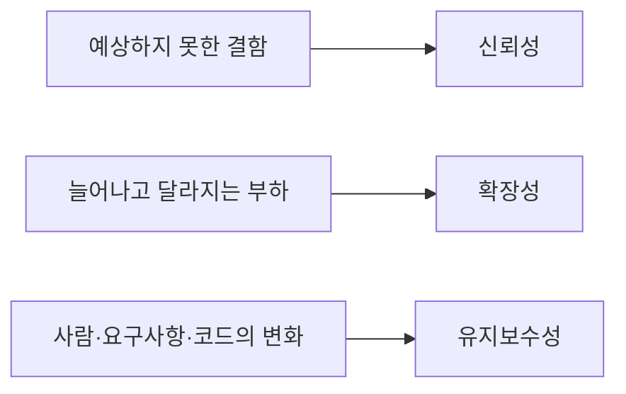

이번 글에서는 길이를 줄이기보다 1장에서 다루는 개념을 가능한 한 빠뜨리지 않고 따라가려고 합니다. 다만 책의 목차를 그대로 요약하기보다 다음 질문 하나를 중심에 둡니다.

> 좋은 데이터 시스템은 무엇이 달라져도 계속 버틸 수 있어야 할까?

트위터 타임라인처럼 하나의 설계만으로도 길어지는 사례는 별도 글과 연결하되, 이 글 안에서도 1장을 이해하는 데 필요한 구조와 수치까지 설명합니다. 이 글 하나로 신뢰성, 확장성, 유지보수성이 왜 데이터 시스템의 기본 기준인지 이해할 수 있게 만드는 것이 목표입니다.

## 데이터 중심 애플리케이션이란 무엇일까?

책의 제목부터 생각해봤습니다.

데이터 중심 애플리케이션은 단순히 데이터가 많은 애플리케이션을 뜻하지 않습니다. 오늘날 많은 애플리케이션은 계산 자체보다 데이터를 저장하고, 다시 찾고, 전달하고, 처리하는 일이 중심이 됩니다.

하나의 서비스 안에서도 여러 도구가 역할을 나눕니다.

```text
데이터베이스
→ 나중에 다시 찾을 데이터를 저장한다.

캐시
→ 자주 읽는 값을 빠르게 제공한다.

검색 색인
→ 키워드나 조건으로 데이터를 찾는다.

메시지 큐
→ 다른 프로세스가 처리할 데이터를 전달한다.

배치·스트림 처리
→ 쌓인 데이터나 계속 들어오는 이벤트를 가공한다.
```

이 구성요소들은 따로 존재하지 않습니다. 애플리케이션이 데이터의 흐름을 만들고, 각 도구는 그 흐름의 한 부분을 맡습니다.

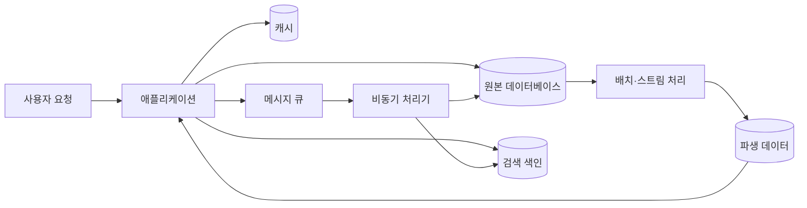

여기서 데이터베이스는 원본을 보관하고, 캐시는 자주 읽는 결과를 복제하며, 검색 색인은 원본을 다른 방식으로 찾을 수 있게 만든 파생 구조입니다. 메시지 큐와 처리기는 데이터가 한 구성요소에서 다른 구성요소로 이동하는 시간을 분리합니다.

이렇게 여러 도구를 조합하면 애플리케이션 자체가 하나의 데이터 시스템이 됩니다. 원본과 파생 데이터가 어긋나지 않는지, 한 구성요소가 멈췄을 때 어디까지 영향을 받는지, 데이터가 늘 때 어느 경로가 병목이 되는지를 애플리케이션이 책임져야 합니다.

예전에는 데이터베이스, 메시지 큐, 캐시를 서로 다른 종류의 도구로 배웠습니다. 하지만 애플리케이션 입장에서는 모두 데이터를 다루는 구성요소입니다.

중요한 것은 특정 제품을 골랐다는 사실보다 이 구성요소들을 어떻게 연결해 필요한 품질을 만들었는가입니다.

예를 들어 제가 만들던 번역 검수 도우미에서는 검토 기록과 154만 쌍의 번역 지식 데이터를 조회해야 했습니다.

처음에는 유사 원문 검색을 위해 PostgreSQL을 사용했습니다. 나중에는 SQLite FTS5로도 필요한 성능을 낼 수 있다는 것을 확인했습니다. 여기서 제품 이름만 보면 `PostgreSQL vs SQLite` 비교처럼 보입니다.

하지만 실제 결정에는 더 많은 질문이 들어 있었습니다.

- 검색 결과가 계속 정확하게 나오는가?
- 데이터가 늘어도 응답 시간이 요구 범위에 남는가?
- 배포와 백업을 누가 어떻게 관리할 것인가?
- 다시 만들 수 있는 지식 데이터와 잃으면 안 되는 검토 기록을 어떻게 나눌 것인가?

DDIA 1장은 이런 판단을 신뢰성, 확장성, 유지보수성이라는 세 기준으로 볼 수 있게 해줍니다.

## 신뢰성: 결함이 생겨도 시스템 전체가 실패하지 않게 하기

신뢰성이라고 하면 처음에는 서버가 절대 고장 나지 않는 상태를 떠올렸습니다.

하지만 고장 나지 않는 부품만으로 시스템을 만드는 것은 어렵습니다. 디스크는 망가질 수 있고, 네트워크는 끊길 수 있고, 소프트웨어에는 버그가 있고, 사람은 설정을 잘못 바꿀 수 있습니다.

DDIA는 **결함(fault)**과 **실패(failure)**를 구분합니다.

- 결함은 시스템을 구성하는 일부가 예상과 다르게 동작하는 것입니다.
- 실패는 시스템 전체가 사용자에게 약속한 서비스를 제공하지 못하는 것입니다.

둘의 차이를 서버 한 대의 장애로 생각해볼 수 있습니다.

```text
서버 한 대가 멈춤
→ 구성요소의 결함

서비스 전체에 접속할 수 없음
→ 시스템의 실패
```

신뢰성은 결함을 완전히 없애는 능력보다, 결함이 시스템 전체의 실패로 번지지 않게 만드는 능력에 가깝습니다.

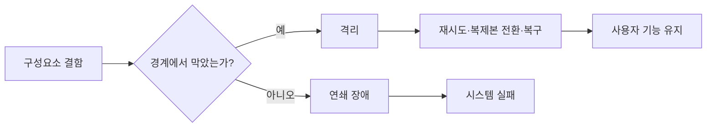

여기서 “사용자에게 약속한 서비스”도 구체적으로 정의해야 합니다. 단순히 HTTP 응답을 반환했다고 신뢰할 수 있는 것은 아닙니다.

- 사용자가 쓴 데이터가 유실되지 않아야 합니다.
- 권한이 없는 사용자가 데이터를 읽을 수 없어야 합니다.
- 잘못된 입력이 다른 사용자의 요청까지 멈추게 해서는 안 됩니다.
- 정상적인 부하에서는 약속한 응답 시간 안에 답해야 합니다.
- 일부 구성요소가 고장 나도 핵심 기능은 계속 제공해야 합니다.

즉 신뢰성은 가용성만의 문제가 아닙니다. 기능의 정확성, 허용 가능한 성능, 데이터 보호까지 사용자가 기대하는 동작에 포함됩니다.

### 하드웨어 결함

디스크, 메모리, 전원, 네트워크 장비는 고장 날 수 있습니다.

대응 방법으로 복제, 중복 장비, 장애 조치 같은 구조를 생각할 수 있습니다. 서버 한 대가 멈춰도 다른 서버가 역할을 이어받는 방식입니다.

클라우드 환경에서는 인스턴스 한 대를 영구적으로 믿기보다, 개별 장비의 손실을 예상하고 복구할 수 있는 구조가 더 중요해졌습니다.

예를 들어 애플리케이션 서버 한 대가 멈추는 상황을 생각해볼 수 있습니다.

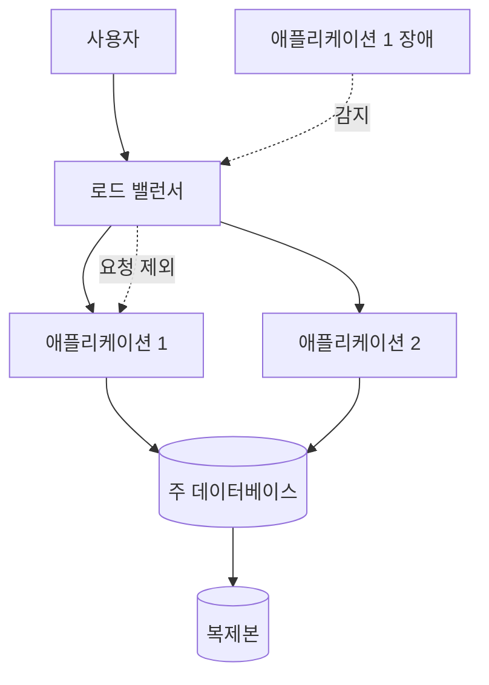

로드 밸런서가 고장 난 인스턴스를 요청 대상에서 제외하면 서버 한 대의 결함이 서비스 전체 실패로 번지지 않습니다. 데이터베이스에도 복제본이 있다면 주 노드 장애 때 전환할 수 있습니다.

하지만 복제본이 있다는 사실만으로 신뢰성이 완성되지는 않습니다. 복제 지연 때문에 최신 데이터가 없을 수 있고, 자동 전환이 잘못된 노드를 선택할 수 있으며, 복구 절차를 실제로 실행해보지 않았다면 장애 때 동작하지 않을 수 있습니다. 중복 구성은 결함 허용의 재료이지 검증된 복구 자체는 아닙니다.

### 소프트웨어 오류

소프트웨어 오류는 여러 노드에 같은 문제를 동시에 만들 수 있다는 점에서 더 까다롭습니다.

- 특정 입력에서 모든 인스턴스가 죽는 버그
- 공유 자원을 지나치게 사용하는 프로세스
- 의존 서비스가 느려지며 연쇄적으로 대기하는 현상
- 잘못된 설정이 전체 서버에 함께 배포되는 상황

하드웨어 한 대의 고장처럼 독립적으로 발생하지 않고, 같은 코드를 사용하는 시스템 전체에 퍼질 수 있습니다.

그래서 모니터링, 격리, 타임아웃, 점진적 배포, 충분한 테스트가 필요합니다. 중요한 것은 “버그를 모두 제거한다”는 불가능한 약속보다, 오류가 생겼을 때 발견하고 범위를 제한하며 복구할 수 있게 만드는 것입니다.

### 사람의 실수

운영 시스템에서는 사람도 중요한 변수입니다.

설정을 잘못 바꾸거나, 명령을 잘못 실행하거나, 예상하지 못한 방식으로 기능을 사용할 수 있습니다. 그렇다고 사람을 시스템 밖의 문제로 밀어낼 수는 없습니다.

사람의 실수를 줄이려면 시스템이 안전한 작업 방식을 제공해야 합니다.

- 위험한 작업과 일상 작업의 인터페이스를 분리합니다.
- 실제 데이터와 분리된 환경에서 실험할 수 있게 합니다.
- 되돌릴 수 있는 배포와 설정 변경 방식을 만듭니다.
- 상태를 관찰할 수 있도록 로그와 지표를 남깁니다.
- 백업뿐 아니라 실제 복구 절차도 검증합니다.

저는 이 부분을 읽으며 신뢰성이 인프라 장비만의 문제가 아니라는 점이 크게 남았습니다. 사용자가 실수하지 않기를 기대하는 대신, 실수가 곧바로 전체 실패가 되지 않는 경로를 만드는 것도 시스템 설계였습니다.

### 결함을 일부러 만들어보는 이유

결함 허용 구조는 실제 결함이 발생하기 전까지 제대로 동작하는지 알기 어렵습니다. 그래서 일부 시스템은 테스트 환경이나 통제된 운영 환경에서 프로세스를 강제로 종료하거나 네트워크를 끊어 복구 경로를 확인합니다.

```text
정상 경로만 테스트
→ 장애 조치 코드는 오랫동안 실행되지 않음
→ 실제 장애 때 처음 실행됨

통제된 결함 주입
→ 복제본 전환과 재시도 경로를 평소에 실행
→ 감지·격리·복구가 실제로 되는지 확인
```

이것은 아무 서버나 무작위로 끄라는 뜻이 아닙니다. 영향 범위, 중단 조건, 관찰 지표, 복구 방법을 갖춘 상태에서 시스템이 약속한 복원력을 실제로 검증하는 것입니다.

백업도 같은 관점으로 볼 수 있습니다. 백업 파일이 존재하는지만 확인하면 부족합니다. 복구에 얼마나 걸리는지, 최신 데이터가 어디까지 들어 있는지, 복구한 데이터로 애플리케이션이 정상 기동하는지를 재봐야 합니다.

### 모든 결함을 허용해야 하는 것은 아니다

어떤 결함은 허용하도록 설계할 수 있지만, 보안 침해처럼 예방이 더 중요한 사건도 있습니다. 공격자가 권한을 얻은 상태를 “정상적으로 견디는 결함”으로 다루기보다 인증, 권한 분리, 감사 기록으로 애초에 발생 가능성과 피해 범위를 줄여야 합니다.

결함 허용은 무한하지 않습니다. 어떤 결함까지 견딜지, 어떤 상황에서는 안전하게 기능을 중단할지 경계를 정하는 것도 신뢰성 설계입니다.

## 확장성: 지금 빠른가보다 부하가 변하면 어떻게 되는가

확장성을 단순히 “트래픽이 많아도 빠른 시스템”이라고 생각하기 쉽습니다.

하지만 DDIA는 확장성을 하나의 숫자나 결과로 보지 않습니다. 현재 부하를 먼저 설명하고, 그 부하가 늘어났을 때 시스템이 어떻게 대응하는지를 묻습니다.

```text
현재 빠르다
≠
부하가 늘어도 잘 대응할 수 있다
```

확장성을 이야기하려면 먼저 **부하 매개변수(load parameter)**를 정해야 합니다.

서비스마다 중요한 부하는 다릅니다.

- 초당 요청 수
- 읽기와 쓰기의 비율
- 동시에 접속한 사용자 수
- 캐시 적중률
- 게시물 작성자의 팔로워 수
- 처리해야 하는 데이터의 크기

### 트위터 타임라인은 왜 팔로워 수를 봤을까?

DDIA 1장에서는 2012년 공개된 수치를 바탕으로 당시 트위터의 홈 타임라인을 예로 듭니다. 책에 나온 대략적인 규모는 다음과 같습니다.

```text
트윗 작성
→ 평균 초당 약 4,600건
→ 피크 초당 12,000건 이상

홈 타임라인 조회
→ 초당 약 300,000건
```

홈 타임라인 읽기는 평균 트윗 쓰기보다 약 65배 많았습니다. 그래서 초당 쓰기 수만 감당하는 것으로는 실제 부하를 설명할 수 없었습니다.

사용자가 홈 화면을 열 때 자신이 팔로우한 사람들의 트윗을 모을 수도 있고, 누군가 트윗을 작성할 때 팔로워들의 타임라인에 미리 넣을 수도 있습니다.

두 구조는 같은 결과를 만들지만 부하가 걸리는 위치가 다릅니다.

```text
fan-out on read
→ 읽을 때 팔로우한 사람들의 트윗을 모은다.

fan-out on write
→ 쓸 때 팔로워들의 타임라인을 미리 갱신한다.
```

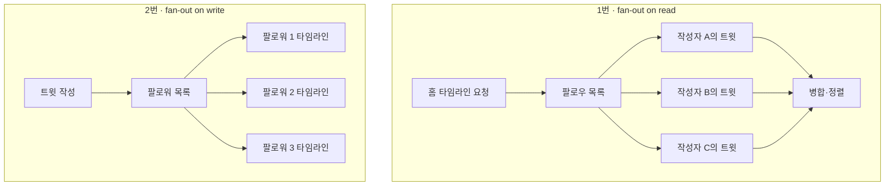

책의 예시처럼 트윗 한 건이 평균 약 75명의 팔로워에게 전달된다고 단순화하면, 읽을 때 만드는 방식은 초당 30만 번의 타임라인 요청마다 여러 작성자의 데이터를 모아야 합니다. 반대로 쓰기 때 미리 퍼뜨리는 방식은 평균 초당 4,600건의 트윗이 평균 전달 대상 수만큼 증폭되어 약 34만 5천 건의 타임라인 쓰기를 만들 수 있습니다. 피크 쓰기 1만 2천 건에 같은 평균을 적용하면 약 90만 건입니다.

이 계산은 실제 시스템 용량을 구하는 공식이 아닙니다. 팔로워 수 분포, 활동 사용자 비율, 배치 쓰기, 캐시 구조에 따라 실제 비용은 달라집니다. 핵심은 **한 요청이 내부에서 몇 개의 작업으로 퍼지는가**를 부하 매개변수로 봐야 한다는 점입니다.

여기서는 단순한 초당 트윗 수만으로 부하를 설명하기 어렵습니다. 작성자의 팔로워 수에 따라 한 번의 쓰기가 만들어내는 작업량이 크게 달라지기 때문입니다.

특히 팔로워 수는 평균 주변에 고르게 모여 있지 않습니다. 대부분의 사용자는 팔로워가 많지 않지만 일부 유명 계정은 수천만 명의 팔로워를 가질 수 있습니다. 평균 75라는 값만 보고 2번 방식을 설계하면 유명 계정의 트윗 한 건이 만드는 순간적인 쓰기 폭증을 놓칩니다.

그래서 책에서는 일반 사용자의 트윗은 쓰기 시점에 미리 퍼뜨리고, 팔로워가 매우 많은 계정의 트윗은 읽을 때 가져와 합치는 혼합 방식을 소개합니다.

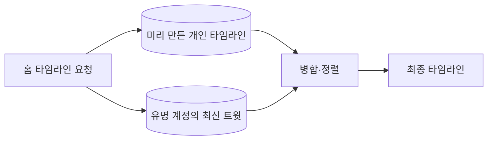

이 사례는 별도 글인 [트위터 타임라인을 만드는 두 방법은 무엇이 다를까?](/posts/how-twitter-builds-home-timeline/)에서 더 자세히 정리했습니다.

중요한 것은 유명 서비스를 외우는 것이 아니었습니다. 시스템의 비용을 실제로 바꾸는 값이 무엇인지 찾는 과정이었습니다.

### 평균 응답 시간만 보면 충분할까?

성능을 설명할 때 평균 응답 시간을 많이 사용합니다. 하지만 평균은 느린 요청이 사용자에게 어떤 경험을 주는지 가릴 수 있습니다.

먼저 **응답 시간(response time)**과 **지연 시간(latency)**을 나눠볼 필요가 있습니다.

```text
응답 시간
→ 클라이언트가 요청을 보낸 뒤 응답을 받을 때까지의 전체 시간

지연 시간
→ 요청이 실제 처리를 기다리며 머무는 시간
```

응답 시간에는 네트워크 이동, 큐에서 기다린 시간, 실제 처리 시간, 다시 클라이언트로 돌아가는 시간이 모두 들어갑니다.


예를 들어 대부분의 요청은 빠르지만 일부 요청이 매우 느릴 수 있습니다. 평균만 보면 괜찮아 보여도, 그 느린 요청을 경험한 사용자는 서비스가 멈춘 것처럼 느낍니다.

그래서 DDIA는 중앙값과 백분위수를 함께 봅니다.

- `p50`: 요청의 절반이 이 시간 안에 끝납니다.
- `p95`: 요청의 95%가 이 시간 안에 끝납니다.
- `p99`: 요청의 99%가 이 시간 안에 끝납니다.

상위 백분위수는 가장 느린 사용자 경험을 보여주는 데 도움이 됩니다. 특히 느린 요청을 보내는 사용자가 데이터가 많거나 중요한 고객일 수도 있기 때문에 꼬리 지연을 단순한 예외로 무시하기 어렵습니다.

### 큐 대기가 꼬리 응답 시간을 키운다

일부 요청만 오래 걸려도 그 뒤에 도착한 요청이 같은 처리 자원을 기다리게 될 수 있습니다. 앞의 느린 작업 때문에 뒤의 빠른 작업까지 지연되는 현상을 **head-of-line blocking**이라고 합니다.

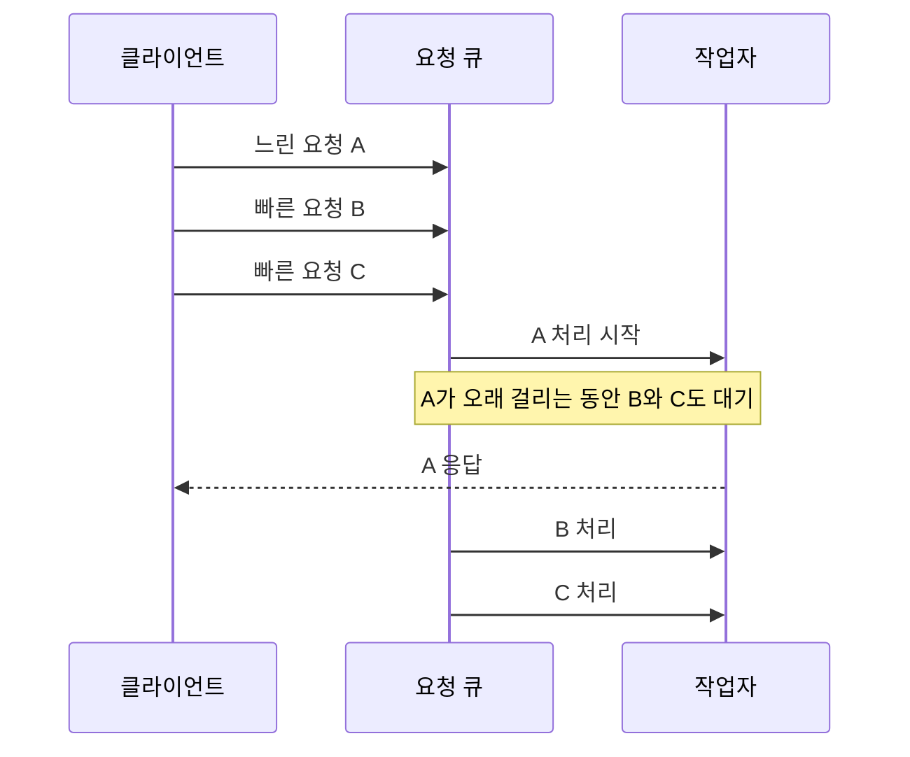

그래서 높은 부하에서 p95와 p99가 갑자기 나빠질 수 있습니다. 실제 연산 시간이 크게 늘지 않아도 큐에 머무는 시간이 길어지기 때문입니다.

부하 테스트도 이 점을 반영해야 합니다. 이전 요청이 끝난 뒤에만 다음 요청을 보내면 큐가 만들어지는 실제 상황을 재현하지 못합니다. 실제 도착률에 맞춰 요청을 독립적으로 보내고, 서버가 감당하지 못할 때 대기 시간이 어떻게 늘어나는지 봐야 합니다.

### 여러 백엔드를 호출하면 꼬리 지연이 증폭된다

사용자 요청 하나가 여러 내부 서비스를 호출하고 모든 결과를 기다린다고 해보겠습니다. 각 서비스에서 느린 요청은 드물더라도, 호출 수가 많아질수록 그중 하나가 느릴 가능성은 커집니다.

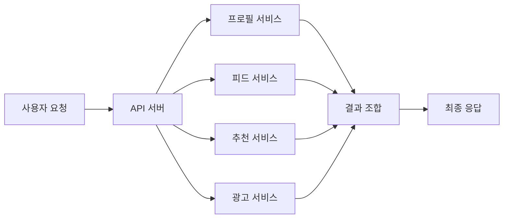

프로필, 피드, 추천이 모두 끝났는데 광고 서비스 하나가 늦으면 최종 응답도 늦습니다. 이것이 **꼬리 지연 증폭(tail latency amplification)**입니다. 분산 시스템에서 하위 서비스의 p99는 상위 서비스의 더 많은 사용자에게 영향을 줄 수 있습니다.

타임아웃, 부분 응답, 기본값, 병렬 호출, 캐시 같은 정책은 이 문제를 줄이기 위한 선택입니다. 다만 무조건 짧은 타임아웃을 걸면 정상 처리될 요청까지 실패시킬 수 있으므로 사용자가 기대하는 기능과 데이터 중요도에 맞춰 정해야 합니다.

### 백분위수는 약속의 기준이 된다

서비스는 “대체로 빠르다”보다 측정 가능한 목표가 필요합니다.

```text
예시
p95 응답 시간은 300ms 이하
월간 성공률은 99.9% 이상
```

내부 목표를 SLO(Service Level Objective)로 정할 수 있고, 외부 고객과의 계약에 위반 시 보상 같은 조건까지 포함하면 SLA(Service Level Agreement)가 됩니다.

목표를 p99.999처럼 무조건 높게 잡는 것도 답은 아닙니다. 높은 꼬리 백분위수를 개선할수록 비용이 급격히 커질 수 있습니다. 사용자 가치와 구현 비용 사이에서 어느 지점까지 약속할지 정해야 합니다.

### 처리량과 응답 시간은 같은 성능이 아니다

배치 시스템에서는 일정 시간 동안 얼마나 많은 데이터를 처리하는지가 중요할 수 있습니다. 온라인 서비스에서는 사용자가 요청한 뒤 얼마나 빨리 응답을 받는지가 더 중요할 수 있습니다.

```text
처리량
→ 일정 시간에 얼마나 많은 작업을 끝냈는가?

응답 시간
→ 한 요청이 답을 받기까지 얼마나 걸렸는가?
```

둘은 관련이 있지만 같은 값은 아닙니다. 시스템을 평가할 때는 사용 목적에 맞는 성능 지표를 선택해야 합니다.

### 부하가 늘면 무엇을 유지할 것인가?

확장성 질문은 두 방향으로 할 수 있습니다.

```text
부하가 늘어도 성능을 유지하려면 자원을 얼마나 늘려야 할까?

자원을 그대로 둘 때 부하가 늘면 성능은 어떻게 변할까?
```

서버를 더 강하게 만드는 수직 확장과 서버 수를 늘리는 수평 확장도 여기서 등장합니다. 하지만 어느 쪽이 항상 정답은 아닙니다.

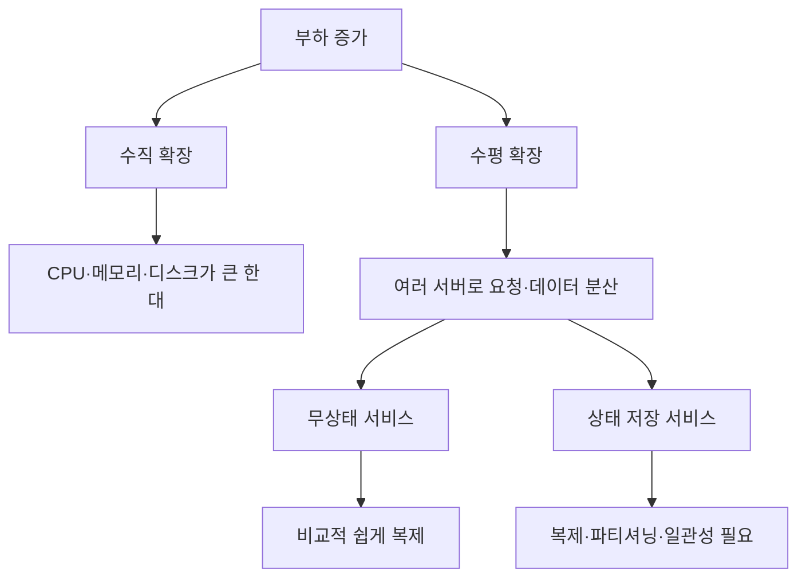

무상태 애플리케이션 서버는 같은 인스턴스를 여러 개 띄우고 로드 밸런서로 나누기 비교적 쉽습니다. 반면 데이터베이스처럼 상태를 가진 구성요소는 데이터를 어느 노드에 둘지, 복제본이 얼마나 최신인지, 노드가 사라지면 누가 주 역할을 맡을지 결정해야 합니다.

부하에 따라 자동으로 자원을 늘리고 줄이는 시스템을 탄력적 시스템이라고 합니다. 부하 변화가 예측하기 어려울 때 유용하지만, 자동 확장 조건과 축소 시점, 새 인스턴스가 준비되는 시간까지 관리해야 합니다. 변화가 작고 예측 가능하다면 사람이 용량을 계획하는 단순한 방식이 더 나을 수도 있습니다.

분산 시스템은 여러 서버를 사용할 수 있는 대신 데이터 분할, 복제, 네트워크 오류, 일관성 같은 복잡성을 만듭니다. 아직 한 대로 충분한 서비스가 미리 모든 것을 분산 구조로 만들면, 실제 부하보다 운영 복잡성을 먼저 떠안을 수 있습니다.

번역 검수 도우미에서 SQLite를 유지한 결정도 이 관점으로 다시 볼 수 있었습니다.

154만 쌍을 실제로 조회했을 때 필요한 응답 속도를 만족했고, 배포가 로컬 단일 인스턴스였습니다. 아직 측정하지 않은 10배 규모나 다중 사용자 상황을 이유로 PostgreSQL 서버를 미리 추가하는 것보다, 현재 부하를 설명하고 한계를 기록하는 편이 더 맞았습니다.

확장 가능하다는 말은 가장 복잡한 구조를 먼저 선택했다는 뜻이 아니었습니다.

> 부하가 어떻게 변할지 알고, 그때 구조를 바꿀 수 있는 경로를 가지고 있다는 뜻에 더 가까웠습니다.

## 유지보수성: 시스템보다 사람이 더 오래 일할 수 있게 하기

소프트웨어 비용의 대부분은 처음 만드는 순간보다 그 이후에 발생합니다.

- 버그를 고칩니다.
- 요구사항을 추가합니다.
- 운영 방법을 바꿉니다.
- 새로운 사람이 코드를 이해합니다.
- 다른 시스템과 연결합니다.
- 오래된 기능을 새로운 환경으로 옮깁니다.

그래서 DDIA는 유지보수성을 운용성, 단순성, 발전성이라는 세 방향으로 설명합니다.

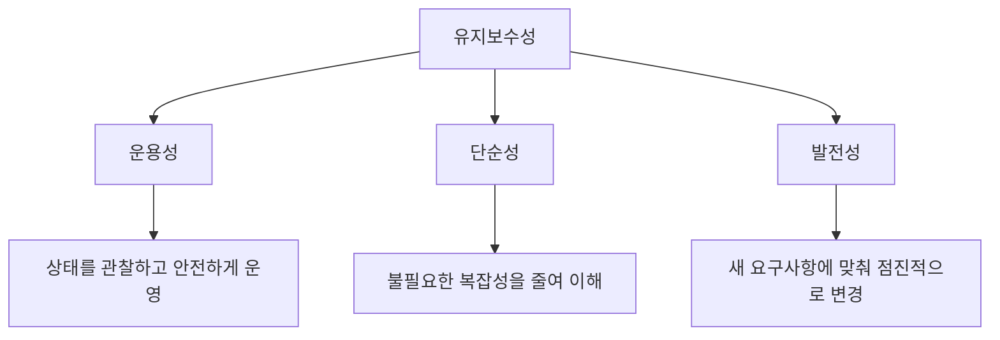

세 가지는 역할이 다릅니다. 운용성은 오늘 시스템을 살려두는 일이고, 단순성은 현재 구조를 사람이 이해할 수 있게 하는 일이며, 발전성은 내일의 변경을 받아들이는 일입니다.

## 운용성: 운영팀이 시스템을 건강하게 유지할 수 있는가?

좋은 운영은 장애가 전혀 없는 상태가 아니라, 시스템의 상태를 이해하고 필요한 조치를 할 수 있는 상태에 가깝습니다.

운영을 돕는 시스템은 다음 정보를 제공해야 합니다.

- 지금 정상적으로 동작하고 있는가?
- 문제가 있다면 어느 구성요소에서 시작됐는가?
- 용량이나 의존성에 위험 신호가 있는가?
- 설정과 버전을 어떻게 바꿀 수 있는가?
- 문제가 생기면 어떻게 이전 상태로 돌아갈 수 있는가?

자동화도 중요하지만 모든 판단을 없앨 수는 없습니다. 예측하지 못한 상황에서는 사람이 시스템을 이해하고 개입해야 합니다.

운용성이 좋은 시스템은 운영자가 다음 일을 할 수 있게 돕습니다.

- 지표, 로그, 추적으로 실행 중인 상태를 관찰합니다.
- 의존성과 용량 한계를 파악합니다.
- 설정 변경과 배포를 반복 가능하게 수행합니다.
- 장애가 발생하면 영향 범위와 원인을 좁힙니다.
- 정기적인 보안 패치와 플랫폼 변경을 적용합니다.
- 중요한 운영 지식과 절차를 문서로 남깁니다.

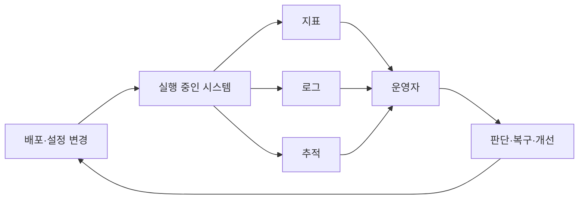

여기서 자동화의 목적은 사람을 완전히 없애는 것이 아닙니다. 반복적이고 위험한 작업을 일관된 절차로 만들고, 사람이 더 중요한 판단에 집중하게 하는 것입니다. 자동화가 실패했을 때 수동으로 상태를 확인하고 복구할 경로도 필요합니다.

제가 SQLite와 PostgreSQL을 비교하며 마지막에 본 것도 운용성이었습니다.

PostgreSQL을 추가하면 접속 정보, 비밀번호, 별도 백업, 연결 실패 화면을 관리해야 했습니다. SQLite 파일로 두면 기존 볼륨과 배포 방식 안에서 관리할 수 있었습니다.

성능이 요구사항을 만족한 뒤에는, 운영자가 알아야 할 구성요소를 줄이는 것이 실제 품질이 됐습니다.

## 단순성: 우발적 복잡성을 줄였는가?

시스템이 커지면 상태, 예외, 의존성이 늘어납니다. 모든 복잡성을 없앨 수는 없습니다. 문제 자체가 원래 어려워서 생기는 본질적 복잡성도 있습니다.

줄여야 하는 것은 문제를 해결하는 데 꼭 필요하지 않은 **우발적 복잡성**입니다.

예를 들어 유사 검색 자체에는 trigram 색인이 필요했습니다. 하지만 로컬 도구에서 별도의 DB 서버와 접속 설정까지 필요한지는 다른 문제였습니다.

```text
필요한 복잡성
→ 비슷한 문장을 찾기 위한 색인과 순위 계산

줄일 수 있는 복잡성
→ 별도 서버, 자격 증명, 연결 장애 처리
```

추상화는 이 복잡성을 숨기고 공통된 개념으로 다루게 해줍니다. 그러나 추상화도 경계를 잘못 잡으면 오히려 이해해야 할 계층을 늘릴 수 있습니다.

예를 들어 애플리케이션 코드가 모든 데이터베이스의 연결 재시도, 직렬화, 쿼리 형식을 직접 다룬다면 기능 하나를 이해하기 위해 너무 많은 세부사항을 따라가야 합니다. 저장소 계층이나 명확한 데이터 접근 인터페이스는 이런 세부사항을 한 경계 안에 모을 수 있습니다.

```text
좋은 추상화
→ 반복되는 세부사항을 숨긴다.
→ 호출자가 알아야 할 계약을 줄인다.
→ 구현을 바꿔도 영향 범위를 제한한다.

나쁜 추상화
→ 실제 차이를 억지로 같은 것으로 만든다.
→ 오류와 성능 특성을 숨긴다.
→ 이해하려면 추상화 안팎을 모두 알아야 한다.
```

단순성을 위해 추상화를 추가했는데 계층만 늘었다면 우발적 복잡성이 줄지 않은 것입니다. 좋은 경계인지 판단하려면 그 추상화가 어떤 결정을 한곳에 모으고, 어떤 변경의 파급 범위를 줄였는지 설명할 수 있어야 합니다.

단순성은 코드 줄 수가 적다는 뜻보다, 문제를 이해하는 데 불필요한 요소가 적다는 뜻으로 읽혔습니다.

## 발전성: 요구사항이 바뀌어도 수정할 수 있는가?

애플리케이션의 요구사항은 계속 달라집니다.

- 새로운 기능이 추가됩니다.
- 데이터 형식이 바뀝니다.
- 사용자의 행동이 예상과 달라집니다.
- 부하 특성이 변합니다.
- 기존 선택이 더 이상 맞지 않게 됩니다.

DDIA는 이런 변화에 대응할 수 있는 능력을 발전성 또는 변화 용이성으로 설명합니다.

좋은 설계는 미래를 정확히 예측한 설계가 아닙니다. 미래를 모두 맞힐 수 없다는 사실을 인정하고, 새로운 정보를 얻었을 때 바꿀 수 있는 설계입니다.

제가 154만 쌍의 번역 기록을 SQLite로 두면서도 다음 조건을 따로 남긴 이유도 여기에 있습니다.

```text
아직 측정하지 않은 것
- 전체 데이터에 PostgreSQL GIN을 적용한 경우
- 실제 배포 환경
- 다중 사용자 동시 조회
- 데이터가 10배로 늘어난 경우
```

SQLite를 영원히 사용한다는 선언이 아니라, 지금 조건에서 선택하고 조건이 달라지면 다시 측정할 수 있게 한 것입니다.

발전성은 “처음부터 모든 확장 기능을 넣기”보다 “선택의 근거와 한계를 남겨 다음 변경을 가능하게 하기”에 가까웠습니다.

### 발전성은 한 번에 갈아엎지 않는 능력이다

요구사항이 바뀔 때 전체 시스템을 한 번에 교체해야 한다면 변경 위험이 큽니다. 발전성이 있는 구조는 작은 단계로 바꿀 수 있습니다.

예를 들어 저장소를 바꾼다고 해보겠습니다.


각 단계에서 결과를 확인하고 문제가 생기면 이전 단계로 돌아갈 수 있습니다. 실제 마이그레이션에서는 이중 기록의 순서, 실패 시 재처리, 데이터 정합성 검증이 필요하지만, 핵심은 변경을 관찰 가능한 작은 단위로 쪼개는 것입니다.

API 버전, 이벤트 스키마, 데이터 형식도 같은 관점으로 볼 수 있습니다. 생산자와 소비자를 동시에 바꿀 수 없다면 일정 기간 동안 이전 형식과 새 형식을 함께 이해해야 합니다. 앞으로 나올 DDIA의 스키마 진화와 호환성 문제도 이 발전성에서 이어집니다.

### 레거시는 오래됐다는 뜻만은 아니다

유지보수가 어려운 시스템을 레거시라고 부르기도 합니다. 하지만 오래 사용했다는 사실보다 변경 비용이 핵심입니다.

- 현재 동작을 설명할 사람이 없습니다.
- 테스트가 부족해 수정 결과를 예측하기 어렵습니다.
- 여러 기능이 강하게 얽혀 한 부분만 바꾸기 어렵습니다.
- 배포와 복구가 수작업에 의존합니다.
- 데이터 형식과 외부 계약이 문서화되어 있지 않습니다.

반대로 오래된 시스템이라도 경계가 분명하고 관찰 가능하며 안전하게 변경할 수 있다면 유지보수성은 높을 수 있습니다.

## 세 기준은 어떻게 연결될까?

처음에는 신뢰성, 확장성, 유지보수성을 각각 외워야 하는 항목으로 봤습니다. 한 장을 다 읽고 나니 시간의 흐름으로 연결할 수 있었습니다.


- 신뢰성은 문제가 생긴 지금도 약속한 동작을 이어가는 능력입니다.
- 확장성은 사용량과 데이터가 달라질 때 성능을 다루는 능력입니다.
- 유지보수성은 사람과 요구사항이 바뀌는 긴 시간 동안 시스템을 운영하고 수정하는 능력입니다.

세 기준은 서로 영향을 줍니다.

서버를 많이 추가하면 확장성에는 도움이 될 수 있지만 운영할 구성요소가 늘어 유지보수성이 나빠질 수 있습니다. 캐시로 읽기를 빠르게 만들면 성능은 좋아질 수 있지만 원본과 캐시가 어긋나는 새로운 신뢰성 문제가 생깁니다. 모든 상황을 한 번에 처리하는 복잡한 코드는 기능을 늘릴 수 있지만 이후 변경을 어렵게 만듭니다.

그래서 좋은 시스템은 각 기준을 최대로 만드는 시스템이라기보다, 현재 요구사항에 맞게 균형을 잡고 그 근거를 설명할 수 있는 시스템이라고 느꼈습니다.

## 1장을 읽고 설계할 때 무엇을 물어볼까?

DDIA 1장을 읽고 나서 시스템을 볼 때 사용할 질문을 정리해봤습니다.

### 신뢰성

- 어떤 결함이 발생할 수 있는가?
- 그 결함이 시스템 전체 실패로 번지는가?
- 사용자는 어떤 동작을 약속받았는가?
- 문제를 발견하고 복구할 수 있는가?
- 사람의 실수를 안전하게 되돌릴 수 있는가?

### 확장성

- 이 시스템의 부하를 바꾸는 핵심 값은 무엇인가?
- 읽기와 쓰기의 비율은 어떠한가?
- 평균뿐 아니라 느린 요청은 얼마나 느린가?
- 부하가 늘면 어떤 구성요소가 먼저 병목이 되는가?
- 자원을 늘릴 때 성능은 어떻게 달라지는가?

### 유지보수성

- 운영자가 현재 상태를 이해할 수 있는가?
- 문제 자체보다 더 많은 우발적 복잡성을 만들지는 않았는가?
- 요구사항이 바뀌면 어느 부분을 수정해야 하는가?
- 선택의 근거와 아직 확인하지 않은 조건이 남아 있는가?
- 새로운 사람이 시스템을 안전하게 바꿀 수 있는가?

이 질문들은 특정 기술을 선택해주지는 않습니다. 대신 기술을 선택하기 전에 무엇을 설명해야 하는지 알려줍니다.

## 1장의 개념을 하나의 설계에 적용해보면

제가 만든 번역 검수 도우미의 지식 데이터 구조를 세 기준으로 다시 보겠습니다.

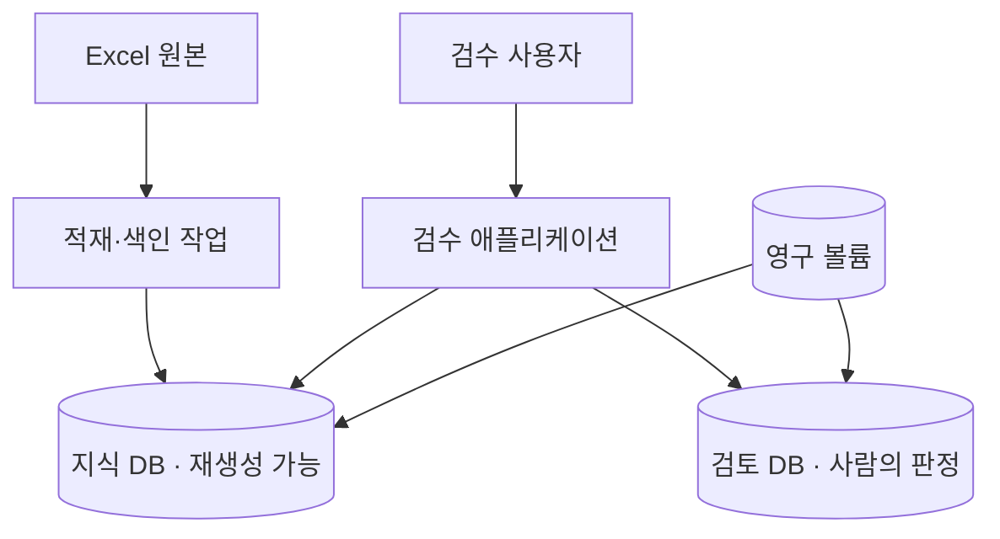

### 신뢰성으로 보면

검토 DB와 지식 DB를 분리했습니다. 지식 DB는 Excel에서 다시 만들 수 있지만 검토 DB는 사람이 내린 판정을 담고 있어 잃으면 안 됩니다. 두 데이터를 한 파일에 넣으면 백업과 복구 정책이 섞입니다.

```text
지식 DB 손상
→ Excel에서 다시 생성

검토 DB 손상
→ 백업에서 복구해야 함
```

데이터의 가치와 복구 방법이 다르므로 결함이 발생했을 때의 대응도 달라야 했습니다.

### 확장성으로 보면

현재 부하는 로컬 단일 인스턴스, 번역 기록 154만 쌍, 제한된 사용자 수입니다. 이 조건에서 FTS5 후보 검색과 Python 유사도 계산이 필요한 응답 시간을 만족하는지 측정했습니다.

아직 다중 사용자, 10배 데이터, 전체 데이터에 PostgreSQL GIN을 적용한 조건은 재지 않았습니다. 그래서 “SQLite는 무조건 확장된다”가 아니라 현재 부하와 다음 재검토 조건을 남겼습니다.

### 유지보수성으로 보면

PostgreSQL을 추가하면 서버, 자격 증명, 연결 설정, 별도 백업, 연결 실패 화면을 운영해야 했습니다. SQLite 파일은 기존 컨테이너와 볼륨 구조 안에 들어갔습니다.

두 방식 모두 필요한 검색 성능을 낼 수 있다면, 운영할 구성요소가 적고 지식 DB를 다시 만들기 쉬운 쪽이 현재 시스템의 유지보수성에 더 맞았습니다.

이렇게 하나의 기술 선택도 세 기준으로 나누어 보면 “SQLite가 PostgreSQL보다 좋다”는 결론이 아니라 더 정확한 설명이 됩니다.

> 현재 부하에서 필요한 성능을 만족했고, 복구 정책을 데이터 가치에 맞게 분리할 수 있으며, 별도 서버를 운영하지 않아도 되기 때문에 SQLite를 선택했습니다.

## 마무리

DDIA 1장은 좋은 데이터 시스템의 기준을 세 가지로 제시합니다.

```text
신뢰성
→ 결함이 생겨도 시스템 전체의 실패로 번지지 않게 한다.

확장성
→ 부하를 설명하고, 부하가 변할 때 성능이 어떻게 달라지는지 다룬다.

유지보수성
→ 운영하고 이해하고 바꾸는 일을 계속 가능하게 한다.
```

처음에는 세 단어가 좋은 시스템이라면 당연히 가져야 할 특징처럼 보였습니다. 지금은 시스템이 서로 다른 종류의 변화를 견디는 방법으로 이해하고 있습니다.

- 구성요소는 고장 납니다.
- 사용량과 데이터는 달라집니다.
- 사람과 요구사항은 계속 바뀝니다.

좋은 시스템은 이 변화를 없애는 시스템이 아니라, 변화가 생겨도 사용자가 기대한 일을 계속 제공할 수 있는 시스템입니다.

그리고 설계를 볼 때 제품 이름보다 먼저 물어야 할 질문도 조금 분명해졌습니다.

> 이 선택은 어떤 결함을 견디고, 어떤 부하를 감당하며, 앞으로 누가 어떻게 바꿀 수 있게 하는가?

DDIA 1장은 이후 장에서 데이터 모델, 저장소, 복제, 파티셔닝을 볼 때 계속 돌아오게 될 기준을 세우는 장이었습니다.

## 이어서 읽기

- [트위터 타임라인을 만드는 두 방법은 무엇이 다를까?](/posts/how-twitter-builds-home-timeline/)
- [154만 쌍을 검색하면서 왜 PostgreSQL 대신 SQLite를 유지했을까?](/posts/why-keep-sqlite-for-translation-search/)

## 참고

- Martin Kleppmann, 《데이터 중심 애플리케이션 설계》(Designing Data-Intensive Applications), 1장
