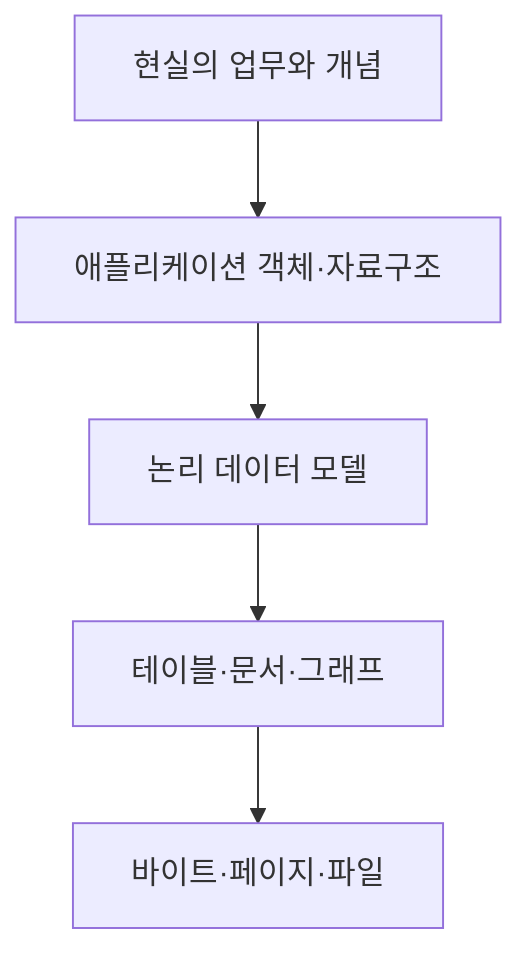
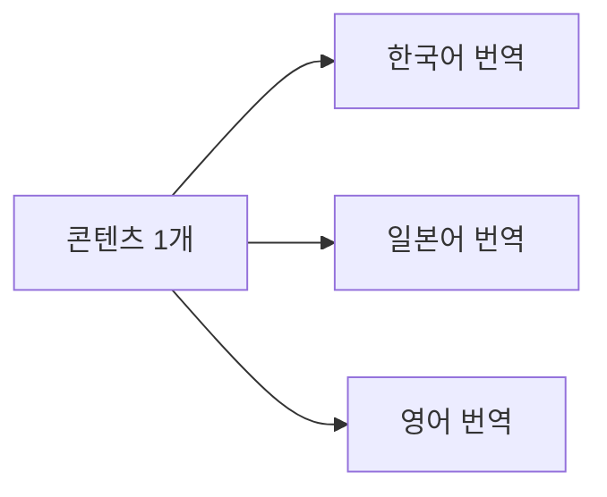
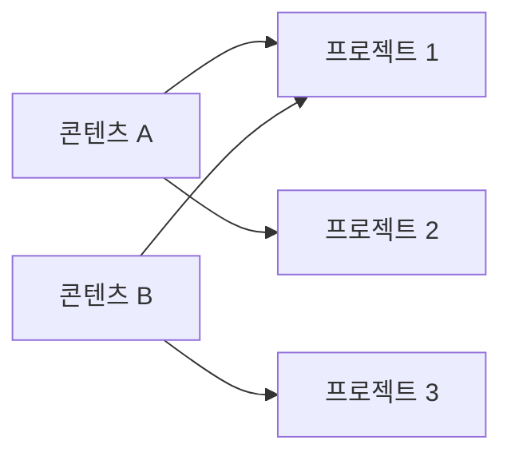
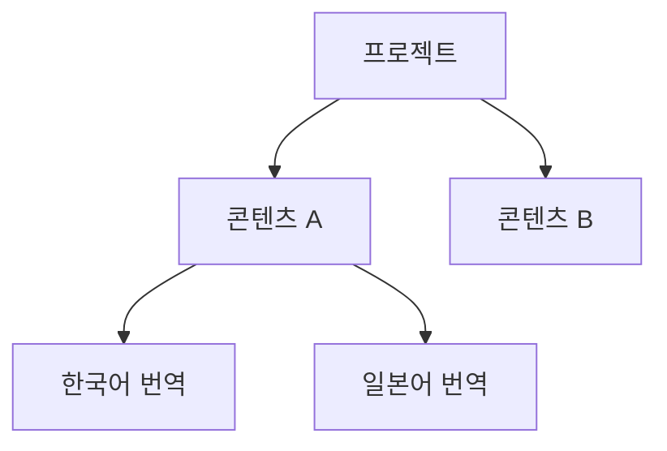
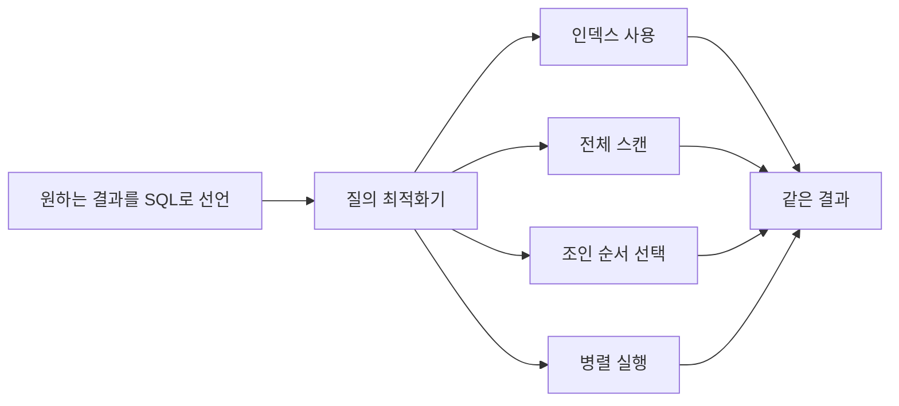
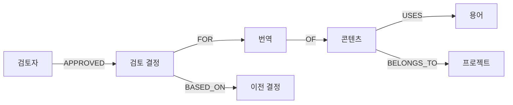
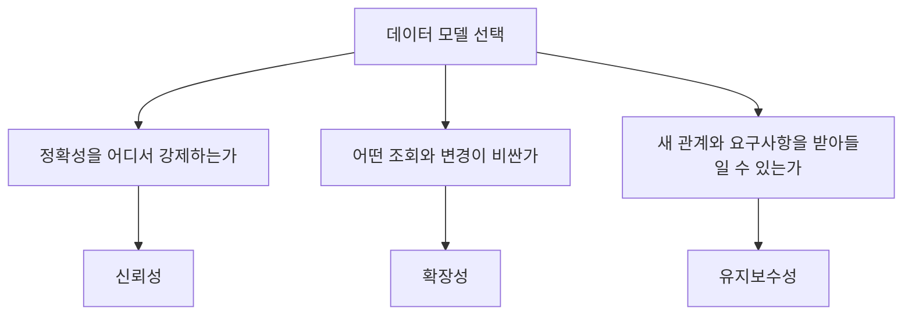

## 들어가며

《데이터 중심 애플리케이션 설계》, DDIA의 2장을 읽고 있습니다.[1]

2장 제목은 **데이터 모델과 질의 언어**입니다.

처음에는 데이터베이스 종류를 비교하는 장처럼 보였습니다.

```text
관계형 데이터베이스
문서형 데이터베이스
그래프 데이터베이스
```

그래서 SQL을 먼저 잘 알아야 읽을 수 있는지 궁금했습니다.

그런데 2장의 중심은 SQL 문법이 아니었습니다. 더 근본적인 질문에 가까웠습니다.

> 현실의 정보를 어떤 모양으로 표현하면 필요한 관계와 조회를 자연스럽게 다룰 수 있을까?

같은 데이터를 테이블로 나눌 수도 있고, JSON 문서 하나에 넣을 수도 있고, 노드와 간선으로 연결할 수도 있습니다. 어느 방식이든 저장은 가능합니다.

차이는 그다음에 드러납니다.

- 함께 읽어야 하는 데이터가 한곳에 있는가?
- 이름이 바뀌었을 때 몇 군데를 수정해야 하는가?
- 새로운 관계가 생기면 기존 구조를 얼마나 바꿔야 하는가?
- 원하는 결과를 데이터베이스가 찾는가, 애플리케이션이 직접 순회하는가?
- 데이터가 복잡해질수록 관계가 잘 보이는가?

이번 글에서는 2장의 내용을 목차 순서대로 압축하기보다, 하나의 다국어 콘텐츠 검수 시스템을 세 가지 데이터 모델로 표현하며 따라가려고 합니다.

예시는 공개를 위해 실제 프로젝트와 식별자를 사용하지 않고 단순화했습니다.

```text
하나의 콘텐츠 항목
→ 여러 언어의 번역
→ 여러 프로젝트에서 재사용
→ 여러 용어와 연결
→ 검토자가 판정을 남김
```

처음에는 이 데이터가 한 문서 안에 잘 들어가는 것처럼 보입니다. 그러나 관계가 늘어날수록 다른 모델이 자연스러워지는 지점을 확인할 수 있습니다.

## 데이터 모델은 현실과 저장 장치 사이의 번역 계층이다

애플리케이션은 현실을 그대로 저장하지 않습니다.

현실의 사람, 콘텐츠, 조직, 권한, 검토를 코드가 다룰 수 있는 객체로 바꿉니다. 다시 그 객체를 데이터베이스가 이해할 수 있는 테이블, 문서, 그래프로 바꿉니다. 데이터베이스 내부에서는 이를 다시 바이트와 페이지와 파일로 표현합니다.



각 계층은 아래 계층의 세부사항을 감춥니다.

애플리케이션 개발자는 디스크의 어느 위치에 바이트가 기록되는지 매번 생각하지 않습니다. 대신 `content`, `translation`, `review` 같은 개념을 다룹니다.

하지만 데이터 모델은 단순한 저장 형식이 아닙니다. 어떤 표현을 쉽게 만들고 어떤 표현을 어렵게 만드는지 결정합니다.

예를 들어 번역 한 건을 다음과 같은 객체로 생각할 수 있습니다.

```json
{
  "contentId": "content-101",
  "source": "Open the silver chest",
  "translations": {
    "ko": "은빛 상자를 여세요",
    "ja": "銀色の箱を開けてください"
  }
}
```

이 구조에서는 콘텐츠와 번역을 한 번에 읽기 쉽습니다.

반면 번역마다 검토자, 판정 이력, 용어, 프로젝트, 배포 버전이 연결되기 시작하면 한 문서만으로 관계를 표현하기 어려워질 수 있습니다.

```text
데이터 모델 선택
→ 저장 문법 선택이 아님
→ 애플리케이션이 관계를 이해하고 변경하는 방식 선택
```

## 관계형 모델은 데이터를 관계로 다시 조합한다

관계형 모델에서는 데이터를 **관계**, 즉 테이블로 표현합니다.

각 테이블에는 행이 있고 각 행에는 정해진 열이 있습니다. 다른 테이블의 행을 식별자로 참조하고, 필요한 시점에 다시 조합합니다.

다국어 콘텐츠를 아주 단순하게 나누면 다음과 같습니다.

```sql
CREATE TABLE contents (
  id           TEXT PRIMARY KEY,
  source_text  TEXT NOT NULL
);

CREATE TABLE translations (
  content_id   TEXT NOT NULL,
  language     TEXT NOT NULL,
  text         TEXT NOT NULL,
  PRIMARY KEY (content_id, language),
  FOREIGN KEY (content_id) REFERENCES contents(id)
);
```

한 콘텐츠에 여러 번역이 있으므로 관계는 일대다입니다.



두 테이블에서 필요한 데이터를 읽으려면 `JOIN`을 사용할 수 있습니다.

```sql
SELECT
  c.id,
  c.source_text,
  t.language,
  t.text
FROM contents AS c
JOIN translations AS t
  ON t.content_id = c.id
WHERE c.id = 'content-101';
```

이 글을 읽기 위해 필요한 SQL은 이 정도 구조면 충분합니다.

- `SELECT`: 어떤 열을 결과로 받을지 정합니다.
- `FROM`: 기준 테이블을 정합니다.
- `JOIN`: 관련된 다른 테이블의 행을 연결합니다.
- `ON`: 어떤 값이 같은 행끼리 연결할지 정합니다.
- `WHERE`: 필요한 행만 고릅니다.

중요한 것은 데이터가 여러 테이블에 나뉘어 있어도 관계를 통해 다시 조합할 수 있다는 점입니다.

## 객체와 테이블의 모양은 왜 어긋날까?

애플리케이션 코드는 중첩된 객체를 자주 사용합니다.

```java
class Content {
    String id;
    String sourceText;
    List<Translation> translations;
}
```

하지만 관계형 데이터베이스에서는 `Content` 한 개와 `Translation` 여러 개가 서로 다른 테이블의 여러 행으로 나뉩니다.

```text
애플리케이션 객체
Content
└─ List<Translation>

관계형 데이터베이스
contents 1행
translations N행
```

이 차이를 **객체-관계 불일치** 또는 impedance mismatch라고 부릅니다.

ORM은 이 변환을 도와줍니다. 예를 들어 JPA는 `Content` 객체와 `contents` 테이블을 연결하고, 연관 관계를 통해 번역 목록을 읽을 수 있게 합니다.

하지만 ORM이 두 모델의 차이를 없애지는 않습니다.

- 연관 데이터를 언제 조회할지 결정해야 합니다.
- 지연 로딩 때문에 예상하지 못한 추가 쿼리가 발생할 수 있습니다.
- 객체 그래프를 그대로 저장하려 하면 테이블 관계가 복잡해질 수 있습니다.
- 트랜잭션 경계 밖에서 연관 데이터를 읽지 못할 수 있습니다.

문서 모델은 객체의 중첩 구조를 JSON에 가깝게 저장하기 때문에 이런 변환이 줄어들 수 있습니다.

그렇다고 객체와 비슷하게 생겼다는 이유만으로 문서 데이터베이스가 항상 더 좋은 것은 아닙니다. 애플리케이션 객체가 편한 모양과 장기적으로 데이터를 연결하기 좋은 모양은 다를 수 있습니다.

## 문서 모델은 함께 읽는 데이터를 한곳에 둔다

같은 콘텐츠를 문서 하나로 저장하면 다음과 같은 형태가 됩니다.

```json
{
  "id": "content-101",
  "sourceText": "Open the silver chest",
  "translations": [
    {
      "language": "ko",
      "text": "은빛 상자를 여세요"
    },
    {
      "language": "ja",
      "text": "銀色の箱を開けてください"
    }
  ]
}
```

콘텐츠 상세 화면에서 원문과 모든 번역을 항상 함께 읽는다면 이 구조는 자연스럽습니다.

```text
콘텐츠 상세 조회
→ 문서 하나 읽기
→ 원문과 번역 목록을 한 번에 얻음
```

데이터가 한곳에 모여 있어 여러 테이블을 조합하지 않아도 되는 특성을 **지역성** 또는 locality라고 볼 수 있습니다.

문서 모델이 잘 맞는 경우는 대체로 데이터가 트리 모양일 때입니다.

```text
콘텐츠
├─ 번역 A
├─ 번역 B
└─ 번역 C
```

부모 하나 아래에 자식 여러 개가 있고, 대부분 부모와 자식을 함께 읽는 구조입니다.

하지만 지역성은 무조건적인 장점이 아닙니다.

- 문서가 너무 크면 일부 필드만 필요해도 많은 데이터를 읽을 수 있습니다.
- 문서 크기가 계속 증가하면 갱신 비용이 커질 수 있습니다.
- 여러 문서에 걸친 관계는 애플리케이션이 직접 처리해야 할 수 있습니다.
- 한 번역만 자주 수정해도 큰 문서를 반복해서 기록할 수 있습니다.

따라서 “JSON으로 표현할 수 있는가?”보다 다음을 물어야 합니다.

> 이 데이터는 실제로 함께 읽고 함께 바뀌는가?

## 문자열을 그대로 저장하면 왜 관계가 숨어버릴까?

각 번역에 언어 이름을 문자열로 저장한다고 해보겠습니다.

```json
{
  "language": "Korean"
}
```

처음에는 가장 단순합니다. 하지만 언어에 추가 정보가 필요해질 수 있습니다.

```text
표시 이름
언어 코드
복수형 규칙
오른쪽에서 왼쪽으로 쓰는지
담당 검토자
배포 가능 여부
```

여러 문서에 `Korean`이라는 문자열을 복사해두면 이름을 바꾸거나 속성을 추가할 때 모든 문서를 찾아야 합니다.

관계형 모델에서는 언어를 별도 행으로 두고 안정적인 ID로 참조할 수 있습니다.

```sql
CREATE TABLE languages (
  code          TEXT PRIMARY KEY,
  display_name  TEXT NOT NULL
);

ALTER TABLE translations
ADD FOREIGN KEY (language) REFERENCES languages(code);
```

```text
"Korean"을 여러 곳에 복제
→ 표시 문자열과 정체성이 섞임

"ko"를 참조
→ 한 곳에서 이름과 정책을 관리
```

중복된 값을 하나의 정규화된 표현으로 바꾸면 일관성을 유지하기 쉬워집니다.

ID를 사용하는 이유는 단순히 저장 공간을 줄이기 위해서만이 아닙니다.

- 사람이 보는 이름은 바뀔 수 있습니다.
- 식별자는 가능한 한 안정적으로 유지할 수 있습니다.
- 관련 속성을 한곳에서 관리할 수 있습니다.
- 참조하는 모든 데이터가 같은 대상을 가리키게 할 수 있습니다.

다만 참조를 도입하면 데이터를 다시 조합해야 합니다. 문서 데이터베이스가 조인을 충분히 지원하지 않는다면 애플리케이션이 여러 번 조회하거나 메모리에서 결합해야 할 수 있습니다.


관계가 사라진 것이 아니라 조인의 책임이 데이터베이스에서 애플리케이션으로 이동한 것입니다.

## 일대다는 문서에 자연스럽지만 다대다는 달라진다

하나의 콘텐츠 아래에 여러 번역이 있는 관계는 문서 안에 중첩하기 쉽습니다.

문제는 여러 방향의 관계가 생길 때입니다.

```text
콘텐츠 하나
→ 여러 프로젝트에서 사용

프로젝트 하나
→ 여러 콘텐츠를 사용
```

이것은 다대다 관계입니다.

용어도 마찬가지입니다.

```text
콘텐츠 하나
→ 여러 용어를 포함

용어 하나
→ 여러 콘텐츠에 등장
```

문서 안에 프로젝트와 용어 정보를 모두 복사하면 읽기는 쉬울 수 있지만 중복이 생깁니다.

```json
{
  "contentId": "content-101",
  "projects": [
    {"id": "project-a", "name": "프로젝트 A"},
    {"id": "project-b", "name": "프로젝트 B"}
  ]
}
```

프로젝트 이름이나 정책이 바뀌면 이 프로젝트가 들어 있는 모든 콘텐츠 문서를 수정해야 합니다.

ID만 저장하면 중복은 줄지만 프로젝트 정보를 읽기 위한 추가 조회가 필요합니다.

```json
{
  "contentId": "content-101",
  "projectIds": ["project-a", "project-b"]
}
```

관계형 모델에서는 연결 테이블을 둘 수 있습니다.

```sql
CREATE TABLE content_projects (
  content_id  TEXT NOT NULL,
  project_id  TEXT NOT NULL,
  PRIMARY KEY (content_id, project_id)
);
```



이 지점에서 2장의 중요한 기준이 드러납니다.

```text
트리처럼 자기완결적인 데이터
→ 문서 모델이 자연스러울 수 있음

관계가 자주 바뀌고 여러 방향으로 연결되는 데이터
→ 관계형 모델이 다루기 쉬움

관계 자체가 탐색의 중심인 데이터
→ 그래프 모델이 자연스러울 수 있음
```

## 문서 데이터베이스는 정말 스키마가 없을까?

문서 데이터베이스를 schemaless라고 부르기도 합니다.

하지만 실제 애플리케이션이 아무 구조나 처리할 수 있는 것은 아닙니다.

어떤 문서는 `sourceText`를 가지고 있고 다른 문서는 `source_text`를 가지고 있다면 읽는 코드가 두 경우를 모두 알아야 합니다.

```json
{"sourceText": "Open the door"}
{"source_text": "Close the door"}
```

데이터베이스가 쓰기 시점에 강제하지 않을 뿐, 구조에 대한 기대는 애플리케이션 코드에 존재합니다.

그래서 다음과 같이 구분하는 편이 더 정확합니다.

```text
Schema-on-write
→ 데이터를 쓸 때 명시된 구조를 검사
→ 맞지 않으면 저장을 거부하거나 변환

Schema-on-read
→ 일단 저장하고 읽을 때 구조를 해석
→ 여러 버전을 읽는 책임이 애플리케이션에 있음
```

관계형 데이터베이스의 스키마 변경은 정적 타입 언어의 컴파일 검사와 비슷하게 볼 수 있습니다. 문서 모델의 읽기 시점 해석은 동적 타입 언어와 비슷한 면이 있습니다.

둘 중 하나가 항상 우월한 것은 아닙니다.

### 쓰기 시점 스키마가 유리한 경우

- 모든 레코드가 같은 필드를 가져야 합니다.
- 잘못된 타입을 초기에 차단해야 합니다.
- 여러 애플리케이션이 같은 데이터를 공유합니다.
- 제약 조건이 데이터 정확성에 중요합니다.

### 읽기 시점 스키마가 유리한 경우

- 외부에서 들어오는 데이터 구조가 자주 달라집니다.
- 데이터마다 포함되는 필드가 크게 다릅니다.
- 새로운 필드를 점진적으로 추가해야 합니다.
- 과거 데이터와 새 데이터를 일정 기간 함께 읽어야 합니다.

하지만 schema-on-read도 결국 마이그레이션 문제를 없애지 않습니다.

```text
저장 시 마이그레이션을 하지 않음
→ 읽는 코드가 과거 구조를 계속 처리
→ 복잡성이 사라진 것이 아니라 이동함
```

다국어 콘텐츠 데이터에서 프로젝트마다 Excel 열 이름과 구조가 다르다면 입력 단계는 유연해야 합니다. 하지만 검수 DB 안에서는 언어 코드, 원문 ID, 검토 상태가 일정해야 안전합니다.

```text
외부 입력 경계
→ 여러 구조를 허용하고 변환

내부 핵심 모델
→ 검증된 공통 구조로 저장
```

한 시스템 안에서도 두 방식을 함께 사용할 수 있습니다.

## 관계형과 문서형은 서로 가까워지고 있다

현실의 데이터베이스는 교과서처럼 한 모델만 제공하지 않습니다.

PostgreSQL 같은 관계형 데이터베이스도 JSON과 JSONB 타입을 제공하고, JSON 내부 값을 조회할 수 있습니다. 공식 문서에서도 JSON 객체와 배열을 중첩해 저장하고 연산자로 탐색하는 방식을 설명합니다.[2]

반대로 일부 문서 데이터베이스는 문서 사이의 참조와 조인에 가까운 기능을 제공합니다.

```text
관계형 데이터베이스
→ JSON 문서 지원

문서 데이터베이스
→ 참조·집계·조인 기능 강화
```

그래서 제품 이름만 보고 데이터 모델을 단정하면 안 됩니다.

예를 들어 PostgreSQL 안에서도 다음을 함께 사용할 수 있습니다.

```sql
CREATE TABLE review_events (
  id          BIGSERIAL PRIMARY KEY,
  content_id  TEXT NOT NULL,
  kind        TEXT NOT NULL,
  payload     JSONB NOT NULL
);
```

- `content_id`, `kind`처럼 관계와 필터에 중요한 값은 명시적인 열로 둡니다.
- 이벤트마다 구조가 다른 세부 내용은 `payload`에 둘 수 있습니다.

이런 혼합 구조는 모든 값을 JSON에 넣는 것과 다릅니다. 무엇을 관계형 계약으로 강제하고 무엇을 유연한 확장 영역으로 둘지 경계를 정합니다.

## 관계형 모델이 과거 모델보다 오래 살아남은 이유

관계형 모델 이전에는 계층형 모델과 네트워크 모델이 사용됐습니다.

계층형 모델에서는 데이터를 트리로 표현합니다. 각 레코드는 하나의 부모를 가집니다.



트리에 맞는 일대다 관계는 자연스럽습니다. 하지만 콘텐츠 하나가 여러 프로젝트에 속하려면 한 부모만 갖는 구조가 불편해집니다.

네트워크 모델은 하나의 레코드가 여러 부모를 가질 수 있게 했습니다. 대신 데이터를 찾으려면 미리 정해진 접근 경로를 따라가야 했습니다.

```text
출발 레코드 선택
→ 정해진 링크를 따라 이동
→ 원하는 레코드 도착
```

애플리케이션은 데이터를 **어떤 경로로 찾아갈지** 알아야 했습니다. 데이터 구조나 접근 경로가 바뀌면 조회 코드도 영향을 받았습니다.

관계형 모델은 이 연결을 외래 키 값과 질의로 표현합니다.

```text
접근 경로를 애플리케이션에 고정
→ 구조 변경이 조회 코드에 퍼짐

원하는 관계를 질의로 선언
→ 데이터베이스가 접근 경로를 선택
```

관계형 모델의 강점은 데이터를 테이블로 표현했다는 사실뿐 아니라 물리적인 접근 경로를 질의에서 분리했다는 데 있습니다.

이 차이는 SQL의 선언형 성격으로 이어집니다.

## 선언형 질의는 결과를 말하고 방법은 맡긴다

다음 번역 목록에서 한국어 데이터만 찾는다고 해보겠습니다.

명령형 방식에서는 처리 순서를 직접 작성합니다.

```java
List<Translation> result = new ArrayList<>();

for (Translation translation : translations) {
    if (translation.language().equals("ko")) {
        result.add(translation);
    }
}
```

이 코드는 다음 과정을 직접 지시합니다.

```text
처음부터 하나씩 순회
→ 언어 코드 비교
→ 조건에 맞으면 결과에 추가
```

SQL은 원하는 결과의 조건을 선언합니다.

```sql
SELECT *
FROM translations
WHERE language = 'ko';
```

SQL에는 다음 내용이 없습니다.

- 어느 행부터 읽을지
- 전체 테이블을 순회할지
- 인덱스를 사용할지
- 여러 CPU에서 나눠 실행할지
- 어떤 순서로 조인할지

이 방법은 데이터베이스의 질의 최적화기가 결정합니다.



선언형 질의의 장점은 코드가 짧다는 것만이 아닙니다.

애플리케이션이 기대하는 결과를 바꾸지 않고 데이터베이스가 내부 실행 방식을 개선할 수 있습니다.

```text
데이터 증가
→ 새로운 인덱스 추가
→ 통계 정보 갱신
→ 실행 계획 변경
→ 애플리케이션 SQL은 그대로 유지 가능
```

물론 최적화기가 항상 최선의 계획을 고르는 것은 아닙니다. 실행 계획을 확인하고 인덱스와 쿼리를 조정해야 할 때도 있습니다.

그래도 “무엇을 원하는가”와 “어떻게 찾을 것인가”를 분리하면 시스템이 바뀔 여지가 커집니다.

## SQL과 CSS는 어떤 점에서 비슷할까?

DDIA는 선언형 언어를 설명하며 웹의 CSS와 비교합니다.

HTML에서 특정 조건을 만족하는 요소를 빨간색으로 표시한다고 해보겠습니다.

```css
.warning {
  color: red;
}
```

CSS는 브라우저가 DOM을 어떤 순서로 순회하고 어느 픽셀을 먼저 칠해야 하는지 지시하지 않습니다. 어떤 요소가 어떤 스타일을 가져야 하는지만 선언합니다.

명령형 JavaScript로 같은 일을 직접 처리한다면 요소를 찾고 반복하며 스타일을 수정하는 순서를 작성할 수 있습니다.

```javascript
for (const element of document.querySelectorAll(".warning")) {
  element.style.color = "red";
}
```

이 비교에서 중요한 것은 SQL과 CSS의 문법이 비슷하다는 뜻이 아닙니다.

```text
선언형
→ 결과가 만족해야 할 조건을 표현
→ 실행기는 방법을 바꿀 수 있음

명령형
→ 작업 순서와 상태 변경을 직접 표현
→ 작성한 절차가 실행 방식에 더 강하게 묶임
```

선언형 표현은 병렬화에도 유리할 수 있습니다. 코드가 특정 순서에 의존하지 않는다면 실행기가 작업을 나누고 다시 합칠 여지가 생기기 때문입니다.

## MapReduce는 선언형과 명령형 사이에 있다

MapReduce는 많은 데이터를 여러 장비에서 처리하기 위한 프로그래밍 모델입니다.

이름처럼 두 단계로 생각할 수 있습니다.

```text
Map
→ 각 입력을 읽어 중간 키와 값 생성

Reduce
→ 같은 키의 값들을 모아 집계
```

예를 들어 언어별 번역 개수를 센다고 해보겠습니다.

```javascript
map = function () {
  emit(this.language, 1);
};

reduce = function (language, counts) {
  return Array.sum(counts);
};
```

사용자는 `map`과 `reduce` 안의 처리 로직을 작성하지만, 데이터 분할과 재시도와 병렬 실행은 프레임워크가 맡을 수 있습니다.

순수한 SQL보다는 절차적이지만 일반적인 애플리케이션 코드보다는 실행 제약이 큽니다.

- 입력으로 받은 데이터만 사용해야 합니다.
- 같은 입력에 같은 결과를 내는 순수 함수여야 합니다.
- 외부 시스템을 임의로 수정하는 부작용이 없어야 합니다.

그래야 작업을 여러 노드에서 재실행하고 순서를 바꿔도 결과를 유지할 수 있습니다.

다만 단순 집계를 위해 JavaScript 함수를 직접 작성하는 방식은 읽고 최적화하기 어렵습니다. 그래서 문서 데이터베이스도 집계 파이프라인처럼 더 선언적인 인터페이스를 제공합니다.

여기서 얻을 수 있는 관점은 특정 기술의 유행이 아닙니다.

> 실행 엔진이 최적화하고 병렬화하려면 사용자의 표현에서 불필요한 실행 순서를 줄여야 한다.

## 관계가 데이터의 중심이면 그래프 모델이 자연스럽다

관계형 모델도 다대다 관계를 표현할 수 있습니다.

하지만 시스템의 핵심 질문이 관계를 여러 단계 따라가는 것이라면 조인 테이블이 빠르게 늘어날 수 있습니다.

예를 들어 다음 관계를 생각해볼 수 있습니다.

```text
콘텐츠
→ 프로젝트에 속함
→ 용어를 사용함
→ 다른 콘텐츠와 유사함
→ 검토자가 승인함
→ 이전 판정을 근거로 삼음
```

여기서 질문도 관계 중심으로 바뀝니다.

- 이 용어를 사용하는 모든 콘텐츠는 무엇인가?
- 같은 프로젝트에 속하면서 비슷한 원문을 가진 콘텐츠는 무엇인가?
- 이 판정이 참조한 이전 판정은 무엇인가?
- 한 검토자의 결정이 어떤 배포에 영향을 줬는가?

그래프 모델에서는 데이터를 정점과 간선으로 표현합니다.



### 정점

사람, 콘텐츠, 번역, 프로젝트, 용어, 결정처럼 독립적으로 식별되는 대상입니다.

### 간선

`승인했다`, `속한다`, `사용한다`, `근거로 삼았다`처럼 두 정점 사이의 관계입니다.

속성 그래프에서는 정점과 간선 모두 속성을 가질 수 있습니다.

```text
검토자 -[APPROVED {at, reason}]-> 검토 결정
```

관계에 시간, 이유, 역할 같은 정보를 붙일 수 있습니다.

## Cypher는 그래프에서 원하는 패턴을 선언한다

Cypher는 속성 그래프를 질의하는 언어입니다.

Neo4j 공식 문서는 Cypher의 핵심을 그래프 **패턴 매칭**으로 설명합니다. 노드와 관계의 모양을 선언하면 데이터베이스가 그 패턴에 맞는 경로를 찾습니다.[3]

예를 들어 특정 용어를 사용하는 콘텐츠를 승인한 검토자를 찾는 패턴은 다음과 같이 표현할 수 있습니다.

```cypher
MATCH (reviewer:Reviewer)-[:APPROVED]->(:Decision)-[:FOR]->(:Translation)-[:OF]->(content:Content)-[:USES]->(term:Term)
WHERE term.name = "silver chest"
RETURN reviewer, content
```

시각적인 관계가 질의 문법에도 드러납니다.

```text
(검토자)-[:승인]->(결정)-[:대상]->(번역)-[:원본]->(콘텐츠)
```

관계형 데이터베이스에서도 여러 `JOIN`으로 같은 결과를 만들 수 있습니다. 그래프 모델의 장점은 불가능했던 조회를 가능하게 한다기보다, 연결과 경로가 중심인 문제를 더 직접적으로 표현한다는 데 있습니다.

반대로 단순한 목록 조회와 집계가 대부분인 시스템에 그래프 데이터베이스를 도입하면 새로운 질의 언어와 운영 복잡성만 늘어날 수 있습니다.

## 트리플 스토어는 주어·서술어·목적어로 표현한다

그래프를 표현하는 또 다른 방식은 트리플 스토어입니다.

모든 사실을 세 부분으로 기록합니다.

```text
주어        서술어          목적어
content-101  uses            term-7
content-101  belongsTo       project-3
reviewer-4   approved        decision-9
```

문장처럼 읽을 수 있습니다.

```text
content-101은 term-7을 사용한다.
content-101은 project-3에 속한다.
reviewer-4는 decision-9를 승인했다.
```

RDF와 SPARQL은 이런 표현과 질의를 위한 표준입니다.

트리플 구조는 서로 다른 데이터셋의 개념을 연결하거나 데이터의 의미를 명시적으로 표현할 때 유용할 수 있습니다.

하지만 애플리케이션의 모든 테이블을 트리플로 바꾸는 것이 목적은 아닙니다. 관계의 의미와 데이터 통합이 핵심일 때 선택할 수 있는 모델입니다.

## Datalog은 사실과 규칙으로 새로운 관계를 만든다

Datalog은 데이터베이스에 저장된 사실과 규칙으로 새로운 관계를 유도하는 선언형 언어입니다.

예를 들어 다음 사실이 있다고 해보겠습니다.

```text
uses(content101, term7)
belongsTo(content101, project3)
approved(reviewer4, content101)
```

여기에 규칙을 정의할 수 있습니다.

```text
reviewedProject(Reviewer, Project) :-
  approved(Reviewer, Content),
  belongsTo(Content, Project).
```

이 규칙은 다음 의미입니다.

```text
어떤 검토자가 콘텐츠를 승인했고
그 콘텐츠가 프로젝트에 속한다면
그 검토자는 그 프로젝트를 검토한 것이다.
```

새로운 사실을 직접 저장하지 않고 기존 관계에서 유도할 수 있습니다.

Datalog 문법을 지금 외울 필요는 없습니다. 2장에서 중요한 것은 데이터 모델이 달라지면 질의가 표현하는 방식도 달라진다는 점입니다.

```text
SQL
→ 테이블의 행을 어떤 조건으로 조합할까?

Cypher
→ 어떤 노드와 관계의 패턴을 찾을까?

SPARQL
→ 어떤 주어·서술어·목적어 패턴을 찾을까?

Datalog
→ 어떤 사실과 규칙에서 새 관계를 유도할까?
```

## 세 모델 중 무엇이 더 좋은가?

2장을 읽으며 가장 경계해야 할 결론은 다음과 같습니다.

```text
관계형은 오래됐고 문서형은 현대적이다.
문서형은 유연하고 관계형은 경직됐다.
관계가 있으면 무조건 그래프를 사용한다.
```

모델의 선택은 데이터의 모양과 접근 방식에 따라 달라집니다.

| 질문 | 관계형 모델 | 문서 모델 | 그래프 모델 |
| --- | --- | --- | --- |
| 기본 표현 | 테이블과 행 | 중첩된 문서 | 정점과 간선 |
| 자연스러운 관계 | 일대다·다대일·다대다 | 자기완결적인 일대다 트리 | 복잡하고 가변적인 다대다 |
| 함께 읽는 데이터 | JOIN으로 조합 | 한 문서에 함께 저장 | 경로를 따라 탐색 |
| 구조 검증 | 주로 쓰기 시점 | 주로 읽기 시점 | 구현과 DB 정책에 따라 다름 |
| 주요 장점 | 참조·조인·제약·유연한 질의 | 객체와 가까운 구조·지역성 | 관계와 경로의 직접적인 표현 |
| 주의점 | 객체 변환·복잡한 조인 | 중복·큰 문서·문서 간 조인 | 운영 도구·질의 비용·과도한 도입 |

이 표도 제품 선택표는 아닙니다. 같은 관계형 데이터베이스 안에서 JSON을 사용할 수 있고, 문서 데이터베이스도 참조를 지원하며, 관계형 테이블로 그래프를 표현할 수도 있습니다.

더 중요한 질문은 다음과 같습니다.

### 데이터의 중심은 개체인가, 관계인가?

사용자 프로필 한 건을 읽는 것이 중심인지, 사용자 사이의 여러 단계 관계를 찾는 것이 중심인지 봅니다.

### 무엇을 함께 읽는가?

항상 함께 읽는 데이터라면 같은 문서에 두는 지역성이 유리할 수 있습니다.

### 무엇이 따로 바뀌는가?

함께 저장했지만 서로 다른 주기로 수정된다면 큰 문서가 오히려 불리할 수 있습니다.

### 관계는 얼마나 자주 변하는가?

문자열을 복제한 뒤 관계가 바뀔 때 모든 복제본을 수정해야 하는지 봅니다.

### 데이터 정확성을 어디서 강제할 것인가?

데이터베이스 제약으로 막을지, 애플리케이션 읽기 코드가 여러 형태를 처리할지 결정합니다.

### 어떤 질의를 앞으로 추가할 가능성이 있는가?

현재 화면 하나만 최적화한 구조가 새로운 조회 요구를 지나치게 어렵게 만들지 확인합니다.

## 다국어 콘텐츠 검수 데이터에 적용해보면

실제 업무를 단순화한 모델을 다시 보겠습니다.

```text
콘텐츠
번역
프로젝트
용어
검토 결정
검토 이력
```

처음에는 프로젝트별 Excel 파일이 원본이었습니다.

한 행에는 원문과 여러 언어 번역이 함께 있었습니다.

```text
한 행
→ 콘텐츠 키
→ 원문
→ 한국어
→ 일본어
→ 영어
```

이 구조는 한 콘텐츠의 여러 번역을 함께 읽기에 좋습니다. 문서 모델과 비슷한 지역성을 가집니다.

하지만 검수 시스템에서는 다른 질문이 생겼습니다.

- 특정 언어의 미검토 번역만 찾기
- 같은 원문이 여러 프로젝트에서 어떻게 번역됐는지 비교하기
- 하나의 용어가 들어간 모든 문장 찾기
- 검토자가 승인하거나 반려한 이력 남기기
- 새로운 언어가 추가돼도 기존 구조를 크게 바꾸지 않기

언어마다 열을 하나씩 두면 새 언어를 추가할 때 스키마와 코드를 함께 바꿔야 합니다.

```sql
contents
- id
- source_text

translations
- content_id
- language_code
- translated_text

reviews
- translation_id
- reviewer_id
- status
- reason
- reviewed_at
```

번역을 행으로 바꾸면 언어가 늘어도 같은 구조를 사용할 수 있습니다.

```text
언어를 열로 표현
→ 새로운 언어마다 열과 코드 변경

언어를 행의 값으로 표현
→ 같은 구조에 새 language_code 추가
```

용어와 프로젝트처럼 여러 콘텐츠와 연결되는 대상은 별도 엔티티와 연결 테이블로 둘 수 있습니다.

한편 프로젝트마다 구조가 다른 원본 메타데이터까지 모두 관계형 열로 강제하면 열이 너무 많아질 수 있습니다. 핵심 조회와 제약에 필요한 필드는 명시적인 열로 두고, 출처별 부가 정보는 JSON으로 보관하는 혼합 방식도 가능합니다.

```sql
imports
- id
- project_id
- imported_at
- source_type
- metadata JSON
```

검토 결정 사이의 근거 관계를 여러 단계 추적하는 기능이 핵심이 된다면 그래프 관점도 유용합니다.

```text
현재 결정
→ 참고한 이전 결정
→ 적용한 용어 정책
→ 영향을 받은 콘텐츠
→ 포함된 배포 버전
```

그래프 데이터베이스를 바로 도입하지 않더라도, 관계 자체를 명시적인 데이터로 남겨야 한다는 설계 힌트를 얻을 수 있습니다.

```sql
review_evidence
- review_id
- evidence_type
- evidence_id
```

데이터 모델을 배운다는 것은 데이터베이스 제품을 많이 아는 것이 아니었습니다.

현재 시스템에서 어떤 관계가 문자열과 애플리케이션 코드 안에 숨어 있는지 발견하는 일이었습니다.

## SQL을 어느 정도 알아야 2장을 읽을 수 있을까?

2장을 읽기 전에 복잡한 SQL을 공부할 필요는 없습니다.

다음 개념이면 충분합니다.

```text
테이블
→ 같은 종류의 행을 모은 구조

기본 키
→ 한 행을 안정적으로 식별

외래 키
→ 다른 테이블의 행을 참조

JOIN
→ 참조 관계를 따라 여러 테이블을 조합

WHERE
→ 원하는 행의 조건
```

다음 쿼리를 해석할 수 있으면 관계형 모델과 문서 모델의 비교를 따라갈 수 있습니다.

```sql
SELECT c.source_text, t.text
FROM contents AS c
JOIN translations AS t
  ON t.content_id = c.id
WHERE t.language = 'ko';
```

읽는 순서는 문법 순서와 조금 다르게 생각하면 쉽습니다.

```text
contents와 translations를
content_id 관계로 연결하고
한국어 번역만 남긴 뒤
원문과 번역문을 보여준다
```

인덱스, 실행 계획, 조인 알고리즘은 3장의 저장과 검색 구조를 읽으며 더 깊게 연결할 수 있습니다.

2장에서는 SQL을 직접 잘 쓰는 것보다 다음을 이해하는 것이 먼저입니다.

> 애플리케이션이 데이터를 찾아가는 절차를 직접 쓰지 않고, 원하는 관계와 결과를 선언할 수 있다.

## 2장을 읽고 설계할 때 무엇을 물어볼까?

### 데이터 구조

- 이 데이터는 트리인가, 여러 방향으로 연결된 관계망인가?
- 함께 저장된 값은 실제로 함께 읽고 함께 수정되는가?
- 독립적으로 식별해야 하는 대상은 무엇인가?

### 중복과 참조

- 같은 문자열이나 객체가 여러 곳에 복제되는가?
- 이름이 바뀌면 몇 군데를 수정해야 하는가?
- ID로 참조했을 때 누가 조인을 수행하는가?

### 스키마

- 잘못된 구조를 쓰기 시점에 막아야 하는가?
- 과거와 현재의 여러 구조를 읽는 책임은 어디에 있는가?
- 유연성을 얻는 대신 어떤 검증 코드를 부담하는가?

### 조회

- 가장 중요한 접근 패턴은 무엇인가?
- 새로운 조회가 생기면 저장 구조를 다시 만들어야 하는가?
- 원하는 결과만 선언할 수 있는가, 접근 경로를 코드에 고정하고 있는가?

### 변경

- 일대다 관계가 나중에 다대다로 바뀔 수 있는가?
- 관계가 추가될 때 한 문서가 계속 커지는가?
- 새로운 언어, 프로젝트, 용어가 추가돼도 기존 데이터를 유지할 수 있는가?

## 1장과 2장은 어떻게 이어질까?

1장에서는 좋은 데이터 시스템이 신뢰성, 확장성, 유지보수성을 가져야 한다고 배웠습니다.

2장의 데이터 모델은 이 세 품질에 직접 영향을 줍니다.

### 신뢰성

명시적인 스키마와 외래 키는 잘못된 데이터를 쓰기 시점에 막을 수 있습니다. 반대로 유연한 문서 구조는 여러 버전의 데이터를 함께 다루는 데 도움이 될 수 있습니다.

### 확장성

함께 읽는 데이터를 한 문서에 두면 조인 비용을 줄일 수 있습니다. 하지만 큰 문서와 중복 데이터는 쓰기 비용을 키울 수 있습니다. 복잡한 관계 탐색은 선택한 모델에 따라 비용이 크게 달라질 수 있습니다.

### 유지보수성

선언형 질의는 물리적 접근 경로를 애플리케이션에서 분리합니다. 정규화는 하나의 사실을 한곳에서 관리하게 합니다. 반면 지나친 분해는 이해하기 어려운 조인을 만들 수 있습니다.



1장의 품질 기준은 2장에서 구체적인 구조 선택으로 내려옵니다.

```text
좋은 데이터 모델
≠ 지금 데이터를 저장할 수 있는 모델

좋은 데이터 모델
= 중요한 관계와 조회를 자연스럽게 표현하고
  데이터와 요구사항이 바뀌어도 감당할 수 있는 모델
```

## 마무리

DDIA 2장은 관계형, 문서형, 그래프 데이터베이스의 승자를 고르는 장이 아니었습니다.

각 모델은 현실의 다른 모양을 자연스럽게 표현합니다.

```text
관계형 모델
→ 데이터를 독립된 행으로 식별하고 관계로 다시 조합

문서 모델
→ 함께 읽는 자기완결적 데이터를 중첩된 구조로 저장

그래프 모델
→ 개체보다 연결과 경로가 중요한 데이터를 직접 표현
```

질의 언어도 데이터 모델과 함께 봐야 합니다.

```text
명령형 질의
→ 데이터를 찾는 절차를 직접 지시

선언형 질의
→ 원하는 결과와 관계를 표현
→ 실행 방법은 시스템이 선택
```

2장을 읽고 가장 크게 달라진 질문은 “어떤 데이터베이스를 쓸까?”가 아니었습니다.

> 이 데이터에서 독립적으로 변하는 것은 무엇이고, 서로 연결되는 것은 무엇이며, 우리는 어떤 관계를 가장 자주 읽고 바꿀 것인가?

테이블, JSON, 그래프는 그 질문에 답한 뒤 선택할 표현입니다.

그리고 관계형 데이터베이스 안에 JSON을 두거나, 관계형 테이블에 그래프의 연결을 명시하는 것처럼 여러 모델을 함께 사용할 수도 있습니다.

중요한 것은 유행하는 제품을 고르는 것이 아니라 모델이 감추고 있는 비용까지 설명하는 것입니다.

```text
중첩하면
→ 함께 읽기 쉽지만 관계가 숨을 수 있다.

참조하면
→ 중복은 줄지만 다시 조합해야 한다.

관계를 직접 모델링하면
→ 탐색은 자연스럽지만 새로운 운영 복잡성이 생긴다.
```

데이터 모델은 데이터를 담는 그릇이 아니라 시스템이 현실을 바라보는 방식이었습니다.

## 이어서 읽기

- [좋은 데이터 시스템은 무엇을 견뎌야 할까? DDIA 1장 읽기](/posts/ddia-chapter-1-reliable-scalable-maintainable/)
- [154만 쌍을 검색하면서 왜 PostgreSQL 대신 SQLite를 유지했을까?](/posts/why-keep-sqlite-for-translation-search/)
- [엑셀 열 번호를 버리자 왜 DX와 AX의 경계가 보였을까?](/posts/why-excel-column-numbers-block-dx-and-ax/)

## Sources

[1] [Martin Kleppmann, Designing Data-Intensive Applications](https://dataintensive.net/)

[2] [PostgreSQL 공식 문서, JSON Types](https://www.postgresql.org/docs/current/datatype-json.html)

[3] [Neo4j Cypher 공식 문서, Patterns](https://neo4j.com/docs/cypher-manual/current/patterns/)
