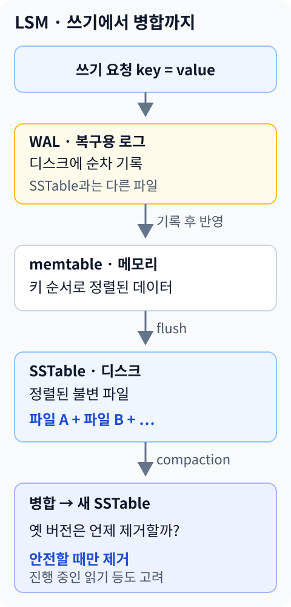
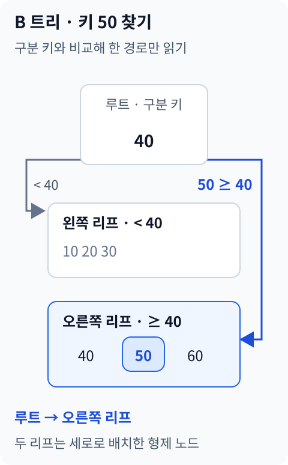
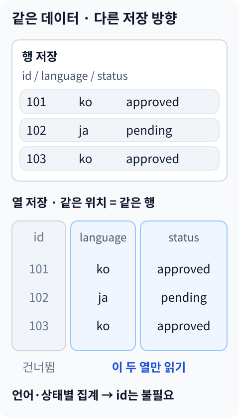

## 들어가며

[1장](/posts/ddia-chapter-1-reliable-scalable-maintainable/)에서는 좋은 데이터 시스템이 무엇을 견뎌야 하는지 살펴봤습니다. [2장](/posts/ddia-chapter-2-data-models-and-query-languages/)에서는 현실의 데이터를 테이블, 문서, 그래프로 어떻게 표현할지 다뤘습니다.

2장에서 애플리케이션은 원하는 결과를 질의로 선언하고, 찾는 방법은 데이터베이스에 맡길 수 있다고 했습니다.

그렇다면 그 아래에서는 무슨 일이 일어날까요?

```sql
SELECT status
FROM reviews
WHERE translation_id = 'translation-101';
```

이 쿼리는 번역 한 건의 검토 상태를 읽습니다. 행이 얼마 없으면 처음부터 끝까지 읽어도 될 것 같습니다. 하지만 검토 기록이 계속 쌓이고 여러 사용자가 동시에 상태를 바꾼다면 이야기가 달라집니다.

- 전체 파일을 읽지 않고 원하는 데이터를 어떻게 찾을까?
- 수정할 때 원래 위치를 덮어쓸까, 새 내용을 뒤에 붙일까?
- 저장했다고 응답한 직후 프로세스가 죽으면 어떻게 될까?
- 한 건을 읽는 구조로 전체 통계도 빠르게 낼 수 있을까?

DDIA 3장 **저장과 검색(Storage and Retrieval)**은 이 질문을 저장 엔진의 관점에서 다룹니다. 기존 시리즈와 같은 초판의 장 구성을 기준으로, 핵심 원리와 보충 공식 자료를 연결했습니다.[1]

이번에도 다국어 콘텐츠 검수라는 같은 사례를 사용합니다. 개별 번역의 최신 상태를 읽는 일에서 시작해, 프로젝트 전체의 검토 통계를 계산하는 일로 범위를 넓혀보겠습니다. 예시 식별자와 데이터는 설명을 위한 가상 값입니다.

> 저장 엔진은 데이터를 빨리 찾기 위해 어떤 일을 미리 하고, 그 비용을 언제 지불할까?

## 저장 엔진은 논리 모델을 실제 바이트로 바꾼다

2장의 테이블과 문서는 개발자가 보는 논리적인 표현입니다. 저장 장치가 실제로 다루는 것은 바이트입니다.

그 사이에서 저장 엔진은 레코드를 파일과 페이지에 배치하고, 찾을 위치를 관리하며, 수정과 복구를 처리합니다.

```text
애플리케이션의 질문
  "이 번역의 상태가 뭐지?"
            ↓
논리 모델과 질의
  reviews 테이블에서 조건에 맞는 행 조회
            ↓
접근 경로 선택
  인덱스를 사용할지, 스캔할지 결정
            ↓
저장 엔진
  메모리·페이지·파일에서 실제 데이터 읽기
```

관계형 데이터베이스라고 반드시 한 가지 저장 구조만 쓰는 것은 아닙니다. 키-값 인터페이스도 해시 색인, LSM 트리, B 트리 등으로 구현할 수 있습니다.

**데이터를 어떤 모양으로 표현하는가와, 그 데이터를 물리적으로 어떻게 찾는가는 다른 선택입니다.**

이 구분을 잡아두면 “NoSQL은 빠르고 SQL은 느리다” 같은 분류보다 정확하게 성능을 설명할 수 있습니다. 어떤 읽기와 쓰기를, 어떤 저장 구조로 처리하는지가 중요합니다.

## 가장 단순한 저장소: 파일 뒤에 계속 붙이면 어떨까?

최신 검토 상태를 키와 값으로 저장한다고 해보겠습니다.

```text
translation-101,pending
translation-102,approved
translation-101,rejected
```

`translation-101`의 상태를 바꿀 때 이전 줄을 찾아 수정하지 않고 새 줄을 파일 끝에 추가했습니다. 이런 구조가 **추가 전용 로그(append-only log)**의 출발점입니다.

여기서 로그는 디버깅 메시지가 아니라 저장할 데이터를 이어 붙인 기록입니다.

이 방식의 쓰기는 단순합니다. 이전 레코드가 어디 있는지 찾거나, 값이 길어져 주변 데이터를 옮길 필요 없이 뒤에 기록하면 됩니다.

하지만 읽기는 불편합니다. `translation-101`의 최신 값은 마지막에 나온 `rejected`입니다. 모든 줄을 훑으며 같은 키의 최신 값을 찾아야 한다면 데이터가 늘수록 읽기 비용도 커집니다.

```text
쓰기
→ 파일 끝에 추가
→ 이전 위치를 찾지 않아도 됨

읽기
→ 같은 키가 어디에 있는지 모름
→ 로그를 훑어 최신 값 확인
```

빠르게 저장하는 방법과 빠르게 찾는 방법은 처음부터 같은 것이 아니었습니다.

### 인덱스는 읽기를 위해 따로 유지하는 안내서다

이제 메모리에 다음 정보를 남겨보겠습니다.

```text
키 → 최신 레코드가 있는 파일과 바이트 위치
```

`translation-101`을 읽을 때 메모리에서 위치를 찾고, 파일의 해당 부분만 읽으면 됩니다. 이 추가 구조가 인덱스, 즉 색인입니다.

인덱스는 원본에서 찾는 비용을 줄이는 대신 별도의 공간과 갱신 작업을 요구합니다. 레코드를 쓸 때 원본만 기록하는 것이 아니라 위치 정보도 바꿔야 합니다.

그래서 인덱스를 많이 만들면 모든 쿼리가 공짜로 빨라지는 것이 아닙니다. 읽을 때 절약한 비용 일부를 쓰기와 공간 사용으로 옮긴 것입니다.

## 해시 색인: 키를 알면 최신 위치로 바로 간다

메모리에 해시 맵을 두면 키를 최신 위치에 연결할 수 있습니다.

```text
메모리 해시 색인
translation-101 → segment-2의 특정 위치
translation-102 → segment-1의 특정 위치
```

읽을 때는 해시 맵을 조회하고 파일로 이동합니다. 새 값을 쓰면 파일에 추가한 뒤 해시 맵이 가리키는 위치를 갱신합니다.

이 구조는 정확한 키 하나로 값을 찾는 데 잘 맞습니다. 그러나 두 가지 문제가 남습니다.

첫째, 모든 키의 위치 정보가 메모리에 들어가야 합니다. 값은 디스크에 있어도 키가 매우 많거나 길면 색인 자체가 커집니다.

둘째, 해시는 정렬 순서를 보존하지 않습니다. `translation-100`부터 `translation-200`까지 읽으려 할 때 이 키들이 해시 맵이나 파일에서 나란히 있지 않습니다. 범위 검색은 단건 조회처럼 자연스럽지 않습니다.

### 로그를 계속 늘릴 수는 없다

같은 번역 상태를 반복해서 바꾸면 과거 값이 계속 쌓입니다. 최신 값만 필요한 저장소라면 오래된 값을 정리할 수 있습니다.

로그를 일정 크기의 **세그먼트(segment)**로 나누고, 활성 세그먼트에만 쓰다가 차면 새 파일을 엽니다. 닫힌 파일은 백그라운드에서 정리할 수 있습니다.

```text
정리 전
translation-101,pending
translation-102,approved
translation-101,rejected

최신 값만 남긴 뒤
translation-102,approved
translation-101,rejected
```

이처럼 필요 없는 이전 값을 제거하는 작업을 **컴팩션(compaction)**이라고 부릅니다. 여러 세그먼트를 합치면서 같은 키의 오래된 값을 제거할 수도 있습니다.

컴팩션은 독자가 아직 읽는 파일을 갑자기 삭제하는 작업이어서는 안 됩니다. 새 파일을 완성하고 색인 또는 파일 목록을 안전하게 전환한 뒤, 더 이상 참조하지 않는 이전 파일을 회수해야 합니다.

실제 저장소에서는 레코드 길이, 체크섬, 재시작 시 색인 복원, 쓰다가 끊긴 마지막 레코드 처리도 필요합니다. 단순한 추가 기록에 복구와 파일 관리가 붙으면서 저장 엔진의 역할이 드러납니다.

### 삭제도 흔적이 필요한 이유

오래된 파일에 값이 남아 있는데 최신 색인에서 키만 지우면 어떻게 될까요? 재시작하거나 파일을 병합할 때 과거 값이 다시 나타날 수 있습니다.

그래서 삭제를 뜻하는 **툼스톤(tombstone)**을 기록할 수 있습니다.

```text
오래된 세그먼트: translation-101 = rejected
새 세그먼트:     translation-101 = 삭제 표시
```

읽기는 삭제 표시를 만나면 오래된 값으로 내려가면 안 됩니다. 컴팩션도 관련된 과거 버전이 안전하게 제거되는 시점까지 삭제 표시를 유지해야 합니다. 스냅샷이나 복제까지 있다면 회수 조건은 더 복잡해집니다.

## SSTable: 파일 안의 키를 정렬하면 무엇이 달라질까?

해시 색인이 단건 조회에는 좋지만 범위 검색에 불편했다면, 데이터를 키 순서대로 저장해볼 수 있습니다.

**SSTable(Sorted String Table)**은 키 순서로 정렬된 키-값 데이터를 담는 파일 구조입니다. 여기서 중요한 성질은 정렬되어 있고, 만들어진 파일을 읽는 동안 직접 수정하지 않는다는 점입니다.[2]

```text
translation-101 → rejected
translation-102 → approved
translation-103 → pending
translation-104 → approved
```

정렬은 두 가지 일을 쉽게 만듭니다.

### 모든 키의 위치를 메모리에 올리지 않아도 된다

파일을 블록으로 나누고 각 블록의 시작 키와 위치를 색인에 남길 수 있습니다. 찾는 키가 어느 두 경계 사이에 있는지 알아내면 그 블록만 읽어 내부를 검색합니다.

```text
메모리의 작은 안내서
translation-100 → 블록 A
translation-200 → 블록 B
translation-300 → 블록 C

translation-150 조회
→ 블록 A 후보
→ 블록 안에서 실제 키 확인
```

각 레코드가 아니라 일부 경계만 가리키는 **희소 색인(sparse index)**을 사용할 수 있는 것입니다. 블록 단위 압축도 결합할 수 있습니다.

파일에 모든 키가 정렬돼 있으므로 범위의 시작점을 찾은 뒤 다음 키들을 순서대로 읽는 것도 가능합니다.

### 정렬된 파일끼리 순서대로 병합할 수 있다

두 파일이 이미 정렬되어 있다면 각각의 앞부분부터 읽고 작은 키를 차례대로 내보내면 됩니다. 병합 정렬의 병합 단계와 같은 원리입니다.

```text
파일 A: 101, 103, 105
파일 B: 102, 103, 104

병합:   101, 102, 103, 104, 105
```

같은 키인 `103`을 만나면 버전 정보를 이용해 필요한 값을 선택합니다. 최신 상태만 유지하는 단순한 경우에는 최신 값을 남기면 되지만, 진행 중인 스냅샷이 이전 버전을 읽어야 한다면 그 버전도 보존해야 합니다.

정렬은 검색뿐 아니라 파일을 정리하는 작업에도 도움이 됩니다.

## LSM 트리: 메모리에서 정렬하고 디스크에서는 합친다

SSTable이 유용하더라도 매번 삽입할 때 큰 파일 전체를 다시 정렬하면 쓰기가 너무 비싸집니다.

그래서 쓰기를 먼저 메모리의 정렬된 자료구조에 모읍니다. 이 버퍼를 **멤테이블(memtable)**이라고 부릅니다. 일정 크기에 도달하면 더 이상 수정하지 않는 상태로 넘기고, 키 순서대로 디스크에 기록해 SSTable을 만듭니다. 이 작업이 **플러시(flush)**입니다.[2]

새 쓰기는 새 멤테이블에서 계속 받습니다. 디스크에는 정렬된 파일들이 쌓이고, 백그라운드에서 이를 병합·정리합니다.

이런 흐름을 사용하는 대표적인 구조가 **LSM 트리(Log-Structured Merge-Tree)**입니다. 이름에 트리가 있지만 뒤에서 볼 B 트리처럼 페이지 포인터를 따라 내려가는 하나의 트리를 뜻하지는 않습니다.



그림의 WAL과 SSTable은 역할이 다릅니다. WAL은 아직 안전하게 내려가지 않은 메모리 상태를 복구하는 기록이고, SSTable은 정상 조회에 사용하는 정렬된 데이터 파일입니다.

### 메모리에만 쓴 뒤 죽으면 어떻게 될까?

멤테이블만 갱신하고 성공이라고 응답했다가 프로세스가 죽으면 아직 디스크에 내려가지 않은 쓰기를 잃을 수 있습니다.

이를 대비해 쓰기를 **WAL(Write-Ahead Log)**에 기록합니다. 장애 후에는 로그를 재생해 멤테이블을 복원할 수 있습니다. 해당 데이터가 SSTable에 안전하게 반영되고 복구에 필요 없게 되면 관련 WAL을 회수할 수 있습니다.[2]

다만 “로그에 썼다”는 표현도 나눠봐야 합니다. 운영체제 메모리에만 들어간 것과 비휘발성 저장소에 동기화된 것은 다릅니다. 어떤 장애까지 견딜지는 WAL 활성화 여부, 동기화 옵션, 저장 장치의 보장에 영향을 받습니다.

쓰기 성공 응답 시점을 설명하지 않고 “LSM은 데이터가 안전하다”고 말할 수는 없습니다.

### 읽기는 여러 곳에 있는 버전을 합쳐야 한다

최신 값은 멤테이블에 있을 수도 있고, 아직 병합되지 않은 SSTable에 있을 수도 있습니다.

```text
키 하나 조회
→ 현재 멤테이블
→ 플러시 중인 메모리 구조
→ 후보 SSTable들
→ 읽기 시점에 보이는 최신 버전 결정
```

단순한 설명에서는 새 파일부터 오래된 파일 순으로 찾는다고 볼 수 있습니다. 실제 엔진은 레벨, 키 범위, 버전 번호, 스냅샷을 이용해 확인할 파일과 결과를 결정합니다.

범위 검색도 정렬된 각 파일의 범위를 읽고 병합해야 합니다. 각 파일이 정렬돼 있다는 사실이 여러 파일의 결과 조합까지 없애주지는 않습니다.

### 없는 키를 찾는 일이 특히 비쌀 수 있다

존재하는 키는 값을 찾은 뒤 탐색을 끝낼 수 있지만, 없는 키는 후보 파일 여러 개를 확인해야 할 수 있습니다.

여기서 **블룸 필터(Bloom filter)**가 도움이 됩니다. 작은 비트 기반 요약 구조를 이용해 파일에 키가 없다는 것을 빠르게 판단합니다.

- **없다고 판단:** 해당 필터가 올바르게 관리됐다면 그 파일에 키가 없으므로 건너뜁니다.
- **있을 수 있다고 판단:** 실제 파일을 확인해야 합니다. 거짓 양성이 가능하기 때문입니다.

블룸 필터는 값을 반환하는 인덱스가 아닙니다. 불필요한 파일 읽기를 줄이는 보조 구조입니다. 임의의 범위 검색 전체를 해결해주는 것도 아닙니다.

### 컴팩션을 뒤로 미루면 비용이 없어질까?

그렇지 않습니다. 새 파일을 빨리 만드는 대신, 나중에 여러 파일을 읽고 다시 쓰는 작업이 생깁니다.

정리 속도가 쓰기 유입 속도를 따라가지 못하면 파일 수가 늘고 조회가 무거워지며, 결국 새 쓰기를 늦추는 상황도 생깁니다. 쓰기 요청 자체가 짧더라도 백그라운드 작업이 같은 CPU와 저장 장치 대역폭을 사용합니다.

대표적인 정리 방향은 다음처럼 이해할 수 있습니다.

- **크기가 비슷한 파일을 묶는 방식:** 비슷한 규모의 정렬된 파일들을 모아 병합합니다. 한 키가 여러 정렬 묶음에 남을 수 있어 읽기와 공간 비용을 봐야 합니다.
- **레벨별 키 범위를 관리하는 방식:** 크기가 커지는 레벨을 두고 겹치는 키 범위를 다음 레벨과 병합합니다. 읽을 후보를 줄이는 대신 같은 데이터가 여러 번 다시 기록될 수 있습니다.

RocksDB의 leveled compaction에서는 L0 파일의 키 범위가 겹칠 수 있고, 그 아래 각 레벨 안에서는 파일들이 겹치지 않는 키 범위로 나뉩니다. 따라서 모든 레벨을 같은 방식으로 검색한다고 설명하면 실제 구조를 놓칩니다.[3]

핵심은 알고리즘 이름보다 **얼마나 자주 병합하고, 몇 개의 후보를 읽으며, 정리 중 얼마나 많은 여유 공간을 쓰는가**입니다.

## B 트리: 정해진 크기의 페이지를 찾아 갱신한다

LSM이 새 파일을 만들고 나중에 병합하는 흐름이라면, B 트리는 데이터를 **페이지(page)** 또는 블록으로 나누고 그 사이를 연결합니다.

한 페이지에는 여러 키와 자식 페이지 위치가 들어갑니다. 루트 페이지에서 키 범위를 보고 다음 페이지로 내려가며 검색 범위를 좁힙니다.[4]

여기서는 실제 데이터베이스에서 흔한 B+ 트리 형태를 단순화해, 내부 페이지는 경로를 안내하고 리프 페이지에 키와 값 또는 데이터 위치가 있다고 보겠습니다.



그림의 키 수는 설명을 위해 작게 잡았습니다. 실제 페이지에는 훨씬 많은 키와 자식 포인터가 들어갈 수 있습니다. 자식 수가 많은 **높은 분기 수(fan-out)** 덕분에 많은 데이터를 비교적 얕은 트리로 찾습니다.

### 왜 이진 탐색 트리와 다를까?

이진 탐색 트리는 한 노드에서 최대 두 방향으로 갈라집니다. B 트리는 저장 장치에서 페이지 단위로 읽는 비용을 고려해 한 번 읽은 페이지로 많은 범위 중 하나를 선택합니다.

복잡도를 표현하면 탐색 깊이는 대략 데이터 수의 로그에 비례하지만, 실제 응답 시간은 수학적인 비교 횟수만으로 정해지지 않습니다. 루트와 상위 페이지가 메모리에 캐시되어 있는지, 리프와 본문이 어디 있는지, 한 번의 읽기로 필요한 데이터를 얼마나 가져오는지도 중요합니다.

### 삽입할 공간이 없으면 페이지를 나눈다

새 키가 들어갈 리프에 공간이 있으면 그 페이지에 넣습니다. 공간이 부족하면 페이지를 둘로 나누고 부모에 새 경계와 포인터를 추가합니다.

부모도 가득 찼다면 분할이 위로 이어질 수 있습니다. 루트가 나뉘면 트리 높이가 늘어납니다. 삭제 후 공간 회수와 페이지 병합 정책은 구현마다 다릅니다.

B 트리의 쓰기는 “바이트 몇 개만 덮어쓰기”로 끝나지 않을 수 있습니다. 페이지 변경, 분할, 부모 갱신, 동시 접근 제어가 함께 필요합니다.

### 페이지를 고치던 중에 전원이 꺼지면?

페이지 분할 중 한쪽 페이지만 저장되고 부모 포인터가 반영되지 않으면 구조가 깨질 수 있습니다. 페이지 일부만 기록되는 문제도 있습니다.

많은 엔진은 데이터 페이지를 영구 저장하기 전에 변경 내용을 WAL에 먼저 안전하게 기록합니다. 장애가 나면 로그를 이용해 필요한 변경을 복구합니다.[5]

여기서 WAL 규칙은 “메모리의 데이터 페이지를 만지기 전에 무조건 디스크 로그부터 써야 한다”는 뜻이 아닙니다. **변경된 데이터 페이지가 영구 저장되기 전에 그 변경을 복구할 로그가 먼저 영구 저장되어야 한다**는 순서가 핵심입니다.

데이터 페이지를 매 커밋마다 모두 동기화하지 않아도 되는 이유도 여기에 있습니다. 복구에 필요한 로그를 확보하고 페이지 반영은 나중에 수행할 수 있습니다. 여러 트랜잭션의 로그를 한 번에 동기화하는 그룹 커밋도 가능합니다.[5]

동기식 커밋으로 내구성을 보장하려면 성공 응답 전에 커밋을 복구하는 데 필요한 WAL까지 영구 저장해야 합니다. 페이지와 로그의 기록 순서뿐 아니라, 사용자에게 언제 성공을 알리는지도 별도의 조건입니다.

그 밖에 변경된 페이지의 새 복사본을 만드는 copy-on-write 계열도 있습니다. B 트리라는 자료구조 이름 하나가 모든 엔진의 복구 방식을 결정하지는 않습니다.

## LSM 트리와 B 트리는 어디에 비용을 내는가?

둘 다 단건 조회와 범위 검색을 지원할 수 있습니다. “LSM은 쓰기 전용, B 트리는 읽기 전용”으로 나누면 지나치게 단순합니다.

세 가지 증폭을 보면 비교가 더 선명해집니다.

### 쓰기 증폭

애플리케이션이 저장한 양보다 저장 장치에 더 많은 양을 쓰는 현상입니다.

LSM에서는 WAL 기록, 플러시, 반복되는 컴팩션이 쓰기를 만듭니다. B 트리에서는 작은 레코드 변경에도 페이지 기록과 WAL, 인덱스 갱신 등이 필요할 수 있습니다.

LSM이 순차적인 쓰기를 모으기 좋다는 사실과 쓰기 증폭이 항상 작다는 주장은 다릅니다. 어떤 컴팩션 정책인지, 값이 얼마나 큰지, 같은 키를 얼마나 자주 수정하는지에 따라 달라집니다.

### 읽기 증폭

필요한 결과보다 더 많은 데이터를 읽거나 더 많은 저장 구조를 확인하는 비용입니다.

LSM에서는 여러 파일에 남은 버전을 확인해야 할 수 있습니다. B 트리에서는 경로 페이지를 읽고, 인덱스가 본문 위치만 가리킨다면 실제 레코드까지 추가로 읽습니다. 두 구조 모두 캐시와 보조 구조의 영향을 받습니다.

### 공간 증폭

논리적으로 필요한 데이터보다 더 많은 저장 공간을 차지하는 현상입니다.

LSM에서는 과거 버전, 툼스톤, 컴팩션 중의 새 파일과 이전 파일이 공간을 씁니다. B 트리에서는 페이지의 빈 공간과 단편화 등이 영향을 줍니다. 스냅샷, MVCC, 압축, 인덱스 수까지 함께 봐야 합니다.

| 비교할 질문 | LSM 계열에서 볼 것 | B 트리 계열에서 볼 것 |
| --- | --- | --- |
| 쓰기가 어디서 모이는가? | 멤테이블과 플러시 | 버퍼에 있는 페이지 변경 |
| 정리를 언제 하는가? | 백그라운드 컴팩션 | 페이지 분할·공간 회수 등 |
| 읽기가 어디로 가는가? | 메모리와 후보 SSTable | 루트부터 리프, 필요시 본문 |
| 부하가 몰리면 무엇이 밀리는가? | 플러시·컴팩션과 쓰기 제한 | 페이지 I/O·분할·경합 등 |
| 내구성을 무엇으로 보장하는가? | WAL와 동기화 정책 등 | WAL 또는 다른 복구 구조 |

이 표는 승자를 고르는 표가 아닙니다. SSD에서도 랜덤 접근, 순차 처리, 압축, CPU 사용량, 쓰기 증폭과 백그라운드 작업은 여전히 다른 비용을 만듭니다.

검토 이벤트를 계속 추가하는 부하와 같은 번역 상태를 반복 수정하는 부하도 다릅니다. 실제 키 분포, 값 크기, 읽기 비율, p99 응답 시간, 컴팩션 중 성능까지 재야 저장 엔진 선택의 근거가 됩니다.

## 기본 키 외의 조건은 어떻게 찾을까?

지금까지는 `translation_id`를 알고 값을 찾았습니다. 하지만 검수 화면에는 다른 질문도 있습니다.

> 한국어 번역 중 아직 검토하지 않은 항목을 보여줘.

기본 키만으로는 이 조건을 빠르게 찾기 어렵습니다. 그래서 **보조 인덱스(secondary index)**를 만듭니다.

```text
기본 키 조회
translation_id → 해당 번역

보조 조건 조회
language, status → 조건에 맞는 번역들의 위치 또는 ID
```

기본 키와 달리 같은 보조 키를 가진 레코드가 여러 개일 수 있습니다. 인덱스 키에 레코드 ID를 덧붙이거나, 같은 키에 여러 위치를 연결하는 구조가 필요합니다.

또 상태를 바꿀 때는 본문뿐 아니라 관련 인덱스도 갱신해야 합니다. 인덱스는 “만들어두고 잊는 파일”이 아닙니다.

### 인덱스와 본문은 꼭 같은 곳에 있지 않다

인덱스의 리프가 실제 레코드 위치를 가리키고, 본문은 별도의 힙 파일 등에 있을 수 있습니다. 그러면 인덱스를 찾은 뒤 본문을 읽는 추가 접근이 필요합니다.

반대로 특정 키 순서에 맞춰 본문을 함께 배치하면 관련 레코드를 연속해서 읽기 좋습니다. 이런 지역성을 확보하는 것이 클러스터형 저장의 주요 목적입니다. 용어와 보장 범위는 제품마다 다르므로 이름만으로 같은 구조라고 보면 안 됩니다.

조회에 필요한 열까지 인덱스에 포함한 **커버링 인덱스(covering index)**도 있습니다. 본문 접근을 줄일 수 있지만 인덱스 크기와 갱신 비용이 늘어납니다. 필요한 열이 모두 있어도 엔진의 가시성 확인 방식에 따라 본문 접근이 완전히 사라지지 않을 수 있습니다.

### 복합 인덱스는 열의 순서가 의미를 가진다

다음 인덱스를 생각해보겠습니다.

```sql
CREATE INDEX idx_reviews_language_status
ON reviews (language, status);
```

B 트리의 복합 키는 먼저 `language`, 같은 언어 안에서는 `status` 순으로 정렬됩니다.

```text
ja / approved
ja / pending
ko / approved
ko / pending
```

따라서 `language = 'ko' AND status = 'pending'`처럼 앞쪽 키를 정하고 다음 키로 좁히는 조회에 자연스럽습니다.[6]

반면 언어 조건 없이 모든 `pending`을 찾으면 그 값들이 각 언어 구간에 나뉘어 있습니다. “복합 인덱스에 status가 있으니 똑같이 빠르다”고 볼 수 없습니다.

그렇다고 선두 열 조건이 없으면 절대 사용되지 않는다고 외울 필요도 없습니다. 엔진은 인덱스 전체 스캔이나 skip scan 같은 경로를 선택할 수 있습니다. 핵심은 어떤 조건이 연속된 검색 구간을 줄이는지이고, 최종 선택은 실행 계획으로 확인해야 합니다.[6]

### 공간과 전문 검색은 다른 질문을 한다

위도와 경도로 사각형 범위 안의 장소를 찾는 문제는 단순한 복합 키의 한 줄 정렬만으로 처리하기 불편합니다. R 트리처럼 다차원 범위를 다루는 색인이나 공간 채움 곡선 같은 접근이 등장하는 이유입니다.

텍스트 검색도 마찬가지입니다. 단어에서 문서 목록으로 가는 **역색인(inverted index)**은 문서 ID에서 원문을 찾는 기본 키 색인과 방향이 다릅니다. 오타를 허용하는 검색에는 편집 거리와 사전 탐색 등의 추가 구조가 필요할 수 있습니다.

기존 번역 검수 사례의 FTS5 검색도 이 질문과 연결됩니다. “원문 ID로 한 행 찾기”와 “비슷한 표현이 있는 원문 후보 찾기”는 다른 접근 경로입니다. B 트리를 배웠다는 이유로 문자열 유사 검색까지 같은 색인으로 해결되는 것은 아닙니다.

## 메모리에 전부 올리면 저장 구조는 필요 없어질까?

디스크 I/O를 줄이면 빨라질 수 있지만, 인메모리 데이터베이스를 단순히 디스크 데이터베이스에 캐시를 크게 붙인 것으로만 보면 부족합니다.

전체 데이터를 메모리에서 다룰 수 있다는 전제에서는 디스크 페이지에 맞춘 구조나 직렬화 방식 자체를 다르게 설계할 수 있습니다. 포인터와 메모리 자료구조를 더 직접적으로 사용하고 CPU·캐시 친화적인 실행에 집중할 수 있습니다.

하지만 다음 문제는 여전히 남습니다.

- 프로세스나 장비가 죽으면 무엇으로 복원하는가?
- 스냅샷과 로그를 언제 기록하는가?
- 사용량이 메모리 용량을 넘으면 어떻게 되는가?
- 동시 수정과 트랜잭션은 어떻게 처리하는가?

인메모리는 데이터의 주된 처리 위치에 대한 선택이지, 무조건 비영속적이라는 뜻도 복구가 필요 없다는 뜻도 아닙니다.

## 한 건의 조회와 전체 통계는 같은 문제가 아니다

이제 저장 구조를 고르는 기준을 바꿔보겠습니다.

검수자가 번역 하나를 열고 승인하는 작업과 운영자가 지난달 프로젝트별 검토 현황을 집계하는 작업은 읽는 데이터의 양과 모양이 다릅니다.

```text
검수 화면
→ 특정 번역 한 건 조회
→ 상태 변경
→ 짧은 응답 시간

운영 보고서
→ 많은 검토 기록 조회
→ 언어·프로젝트·날짜별 집계
→ 전체 처리량과 스캔 효율
```

앞쪽은 **OLTP(Online Transaction Processing)**, 뒤쪽은 **OLAP(Online Analytical Processing)**의 전형적인 부하에 가깝습니다.

OLTP의 트랜잭션은 결제만 뜻하지 않습니다. 소수 레코드를 읽고 상태를 변경하는 짧은 업무 처리도 포함합니다. OLAP는 대량의 과거 데이터를 읽고 집계·비교하는 쪽에 무게가 있습니다.

같은 SQL을 사용하더라도 필요한 저장 경로는 다를 수 있습니다. 단건 응답을 위해 키 위치를 잘 찾는 것과, 많은 행의 일부 열을 빠르게 훑는 것은 다른 최적화입니다.

### 분석을 운영 DB에서 분리하는 이유

대규모 통계를 운영 DB에서 계속 실행하면 검수자의 짧은 요청과 CPU, 메모리, I/O를 경쟁할 수 있습니다. 여러 서비스의 데이터를 함께 분석해야 하는 요구도 생깁니다.

그래서 운영 데이터를 분석용 저장소인 **데이터 웨어하우스**로 옮기는 구조를 사용할 수 있습니다.

```text
검수 서비스 DB ───┐
프로젝트 관리 DB ─┼─ 추출·정제·통합 → 분석용 저장소
배포 이력 DB ─────┘                      ↓
                                 집계·보고서·분석
```

이 과정이 ETL(Extract, Transform, Load)의 전형적인 모습입니다. 변환을 적재 이후에 하는 ELT 구성도 가능하지만, 핵심은 분석용 데이터의 구조와 부하를 운영 경로에서 분리하는 것입니다.

대신 분석 데이터가 어느 시점까지 최신인지, 적재가 실패하면 어떻게 재처리하는지, 누락과 중복을 어떻게 확인하는지 책임이 생깁니다. 읽기를 분리했다고 데이터의 의미까지 자동으로 일치하지는 않습니다.

## 분석 데이터는 사실과 차원으로 나눌 수 있다

검토 이벤트를 분석한다고 해보겠습니다.

```text
사실 테이블: review_events
- 검토 시점
- 프로젝트 ID
- 언어 ID
- 검토자 ID
- 판정
- 처리 시간
```

사실 테이블은 분석할 사건이나 관측값을 담습니다. 주변에는 프로젝트, 언어, 날짜, 검토자 같은 **차원(dimension)** 테이블을 둡니다.

```text
프로젝트 차원 ─┐
언어 차원 ─────┼─ 검토 이벤트 사실 테이블
날짜 차원 ─────┤
검토자 차원 ───┘
```

중심의 사실 테이블에 차원들이 연결되는 형태가 **스타 스키마(star schema)**입니다. 차원을 다시 세분화해 정규화하면 눈송이 모양으로 관계가 늘어나는 **스노플레이크 스키마(snowflake schema)**가 됩니다.

이름보다 중요한 것은 사실 테이블 한 행의 의미입니다.

- 한 번의 판정 이벤트인가?
- 번역 한 건의 현재 상태인가?
- 하루에 한 번 저장한 상태 스냅샷인가?

이 단위를 **그레인(grain)**이라고 부릅니다. 한 번 승인했다가 반려하고 다시 승인한 번역은 승인 이벤트가 여러 개일 수 있습니다. 이벤트 수를 세는 것과 현재 승인된 번역 수를 세는 것은 다릅니다.

저장 엔진이 아무리 빠르더라도 집계 단위를 잘못 잡으면 빠르게 틀린 결과를 만듭니다. 2장의 데이터 모델과 3장의 물리 저장은 이 지점에서 다시 만납니다.

## 컬럼 지향 저장소: 필요한 열만 모아서 읽는다

분석 쿼리는 테이블의 모든 열을 필요로 하지 않는 경우가 많습니다.

```sql
SELECT language, status, COUNT(*)
FROM reviews
GROUP BY language, status;
```

이 쿼리는 번역 ID나 긴 원문 전체가 필요하지 않습니다. 언어와 상태만 읽고 개수를 세면 됩니다.

**행 지향(row-oriented)** 저장에서는 같은 행의 여러 필드가 가깝게 배치됩니다. 한 번역의 모든 정보를 읽고 수정하기에 자연스럽습니다.

**컬럼 지향(column-oriented)** 저장에서는 같은 열의 값들을 모아 배치합니다. 많은 행에서 일부 열만 읽는 분석에 유리할 수 있습니다.



그림에서 각 열의 같은 위치는 같은 레코드에 대응합니다. 실제 저장 형식은 행 그룹, 메타데이터, 압축 블록 등을 사용하므로 “열 하나가 언제나 파일 하나”라고 생각할 필요는 없습니다.

2장의 문서 모델이 **한 개체와 함께 읽을 데이터**의 지역성을 높였다면, 컬럼 지향 저장은 **많은 개체에서 같은 속성을 읽는 작업**의 지역성을 높입니다.

### 같은 종류의 값은 압축하기도 좋다

언어 열에는 `ko`, `ja`, `en`처럼 제한된 값이 반복될 수 있습니다. 상태 열도 `pending`, `approved`, `rejected`가 반복됩니다.

같은 종류의 값끼리 모이면 다음과 같은 압축을 적용하기 쉽습니다.

- **사전 인코딩:** 문자열을 작은 코드에 대응시킵니다.
- **런 길이 인코딩:** 같은 값이 연속되면 값과 반복 횟수를 저장합니다.
- **비트 패킹:** 값 표현에 필요한 비트 수를 줄입니다.
- **비트맵 표현:** 특정 값이 있는 위치를 비트로 표시합니다.

예를 들어 언어가 한국어인 위치와 상태가 승인인 위치를 각각 비트맵으로 표현하면 AND 연산으로 둘 다 만족하는 위치를 구할 수 있습니다. 다만 값 종류와 분포, 엔진 구현에 따라 적합한 방식이 다릅니다.

압축은 디스크 공간뿐 아니라 저장 장치에서 읽는 양과 메모리 대역폭도 줄일 수 있습니다. 대신 압축·해제에 CPU를 사용하므로 무조건 가장 강한 압축이 빠른 것은 아닙니다.

### 정렬 순서는 압축과 검색을 함께 바꾼다

언어와 날짜 순으로 정렬하면 같은 언어가 모이고 날짜 범위도 좁힐 수 있습니다. 연속된 값이 많아져 압축에도 도움이 될 수 있습니다.

그러나 같은 행에 속한 열들의 대응은 유지해야 합니다. 각 열을 제멋대로 따로 정렬하면 어느 값들이 원래 한 행이었는지 잃습니다. 특정 정렬 기준에 따라 모든 열의 레코드 순서를 함께 바꾸는 것입니다.

한 정렬 순서가 모든 조회에 최선은 아닙니다. 다른 순서의 복사본이나 투영을 유지하면 다른 쿼리에 도움이 될 수 있지만, 저장 공간과 갱신 비용이 늘어납니다.

### 디스크 다음 병목은 CPU와 메모리가 될 수 있다

필요한 열만 읽고 압축으로 양까지 줄이면 CPU가 데이터를 처리하는 방식도 중요해집니다.

값을 하나씩 복잡한 객체로 풀기보다 여러 값을 배치로 처리하면 함수 호출과 분기 비용을 줄이고 CPU 캐시와 SIMD 명령을 활용할 여지가 생깁니다. 이런 **벡터화 실행(vectorized execution)**은 컬럼형 분석 엔진과 잘 어울립니다.

빠른 분석은 “파일을 덜 읽는다”에서 끝나지 않습니다. 읽어온 데이터를 CPU가 어떤 형태로 소비하는지도 연결됩니다.

### 쓰기는 왜 까다로워질까?

한 행을 수정하려면 여러 열의 구조를 함께 바꿔야 합니다. 압축된 블록과 정렬 순서까지 유지하려면 기존 데이터를 즉시 수정하는 비용이 커질 수 있습니다.

그래서 새 쓰기를 별도의 메모리나 델타 구조에 모았다가 컬럼형 데이터와 합치는 설계가 가능합니다. 여기에서도 작은 쓰기를 모으고 나중에 정리하는 앞부분의 원리가 다시 나타납니다.

컬럼 지향 저장소가 쓰기를 못 한다는 뜻이 아닙니다. 작은 갱신을 자주 하는 부하와 많은 행을 묶어 읽는 부하에 서로 다른 비용을 지불한다는 뜻입니다.

## 같은 집계를 반복한다면 결과를 저장할 수도 있다

매번 언어별 승인 수를 전체 데이터에서 다시 계산할 필요가 있을까요?

질의 결과를 실제로 저장하는 **구체화 뷰(materialized view)**를 사용할 수 있습니다. 여기서는 집계 결과를 저장하지만 조인이나 필터링 결과도 저장할 수 있습니다. 일반 뷰가 질의를 정의한다면 구체화 뷰는 계산 결과를 보관합니다.[7]

```text
원본 검토 기록
     ↓ 집계
날짜·프로젝트·언어별 승인 수
     ↓
대시보드는 작은 집계 결과 조회
```

데이터 큐브도 여러 차원별 집계를 미리 준비하는 관점으로 이해할 수 있습니다. 미리 정해진 질문에는 빠르게 답할 수 있지만, 원본에만 있는 상세 조건이나 새로운 분석 질문에는 부족할 수 있습니다.

결과를 저장하면 갱신 책임이 생깁니다. 새 이벤트를 언제 반영할지, 과거 판정이 수정되면 무엇을 다시 계산할지, 보고서가 얼마나 오래된 결과를 보여줘도 되는지 정해야 합니다.

**인덱스, 컬럼 저장, 구체화 뷰는 모두 읽기 비용을 줄이지만, 같은 장치는 아닙니다.** 인덱스는 위치를 찾는 경로를 추가하고, 컬럼 저장은 배치를 바꾸며, 구체화 뷰는 계산 결과를 미리 보관합니다.

## 다국어 콘텐츠 검수 시스템에 다시 적용해보면

2장에서 다룬 콘텐츠, 번역, 검토 데이터를 이제 접근 패턴별로 나눠볼 수 있습니다.

### 번역 한 건의 최신 상태를 읽고 바꾼다

기본 키로 좁은 범위를 읽고 작은 변경을 수행합니다. 기본 키 색인, 페이지 접근, 트랜잭션과 WAL의 내구성 경계가 중요합니다.

이 요구만으로 LSM과 B 트리 중 승자를 정할 수는 없습니다. 갱신 비율, 캐시 적중, 동시성, 장애 복구 요구를 함께 봐야 합니다.

### 특정 언어의 미검토 목록을 읽는다

`language`, `status` 같은 보조 조건이 중요합니다. 복합 인덱스의 열 순서와 정렬·페이지네이션 조건을 함께 설계합니다.

미검토 항목이 대부분이라면 색인으로 많은 본문 위치를 따라가는 것보다 스캔이 나을 수도 있습니다. 조건에 맞는 데이터의 비율과 실제 실행 계획을 봐야 합니다.

### 유사한 원문을 찾는다

텍스트에서 후보를 찾는 역색인과 후보 간 유사도 판단이 필요할 수 있습니다. 기본 키 인덱스만으로 해결할 질문이 아닙니다.

기존 사례에서 전체 프로젝트를 합친 번역 지식 데이터는 154만 쌍이었고, 개별 프로젝트 Excel은 최대 약 20만 행 규모였습니다. 이 규모 자체가 특정 엔진을 강제하는 것은 아닙니다. 필요한 후보 검색과 본문 조회를 어떤 경로로 수행하는지가 먼저입니다.

### 프로젝트 전체의 현황을 분석한다

많은 행의 일부 열을 읽습니다. 데이터가 충분히 커지고 분석이 운영 요청을 방해한다면 분석용 저장소, 컬럼형 배치, 사전 집계를 검토할 수 있습니다.

처음부터 별도 웨어하우스를 도입해야 한다는 결론은 아닙니다. 현재 데이터베이스의 인덱스와 집계만으로 요구를 만족한다면 그 단순한 구조를 유지할 수 있습니다. 1장의 유지보수성 기준도 여전히 유효합니다.

## 3장을 읽고 무엇을 확인할까?

저장 엔진을 직접 구현하지 않더라도 다음 질문은 데이터베이스 선택과 튜닝에 사용할 수 있습니다.

**읽기 경로**

- 정확한 키 한 건인가, 범위인가, 대량 집계인가?
- 인덱스 이후 본문을 추가로 읽는가?
- 없는 키를 찾을 때도 많은 파일을 읽는가?
- 캐시가 비어 있을 때와 따뜻할 때 성능이 다른가?

**쓰기와 정리**

- 새 데이터를 추가하는가, 같은 키를 반복 갱신하는가?
- 보조 인덱스는 몇 개를 함께 고치는가?
- 컴팩션·체크포인트·공간 회수가 사용자 요청과 자원을 경쟁하는가?
- 백그라운드 작업 중에도 꼬리 응답 시간이 요구 범위에 있는가?

**복구와 의미**

- 성공 응답 전에 무엇이 영구 저장되는가?
- 메모리, 프로세스, 장비 중 어디까지의 장애를 견디는가?
- 과거 버전과 삭제 표시는 언제 회수하는가?
- 분석 데이터와 구체화된 결과는 얼마나 최신인가?

벤치마크의 초당 요청 수만 보지 않고 이 조건을 함께 기록해야 같은 시스템을 비교할 수 있습니다.

## 1장부터 3장까지 연결하면

```text
1장: 무엇을 견뎌야 하는가?
→ 신뢰성·확장성·유지보수성

2장: 현실을 어떤 관계와 질의로 표현할까?
→ 데이터 모델·질의 언어

3장: 그 질의를 어떤 물리적 경로로 실행할까?
→ 로그·페이지·색인·행과 열의 배치
```

로그와 WAL의 복구 경계는 1장의 신뢰성으로 이어집니다. 컴팩션과 페이지 갱신 비용은 확장성으로 이어집니다. 색인과 사전 집계를 얼마나 유지할지는 유지보수성에도 영향을 줍니다.

2장에서 질의와 접근 경로를 분리했기 때문에, 3장의 저장 구조를 개선하면서도 애플리케이션이 원하는 결과는 유지할 수 있습니다. 하지만 그 결과를 빠르게 얻으려면 개발자도 아래에서 발생하는 비용을 어느 정도 알아야 합니다.

## 마무리

DDIA 3장을 “LSM 트리와 B 트리 비교”로만 기억하면 뒤쪽의 분석 저장소와 연결이 끊깁니다. 둘을 관통하는 질문은 같습니다.

> 어떤 읽기를 빠르게 만들기 위해 데이터를 어떻게 배치하고, 쓰기와 정리를 어디로 옮겼는가?

추가 전용 로그는 쓰기를 단순하게 만들지만 검색과 정리를 남깁니다. SSTable과 LSM 트리는 정렬된 파일을 만들고 합치는 방식으로 그 비용을 다룹니다. B 트리는 페이지 사이의 경로를 유지하며 데이터를 찾고 갱신합니다.

분석에서는 개별 레코드를 찾는 것보다 필요한 열을 모아 읽고 압축하며, 반복되는 계산을 미리 해두는 것이 더 중요해질 수 있습니다.

**빠른 읽기 뒤에는 미리 만들어둔 구조가 있고, 그 구조 뒤에는 쓰기·공간·복구·갱신 비용이 있습니다.** 저장 엔진을 이해한다는 것은 그 비용이 보이지 않던 곳에서 어디로 이동했는지 설명할 수 있게 되는 것입니다.

다음 4장에서는 저장한 데이터의 표현이 시간이 지나며 달라질 때, 이전 코드와 새 코드가 어떻게 함께 데이터를 읽고 쓸 수 있는지 인코딩과 호환성으로 이어집니다.

## 이어서 읽기

- [좋은 데이터 시스템은 무엇을 견뎌야 할까? DDIA 1장 읽기](/posts/ddia-chapter-1-reliable-scalable-maintainable/)
- [데이터를 어떤 모양으로 저장해야 할까? DDIA 2장 읽기](/posts/ddia-chapter-2-data-models-and-query-languages/)
- [154만 쌍을 검색하면서 왜 PostgreSQL 대신 SQLite를 유지했을까?](/posts/why-keep-sqlite-for-translation-search/)

## 참고 자료

[1] Martin Kleppmann, 《데이터 중심 애플리케이션 설계》 초판 3장, [O’Reilly — Storage and Retrieval 공개 미리보기](https://www.oreilly.com/library/view/designing-data-intensive-applications/9781491903063/ch03.html). 공개 페이지에서 확인 가능한 범위는 장 도입부이며, 아래 공식 구현 문서는 원리를 보충하기 위한 자료입니다.

[2] [RocksDB — 저장 구조 개요](https://github.com/facebook/rocksdb/wiki/RocksDB-Overview)

[3] [RocksDB — Leveled Compaction](https://github.com/facebook/rocksdb/wiki/Leveled-Compaction)

[4] [PostgreSQL — B-Tree Indexes](https://www.postgresql.org/docs/current/btree.html)

[5] [PostgreSQL — Write-Ahead Logging](https://www.postgresql.org/docs/current/wal-intro.html)

[6] [PostgreSQL — Multicolumn Indexes](https://www.postgresql.org/docs/current/indexes-multicolumn.html)

[7] [PostgreSQL — Materialized Views](https://www.postgresql.org/docs/current/rules-materializedviews.html)
