## 들어가며

게임 로컬라이제이션 검수 도구에서 비슷한 문장을 하나의 템플릿으로 묶는 기능을 만들고 있었습니다.

예를 들어 다음 두 원문은 캐릭터 이름만 다르고 나머지 구조는 같습니다.

```text
아리아가 새로운 임무에 합류했습니다.
레온이 새로운 임무에 합류했습니다.
```

사람이 보면 바로 같은 문장 틀이라고 느낍니다.

```text
{캐릭터명}이 새로운 임무에 합류했습니다.
```

이런 문장을 자동으로 묶을 수 있다면 번역 검수에서 여러 도움을 받을 수 있습니다.

- 같은 문장 틀의 번역이 일관적인지 확인할 수 있습니다.
- 달라지는 값이 무엇인지 찾을 수 있습니다.
- 반복되는 원문을 매번 새 문장처럼 검수하지 않아도 됩니다.
- 번역자가 이전에 사용한 표현을 함께 볼 수 있습니다.

처음에는 문자열 비교 알고리즘의 문제라고 생각했습니다.

문장을 공백으로 나누고, 같은 순서로 남아 있는 토큰을 찾으면 될 것 같았습니다. 두 토큰 시퀀스에서 공통된 흐름을 찾는다는 점에서는 LCS나 LIS를 떠올릴 수 있는 구조였습니다.

한국어 데이터에서는 꽤 자연스럽게 동작했습니다.

그런데 실제 다국어 데이터를 보기 시작하면서 가장 앞의 전제가 깨졌습니다.

> 모든 언어가 공백으로 단어를 나누지는 않았습니다.

그 뒤에는 더 많은 문제가 기다리고 있었습니다. 원문의 변수 하나가 번역문에서는 여러 단어를 바꿨고, 쉼표와 마침표처럼 보이던 문자가 어떤 로케일에서는 숫자의 일부였습니다.

알고리즘을 조금 고치는 정도로 끝나는 문제가 아니었습니다.

이 글은 다국어 템플릿 그룹화를 만들면서 제가 당연하게 두었던 전제가 어떻게 깨졌는지 정리한 기록입니다. 언어학을 설명하려는 글이라기보다, 실제 데이터를 보고 텍스트 처리 구조를 다시 생각하게 된 과정에 가깝습니다.

## 처음에는 공백으로 나누면 된다고 생각했다

처음 구현을 단순하게 그리면 다음과 같았습니다.

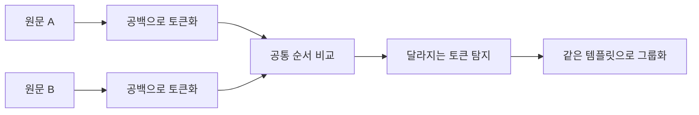

예를 들어 두 문장이 있다고 해보겠습니다.

```text
아리아 새로운 임무 시작
레온 새로운 임무 시작
```

공백으로 나누면 다음처럼 볼 수 있습니다.

```text
문장 A: [아리아] [새로운] [임무] [시작]
문장 B: [레온]   [새로운] [임무] [시작]
```

공통으로 남는 부분은 분명합니다.

```text
[새로운] [임무] [시작]
```

첫 번째 토큰만 달라지므로 그 자리를 변수로 볼 수 있습니다.

```text
[{캐릭터명}] [새로운] [임무] [시작]
```

긴 문장에서도 같은 순서로 등장하는 토큰을 찾고, 그 사이에서 달라지는 부분을 변수 후보로 잡을 수 있었습니다.

제가 이 구조를 자연스럽다고 생각한 이유는 공백을 이미 의미 있는 경계로 보고 있었기 때문입니다.

```text
공백
→ 단어와 단어의 경계
→ 비교 가능한 토큰의 경계
→ 변수가 들어갈 수 있는 위치
```

하지만 알고리즘에는 이 전제가 코드로 드러나 있지 않았습니다. 단순히 `split()`을 호출하고 있었을 뿐입니다.

한국어 데이터에서 잘 동작하니 공백이 언어의 특징이 아니라 문자열의 보편적인 구조처럼 느껴졌습니다.

## 중국어와 일본어에서는 첫 단계부터 달랐다

중국어와 일본어 문장에서는 단어마다 공백을 넣지 않는 것이 일반적입니다.

예를 들어 눈에 보이는 문자열이 다음처럼 이어질 수 있습니다.

```text
新的任务开始了
新しい任務が始まりました
```

공백만 기준으로 나누면 문장 전체가 토큰 하나가 됩니다.

```text
[新的任务开始了]
[新しい任務が始まりました]
```

이 상태에서는 이름 하나나 단어 하나가 달라져도 “토큰 하나 전체가 다르다”는 결과만 나옵니다. 공통 구조와 변수 위치를 찾을 수 없습니다.

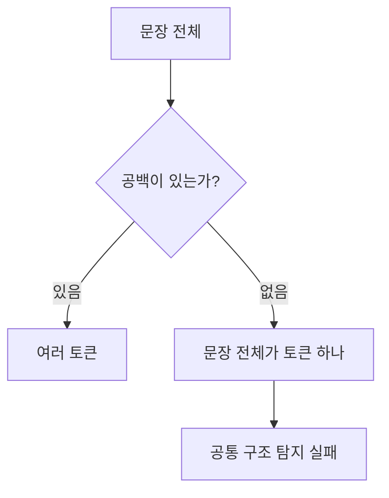

여기서 처음 알게 된 것은 띄어쓰기가 없다는 사실보다, **문장을 어디서 나눌 것인가도 언어별 처리의 일부**라는 점이었습니다.

중국어는 연속된 글자 사이에서 단어 경계를 찾아야 합니다. 일본어는 한자, 히라가나, 가타카나가 섞이고 조사와 활용이 이어지기 때문에 형태를 고려한 분절이 필요합니다.

Unicode의 기본 단어 경계 규칙만으로도 모든 언어를 같은 정확도로 나눌 수 있는 것은 아닙니다. 중국어와 일본어처럼 문맥을 보고 경계를 찾아야 하는 문자 체계는 별도의 조정이 필요합니다. ICU도 중국어, 일본어, 태국어 등의 단어 경계를 찾을 때 사전 기반 처리를 함께 제공합니다.

즉 다음 두 문장은 같은 뜻이 아니었습니다.

```text
공백으로 나눈다.
언어에 맞게 문장을 분절한다.
```

공백 분리는 분절 방법 중 하나일 뿐이었습니다.

## 태국어의 공백도 제가 알던 공백과 달랐다

태국어에서도 공백을 한국어나 영어의 단어 경계처럼 그대로 사용할 수 없습니다.

공백이 전혀 없다는 식으로 단순화하는 것도 정확하지 않습니다. 공백이 등장할 수 있지만, 모든 단어 사이에 들어가는 경계라기보다 구나 문장의 큰 단위를 나누는 데 쓰일 수 있습니다.

따라서 공백이 있다는 사실만 확인하고 같은 토크나이저를 적용하면 또 다른 오류가 생깁니다.

```text
한국어·영어에서의 공백
→ 단어 경계로 활용하기 쉬움

태국어에서의 공백
→ 항상 단어 하나의 경계를 뜻하지 않음
```

처음에는 언어를 두 종류로만 나눌 수 있을 것 같았습니다.

```text
띄어쓰기가 있는 언어
띄어쓰기가 없는 언어
```

하지만 실제로는 이것도 너무 거친 분류였습니다.

- 공백이 단어 경계로 강하게 작동하는 언어가 있습니다.
- 공백이 제한적으로 사용되는 언어가 있습니다.
- 공백 없이 단어가 이어지는 언어가 있습니다.
- 활용과 접사가 붙어 한 토큰 안에서도 비교할 형태가 달라지는 언어가 있습니다.

그래서 `공백 있음/없음`을 저장하는 플래그 하나로는 부족했습니다. 언어별로 어떤 분절기를 사용할지 결정해야 했습니다.

## 언어별로 무엇이 다른지 한 번 정리해봤다

다국어 데이터를 보면서 제가 확인해야 했던 특징을 한곳에 모아봤습니다. 모든 문법을 설명하는 목록은 아닙니다. 템플릿 그룹화와 문자열 비교에서 바로 문제가 될 수 있는 차이를 중심으로 정리했습니다.

| 언어 | 경계 특징 | 함께 봐야 할 변화 | 비교할 때의 위험 |
| --- | --- | --- | --- |
| 한국어 | 공백은 어절 경계 | 조사·어미·높임말 | 변수 뒤 조사가 함께 바뀜 |
| 영어 | 공백이 유용하지만 예외 존재 | 복수형·소유격·대소문자 | apostrophe·hyphen을 잘못 제거 |
| 중국어 | 단어 사이 공백이 일반적이지 않음 | 문맥에 따른 단어 경계 | 문장 전체가 토큰 하나가 됨 |
| 일본어 | 단어 사이 공백이 일반적이지 않음 | 조사·활용·표기 체계 혼합 | 같은 어근이 다른 형태로 나타남 |
| 태국어 | 공백이 항상 단어 경계가 아님 | 사전 기반 분절 필요 | 공백만으로 단어를 찾을 수 없음 |
| 프랑스어 | 공백 외 apostrophe·축약 존재 | 성·수 일치, 관사 | `l'`, `d'`를 구두점으로 제거 |
| 독일어 | 합성어가 한 단어로 이어짐 | 격·성·수, 직함 형태 | 공백 토큰 하나가 긴 복합 개념 |
| 스페인어 | 공백 사용 | 성·수 일치, 관사 | 변수 하나가 주변 여러 단어를 바꿈 |
| 아랍어 | 접사가 단어에 붙을 수 있음 | 오른쪽에서 왼쪽, 발음 기호 | 화면 순서와 저장 순서를 혼동 |

이 표를 만들고 나니 `언어별 토크나이저`만 추가하면 끝나는 것도 아니었습니다. 분절, 문법, 문자 표현, 로케일 표기가 서로 다른 층에 있었습니다.

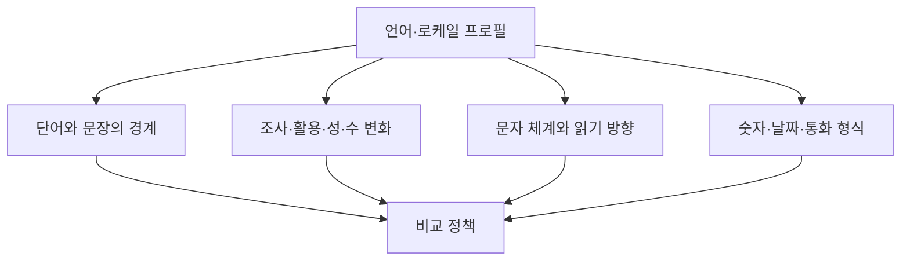

### 한국어: 공백이 있어도 조사와 어미가 붙는다

한국어에는 공백이 있으니 비교하기 쉬울 것 같았습니다. 하지만 공백으로 나눈 단위는 사전의 단어보다 **어절**에 가깝습니다. 명사 뒤에 조사와 어미가 붙습니다.

```text
철수가 도착했습니다.
영희가 도착했습니다.
레온이 도착했습니다.
```

이름만 바뀌었지만 바로 뒤의 조사도 달라집니다.

```text
철수 + 가
영희 + 가
레온 + 이
```

받침 유무에 따라 `이/가`, `은/는`, `을/를`이 달라질 수 있습니다. 따라서 `{캐릭터명}` 하나만 치환하고 조사를 고정하면 자연스럽지 않은 문장이 생깁니다.

```text
잘못된 템플릿
{캐릭터명}가 도착했습니다.

필요한 처리
{캐릭터명}{이/가} 도착했습니다.
```

동사와 형용사의 활용도 있습니다.

```text
시작하다
시작합니다
시작했다
시작할 수 있습니다
```

표면 문자열은 달라도 같은 어근에서 나온 형태일 수 있습니다. 높임말과 말투까지 포함하면 같은 사건을 설명하면서도 문장 끝이 크게 달라질 수 있습니다.

한국어에서는 공백 토큰을 출발점으로 사용할 수 있지만, 변수 주변 조사와 활용까지 같은 토큰 안에서 봐야 했습니다.

### 영어: 공백이 있어도 apostrophe와 hyphen이 남는다

영어는 공백이 단어 경계로 잘 작동하는 편입니다. 그렇다고 구두점을 모두 제거해도 되는 것은 아닙니다.

```text
don't
player's
state-of-the-art
```

apostrophe는 축약이나 소유격 안에 들어가고, hyphen은 여러 단어를 하나의 표현으로 묶을 수 있습니다.

```text
players
player's
players'
```

겉보기에는 비슷하지만 의미와 문법 역할이 다릅니다.

대소문자도 목적에 따라 다르게 다뤄야 합니다.

```text
May  → 5월 또는 이름
may  → 가능성을 나타내는 조동사
```

검색 후보를 찾을 때는 대소문자를 무시할 수 있지만, 최종 템플릿을 확정할 때까지 무조건 없애면 원래 차이를 설명하기 어렵습니다.

### 중국어: 글자 경계와 단어 경계가 같지 않다

중국어 문장은 단어마다 공백을 넣지 않는 것이 일반적입니다.

```text
重新开始任务
```

문자는 눈에 보이는 단위로 나눌 수 있지만, 어떤 문자 묶음이 한 단어인지는 문맥에 따라 달라질 수 있습니다.

```text
重新 / 开始 / 任务
```

한 글자씩 자르면 비교 단위가 너무 잘게 쪼개지고, 문장 전체를 한 토큰으로 두면 변수 위치를 찾을 수 없습니다. 중국어 단어 분절이 별도 문제로 존재하는 이유입니다.

간체와 번체도 구분해야 합니다.

```text
简体中文
繁體中文
```

둘을 무조건 같은 문자로 변환할지, 서로 다른 로케일 데이터로 보존할지는 제품 목적에 따라 달라집니다. 검색 후보를 넓히는 단계에서는 변환 결과를 보조 키로 사용할 수 있지만, 원문 자체를 덮어쓰면 어떤 표기가 실제로 사용됐는지 잃습니다.

### 일본어: 여러 문자 체계와 활용이 한 문장에 섞인다

일본어 문장에는 한자, 히라가나, 가타카나가 함께 나올 수 있습니다.

```text
新しいミッションを開始します
```

```text
新しい      → 한자와 히라가나
ミッション  → 가타카나
を           → 조사
開始します   → 한자와 활용 어미
```

공백이 없을 뿐 아니라 조사와 활용이 이어집니다. 같은 동사도 문장 안에서 형태가 달라질 수 있습니다.

```text
開始する
開始します
開始した
開始しない
```

표기 변형도 있습니다. 같은 외래어나 이름이 전각·반각, 가타카나 표기 차이로 다르게 들어올 수 있습니다. 후보 검색 단계에서는 표기 차이를 완화할 수 있지만, 최종 검수에서는 실제 사용자 화면에 나온 표기를 보존해야 합니다.

### 태국어: 눈에 보이는 문자 하나도 내부에서는 여러 코드 포인트일 수 있다

태국어는 단어 사이 공백만으로 분절하기 어렵습니다. 그래서 사전과 문맥을 활용한 분절기가 필요할 수 있습니다.

문자 처리에서도 주의할 점이 있습니다. 화면에서 글자 하나처럼 보이는 단위가 기본 문자와 결합 기호의 조합일 수 있습니다.

문자열을 코드 포인트 위치로 무작정 자르면 사용자가 보는 글자 단위를 중간에서 끊을 수 있습니다. 이 문제는 태국어에만 있는 것은 아니며, 악센트가 결합되는 여러 문자 체계와 이모지에서도 나타납니다.

따라서 다음 단위를 구분해야 합니다.

```text
byte
→ 저장 인코딩의 단위

code point
→ Unicode 문자 값의 단위

grapheme cluster
→ 사용자가 화면에서 글자 하나로 인식하는 단위

word segment
→ 언어 문맥에서 단어로 해석하는 단위
```

유사도 계산이 어느 단위를 비교하는지 명시하지 않으면 문자열 길이와 위치가 언어마다 다르게 해석될 수 있습니다.

### 프랑스어: apostrophe와 일치 변화가 같이 나타난다

프랑스어에서는 관사와 전치사가 다음 단어와 축약되거나 apostrophe로 이어질 수 있습니다.

```text
le ami → l'ami
de le  → du
à le   → au
```

apostrophe를 일반 구두점으로 보고 제거하거나 그 자리에서 토큰을 끊으면 문법 구조를 잃을 수 있습니다.

명사와 형용사는 성과 수에 따라 형태가 달라질 수 있습니다. 과거분사도 문장 구조에 따라 일치 변화가 나타날 수 있습니다.

```text
원문의 인물 변수
→ 이름
→ 직함
→ 주변 형용사
→ 과거분사 형태
```

숫자와 문장부호에서도 일반 공백이 아닌 줄 바꿈 없는 공백이나 좁은 줄 바꿈 없는 공백이 들어올 수 있습니다. 화면에서 공백처럼 보여도 코드 포인트가 다를 수 있으므로 정규화 정책에 포함해야 합니다.

### 독일어: 합성어와 격 변화가 토큰 수를 흔든다

독일어는 여러 개념을 하나의 긴 합성어로 만들 수 있습니다.

```text
Schaden
Berechnung
System

→ Schadensberechnungssystem
```

다른 언어에서는 여러 토큰으로 번역되는 개념이 독일어에서는 공백 없는 한 토큰일 수 있습니다. 토큰 개수만 비교하면 구조가 크게 다른 문장처럼 보일 수 있습니다.

관사와 형용사도 성·수·격에 따라 달라집니다.

```text
der
die
das
den
dem
```

사람의 이름이나 역할이 바뀌면서 문장 속 격이 달라지면 주변 관사와 형용사까지 함께 변할 수 있습니다. 독일어 직함은 성별에 따라 형태가 달라지는 경우도 있습니다.

그래서 긴 단어 하나의 차이와 문장 구조 전체의 차이를 같은 기준으로 처리하면 안 됩니다.

### 스페인어: 변수 하나가 성·수 일치를 퍼뜨린다

스페인어는 공백으로 단어를 나눌 수 있지만 명사, 관사, 형용사가 성과 수에 따라 함께 달라질 수 있습니다.

```text
el almirante
la almirante
```

직함의 표면 형태는 같아도 관사가 달라질 수 있습니다. 다른 명사와 형용사에서는 단어 자체의 끝도 함께 달라질 수 있습니다.

```text
원문의 캐릭터 변수 하나
→ 관사 변화
→ 직함 변화 가능
→ 형용사 변화
→ 대명사 변화
```

질문과 감탄에는 여는 기호가 사용됩니다.

```text
¿...?
¡...!
```

문장 앞의 `¿`, `¡`를 무조건 잡음으로 제거하면 문장 유형을 나타내는 정보를 잃을 수 있습니다.

스페인어도 지역에 따라 어휘와 숫자 형식이 다를 수 있으므로 언어 코드 `es`만 저장하는 것보다 필요한 경우 `es-ES`, `es-MX` 같은 로케일까지 보존하는 편이 좋습니다.

### 아랍어: 읽기 방향, 결합 문자, 붙는 접사가 함께 있다

아랍어는 오른쪽에서 왼쪽으로 표시됩니다. 문자열의 논리적 저장 순서와 화면에 보이는 시각적 순서를 혼동하면 위치 기반 강조나 diff 표시가 깨질 수 있습니다.

관사와 접속사, 전치사 같은 요소가 단어에 붙어 나타날 수 있습니다. 하나의 공백 토큰 안에 여러 문법 요소가 들어갈 수 있다는 뜻입니다.

발음 구별 기호는 일상 텍스트에서 생략되는 경우가 많습니다. 같은 단어가 기호 포함 여부에 따라 다른 코드 포인트 시퀀스로 저장될 수 있습니다.

숫자도 아라비아 숫자 `0-9`만 들어온다고 가정할 수 없습니다. 아랍어권 숫자 기호와 구분자가 사용될 수 있습니다.

```text
언어별 처리
→ 접사와 단어 경계

문자 처리
→ 결합 형태와 발음 기호

UI 처리
→ 오른쪽에서 왼쪽으로 표시

로케일 처리
→ 숫자와 구분자
```

아랍어는 분절기 하나만 바꾸는 것으로 끝나지 않고 저장, 비교, diff 표시, 화면 배치까지 함께 확인해야 하는 예였습니다.

## 언어별 특징을 코드에서는 어떻게 표현할까?

언어마다 `if` 문을 계속 추가하면 정책이 여러 곳에 흩어집니다. 텍스트 처리에 필요한 선택을 언어·로케일 프로필로 모으는 편이 이해하기 쉬웠습니다.

```text
LanguageProfile
  language
  locale
  segmenter
  unicode_normalization
  case_policy
  punctuation_policy
  number_parser
  placeholder_policy
```

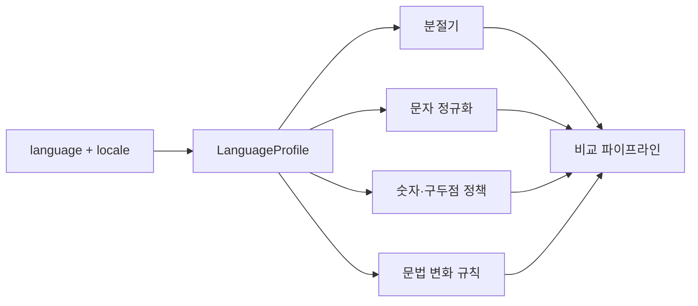

모든 언어 문법을 코드로 완벽하게 모델링하겠다는 뜻은 아닙니다. 현재 지원하는 언어에서 어떤 전처리와 비교 정책을 사용했는지 명시적으로 남기는 구조입니다.

언어를 추가할 때도 질문이 구체적으로 바뀝니다.

```text
이 언어는 지원한다.
```

보다,

```text
어떤 분절기를 쓰는가?
어떤 문자를 같은 것으로 보는가?
숫자는 어느 로케일 규칙으로 해석하는가?
어떤 문법 변화까지 같은 템플릿 후보로 허용하는가?
검수 화면에서 어느 방향으로 diff를 표시하는가?
```

를 확인할 수 있습니다.

## 토큰화보다 먼저 언어를 알아야 했다

문장을 받자마자 `split()`을 호출하던 구조에서, 언어 정보를 먼저 확인하는 구조로 바뀌어야 했습니다.

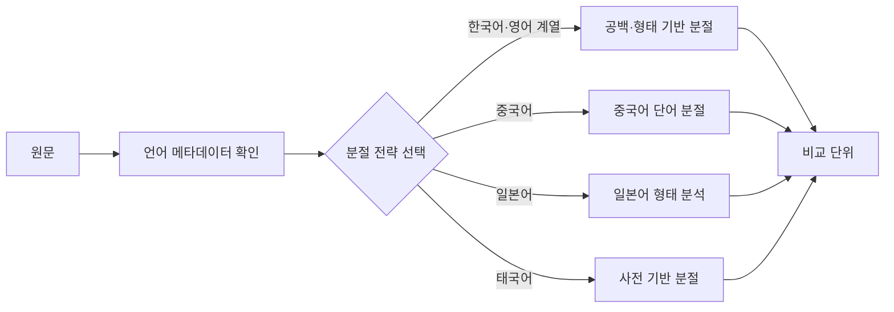

여기서 언어를 문자열에서 매번 추측하는 것보다, 원본 데이터가 이미 가진 언어 코드를 사용하는 편이 낫습니다.

```text
ko
zh-Hans
zh-Hant
ja
th
fr-FR
es-ES
```

자동 언어 감지는 입력이 짧거나 이름과 숫자가 많을 때 쉽게 흔들릴 수 있습니다. 번역 데이터처럼 언어 정보가 원래 존재하는 도메인에서는 그 메타데이터를 먼저 보존해야 했습니다.

분절 결과도 원문을 대체해서는 안 됩니다.

```text
raw_text
→ 사용자가 입력한 원문

normalized_text
→ 비교를 위해 정규화한 문자열

segments
→ 언어별 분절 결과
```

원문과 처리 결과를 따로 보관해야 잘못된 그룹이 생겼을 때 어느 단계에서 문제가 발생했는지 확인할 수 있습니다.

## 원문의 변수 하나가 번역문에서는 한 자리에 머물지 않았다

공백 문제를 해결하면 비교가 끝날 줄 알았습니다.

그런데 다음 문제는 번역문의 문법에서 나왔습니다.

한국어 원문에서는 캐릭터 이름 하나만 바뀔 수 있습니다.

```text
제독 {캐릭터명}이 도착했습니다.
```

한국어의 `제독`이라는 표현은 캐릭터 성별이 달라져도 같은 형태로 사용할 수 있습니다. 그래서 원문에서는 이름 자리 하나만 변수처럼 보입니다.

하지만 번역문에서는 캐릭터 성별 때문에 이름 주변의 여러 표현이 함께 바뀔 수 있습니다.

- 스페인어에서는 직함 앞 관사가 달라질 수 있습니다.
- 독일어에서는 직함 자체의 형태가 달라질 수 있습니다.
- 프랑스어에서는 문장 안의 형용사나 과거분사가 성에 맞춰 달라질 수 있습니다.

원문에서 바뀐 것은 하나인데 번역문에서 달라지는 범위는 여러 토큰일 수 있습니다.

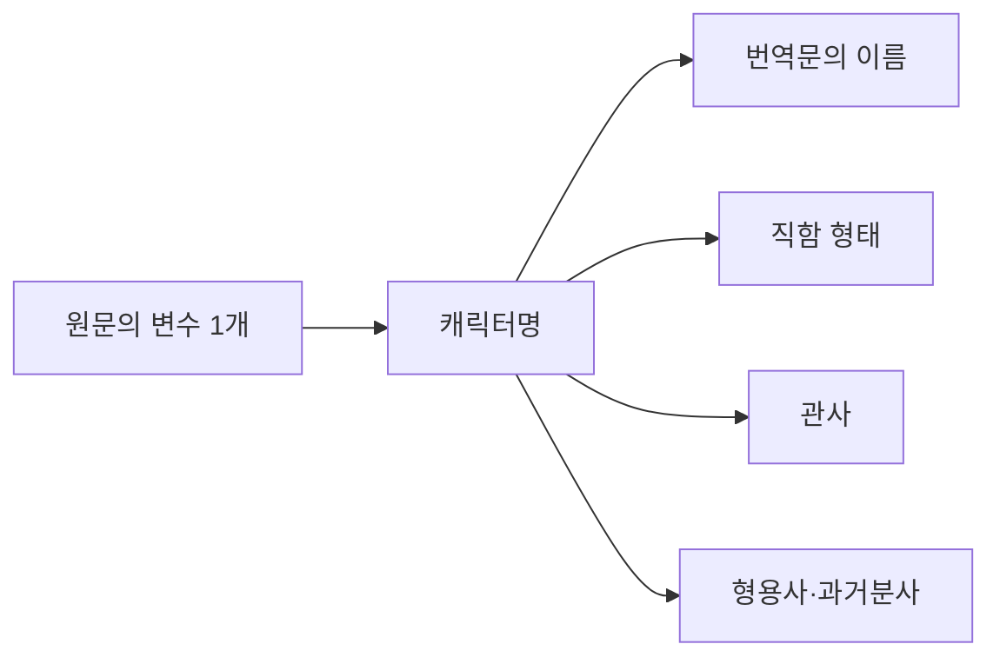

처음 구조는 변수 하나가 양쪽 문장의 같은 위치에 대응한다고 생각했습니다.

```text
원문 변수 1개
↕
번역문 토큰 1개
```

하지만 실제 대응은 다음에 가까웠습니다.

```text
원문 변수 1개
↕
번역문의 여러 구간과 문법 변화
```

이 차이는 템플릿 그룹화의 기준을 바꿨습니다.

번역문에서 여러 토큰이 달라졌다고 해서 바로 다른 템플릿으로 분리하면, 사실은 같은 원문 변수 때문에 생긴 문법 변화를 놓칠 수 있습니다. 반대로 모든 차이를 변수로 허용하면 의미가 다른 문장까지 같은 그룹으로 묶일 수 있습니다.

그래서 단순히 “몇 개의 토큰이 다른가”보다 다음을 함께 봐야 했습니다.

- 차이가 문장의 어느 구간에 모여 있는가?
- 원문에서 달라진 변수와 연관된 변화인가?
- 동일한 언어·로케일 안에서 반복되는 변화인가?
- 나머지 문장 구조는 얼마나 안정적으로 유지되는가?
- 자동 그룹화해도 되는가, 검수 후보로만 보여줘야 하는가?

## 변수는 토큰 한 개보다 구간으로 보는 편이 맞았다

기존에는 서로 다른 토큰의 위치를 찾고 그 자리를 변수로 바꾸려 했습니다.

```text
[A] [공통] [공통] [공통]
[B] [공통] [공통] [공통]
```

다국어에서는 차이가 연속된 구간으로 나타날 수 있습니다.

```text
[A1] [A2] [공통] [공통] [A3]
[B1] [B2] [공통] [공통] [B3]
```

이 경우 비교 결과는 “첫 번째 토큰이 다르다”가 아니라 다음 구조를 표현해야 합니다.

```text
변화 구간 1
공통 구간
변화 구간 2
```

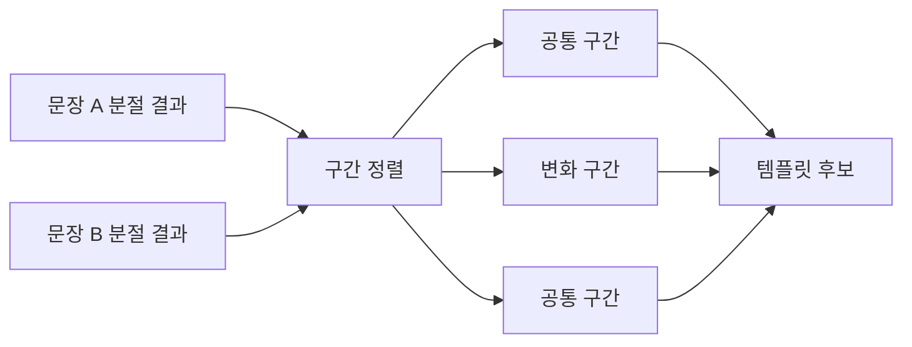

변화 구간 안에서 이름, 직함, 관사, 형용사가 함께 달라질 수 있습니다. 자동화는 그 구간이 왜 달라졌는지 완전히 이해하지 못하더라도, 적어도 차이가 한 자리의 단어 교체보다 넓다는 사실을 보존해야 합니다.

그리고 확신이 낮으면 자동으로 하나의 그룹을 확정하기보다 사람이 판단할 후보로 보여주는 편이 안전합니다.

## 숫자는 언어보다 로케일의 영향을 받았다

문자열을 정규화할 때 숫자와 구두점을 단순하게 처리하려던 부분도 문제가 됐습니다.

예를 들어 다음 문자열이 있습니다.

```text
1,500
```

미국 영어 로케일에서는 보통 천 단위 구분자가 쉼표이므로 `천오백`으로 읽습니다.

```text
en-US
1,500 → 1500
```

소수점에 쉼표를 사용하는 로케일에서는 같은 문자열이 `1.5`를 뜻할 수 있습니다.

```text
decimal comma locale
1,500 → 1.5
```

독일어권 일부 표기에서는 점을 천 단위 구분자로, 쉼표를 소수점으로 사용할 수 있습니다.

```text
1.500,25
→ 천오백 점 이오
```

프랑스어 로케일처럼 천 단위에 일반 공백이 아닌 좁은 줄 바꿈 없는 공백을 쓰는 경우도 있습니다.

겉으로 보기에 쉼표, 마침표, 공백은 제거해도 될 구두점처럼 보입니다. 하지만 숫자 안에서는 값의 크기를 결정하는 문자입니다.

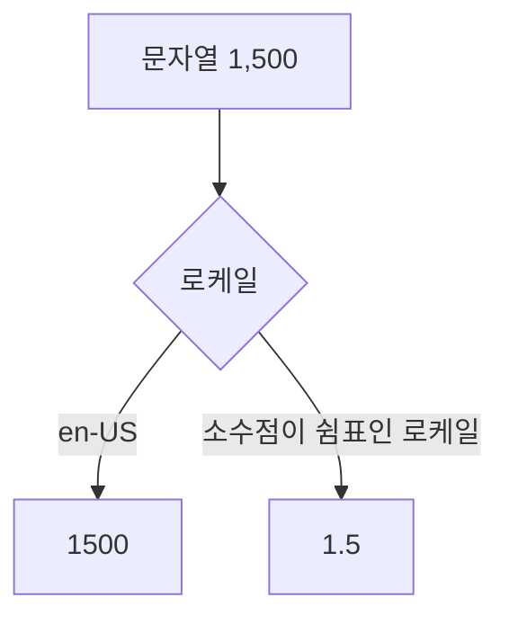

여기서 언어와 로케일을 나눠봐야 했습니다.

```text
언어
→ 문장을 어떻게 분절하고 문법을 어떻게 해석할지 결정

로케일
→ 숫자·날짜·통화·구분자를 어떻게 표시할지 결정
```

`Spanish`라는 언어 정보만으로 모든 숫자 표기를 결정하기 어렵습니다. 스페인과 중남미 지역에서 사용하는 표기 관습이 다를 수 있습니다. `es-ES`, `es-MX`처럼 지역까지 포함한 로케일 정보가 필요한 이유입니다.

## 구두점을 먼저 지우면 원래 값을 복구할 수 없다

유사 문장 비교에서는 구두점을 제거하면 잡음이 줄어드는 경우가 있습니다.

```text
안녕하세요!
안녕하세요.
```

마침표와 느낌표 차이를 무시하고 같은 문장으로 보고 싶을 수 있습니다.

하지만 모든 구두점을 먼저 제거하면 숫자, 자리표시자, 축약형의 구조까지 잃을 수 있습니다.

```text
1,500     → 1500인지 1.5인지 구분할 정보 손실
{user.id} → placeholder 내부 구조 손상 가능
don't     → 단어 내부 apostrophe 손실
```

따라서 정규화 순서가 중요했습니다.

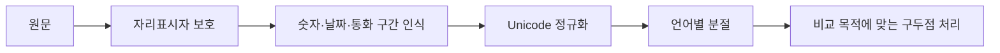

먼저 의미 있는 구간을 보호하고, 그다음 비교에 불필요한 차이만 줄여야 합니다.

정규화는 원문을 깨끗하게 만드는 청소 작업이 아니었습니다. 어떤 차이를 같은 것으로 취급할지 정하는 정책이었습니다.

## Unicode 정규화도 무조건 한 방식으로 끝나지 않았다

화면에서는 같은 글자처럼 보여도 내부 코드 포인트가 다른 문자열이 있을 수 있습니다. 전각과 반각, 조합 문자와 완성된 문자처럼 입력 방식 때문에 같은 표현이 다르게 저장되기도 합니다.

Unicode 정규화는 이런 차이를 줄이는 데 도움이 됩니다.

하지만 여기서도 “무조건 모든 문자를 같은 모양으로 바꾼다”는 정책은 위험합니다.

- 전각과 반각 차이를 무시해도 되는가?
- 대소문자 차이는 의미가 없는가?
- 악센트 부호를 제거해도 되는가?
- 일본어 가나의 차이를 같은 것으로 볼 것인가?
- 게임 안에서 의도적으로 사용한 특수문자를 보존해야 하는가?

정답은 비교 목적에 따라 달라집니다.

```text
검색 후보를 넓게 찾는 정규화
→ 더 많은 차이를 무시할 수 있음

최종 템플릿을 확정하는 정규화
→ 의미 있는 차이를 더 많이 보존해야 함
```

후보 검색과 최종 판정을 같은 정규화 결과 하나에 맡기면 어느 쪽에도 맞지 않을 수 있습니다.

## 그래서 비교를 두 단계로 나누는 편이 나았다

모든 문장을 정교한 언어 분석기로 전부 비교하면 정확도는 높아질 수 있지만 처리 비용이 커집니다. 반대로 문자 몇 개만 보고 그룹을 확정하면 오탐이 늘어납니다.

그래서 후보를 찾는 단계와 그룹을 판정하는 단계를 나누는 구조가 자연스러웠습니다.

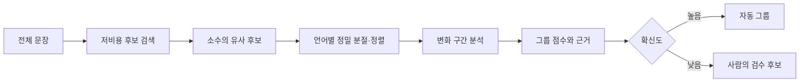

후보 검색에서는 문자 n-gram처럼 언어별 단어 경계에 덜 의존하는 방식을 사용할 수 있습니다. 최종 비교에서는 언어별 분절 결과와 공통 구간, 변수 위치를 더 자세히 봅니다.

이 구조는 완벽한 언어 분석기를 만드는 것보다 현실적이었습니다.

- 후보 검색은 놓치지 않는 방향으로 넓게 찾습니다.
- 최종 비교는 잘못 묶지 않는 방향으로 엄격하게 봅니다.
- 확신이 낮은 결과는 자동 확정하지 않습니다.
- 사람이 왜 후보가 됐는지 확인할 수 있게 근거를 보여줍니다.

## 새 구조에서는 무엇을 저장해야 할까?

문자열 하나와 유사도 점수만 저장하면 문제가 생겼을 때 설명하기 어렵습니다.

다음 정보가 함께 필요했습니다.

```text
raw_text
language
locale
normalized_text
normalization_version
protected_placeholders
segments
common_spans
variable_spans
similarity_score
comparison_reason
```

`normalization_version`도 중요합니다. 정규화 규칙이나 분절기를 바꾸면 같은 문장의 결과가 달라질 수 있기 때문입니다.

```text
규칙 v1
→ 공백 분리

규칙 v2
→ 언어별 분절

규칙 v3
→ 로케일 숫자 보호 추가
```

어떤 규칙으로 만든 그룹인지 모르면 이전 결과와 새 결과를 비교할 수 없습니다. 알고리즘 버전이 데이터의 의미 일부가 됩니다.

## 전체 흐름을 다시 그려보면

처음의 구조는 짧았습니다.

```text
문장
→ 공백으로 분리
→ 유사도 계산
→ 그룹화
```

실제 데이터를 본 뒤에는 다음과 같이 바뀌었습니다.

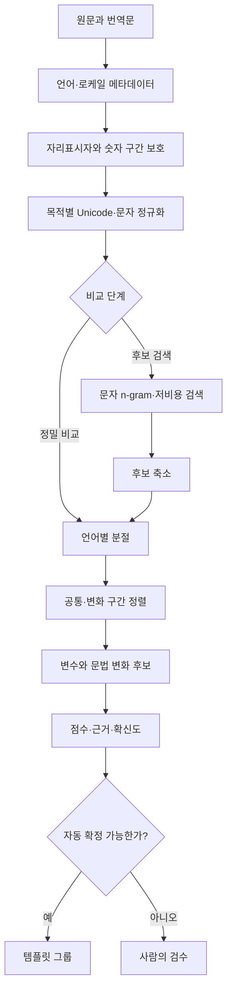

단계가 많아진 이유는 멋진 NLP 파이프라인을 만들기 위해서가 아닙니다. 처음 알고리즘이 숨기고 있던 결정을 밖으로 꺼냈기 때문입니다.

- 어떤 언어인가?
- 어느 지역의 표기인가?
- 무엇을 변수로 보호할 것인가?
- 어디를 문장 경계로 볼 것인가?
- 어떤 차이는 무시해도 되는가?
- 어느 정도 확신해야 자동으로 묶을 것인가?

이 질문에 대한 답이 기존에는 `split()`과 구두점 제거 코드 안에 섞여 있었습니다.

## 테스트 데이터도 언어별로 달라져야 했다

한국어 예제 몇 개로 유사도 기준을 조절하면 다국어 품질을 알 수 없습니다.

언어·로케일별로 최소한 다음 유형을 확인해야 했습니다.

| 유형 | 확인할 것 |
| --- | --- |
| 공백으로 단어를 나누는 문장 | 기존 토큰 비교가 유지되는가? |
| 중국어·일본어 문장 | 공백이 없어도 공통 구조를 찾는가? |
| 태국어 문장 | 공백을 단어 경계로 오해하지 않는가? |
| 이름·성별 변수 | 여러 문법 변화가 있어도 후보로 연결되는가? |
| 숫자 포함 문장 | 로케일별 소수점과 천 단위를 보존하는가? |
| 자리표시자 포함 문장 | `{0}`, `%s`, `{name}`이 깨지지 않는가? |
| 구두점만 다른 문장 | 의도한 범위에서 같은 그룹이 되는가? |
| 의미가 다른 유사 문장 | 표면이 비슷해도 잘못 묶이지 않는가? |

좋은 결과만 확인해서는 부족했습니다.

```text
같이 묶여야 하는 문장
→ 재현율 확인

같이 묶이면 안 되는 문장
→ 정밀도 확인
```

템플릿 그룹화에서는 잘못 묶은 결과의 비용이 클 수 있습니다. 서로 다른 의미의 번역을 같은 템플릿으로 보면 검수자가 중요한 차이를 놓칠 수 있기 때문입니다.

따라서 자동화 비율을 높이는 것보다, 잘못된 자동 확정을 줄이고 애매한 결과를 설명 가능한 후보로 남기는 것이 먼저였습니다.

## 클라이언트 인터뷰에서 알고리즘의 전제가 보였다

이 문제를 코드만 보고 있을 때는 공백 분리와 유사도 임계값을 어떻게 개선할지만 생각했습니다.

그런데 클라이언트와 이야기하고 실제 번역 데이터를 보니 질문이 달라졌습니다.

- 같은 캐릭터가 언어마다 어떤 문법 변화를 만드는가?
- 번역자가 정말 같은 템플릿으로 보고 싶은 범위는 어디까지인가?
- 숫자와 날짜는 어느 로케일 규칙으로 작성되는가?
- 자동 그룹이 틀렸을 때 검수자는 어떻게 알아차릴 수 있는가?
- 원문과 번역문 중 어느 쪽의 구조를 더 우선해야 하는가?

알고리즘 문서에는 없던 정보였습니다. 하지만 기능의 정확도를 결정하는 정보였습니다.

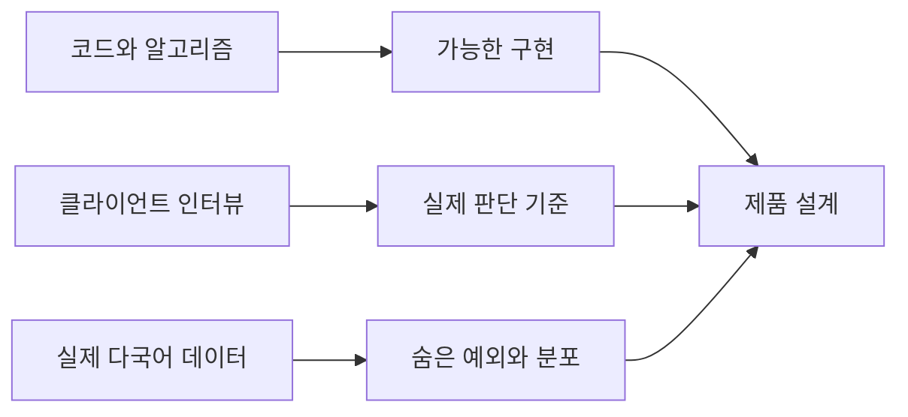

도메인 지식을 많이 쌓은 뒤에야 개발할 수 있다는 뜻은 아닙니다. 먼저 단순하게 만들고, 실제 사용자와 데이터를 보면서 어떤 전제가 틀렸는지 찾아야 했습니다.

기능을 고도화할 지점도 그때부터 보였습니다.

```text
알고리즘의 정확도 개선
→ 무엇을 같은 문장으로 볼지 이미 안다는 전제

도메인 인터뷰
→ 사용자가 무엇을 같은 문장으로 보는지 발견
```

후자가 정해지지 않으면 앞의 정확도도 무엇을 기준으로 재야 할지 알 수 없습니다.

## 이 경험에서 배운 것

처음에는 비슷한 문장을 잘 비교하는 알고리즘을 찾고 있었습니다.

공백으로 토큰화하고, 공통 순서를 찾고, 달라지는 자리를 변수로 바꾸면 될 것 같았습니다.

실제 데이터에서는 세 가지 전제가 차례로 깨졌습니다.

### 공백은 보편적인 단어 경계가 아니었다

중국어, 일본어, 태국어를 같은 방식으로 나눌 수 없었습니다. 비교 알고리즘 전에 언어별 분절 전략이 필요했습니다.

### 원문의 변수 하나는 번역문의 여러 표현을 바꿀 수 있었다

이름과 성별은 직함, 관사, 형용사처럼 더 넓은 문법 변화를 만들었습니다. 변수는 토큰 한 자리보다 변화 구간으로 봐야 했습니다.

### 구두점처럼 보이는 문자도 로케일에서는 데이터였다

쉼표, 마침표, 공백은 숫자의 크기와 의미를 바꿀 수 있었습니다. 언어와 로케일을 나누고, 의미 있는 구간을 보호한 뒤 정규화해야 했습니다.

이 세 가지는 서로 다른 문제처럼 보이지만 한곳에서 만납니다.

> 문자열은 문자만 모아놓은 값이 아니라, 언어와 로케일과 사용 맥락을 가진 데이터였습니다.

## 마무리

처음에는 이 기능을 알고리즘 문제로 봤습니다.

```text
문장을 어떻게 잘 비교할까?
```

지금은 질문을 조금 다르게 봅니다.

```text
이 언어에서 비교 가능한 단위는 무엇인가?
이 로케일에서 보존해야 할 표기는 무엇인가?
사용자는 어떤 차이를 변수로 보는가?
어디까지 자동으로 판단해도 되는가?
```

알고리즘은 이 질문에 답한 뒤에야 제대로 동작할 수 있었습니다.

한국어 데이터에서 성공한 공백 토큰화는 틀린 구현이 아니었습니다. 다만 한국어라는 조건 안에서만 맞는 구현이었습니다. 문제는 그 조건을 적지 않은 채 다국어 전체의 규칙처럼 사용한 데 있었습니다.

클라이언트를 인터뷰하고 실제 데이터를 본 뒤에야 숨은 전제가 보였습니다. 그리고 그때부터 기능을 어디까지 고도화해야 하는지도 구체적으로 말할 수 있었습니다.

처음에는 비슷한 문장을 잘 비교하는 알고리즘의 문제라고 생각했습니다. 그런데 실제 데이터를 들여다볼수록 먼저 이해해야 했던 것은 알고리즘이 아니라 언어와 사용자의 세계였습니다.

## 참고

- [Unicode Standard Annex #29: Unicode Text Segmentation](https://www.unicode.org/reports/tr29/)
- [ICU Boundary Analysis](https://unicode-org.github.io/icu/userguide/boundaryanalysis/)
- [Unicode LDML Part 3: Numbers](https://www.unicode.org/reports/tr35/tr35-numbers.html)
