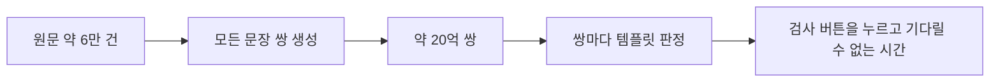
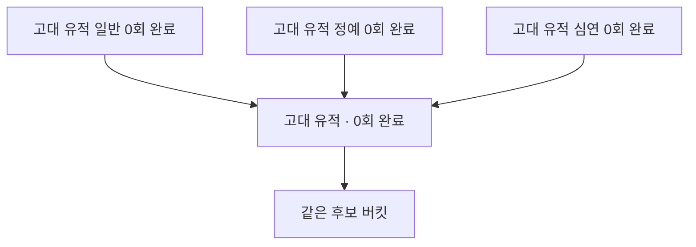
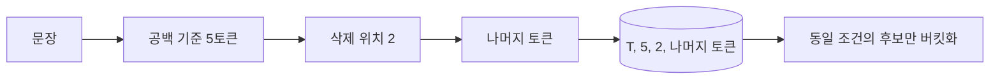
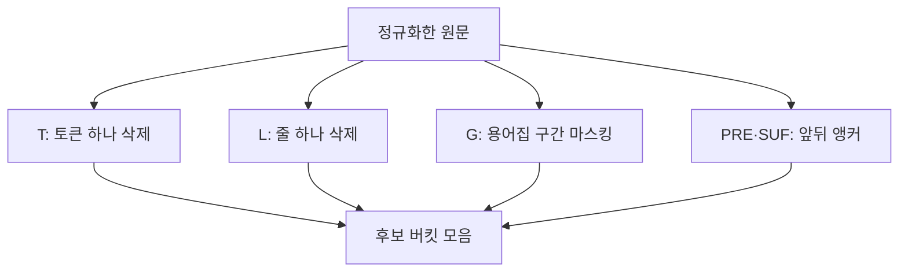
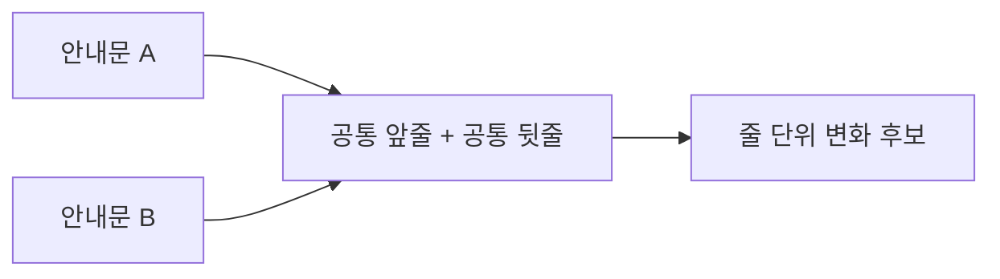
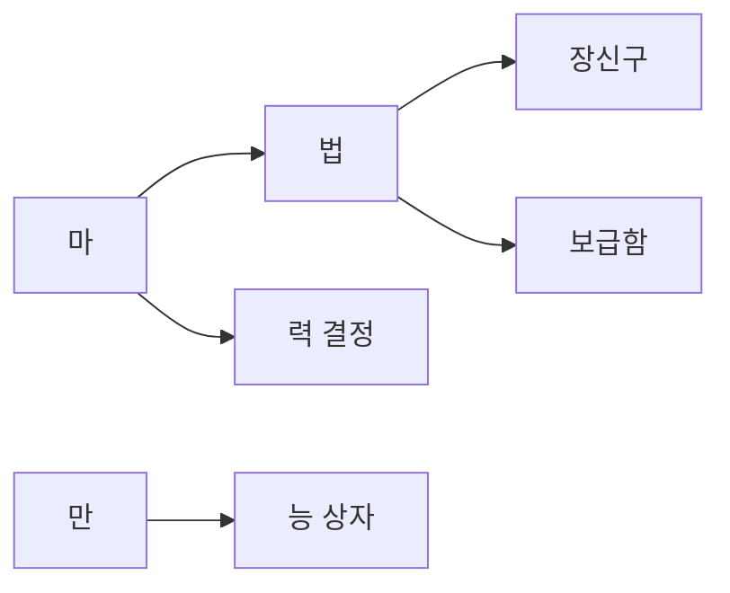
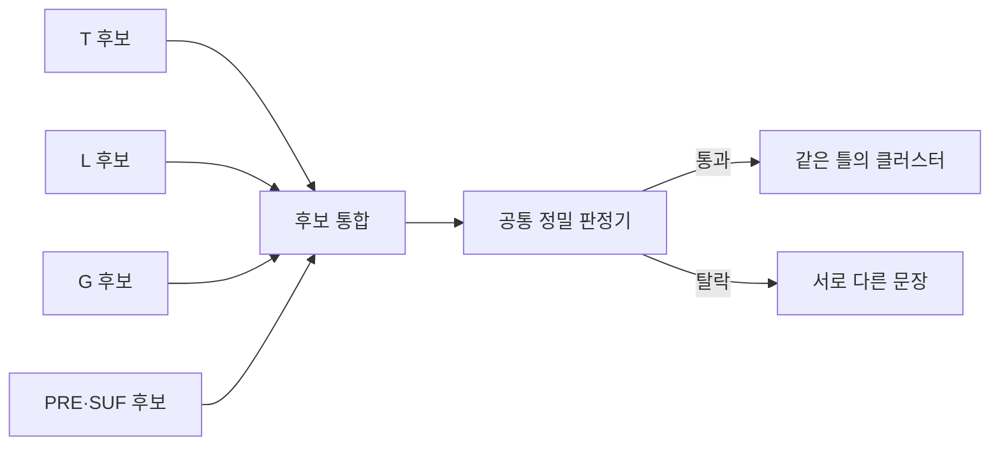
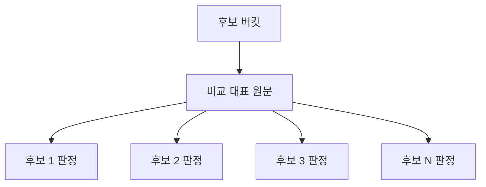
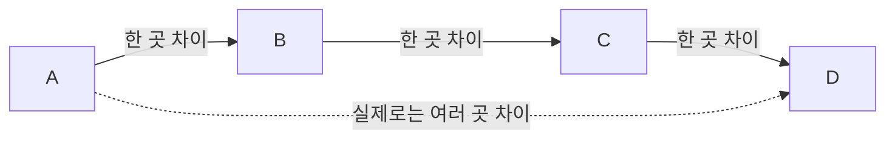
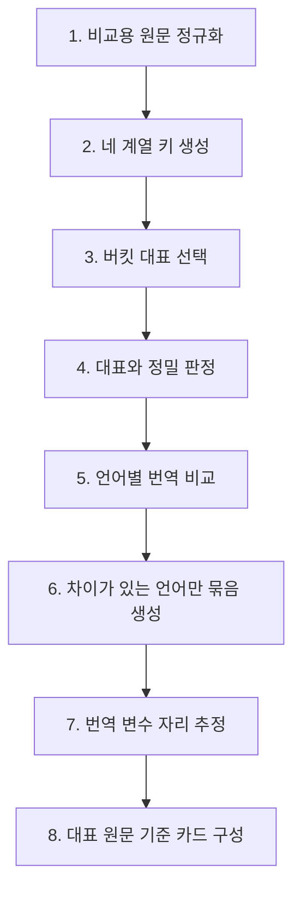

> 이 글은 실무에서 만든 검사 알고리즘을 바탕으로 작성했습니다. 회사 자산을 보호하기 위해 게임명과 프로젝트명은 제거했고, 모든 예문은 같은 구조의 가상 문장으로 다시 만들었습니다. 데이터 규모·경로별 건수·시간·내부 임계값도 의미가 달라지지 않는 범위에서 반올림했습니다.

## 들어가며

게임 번역 파일에는 같은 틀을 반복하는 문장이 많습니다.

아래 문장은 실제 게임 문구가 아니라 구조만 재현한 예시입니다.

```text
고대 유적 일반 <color={COLOR}>{0}회</color> 완료
고대 유적 정예 <color={COLOR}>{0}회</color> 완료
고대 유적 심연 <color={COLOR}>{0}회</color> 완료
```

사람이 보면 같은 틀이라는 것을 바로 알 수 있습니다.

```text
고대 유적 {난이도} <color={COLOR}>{0}회</color> 완료
```

원문에서 난이도 하나만 달라졌다면 번역도 대체로 그 자리에 대응하는 표현만 달라져야 합니다.

그런데 여러 번역가가 수개월에 걸쳐 작업한 파일을 보면 꼭 그렇지는 않습니다. 영어 문장 하나만 어순이 달라지기도 하고, 일부 일본어 번역만 문장을 축약하기도 합니다. 숫자나 포맷 태그의 위치가 달라진 경우도 있습니다.

문장 세 개가 나란히 있다면 사람이 알아챌 수 있습니다. 실제 파일에서는 같은 틀의 문장들이 수만 행 떨어져 있습니다. 눈으로 찾기는 어렵습니다.

그래서 검사기가 해야 할 일은 명확했습니다.

> 같은 틀의 원문을 묶고, 그 안에서 번역 구조가 달라진 곳을 보여준다.

문제는 “같은 틀”을 어떻게 찾느냐였습니다.

## 약 6만 문장을 모두 비교할 수는 없었다

가장 단순한 방법은 모든 원문 쌍을 비교하는 것입니다.

문장이 `N`개라면 비교할 쌍의 수는 다음과 같습니다.

```text
N × (N - 1) ÷ 2
```

원문이 약 6만 건이면 비교 대상은 약 20억 쌍입니다.

쌍 하나를 비교하는 데 10마이크로초만 걸린다고 가정해도 5시간이 넘습니다. 실제 판정은 토큰화, 공통 구간 계산, 변수 추출, 태그와 숫자 처리까지 포함하므로 더 무거울 수 있습니다.



처음에는 비교 함수를 더 빠르게 만드는 방법을 생각했습니다. 하지만 비교 한 번을 절반으로 줄여도 약 20억이라는 수는 그대로입니다.

질문을 바꿔야 했습니다.

```text
기존 질문
→ 두 문장이 같은 틀인지 어떻게 빨리 비교할까?

바꾼 질문
→ 같은 틀일 가능성이 있는 문장끼리만 어떻게 만나게 할까?
```

핵심은 비교 속도가 아니라 비교 상대의 수였습니다.

## 다른 단어를 지우면 같은 문장이 된다

앞의 예시에서 달라지는 부분은 난이도 한 단어뿐입니다.

```text
고대 유적 일반 <color={COLOR}>{0}회</color> 완료
고대 유적 정예 <color={COLOR}>{0}회</color> 완료
고대 유적 심연 <color={COLOR}>{0}회</color> 완료
```

세 번째 토큰을 지우면 나머지가 같습니다.

```text
고대 유적 [삭제] <color={COLOR}>{0}회</color> 완료
```

이 “지운 나머지”를 사전의 열쇠로 사용했습니다. 같은 열쇠 아래에 모인 문장 집합을 이 글에서는 버킷이라고 부르겠습니다.



어느 단어가 변수인지는 미리 알 수 없습니다.

그래서 하나를 고르지 않았습니다. 토큰이 다섯 개면 각 위치를 한 번씩 지운 열쇠를 전부 만듭니다.

```text
문장
가람 용맹 700이상 <color={COLOR}>5회</color> 달성

열쇠 1
[삭제] 용맹 700이상 <color={COLOR}>5회</color> 달성

열쇠 2
가람 [삭제] 700이상 <color={COLOR}>5회</color> 달성

열쇠 3
가람 용맹 [삭제] <color={COLOR}>5회</color> 달성

열쇠 4
가람 용맹 700이상 [삭제] 달성

열쇠 5
가람 용맹 700이상 <color={COLOR}>5회</color> [삭제]
```

`가람 인내 700이상 …`이라는 문장이 있다면 두 번째 열쇠에서 만납니다. 나머지 네 열쇠는 같은 문장을 만나지 못한 채 버려집니다.

낭비처럼 보이지만 문장마다 만드는 열쇠 수는 토큰 수에 비례합니다.

```text
전수 비교
O(N²)

한 토큰 삭제 키 생성
O(N × 평균 토큰 수)
```

약 20억 쌍을 먼저 만들지 않고 백만 개 안팎의 키를 생성한 뒤, 실제로 같은 키를 공유한 문장끼리만 비교할 수 있게 됐습니다.

여기서 보장 범위를 좁혀 말해야 합니다.

> 두 문장이 정확히 한 토큰만 다르면, 각 위치를 지워 만든 열쇠 중 하나는 반드시 겹칩니다.

모든 유사 문장이 반드시 만난다는 뜻은 아닙니다. 두 곳이 달라지거나 여러 토큰으로 된 구간이 바뀌면 이 열쇠 하나만으로는 부족합니다.

## 삭제 열쇠에는 문장도 함께 설명돼야 했다

지운 나머지 문자열만 열쇠로 사용하면 길이가 다른 문장이나 삭제 위치가 다른 문장이 우연히 섞일 수 있습니다.

그래서 실제 열쇠에는 세 가지를 함께 넣었습니다.

```text
키 종류
전체 토큰 수
지운 위치
지운 나머지 토큰
```

개념적으로는 다음과 같습니다.

```text
(T, 5, 2, "가람 · 700이상 · 5회 · 달성")
```

이제 “5토큰 문장에서 두 번째 토큰을 지운 결과가 같은 문장”끼리만 만납니다.



열쇠 생성에도 경계를 뒀습니다.

- 토큰이 너무 짧은 문장은 우연한 일치가 많아 제외했습니다.
- 토큰이 수십 개를 넘는 긴 문장은 키가 과도하게 늘어 제외했습니다.
- 한 키에 수백 문장이 모이면 너무 흔한 표현으로 보고 해당 버킷을 건너뛰었습니다.

내부 구현에는 구체적인 상한이 있지만 공개 글에서는 반올림했습니다. 중요한 것은 숫자 자체보다 다음 원칙입니다.

> 후보를 놓치지 않기 위해 키를 넓게 만들되, 의미 없는 대형 버킷이 정밀 판정을 압도하지 못하게 제한한다.

## 토큰은 형태소가 아니라 공백으로 나눈 조각이었다

여기서 토큰은 형태소 분석 결과가 아닙니다. 공백으로 나눈 조각입니다.

```text
물속성 2명으로 플레이

토큰 1: 물속성
토큰 2: 2명으로
토큰 3: 플레이
```

`물속성`을 `물 + 속성`으로 분해하지 않습니다. 따라서 다음 네 문장은 첫 번째 토큰 하나가 다른 문장으로 만날 수 있습니다.

```text
물속성 2명으로 플레이
불속성 2명으로 플레이
바람속성 2명으로 플레이
빛속성 2명으로 플레이
```

포맷 태그도 안에 공백이 없다면 한 토큰입니다.

```text
<color={COLOR}>5회</color>
```

이 단순한 토큰화는 빠르고 결과를 설명하기 쉽습니다. 대신 한계도 분명합니다.

```text
700이상
700 이상
```

사람에게는 비슷해 보여도 토큰 수가 달라 삭제 위치와 전체 토큰 수가 맞지 않을 수 있습니다.

즉 공백 토큰화는 임시 구현이 아니라 선택이었습니다.

- 형태소 분석 모델 없이 빠르게 실행할 수 있습니다.
- 태그가 포함된 게임 문장을 그대로 다루기 쉽습니다.
- 왜 두 문장이 만났거나 만나지 못했는지 설명할 수 있습니다.
- 반대로 띄어쓰기 차이와 언어별 분절 문제는 별도 계층에서 해결해야 합니다.

## 첫 번째 후보 생성기 T는 무엇을 잡았나

한 토큰 삭제 경로를 `T`라고 불렀습니다. Token의 첫 글자입니다.

```text
T(sentence)
→ 각 토큰 위치를 한 번씩 지운 키 생성
```

실제 문장을 공개할 수 없어 같은 패턴의 가상 예시로 바꾸면 다음과 같습니다.

### 단계나 등급 한 단어가 다른 경우

```text
가온 방어 숙련 I
가온 방어 숙련 II
가온 방어 숙련 III
```

### 캐릭터 이름만 다른 경우

```text
가람 용맹 700이상 5회 달성
누리 용맹 700이상 5회 달성
다온 용맹 700이상 5회 달성
```

### 한 단어 안의 일부 글자만 다른 경우

```text
물속성 2명으로 플레이
바람속성 2명으로 플레이
빛속성 2명으로 플레이
불속성 2명으로 플레이
```

### 문장 안의 숫자 토큰만 다른 경우

```text
턴 종료 시 체력이 가장 낮은 아군의 받는 피해가 10% 감소합니다.
턴 종료 시 체력이 가장 낮은 아군의 받는 피해가 12% 감소합니다.
턴 종료 시 체력이 가장 낮은 아군의 받는 피해가 15% 감소합니다.
```

마지막 예시는 문장이 길어 앞뒤 앵커 안에서 변수를 만나지 못할 수 있고, 숫자는 용어집에도 없습니다. 한 토큰 삭제 키가 필요한 이유입니다.

내부 회차에서는 다른 경로가 아니라 T 경로로만 발견된 그룹이 약 1,800개 있었습니다. 이 숫자는 오류 수가 아니라 T가 추가로 만들어낸 후보 그룹 규모입니다.

하지만 실제 파일에는 한 토큰보다 큰 변화가 있었습니다. 그래서 후보 생성기가 세 계열 더 필요했습니다.

## 실제 데이터가 열쇠를 네 계열로 늘렸다

처음부터 네 가지 전략을 설계한 것은 아닙니다.

놓치는 사례를 확인할 때마다 “왜 기존 키로 만나지 못했는가?”를 분류했습니다.



`PRE`와 `SUF`는 각각 키를 만들지만 같은 앵커 전략의 앞쪽과 뒤쪽이므로 하나의 후보 생성 계열로 봤습니다.

## L: 줄 하나를 지웠다

안내문은 단어가 아니라 한 줄 전체가 달라질 수 있습니다.

아래도 실제 원문이 아니라 구조만 재현한 예시입니다.

```text
업데이트 파일에 문제가 있습니다.
다시 시도하시겠습니까?
문제가 계속되면 저장 공간을 확인해 주세요.
```

다른 문장은 가운데 줄이 통째로 바뀝니다.

```text
업데이트 파일에 문제가 있습니다.
게임을 종료합니다.
문제가 계속되면 저장 공간을 확인해 주세요.
```

가운데 줄의 길이와 단어 수가 다르면 토큰 하나 삭제로는 만날 수 없습니다. 두 줄 이상인 문장에는 각 줄을 하나씩 지운 키를 추가했습니다.



L 경로가 필요했던 예시는 다음과 같은 형태였습니다.

### 첫 줄이 여러 토큰으로 달라지는 설명

```text
수정 속성 캐릭터를 편성해 전투에서 승리하세요.
일부 특수 전투는 집계에서 제외됩니다.

화염 속성 캐릭터를 편성해 전투에서 승리하세요.
일부 특수 전투는 집계에서 제외됩니다.
```

### 괄호 안 목록이 통째로 달라지는 설명

```text
특정 영웅 일부(가온, 누리)의 조각을 선택할 수 있습니다.
선택한 조각은 우편으로 지급됩니다.

특정 영웅 일부(다온, 라온)의 조각을 선택할 수 있습니다.
선택한 조각은 우편으로 지급됩니다.
```

첫 줄을 지우면 나머지 줄이 같아져 후보로 만납니다.

L 경로로만 발견된 그룹은 수십 개 수준이었습니다. 수만 개 그룹 중 비중은 작지만, 긴 안내문에서 한 줄만 잘못 축약된 경우를 찾는 데 필요했습니다.

줄바꿈은 단순한 공백이 아니었습니다. 이 도메인에서는 안내문의 구조 단위였습니다.

## G: 용어집 단어를 같은 표식으로 바꿨다

변수가 캐릭터·아이템·던전 이름이면 두세 토큰이 한꺼번에 달라질 수 있습니다.

```text
여름 축제 기념 황금 보급품을 획득할 수 있는 패키지입니다.
여름 축제 기념 특급 장비 꾸러미를 획득할 수 있는 패키지입니다.
```

`황금 보급품`과 `특급 장비 꾸러미`는 토큰 수가 다릅니다. T로는 만날 수 없습니다. 앞뒤 앵커 안에 이름이 걸리면 앵커도 깨집니다.

그런데 이런 변수에는 공통점이 있었습니다.

- 캐릭터 이름
- 아이템 이름
- 던전 이름
- 스킬 이름

번역팀이 용어를 통일하기 위해 만든 용어집에 이미 올라 있는 표현이었습니다.

그래서 용어집에 있는 문자열을 모두 같은 표식으로 바꾼 문장을 키로 사용했습니다.

```text
여름 축제 기념 황금 보급품을 획득할 수 있는 패키지입니다.
여름 축제 기념 특급 장비 꾸러미를 획득할 수 있는 패키지입니다.

↓ 용어집 구간을 ␀로 치환

여름 축제 기념 ␀를 획득할 수 있는 패키지입니다.
```

용어가 두 토큰이든 세 토큰이든 표식 하나가 됩니다.

이 치환은 공백 토큰이 아니라 문자 구간을 기준으로 했습니다. 이름이 괄호 안에 붙어 있어도 찾을 수 있었습니다.

```text
기계 수호자(가온 전사) / 메인 임무
기계 수호자(누리 마법사) / 메인 임무
```

용어집은 번역을 통일하기 위한 목록이었지만, 이 알고리즘에서는 “변수일 가능성이 높은 문자열 목록”이라는 두 번째 역할을 갖게 됐습니다.

## 용어집 정규식 하나가 나머지 경로보다 느렸다

문제는 속도였습니다.

용어집에는 약 3,500개의 항목이 있었습니다. 가장 단순한 구현은 용어를 `|`로 이어 붙인 정규식입니다.

```text
(황금 보급품|특급 장비 꾸러미|기계 수호자|가온 전사|...)
```

정규식 엔진은 문장의 후보 위치마다 여러 대안을 확인해야 합니다. 약 6만 문장에 적용했을 때 이 단계만 약 8초가 걸렸습니다.

다른 세 계열의 키를 모두 만드는 비용보다 이 정규식 하나가 더 무거웠습니다.

해법은 용어를 문자 트라이 형태로 접은 정규식이었습니다.

```text
목록
마법 장신구 | 마법 보급함 | 마력 결정 | 만능 상자

공통 접두사 트라이
마 ─┬─ 법 ─┬─ 장신구
    │      └─ 보급함
    └─ 력 결정
만 ─── 능 상자

정규식 형태
마(?:법 (?:장신구|보급함)|력 결정)|만능 상자
```



어느 위치의 첫 글자가 `마`가 아니면 `마`로 시작하는 용어 전체를 한 번에 건너뜁니다. 같은 접두사를 용어 수만큼 반복해서 읽지 않고 한 번만 읽는 셈입니다.

결과 일치 규칙은 기존 정규식과 같게 유지했습니다.

- 가장 왼쪽의 일치를 먼저 선택
- 같은 위치라면 긴 용어를 먼저 선택
- 긴 가지가 실패하면 더 짧은 용어 일치로 돌아갈 수 있음

바뀐 것은 결과가 아니라 시도하는 경로의 수였습니다.

이렇게 바꾸고 나서야 G 경로가 다른 후보 생성기와 비슷한 비용으로 내려왔습니다.

## G 경로의 기여는 작지만 남겼다

G 경로가 없을 때 추가로 놓치는 그룹은 전체의 1% 미만이었습니다. 경로별 기여만 보면 가장 작았습니다.

그럼에도 남긴 이유가 있습니다.

```text
캐릭터 이름만 다른 스킬 설명
아이템 이름만 다른 패키지 설명
괄호 안의 인물만 다른 퀘스트 문장
```

이런 문장은 번역이 갈리면 플레이어 눈에 바로 띄기 쉽습니다.

G 경로로만 발견된 그룹은 수백 개 수준이었습니다. 코드 대비 기여율만 보면 제거할 수도 있었지만, 검출되는 문제의 가치를 함께 봐야 했습니다.

성능 최적화에서 경로의 가치는 건수만으로 결정되지 않았습니다.

```text
경로의 가치
= 추가로 찾는 건수
× 놓쳤을 때의 영향
÷ 실행 비용과 유지보수 비용
```

## PRE·SUF: 앞과 뒤를 가장 느슨한 그물로 사용했다

앞의 몇 토큰과 뒤의 몇 토큰도 각각 키로 만들었습니다.

```text
PRE = 앞쪽 앵커
SUF = 뒤쪽 앵커
```

가운데 구간이 길게 달라도 시작이나 끝이 같으면 후보로 올릴 수 있습니다.

```text
공통 시작 + [긴 가변 구간] + 공통 끝
```

이 경로로만 발견된 가상 예시는 다음과 같습니다.

### 같은 뜻의 원문 표기가 흔들린 경우

```text
목표 지점 도달 또는 모든 적 처치
목표 지점에 도달 또는 모든 적 처치
목표 위치 도착 또는 모든 적 처치
```

### 가운데 이름이 용어집에 없는 경우

```text
탐험대는 ‘푸른 돛’ 해적단과 맞서 싸운다.
탐험대는 ‘붉은 달’ 해적단과 맞서 싸운다.
탐험대는 ‘바다의 그림자’ 해적단과 맞서 싸운다.
```

### 앞은 같고 작업 종류만 다른 경우

```text
물속성 1명으로 플레이 - 지역 조사
물속성 1명으로 플레이 - 돌발 임무
물속성 1명으로 플레이 - 보스 전투
```

### 문장 중간의 표현이 길게 다른 경우

```text
잠시 후 {0}부터 정기 점검이 진행됩니다. 자세한 내용은 공지를 확인해 주세요.
잠시 후 {0}부터 긴급 서버 점검이 진행됩니다. 자세한 내용은 공지를 확인해 주세요.
```

PRE·SUF는 가장 느슨한 그물입니다. 앞쪽 몇 단어만 같은 전혀 다른 문장도 같은 버킷에 들어올 수 있습니다.

그 대신 다른 키가 못 잡는 약 1,000개 수준의 그룹을 추가로 후보에 올렸습니다.

이 경로는 후보를 확정하는 규칙으로 사용할 수 없습니다. 반드시 뒤의 공통 검문이 필요했습니다.

## 그물은 넓게, 검문은 하나로 모았다

네 계열의 열쇠는 모두 후보를 찾는 장치입니다.

```text
T / L / G / PRE·SUF
→ 같은 틀일 가능성이 있는 문장을 만나게 함
```

같은 버킷에 들어왔다는 이유만으로 같은 그룹으로 확정하지는 않습니다.

후보를 넓게 모은 뒤 모든 후보를 하나의 정밀 판정기로 보냈습니다.



한때 앵커 후보에만 엄격한 검문을 적용하고 줄 삭제 후보에는 같은 검문을 걸지 않은 적이 있었습니다. 그 결과 첫 줄만 같은 문장 쌍이 그룹에 들어왔습니다.

후보 생성기마다 판정 조건을 따로 두면 새로운 경로를 추가할 때 안전 조건 하나가 빠질 수 있습니다.

그래서 원칙을 고정했습니다.

> 그물은 여러 개여도 검문소는 하나만 둔다.

## 정밀 판정기는 무엇을 확인했나

후보가 실제로 같은 틀인지 확인할 때는 고정된 부분과 바뀐 부분을 나눠 봤습니다.

| 규칙 | 공개용 기준 | 막으려는 경우 |
| --- | ---: | --- |
| 공통 토큰 | 최소 몇 개 이상 | 짧은 문장이 우연히 겹치는 경우 |
| 치환 구간 | 수 토큰 이하 | 같은 틀이 아니라 서로 다른 긴 문장 |
| 고정부 비율 | 절반보다 충분히 높게 | 바뀐 부분이 문장의 대부분인 경우 |
| 비숫자 치환 종류 | 한 종류 이하 | 서로 떨어진 여러 곳이 달라지는 경우 |
| 숫자 치환 | 개수 제한 없음 | 레벨·횟수·확률처럼 여러 숫자가 함께 변하는 틀 |

내부에서는 공통 토큰 수, 변수 길이, 고정부 비율에 구체적인 값을 사용했습니다. 이 글에서는 회사 내부 기준을 그대로 공개하지 않고 범위만 남겼습니다.

숫자는 일반 문자 치환과 따로 셌습니다.

```text
레벨 10에서 공격력 5% 증가
레벨 20에서 공격력 10% 증가
```

숫자를 일반 문자 치환과 똑같이 세면 같은 템플릿을 놓치게 됩니다. 그래서 비숫자 치환은 한 종류로 제한하되 숫자 슬롯은 여러 개 허용했습니다.

이 말은 숫자 차이를 정상 번역으로 확정한다는 뜻이 아닙니다.

```text
원문 후보 그룹화
→ 숫자 여러 개를 변수로 허용

번역 결과 검증
→ 원문의 숫자가 번역에 보존됐는지 별도 확인
```

후보를 찾는 규칙과 번역의 정확성을 판단하는 규칙은 분리했습니다.

## 버킷에서는 최빈 원문을 비교 기준으로 세웠다

버킷 안에 문장이 많을 때 모든 문장끼리 다시 비교하면 비교 수가 커집니다.

그래서 버킷에서 실제 셀 출현 수가 가장 많은 원문을 대표로 선택하고, 나머지를 대표와 비교했습니다. 빈도가 같으면 더 짧은 문장을 우선하는 결정적인 규칙을 뒀습니다.



여기서 대표는 정답 문장이 아닙니다.

- 가장 올바른 원문을 고르는 것이 아닙니다.
- 가장 올바른 번역을 고르는 것도 아닙니다.
- 다수 번역을 자동 적용하지 않습니다.

대표는 비교 횟수를 줄이고 그룹의 중심을 고정하기 위한 기준점입니다.

번역 비교에서도 최빈 번역을 기준선으로 사용하지만, 그 번역을 정답으로 확정하지는 않습니다. 반복된 오역이 최빈값이 될 수도 있기 때문입니다. 빈도는 차이를 찾는 기준을 고를 뿐, 무엇이 옳은지 결정하지 않습니다.

## 연쇄 병합은 하지 않았다

후보 문장을 연결하는 쉬운 방법은 전이 관계를 사용하는 것입니다.

```text
A는 B와 비슷함
B는 C와 비슷함
그러므로 A, B, C는 같은 그룹
```

하지만 텍스트 유사성은 항상 전이적이지 않습니다.

```text
A와 B는 한 곳 차이
B와 C도 한 곳 차이
A와 C는 두 곳 이상 차이
```

이를 계속 이어 붙이면 한 칸씩 표류하다가 처음과 끝이 전혀 다른 문장이 하나의 그룹이 될 수 있습니다.



그래서 대표와 직접 판정을 통과한 문장만 같은 클러스터에 넣었습니다.

반대로 한 문장이 여러 버킷을 통해 여러 클러스터에 속하는 것은 허용했습니다. 동일한 문장 집합이 여러 키에서 나온 경우에는 하나로 합쳤지만, 일부만 겹친 클러스터는 각자 남겼습니다.

```text
연쇄 병합
→ 금지

완전히 동일한 멤버 집합
→ 중복 제거

부분적으로 겹친 클러스터
→ 각각 유지
```

놓치는 것보다 중복해서 보여주는 편이 안전하다고 판단했습니다.

## 전체 동작을 한 예로 따라가 보기

이제 가상의 “고대 유적” 문장이 실제 검사 흐름에서 어떻게 처리되는지 처음부터 따라가 보겠습니다.

```text
고대 유적 일반 <color={COLOR}>{0}회</color> 완료
고대 유적 정예 <color={COLOR}>{0}회</color> 완료
고대 유적 심연 <color={COLOR}>{0}회</color> 완료
```

전체 흐름은 여덟 단계입니다.



### 1. 원문을 비교용 열쇠로 정규화한다

화면에 보여줄 원문은 그대로 보존하고, 비교에만 사용하는 별도 값을 만듭니다.

- 유니코드 정규화
- 전각·반각처럼 비교 정책에 포함된 표기 통일
- 연속 공백 축약
- 줄바꿈 형태 통일

같은 정규화 원문이 여러 셀에 있으면 하나로 접고 실제 셀 수를 기록합니다.

```text
“고대 유적 일반 … 완료”
→ 비교 원문 1개
→ 실제 셀 수 수백 개
```

같은 문장을 반복해서 색인하지 않고, 이후 대표를 고를 때 실제 사용 빈도만 활용합니다.

### 2. 문장마다 네 계열의 열쇠를 만든다

공백으로 토큰을 나누고 T·L·G·PRE/SUF 키를 생성합니다.

```text
T
→ 각 토큰 위치를 지운 키

L
→ 여러 줄일 때 각 줄을 지운 키

G
→ 용어집 표현을 ␀로 바꾼 키

PRE·SUF
→ 앞쪽·뒤쪽 앵커 키
```

가상의 예에서 난이도 토큰을 지운 T 키는 다음과 같습니다.

```text
(T, 토큰 수, 난이도 위치, "고대 유적 · <color…> · 완료")
```

일반·정예·심연 문장이 여기서 만납니다.

### 3. 버킷마다 대표를 세운다

버킷에 문장이 둘 이상이고 너무 큰 버킷이 아니면 진행합니다.

실제 셀 수가 가장 많은 문장을 대표로 고릅니다. 가상의 예에서는 일반 난이도 문장이 가장 많이 등장했다고 가정하겠습니다.

```text
대표
→ 고대 유적 일반 … 완료
```

대표는 기준 틀과 번역 비교 기준을 제공하지만 정답을 의미하지 않습니다.

### 4. 대표와 같은 틀인지 한 문장씩 검문한다

대표와 후보를 토큰 단위로 비교합니다.

```text
대표
고대 유적 [일반] <color…> 완료

후보
고대 유적 [정예] <color…> 완료
```

- 다른 비숫자 구간 한 종류
- 변수 구간이 허용 길이 안쪽
- 공통 토큰이 최소 기준 이상
- 고정부 비율이 기준 이상

이면 통과합니다.

반면 다음 문장은 같은 T 버킷에 우연히 들어왔더라도 탈락할 수 있습니다.

```text
고대 유적 일반 완료 보상
```

공통 토큰과 고정부 비율이 부족하고 여러 구간이 달라지기 때문입니다.

통과한 대표와 후보 집합이 클러스터입니다. 한 클러스터가 지나치게 커져 화면과 비교 비용을 압도하지 않도록 수십 개 수준의 상한도 뒀습니다.

### 5. 클러스터 안에서 언어마다 번역을 비교한다

1~4단계는 원문만 보고 회차당 한 번 실행됩니다.

이제 각 언어에서 대표 문장의 최빈 번역과 후보 문장의 최빈 번역을 비교합니다.

아래 번역도 구조를 설명하기 위해 만든 예시입니다.

```text
en 기준
Clear Ancient Ruins - Normal Mode {0} times

정예 후보
Ancient Ruins Elite {0} times Cleared

심연 후보
Clear Ancient Ruins - Abyss Mode {0} times
```

정예 후보는 난이도 표현뿐 아니라 어순도 다릅니다. 심연 후보는 난이도 자리만 다릅니다.

다른 언어에서도 같은 방식으로 비교합니다.

### 6. 실제로 갈린 언어만 묶음이 된다

후보 중 하나라도 원문의 변수 자리로 설명되지 않는 차이가 있으면 해당 언어에 묶음을 만듭니다.

```text
묶음
= 원문 클러스터 × 언어
```

정상 후보도 함께 넣습니다. 어떤 번역이 기준이고 어떤 후보에서 구조가 갈렸는지 비교하려면 전체 문맥이 필요하기 때문입니다.

모든 후보가 변수 차이만 가진 언어는 검토 묶음을 만들지 않습니다.

따라서 원문 클러스터 하나가 모든 언어에서 반드시 검토 카드가 되는 것은 아닙니다. 차이가 있는 언어만 남습니다.

### 7. 번역 쪽 변수 자리를 추정해 저장한다

원문에서 달라지는 토큰 위치는 이미 알고 있습니다. 번역에서는 어순과 문법 때문에 대응 위치가 같지 않을 수 있습니다.

기준 번역과 후보 번역의 공통 접두사와 접미사를 제거하고, 남는 구간이 가장 짧은 후보를 닻으로 삼아 번역의 변수 자리를 추정했습니다.

```text
공통 접두사 + [번역 변수] + 공통 접미사
```

후보마다 잘라낸 문자열을 저장해 화면의 일괄 교정과 AI 제안 후 안전검사에서 사용했습니다.

하지만 이 추정에는 약점이 있습니다.

어순이 다른 후보가 섞이면 문장 대부분이 변수 구간으로 잡힐 수 있습니다. 현재도 별도 개선 대상으로 남아 있는 부분입니다.

### 8. 화면에서는 대표 원문을 기준으로 카드를 접는다

같은 대표 원문을 가진 언어별 묶음을 카드 한 장의 언어 열로 구성합니다.

원문을 공유하는 이웃 클러스터를 카드에 합칠 때도 카드 기준 문장과 직접 닮았는지 확인합니다. 이 단계에서도 연쇄 병합을 허용하지 않습니다.

검토자는 다음 정보만 한 화면에서 봅니다.

```text
대표 원문
언어 수
실제 셀 수
내용 변형 수
언어별 기준 번역과 후보 번역
변수로 설명되지 않는 차이
```

수만 행 떨어진 문장을 사람이 직접 찾는 작업이, 카드 하나에서 차이를 판단하는 작업으로 바뀝니다.

## 어느 단계가 얼마나 걸렸나

원문 그룹을 만드는 1~4단계는 언어와 무관하게 회차당 한 번 실행됩니다.

반올림한 내부 측정에서는 다음 정도였습니다.

```text
후보 색인 생성
→ 약 2초

대표 기준 정밀 판정
→ 1초 미만

언어별 번역 비교와 묶음 저장
→ 언어 수와 결과 규모에 비례
```

그래서 이 글의 제목에는 “1초 안에 찾는다”는 표현을 넣지 않았습니다. 원문 정밀 판정만 보면 1초 미만이지만 후보 색인부터 번역 묶음 저장까지 포함하면 범위가 달라지기 때문입니다.

성능 수치를 쓸 때는 무엇을 포함했는지 함께 써야 합니다.

```text
후보 검색 시간
≠ 원문 클러스터 생성 시간
≠ 언어별 번역 비교 시간
≠ DB 저장과 화면 준비까지 포함한 전체 검사 시간
```

## 그래서 어떻게 됐나

약 6만 건의 고유 원문에서 약 1.5만 개의 원문 클러스터를 구성했습니다.

이 수치는 오류 개수가 아닙니다.

- 같은 틀일 가능성이 있는 원문 집합의 수입니다.
- 한 문장이 여러 클러스터에 속할 수 있습니다.
- 완전히 같은 멤버 집합은 중복 제거됐습니다.
- 클러스터 안의 번역이 모두 잘못됐다는 뜻도 아닙니다.
- 언어별로 실제 차이가 있어야 검토 묶음이 만들어집니다.

검토자는 같은 틀의 여러 원문과 여러 언어 번역을 한 카드에서 비교할 수 있게 됐습니다.

```text
고대 유적 {난이도} … 완료
├─ 일반 번역
├─ 정예 번역
└─ 심연 번역
```

검사기는 어느 번역이 정답인지 자동으로 결정하지 않습니다.

```text
시스템
→ 멀리 떨어진 비교 대상을 찾아 한자리에 모음
→ 변수로 설명되지 않는 차이를 표시

사람
→ 실제 의미와 문맥을 보고 교정 여부 판단
```

알고리즘의 역할은 정답을 대신 고르는 것이 아니라, 사람이 판단할 가치가 있는 문장을 같은 화면에 데려오는 것이었습니다.

## 잡지 못하는 문장도 있었다

가장 분명한 한계는 변수가 서로 떨어진 두 곳에 있는 문장입니다.

```text
빛의 수호자 가온의 룬
어둠의 추적자 마루의 룬
```

칭호와 이름이 함께 달라지고 그 사이에 고정 표현이 끼면 차이가 하나의 연속 구간이 아니라 두 조각으로 나뉩니다.

현재 규칙은 비숫자 변수 종류를 하나로 제한합니다. 따라서 이런 문장은 클러스터에서 빠지거나 둘 이상의 변수 조각으로 인식됩니다.

내부 데이터에서 넓게 잡은 상한을 보면 프로젝트에 따라 원문 클러스터의 10%대에서 20%대가 복수 변수 가능성을 가졌습니다.

이 비율은 실제 누락률이 아닙니다.

- 해당 구조일 가능성을 넓게 센 상한입니다.
- 이미 다른 키로 발견된 문장이 포함될 수 있습니다.
- 사람이 검토해야 할 실제 오류 비율과도 다릅니다.

비숫자 변수 두 종류를 허용하면 놓치는 템플릿은 줄어듭니다. 동시에 대표와 각각 한 곳만 다른 문장이 같은 카드에 모이면서, 멤버끼리는 두 곳 이상 달라질 수 있습니다.

```text
대표
가람 링 던지기

후보 A
가람 단검 던지기

후보 B
누리 링 던지기

대표와 후보
→ 각각 한 곳 차이

후보 A와 후보 B
→ 이름과 아이템 두 곳 차이
```

이 현상은 앵커 경로의 느슨함과 대표 중심 비교가 만나 생깁니다.

단순히 제한을 `1 → 2`로 바꾸면 Recall은 올라가지만 잘못 묶인 카드와 사람의 검토량도 늘어납니다. 어디까지 허용할지는 알고리즘만의 답이 아니라 제품 결정이라 열어 두었습니다.

## 이 알고리즘에서 중요했던 결정

### 비교 함수를 고치기 전에 비교 대상을 줄였다

```text
약 20억 쌍을 더 빠르게 비교
→ 여전히 약 20억 쌍

삭제·마스킹·앵커 키로 후보 색인
→ 만날 이유가 있는 문장만 정밀 비교
```

성능 문제의 중심을 내부 루프가 아니라 입력 집합으로 옮겼습니다.

### 하나의 만능 유사도 함수 대신 후보 생성기를 나눴다

실제 문장의 변화 단위는 하나가 아니었습니다.

- 토큰 하나
- 줄 하나
- 여러 토큰으로 된 용어
- 긴 가운데 구간

이를 하나의 복잡한 유사도 점수로 처리하지 않고 T·L·G·PRE/SUF로 나눴습니다.

각 경로가 왜 문장을 만났는지 설명할 수 있었고, 새로운 누락 사례가 어떤 후보 생성기에서 다뤄져야 하는지도 찾기 쉬웠습니다.

### 후보 생성과 그룹 확정을 분리했다

```text
키 일치
≠ 같은 템플릿 확정

키 일치
= 정밀 판정을 받을 후보
```

이 분리 덕분에 PRE·SUF처럼 느슨하지만 유용한 신호를 사용할 수 있었습니다.

### 여러 입구가 하나의 검문을 지나게 했다

후보 생성기마다 안전 규칙을 복제하지 않았습니다. 새로운 입구를 추가해도 같은 정밀 판정기를 통과하게 했습니다.

```text
입구는 여러 개
검문은 하나
```

### 최빈값을 정답이 아니라 기준점으로만 사용했다

빈도가 높은 원문과 번역을 비교 기준으로 사용했습니다. 하지만 자동 교정의 정답으로 사용하지 않았습니다.

반복된 오역이 다수일 수도 있기 때문입니다.

### 연쇄 병합 대신 직접 관계만 허용했다

대표와 직접 같은 틀로 판정된 문장만 클러스터에 넣었습니다. 한 단계씩 유사한 문장을 따라가며 그룹이 표류하는 것을 막았습니다.

### 기여가 작은 경로도 오류 영향으로 평가했다

G 경로의 추가 기여는 1% 미만이었습니다. 하지만 캐릭터·아이템 이름이 다른 문장은 사용자에게 노출되는 품질 문제로 이어지기 쉬워 남겼습니다.

건수만으로 기능의 가치를 결정하지 않았습니다.

## 다시 만든다면 무엇을 더 측정할까

현재 기록만으로도 후보 검색 구조가 전수 비교를 피했다는 것은 확인할 수 있습니다. 하지만 다음 개선을 결정하려면 단계별 측정이 더 필요합니다.

### 후보 생성기별 기여도

```text
T만 잡은 클러스터
L만 잡은 클러스터
G만 잡은 클러스터
PRE·SUF만 잡은 클러스터
여러 경로가 중복해서 잡은 클러스터
```

경로별 추가 기여와 실행 비용을 함께 보면 복잡한 후보 생성기를 계속 유지할지 판단할 수 있습니다.

### 후보 생성기별 정밀 판정 통과율

앵커 버킷이 크더라도 대부분 정밀 판정에서 탈락한다면 후보 생성 비용이 과도할 수 있습니다.

```text
생성된 버킷 수
버킷 안 후보 수
정밀 판정 통과 수
최종 클러스터 수
```

이 퍼널을 경로별로 기록할 필요가 있습니다.

### 너무 커서 건너뛴 버킷의 내용

대형 버킷을 건너뛰면 성능은 지킬 수 있지만 중요한 템플릿도 놓칠 수 있습니다.

- 어떤 키가 반복적으로 상한을 넘는가?
- 상한 안에 실제 유효한 그룹이 있었는가?
- 문장 길이·Key 종류별로 다른 상한이 필요한가?

상한은 성능 안전장치이면서 누락 지점입니다.

### 번역 변수 자리 추정의 실패율

어순이 바뀐 문장에서 변수 범위가 문장 대부분으로 잡히는 문제는 화면 표시와 자동 제안 안전검사에 영향을 줍니다.

후보를 찾는 정확도와 별개로 다음을 측정해야 합니다.

```text
변수 자리 추정 성공
과도하게 넓은 변수 범위
변수 위치를 찾지 못함
사람이 수정한 비율
```

### 검토자의 실제 작업량

궁극적으로 줄이고 싶은 것은 비교 횟수나 클러스터 수가 아니라 사람이 내려야 할 판단의 수입니다.

```text
알고리즘 처리 시간
+ 검토 카드 수
+ 카드당 판단 시간
+ 다시 열어보는 비율
```

이 값까지 봐야 사용자 경험을 포함한 성능을 말할 수 있습니다.

## 마무리

처음 문제는 단순해 보였습니다.

> 비슷한 문장을 찾는다.

하지만 약 6만 문장을 모두 비교하려 하자 약 20억 쌍이 됐습니다. 비교 함수를 조금 더 빠르게 만드는 것으로는 해결되지 않았습니다.

전환점은 다른 부분을 지워본 것이었습니다.

```text
원래 문장은 다르다
→ 달라지는 토큰을 지운다
→ 나머지가 같은 문장은 같은 키에서 만난다
```

실제 데이터는 한 토큰보다 복잡했습니다. 줄 전체가 달라졌고, 여러 토큰으로 된 용어가 바뀌었고, 가운데 긴 구간이 달라졌습니다. 그래서 후보 생성기는 T·L·G·PRE/SUF 네 계열로 늘었습니다.

그물이 넓어진 만큼 검문은 하나로 모았습니다.

```text
여러 후보 생성기
→ 하나의 정밀 판정기
→ 대표와 직접 비교
→ 연쇄 병합 금지
→ 완전 중복만 제거
→ 부분 중복은 허용
```

이 과정에서 배운 것은 거창한 최적화 기법보다 문제를 어디에서 줄일지에 가까웠습니다.

> 빨리 비교하는 것보다, 비교할 상대를 먼저 고르는 것이 중요했습니다.

그리고 하나가 더 남았습니다.

> 후보를 넓게 찾을수록 확정 조건과 남은 한계를 더 분명하게 만들어야 했습니다.

약 1.5만 개의 클러스터는 정답도 오류 수도 아닙니다. 수만 행 떨어진 문장을 사람이 직접 찾지 않도록 만든 검토의 시작점입니다.

이 알고리즘의 역할은 번역이 맞는지 대신 결정하는 것이 아니라, 사람이 판단할 가치가 있는 문장들을 같은 화면에 데려오는 것이었습니다.
