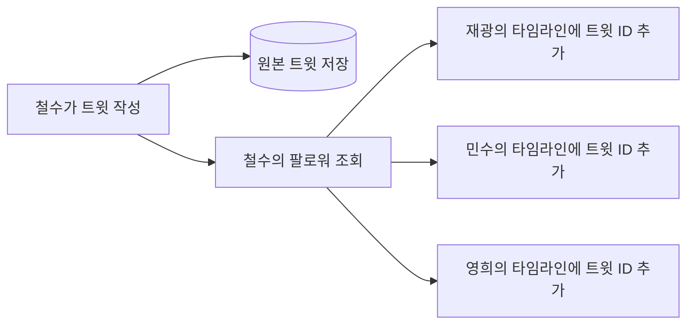
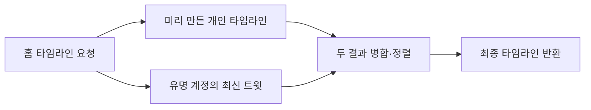

## 들어가며

《데이터 중심 애플리케이션 설계》, 흔히 DDIA라고 부르는 책을 읽다가 트위터의 홈 타임라인 예시를 만났습니다.

책에서는 사용자가 트윗을 작성하고 팔로워가 그 글을 보는 과정을 두 가지 방법으로 설명합니다. 처음 읽었을 때는 둘 다 결국 같은 트윗을 보여주는 것처럼 느껴졌습니다.

```text
1번 방법: 타임라인을 열 때 팔로우한 사람들의 트윗을 모은다.
2번 방법: 트윗을 작성할 때 팔로워들의 타임라인에 미리 넣는다.
```

결과만 보면 차이가 없어 보입니다. 사용자가 홈 화면을 열면 자신이 팔로우한 사람들의 최신 트윗이 나옵니다.

그런데 시스템이 일을 하는 시점은 완전히 달랐습니다.

> 1번 방법은 읽을 때 비용을 내고, 2번 방법은 쓸 때 비용을 냅니다.

이번 글에서는 DDIA의 트위터 예시를 따라가며 이 차이를 제가 이해한 방식으로 정리해보겠습니다.

> 이 글의 트위터 구조는 DDIA가 설명하는 당시의 설계 사례를 바탕으로 한 개념적 모델입니다. 현재 X의 내부 구현이 이 구조와 같다고 주장하는 글은 아닙니다.

## 먼저 필요한 데이터부터 보면

홈 타임라인을 만들려면 크게 세 가지 데이터가 필요합니다.

```text
사용자
트윗
팔로우 관계
```

예를 들어 재광이 철수와 영희를 팔로우한다고 해보겠습니다.

```text
재광 → 철수 팔로우
재광 → 영희 팔로우
```

철수와 영희가 트윗을 작성했다면 재광의 홈 타임라인에는 두 사람의 글이 최신순으로 보여야 합니다.

기능만 생각하면 다음 순서가 자연스럽습니다.

1. 재광이 누구를 팔로우하는지 찾습니다.
2. 그 사람들이 작성한 트윗을 찾습니다.
3. 최신순으로 정렬합니다.
4. 상위 결과를 반환합니다.

이것이 DDIA에서 먼저 소개하는 1번 방법입니다.

## 1번 방법: 읽을 때 타임라인을 만든다

1번 방법에서는 트윗을 작성할 때 특별한 일을 많이 하지 않습니다. 작성한 트윗을 트윗 테이블에 저장하면 됩니다.

```text
철수가 트윗 작성
→ 트윗 테이블에 저장
→ 끝
```

대신 재광이 홈 타임라인을 열 때 필요한 글을 그 자리에서 모읍니다.


SQL의 모양을 단순화하면 다음과 비슷합니다.

```sql
SELECT tweets.*
FROM tweets
JOIN follows ON follows.followee_id = tweets.author_id
WHERE follows.follower_id = :user_id
ORDER BY tweets.created_at DESC
LIMIT 100;
```

실제로는 페이지네이션, 삭제된 글, 공개 범위, 차단 관계, 추천 글처럼 더 많은 조건이 필요합니다. 여기서는 두 방법의 차이에 집중하기 위해 단순하게 보겠습니다.

이 방법은 **fan-out on read** 또는 **pull model**이라고 부릅니다.

- `fan-out`: 하나의 요청이 여러 대상의 데이터로 퍼집니다.
- `on read`: 그 일이 읽기 요청이 들어왔을 때 발생합니다.
- `pull`: 사용자가 필요할 때 데이터를 당겨옵니다.

### 1번 방법의 장점

트윗 작성이 가볍습니다.

팔로워가 몇 명이든 새 트윗 한 건을 저장하면 됩니다. 팔로워가 한 명도 없는 사용자와 아주 많은 팔로워를 가진 사용자의 기본 쓰기 경로가 크게 다르지 않습니다.

저장 공간도 비교적 단순합니다. 원본 트윗과 팔로우 관계를 가지고 있으면 타임라인을 다시 계산할 수 있습니다. 사용자마다 같은 트윗 ID를 미리 복제해둘 필요가 없습니다.

### 1번 방법의 단점

타임라인을 읽을 때 일이 몰립니다.

사용자가 팔로우하는 계정이 많다면 여러 작성자의 트윗을 찾고 하나의 순서로 합쳐야 합니다. 홈 화면은 사용자가 자주 여는 화면이므로 같은 계산이 반복될 수도 있습니다.

특히 읽기 요청이 쓰기보다 훨씬 많은 서비스라면 문제가 커집니다.

```text
트윗은 가끔 작성한다.
홈 타임라인은 앱을 열 때마다 읽는다.
```

이런 사용 패턴에서는 쓰기를 가볍게 만든 대신, 훨씬 자주 발생하는 읽기 요청마다 비싼 계산을 반복하게 됩니다.

## 2번 방법: 쓸 때 타임라인을 미리 만든다

2번 방법은 비용을 반대편으로 옮깁니다.

철수가 트윗을 작성하면 원본 트윗만 저장하는 것으로 끝나지 않습니다. 철수를 팔로우하는 사용자를 찾고, 각 사용자의 홈 타임라인에 새 트윗의 ID를 미리 넣습니다.



각 사용자의 홈 타임라인을 편지함처럼 생각하면 이해하기 쉬웠습니다.

```text
재광의 타임라인 편지함
- 철수의 새 트윗 ID
- 영희의 이전 트윗 ID
- 철수의 이전 트윗 ID
```

재광이 홈 화면을 열면 이미 만들어진 목록을 읽으면 됩니다.

```text
재광이 홈 타임라인 요청
→ 재광의 타임라인 목록 조회
→ 트윗 본문 조회
→ 반환
```

이 방법은 **fan-out on write** 또는 **push model**이라고 부릅니다.

- `fan-out`: 하나의 트윗이 여러 팔로워의 타임라인으로 퍼집니다.
- `on write`: 그 일이 트윗을 작성할 때 발생합니다.
- `push`: 새 글을 팔로워의 타임라인에 밀어 넣습니다.

### 2번 방법의 장점

읽기가 빨라집니다.

사용자가 홈 화면을 열 때마다 팔로우 관계를 따라가며 여러 작성자의 트윗을 합칠 필요가 없습니다. 이미 사용자별로 정리된 타임라인을 읽으면 됩니다.

읽기가 매우 많은 서비스에서는 이 차이가 중요합니다. 자주 발생하는 요청을 단순하게 만들기 위해 상대적으로 덜 자주 발생하는 쓰기 시점에 계산을 미리 해두는 것입니다.

### 2번 방법의 단점

트윗 한 건이 많은 쓰기로 증폭됩니다.

팔로워가 많을수록 갱신해야 할 타임라인도 많아집니다. 팔로워 수가 아주 많은 사용자가 트윗을 작성하면 하나의 작성 요청이 수많은 타임라인 갱신 작업으로 퍼질 수 있습니다.

이 작업을 작성 API가 전부 끝날 때까지 기다리게 하면 응답이 느려질 수 있습니다. 그래서 실제 시스템에서는 보통 원본 트윗을 먼저 저장한 뒤, 별도의 비동기 작업이 팔로워들의 타임라인을 갱신하는 구조를 생각할 수 있습니다.

```text
트윗 작성
→ 원본 저장
→ fan-out 작업을 큐에 전달
→ 작업자가 팔로워 타임라인을 순차적으로 갱신
```

하지만 비동기로 바꾸면 새로운 문제가 생깁니다.

- 작성 직후 일부 팔로워에게 아직 글이 보이지 않을 수 있습니다.
- fan-out 작업이 실패하면 재시도가 필요합니다.
- 같은 작업이 중복 실행되어도 결과가 깨지지 않아야 합니다.
- 삭제나 공개 범위 변경을 타임라인에 다시 반영해야 합니다.

읽기를 빠르게 만든 대가로 쓰기 경로와 운영이 복잡해집니다.

## 두 방법의 차이는 데이터가 아니라 비용의 위치다

두 방법 모두 같은 원본 트윗과 팔로우 관계에서 출발합니다. 차이는 최종 타임라인을 **언제 계산하고 어디에 저장하는가**입니다.

| 비교 | 1번: fan-out on read | 2번: fan-out on write |
| --- | --- | --- |
| 타임라인 생성 시점 | 사용자가 읽을 때 | 작성자가 트윗을 쓸 때 |
| 쓰기 | 원본 트윗 저장 중심 | 팔로워별 타임라인 갱신 |
| 읽기 | 팔로우한 계정의 글을 조회·병합 | 미리 만든 타임라인 조회 |
| 비용이 커지는 조건 | 사용자의 팔로우 수와 읽기 빈도 | 작성자의 팔로워 수 |
| 저장 구조 | 원본 중심 | 사용자별 타임라인 목록 추가 |
| 대표 위험 | 느린 읽기와 반복 계산 | 쓰기 증폭과 fan-out 지연 |

처음에는 2번 방법이 1번 방법을 단순히 최적화한 것처럼 보였습니다. 하지만 다시 보니 한쪽이 항상 더 좋은 관계는 아니었습니다.

```text
1번 방법
쓰기 비용을 아끼고 읽을 때 계산한다.

2번 방법
읽기 비용을 아끼고 쓸 때 미리 계산한다.
```

결국 시스템의 부하가 어디에서 발생하는지 보고 비용을 옮긴 선택입니다.

## 팔로워가 아주 많은 사용자는 어떻게 할까?

2번 방법을 그대로 적용하면 팔로워가 아주 많은 계정에서 문제가 생깁니다.

일반 사용자가 트윗을 작성하면 갱신할 타임라인 수가 감당할 만할 수 있습니다. 하지만 유명인처럼 팔로워가 매우 많은 사용자의 트윗을 모든 팔로워 타임라인에 즉시 넣으려면 fan-out 작업 자체가 큰 부하가 됩니다.

DDIA가 소개하는 해결 방향은 두 방법을 섞는 것입니다.

```text
일반 사용자의 트윗
→ fan-out on write
→ 팔로워 타임라인에 미리 넣기

팔로워가 매우 많은 사용자의 트윗
→ fan-out on read
→ 사용자가 타임라인을 읽을 때 별도로 합치기
```

재광이 홈 화면을 열면 대부분의 글은 미리 만들어진 타임라인에서 가져옵니다. 여기에 재광이 팔로우하는 유명 계정의 최신 글을 읽는 시점에 합칩니다.



이 혼합 방식이 흥미로웠던 이유는 예외를 인정하기 때문입니다.

모든 사용자를 같은 쓰기 경로로 처리하는 구조는 단순해 보이지만, 팔로워 수의 분포는 균등하지 않습니다. 소수의 계정이 아주 많은 팔로워를 가질 수 있습니다. 평균적인 사용자에게 잘 맞는 방법을 그 계정에 그대로 적용하면 병목이 생깁니다.

그래서 정상 경로는 fan-out on write로 빠르게 만들고, 비용이 지나치게 커지는 계정만 fan-out on read로 처리합니다.

## 이 예시에서 제가 놓치고 있던 것

처음에는 이 예시를 데이터베이스 조회 방식의 차이로만 봤습니다.

```text
JOIN을 할 것인가?
캐시를 사용할 것인가?
```

하지만 DDIA가 보여주는 핵심은 조금 더 컸습니다.

### 같은 기능도 비용을 내는 시점을 바꿀 수 있다

사용자가 보는 결과가 같아도 계산을 요청 시점에 할지, 이벤트가 발생한 시점에 미리 할지 선택할 수 있습니다.

타임라인뿐 아니라 알림, 뉴스 피드, 추천 결과, 집계 데이터에서도 비슷한 선택이 나타납니다.

```text
요청이 들어오면 그때 계산한다.
vs
데이터가 바뀔 때 결과를 미리 갱신한다.
```

### 읽기를 빠르게 만들면 쓰기가 공짜로 남지 않는다

미리 계산한 결과는 어딘가에 저장하고 계속 최신 상태로 유지해야 합니다. 원본 데이터가 삭제되거나 관계가 바뀌면 파생된 결과도 수정해야 합니다.

그래서 2번 방법은 단순한 캐시 추가가 아니었습니다. 원본 트윗에서 사용자별 타임라인이라는 파생 데이터를 만드는 작은 데이터 파이프라인에 가까웠습니다.

### 평균만 보면 큰 계정을 놓친다

대부분의 사용자가 적당한 수의 팔로워를 가지고 있어도, 소수의 유명 계정은 전혀 다른 부하를 만듭니다. 평균 팔로워 수만 보고 fan-out 비용을 판단하면 가장 큰 병목을 놓칠 수 있습니다.

이 예시를 통해 확장성을 볼 때는 데이터 양뿐 아니라 **분포의 꼬리**도 봐야 한다는 점을 이해했습니다.

## 백엔드 개발에서는 어떻게 연결해서 볼 수 있을까?

트위터 규모의 서비스를 만들지 않더라도 이 선택은 자주 만날 수 있습니다.

예를 들어 알림 목록을 만든다고 해보겠습니다.

### 읽을 때 계산하는 방법

사용자가 알림 화면을 열면 댓글, 좋아요, 팔로우 같은 여러 테이블을 조회해 알림 목록을 조합합니다.

```text
알림 화면 요청
→ 댓글 이벤트 조회
→ 좋아요 이벤트 조회
→ 팔로우 이벤트 조회
→ 정렬 후 반환
```

구현을 시작하기는 쉽지만 이벤트 종류와 데이터가 늘어날수록 읽기 쿼리가 복잡해집니다.

### 이벤트가 생길 때 미리 만드는 방법

댓글이나 좋아요가 발생할 때 `notifications` 테이블에 수신자용 알림을 미리 저장합니다.

```text
댓글 작성
→ 댓글 저장
→ 알림 이벤트 발행
→ 수신자의 notifications에 저장
```

이제 알림 화면은 수신자의 알림 목록만 읽으면 됩니다. 대신 이벤트 전달 실패, 중복 처리, 알림 삭제와 같은 문제를 다뤄야 합니다.

트위터의 두 방법은 특별한 서비스만의 이야기가 아니었습니다. 결국 백엔드에서 자주 만나는 다음 선택과 같았습니다.

> 요청할 때 원본을 조합할 것인가, 변경이 생길 때 조회 결과를 미리 만들어둘 것인가?

## 마무리

DDIA에서 소개한 트위터 타임라인의 두 방법은 같은 기능을 서로 다른 시점에 계산하는 구조였습니다.

```text
1번: fan-out on read
트윗은 가볍게 저장하고, 사용자가 읽을 때 타임라인을 만든다.

2번: fan-out on write
트윗을 작성할 때 팔로워별 타임라인을 미리 갱신하고,
사용자는 만들어진 결과를 읽는다.
```

1번은 쓰기가 단순하지만 읽기가 무거워질 수 있습니다. 2번은 읽기가 단순하지만 팔로워 수만큼 쓰기가 증폭되고 파생 데이터를 관리해야 합니다.

팔로워가 아주 많은 계정에서는 2번 방법의 비용이 지나치게 커질 수 있기 때문에, DDIA의 사례에서는 두 방법을 섞어 사용합니다.

이번 예시를 읽고 제가 가져간 질문은 하나입니다.

> 이 시스템은 계산 비용을 읽을 때 내고 있는가, 쓸 때 미리 내고 있는가?

앞으로 피드나 알림처럼 여러 데이터를 모아 보여주는 기능을 볼 때, SQL이나 캐시부터 떠올리기 전에 이 질문을 먼저 해보려고 합니다.

## 참고

- Martin Kleppmann, 《데이터 중심 애플리케이션 설계》(Designing Data-Intensive Applications), 1장
