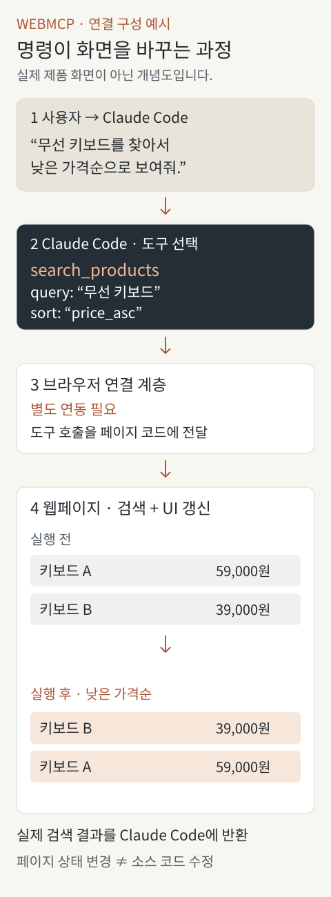

## AI가 웹사이트를 쓸 때도 버튼을 찾아야 할까?

사용자가 AI에게 이렇게 요청했다고 해보겠습니다.

> 무선 키보드를 찾아서 가격이 낮은 순서로 보여줘.

사람이라면 검색창에 단어를 넣고 정렬 메뉴를 바꾸면 됩니다. 브라우저를 조작하는 에이전트도 비슷한 일을 할 수 있습니다. 화면이나 DOM을 읽고, 검색창을 찾고, 값을 입력한 뒤, 정렬 메뉴의 의미를 해석하는 방식입니다.

그런데 웹사이트 개발자는 이미 이 기능을 알고 있습니다. 검색어와 정렬 조건을 받아 검색을 실행하는 애플리케이션 로직이 있기 때문입니다.

**그 기능의 이름과 입력 형식을 AI에게 직접 알려주면 어떨까요?**

WebMCP는 웹페이지가 AI 에이전트에 구조화된 도구를 제공하도록 하는 웹 표준 제안입니다. JavaScript로 함수를 등록하거나 HTML 폼에 속성을 추가하면, 에이전트가 페이지의 기능을 더 명시적인 방식으로 사용할 수 있게 합니다.[1]

여기서 도구는 검색이나 폼 작성처럼 에이전트가 호출할 수 있도록 사이트가 공개한 기능입니다. 사이트는 이름·설명·입력 형식과 실행 로직을 제공하고, 에이전트는 요청에 맞는 도구를 선택합니다.[1][2]

상품 검색을 예로 동작 원리를 살펴보고, 기존 MCP와 화면·DOM 조작 방식의 차이를 비교하겠습니다.

## Claude Code에 명령하면 화면은 어떻게 바뀔까?

아래는 Claude Code와 브라우저 사이에 WebMCP 도구를 발견하고 호출할 수 있는 연결이 갖춰졌다고 가정한 예시입니다.

사용자가 “무선 키보드를 낮은 가격순으로 보여줘”라고 요청하면, 에이전트는 페이지의 검색 도구를 선택합니다. 브라우저가 호출을 전달하고, 웹페이지는 검색을 실행한 뒤 결과를 화면에 반영합니다.



### 웹서비스와 브라우저는 각각 무엇을 할까?

웹서비스는 WebMCP 규격에 맞춰 도구의 이름·입력 형식·실행 함수를 등록합니다. Chrome 같은 지원 브라우저는 등록된 도구를 에이전트가 발견하고 호출할 수 있도록 중개합니다.[1][2][4]

따라서 **사이트 운영자가 자기 서비스 전용 MCP 서버를 따로 구현해야 하는 것은 아닙니다.** 페이지에 기존 기능을 WebMCP 도구로 등록할 수 있습니다. 다만 이 말은 **사용자 쪽 에이전트에도 MCP 서버나 브라우저 연결 설정이 전혀 필요 없다는 뜻은 아닙니다.** WebMCP와 MCP는 별개의 인터페이스이며, 실제 호출 경로에서는 함께 사용할 수 있습니다.[4][7][8]

그림의 Claude Code처럼 브라우저 밖에서 실행되는 에이전트는 WebMCP 도구를 조회하고 호출할 수 있는 연결이 필요합니다. 한 예가 Chrome 팀의 **Chrome DevTools MCP**입니다. 이 MCP 서버가 에이전트와 Chrome 사이의 브리지 역할을 합니다. 공식 문서는 Claude Code와 Codex CLI의 연결 방법을 제공하며, WebMCP 기능을 켜면 페이지 도구를 조회하는 `list_webmcp_tools`와 실행하는 `execute_webmcp_tool`을 사용할 수 있습니다.[7][8]

즉, 사이트가 상품 검색용 MCP 서버를 별도로 만드는 것과 사용자가 브라우저 연결용 MCP 서버를 설정하는 것은 다른 작업입니다. 페이지에 도구를 등록했다고 모든 에이전트에 자동으로 연결되지는 않습니다.

이때 바뀌는 것은 웹사이트의 소스 코드가 아니라 사용자가 보고 있는 페이지의 검색 조건과 결과입니다. Claude Code가 HTML이나 React 파일을 수정해 개발 서버 화면을 바꾸는 일반적인 코딩 작업과는 다른 경로입니다.

또한 WebMCP가 화면을 자동으로 다시 그려주는 것은 아닙니다. 사이트가 등록한 검색 함수가 기존 애플리케이션 상태와 UI 갱신 로직에 연결돼 있어야 합니다.

## 동작 원리: 등록에서 결과 반환까지

상품 검색이 실행되는 과정을 순서대로 살펴보겠습니다. 여기서는 JavaScript로 검색 도구를 등록하는 명령형 API를 기준으로 설명합니다. HTML 폼을 도구로 선언하는 방식도 있지만, 아래 흐름은 등록된 함수를 호출하는 경우에 해당합니다.[2][3]

```text
웹페이지 개발자
  │ 검색 도구의 이름·설명·입력·실행 함수를 정의
  ▼
브라우저의 도구 등록·발견 인터페이스
  │ 현재 문서에서 접근 가능한 도구 정보 제공
  ▼
에이전트
  │ 사용자 요청을 해석하고 도구와 입력 선택
  ▼
브라우저
  │ 도구 실행을 연결
  ▼
웹페이지의 execute 함수
  │ 검색 로직 호출 / 필요하면 서버에 요청
  ▼
검색 결과 + 화면 상태 갱신
  │ 반환값을 브라우저에 전달
  ▼
에이전트
    결과를 읽고 사용자에게 설명하거나 다음 행동 선택
```

### 1. 페이지가 도구를 등록한다

사이트가 검색 도구의 이름, 설명, 입력 형식과 실행 함수를 등록합니다. JavaScript로 함수를 등록하는 방식과 기존 HTML 폼에 설명을 붙여 도구로 선언하는 방식이 있습니다.[2][3]

중요한 점은 등록과 실행이 별개라는 것입니다. 등록은 “이런 기능을 호출할 수 있다”는 안내이고, 실제 검색은 도구가 호출됐을 때 실행됩니다.

### 2. 접근 가능한 도구를 발견한다

브라우저는 현재 문서에서 접근이 허용된 도구 목록을 제공합니다.[2]

도구 목록에는 이름, 설명, 입력 스키마, 출처 등의 정보가 포함됩니다.[2] 에이전트 연동 계층은 이 정보를 활용해 모델이 선택할 수 있는 도구를 구성할 수 있습니다. WebMCP 자체가 특정 LLM 공급자나 모델을 지정해주는 것은 아닙니다.

사이트 방문도 여전히 필요합니다. Chrome 문서는 클라이언트나 브라우저가 해당 사이트에 직접 방문해야 호출 가능한 도구를 알 수 있다는 발견상의 한계를 명시합니다.[1]

### 3. 에이전트가 이름과 인자를 선택한다

사용자가 “무선 키보드를 가격순으로 보여줘”라고 요청하면, 에이전트는 예를 들어 `search_products`에 다음 인자를 선택할 수 있습니다.

```json
{
  "query": "무선 키보드",
  "sort": "price_asc"
}
```

이 단계는 자연어 의도를 구조화된 호출로 바꾸는 과정입니다. 스키마는 `sort`에 어떤 값이 허용되는지 알려주지만, 사용자가 정말 가격순을 원했는지까지 보장하지는 않습니다.

### 4. 브라우저가 페이지의 실행 함수로 연결한다

브라우저가 선택한 도구와 입력을 페이지의 실행 함수에 전달하고, 실행 결과를 돌려줍니다.[2]

페이지의 실행 함수가 서버 API를 호출한다면 네트워크 지연과 오류는 여전히 발생합니다. WebMCP는 클릭 경로를 도구 호출 경로로 바꾸는 것이지, 검색 서버 자체를 없애는 기술은 아닙니다.

### 5. 결과와 화면 상태를 맞춘다

함수는 실제 결과를 반환하고, 사이트가 필요에 따라 화면을 갱신하도록 설계합니다. 반환값만 성공이라고 만들고 화면에는 이전 검색 결과를 남겨두면 사람과 에이전트가 서로 다른 상태를 보고 작업할 수 있습니다.

이것은 애플리케이션 구현상의 책임입니다. “검색이 끝났다”는 문장보다 어떤 조건으로 무엇을 찾았는지 명확한 결과를 주는 편이 다음 판단에 도움이 됩니다.

### 6. 페이지 수명이 끝나면 도구도 사라진다

WebMCP 도구는 열린 페이지의 수명에 묶입니다. 사용자가 사이트를 떠나거나 탭을 닫으면 그 페이지의 도구를 계속 이용하는 상시 서버처럼 동작하지 않습니다.[4]

SPA에서도 화면과 권한이 바뀌면 도구 목록을 함께 관리해야 합니다. 상품 상세 화면을 벗어났는데 이전 상품의 구매 도구가 남아 있지 않도록 하는 식입니다.

## 기존 MCP와는 무엇이 다를까?

이름 때문에 WebMCP를 기존 MCP의 브라우저 전송 방식으로 생각하기 쉽습니다. 하지만 Chrome 공식 비교 문서는 WebMCP가 MCP의 확장이나 대체물이 아니며, MCP에서 영감을 받은 브라우저 API라고 설명합니다.[4]

둘 다 기능을 구조화된 도구로 제공한다는 방향은 같습니다. 차이는 그 기능이 놓인 곳과 사용되는 맥락입니다.[4]

| 구분 | MCP | WebMCP |
| --- | --- | --- |
| 중심 | 외부 시스템의 도구·데이터 연결 | 현재 웹페이지의 기능 연결 |
| 실행 맥락 | MCP 클라이언트와 서버 | 열린 페이지와 브라우저 |
| 사이트 탭 필요 여부 | 특정 웹페이지 탭에 종속되지 않음 | 페이지의 수명과 맥락에 종속 |
| 구현 관점 | 도구 서버와 프로토콜 연결 | JavaScript 등록 또는 HTML 폼 선언 |
| 어울리는 예 | 백그라운드 업무 시스템 조회 | 사용자가 보는 페이지의 검색·폼·상태 조작 |

위 표는 일반적인 사용 형태를 비교한 것입니다. MCP를 반드시 원격 서버라고 볼 필요는 없고, WebMCP 도구가 서버 요청을 하지 않는다는 뜻도 아닙니다.

WebMCP는 웹페이지에서 실행되는 함수가 기존 HTTP API를 호출하는 구조로도 만들 수 있습니다. 그 경우 서버의 업무 로직과 인증·인가 체계는 그대로 필요합니다.

```text
MCP 경로의 예
에이전트 → MCP 클라이언트 → MCP 서버 → 업무 시스템

WebMCP 지원이 통합된 에이전트의 경로 예
에이전트 → 브라우저 → 현재 페이지의 도구 → 기존 HTTP API

외부 에이전트를 MCP 브리지로 연결하는 경로 예
Codex CLI / Claude Code
  → Chrome DevTools MCP → Chrome → 현재 페이지의 WebMCP 도구
```

마지막 경로에서는 에이전트와 브리지 사이에 MCP가 쓰이고, 브라우저와 페이지 기능 사이에는 WebMCP가 쓰입니다. MCP와 WebMCP를 서로 하나만 골라야 하는 대안으로 보면 이 연결 구조를 놓치기 쉽습니다.[7][8]

사용자가 열어둔 화면에서 검색 조건을 바꾸는 일에는 WebMCP가 자연스럽습니다. 페이지를 열지 않고 정기적으로 데이터를 모으는 일은 별도 서버 연결 방식이 더 적합할 수 있습니다. 두 기술을 서비스의 서로 다른 접점으로 함께 사용할 수도 있습니다.[4]

## GPT의 Computer Use, DOM 자동화, WebMCP는 어떻게 다를까?

세 방식 모두 상품을 검색하고 낮은 가격순으로 정렬하는 같은 목표에 사용할 수 있습니다. 차이는 결과보다 **무엇을 관찰하고 어떤 경로로 행동하는가**입니다.

여기서는 제품명이 아니라 행동 방식을 비교합니다. 화면을 보고 좌표를 조작하는 방식, DOM 요소를 찾아 조작하는 방식, 사이트가 등록한 도구를 호출하는 방식입니다.

이 구분이 완전히 배타적인 것은 아닙니다. OpenAI의 Computer Use도 구성에 따라 코드 실행과 브라우저 조작 라이브러리를 활용할 수 있습니다. 아래 표에서는 차이를 설명하기 위해 Computer Use를 스크린샷·좌표 중심의 방식으로 좁혀 다룹니다.[6]

| 방식 | 주로 보는 정보 | 행동 경로 | 사이트 측 준비 |
| --- | --- | --- | --- |
| 화면 기반 Computer Use | 스크린샷 | 좌표 클릭·스크롤·키보드 입력 | 사람이 사용하는 화면 |
| DOM 자동화 | 요소 구조·역할·레이블 | 요소를 찾아 입력·클릭 | 조작 가능한 웹 UI |
| WebMCP | 도구 설명·입력 스키마 | 등록된 기능 호출 | 도구 등록과 실행 로직 연결 |

Computer Use의 기본 반복 구조는 모델이 화면을 바탕으로 동작을 제안하고, 실행 환경이 이를 수행한 뒤 새 스크린샷을 돌려주는 방식입니다. 모델이 직접 운영체제의 마우스를 움직이는 것이 아니라 실행 환경이 클릭과 입력을 수행합니다.[6]

```text
Computer Use
화면 캡처 → 검색창 위치 판단 → 클릭·입력
→ 새 화면 확인 → 정렬 메뉴 조작

DOM 자동화
검색 입력 요소 탐색 → 값 입력 → 검색 버튼 클릭
→ 정렬 요소 탐색·선택

WebMCP
search_products 도구 발견
→ query와 sort를 전달 → 결과 확인
```

Computer Use는 사이트가 전용 도구를 등록하지 않아도 사람용 화면을 이용할 수 있습니다. DOM 자동화는 화면 좌표 대신 요소의 구조와 의미를 이용합니다. WebMCP는 사이트가 공개한 기능 계약을 사용하므로 검색창이나 정렬 메뉴를 찾아 조작하는 단계를 줄일 수 있습니다.[1][6]

WebMCP는 도구의 이름과 입력 형식이 유지되면 화면 배치가 바뀌어도 버튼 위치를 다시 찾을 필요가 줄어듭니다.[4] 다만 서버 요청과 실제 업무 처리 시간은 남습니다. 화면을 읽고 클릭하는 단계를 줄이는 것이지 모든 처리를 즉시 끝내는 것은 아닙니다.

### 최종 화면은 같을까?

같은 검색 로직과 화면 갱신 경로를 사용한다면 최종 화면은 같을 수 있습니다. 달라지는 것은 결과보다 그 결과에 도달하는 경로입니다. 화면·DOM 조작은 UI 요소를 거치고, WebMCP는 등록된 도구를 호출합니다.

```text
Computer Use의 클릭 ─┐
DOM 자동화의 클릭 ───┼→ 공통 검색 로직
WebMCP 도구 호출 ────┘     → 상태·화면 갱신
```

다만 도구가 데이터만 반환하고 화면을 갱신하지 않거나, 버튼 경로에 있던 검증을 빠뜨리면 결과가 달라질 수 있습니다. 두 경로를 같은 동작으로 연결하는 것은 사이트의 책임입니다.

따라서 WebMCP 호출만으로 UI 테스트를 대체할 수는 없습니다. 검색 도구가 정상 실행되더라도, 실제 검색 버튼이 가려지거나 입력창이 고장 난 문제는 별도로 확인해야 합니다.

### 어느 하나로 통일할 필요는 없다

사이트가 안정적인 WebMCP 도구를 제공하는 기능에는 그 도구를 사용하고, 도구가 없는 기능에는 DOM이나 화면 조작을 사용하는 구성을 생각할 수 있습니다. 마지막 화면을 시각적으로 확인하는 과정도 별도로 둘 수 있습니다. 이는 가능한 설계이지, 모든 GPT 제품이 이 세 경로를 기본 제공한다는 뜻은 아닙니다.

특히 Computer Use가 로그인이나 결제 화면을 조작할 수 있다는 것과 실행을 허가받았다는 것은 별개입니다. OpenAI 문서는 실행 환경이 실행 제한과 권한 규칙을 적용해야 한다고 설명합니다.[6] WebMCP 역시 뒤에서 설명할 권한·확인 절차가 필요합니다.

## 지원 현황과 주의점

### Chrome에서 먼저 실험하고 있다

2026년 9월 7일 확인한 Chrome 문서는 Chrome 149부터의 origin trial과 로컬 개발용 플래그를 안내합니다. WebMCP는 아직 변경 가능한 제안·실험 단계이며, 모든 브라우저에서 기본 제공되는 기능은 아닙니다.[1]

브라우저의 API 지원과 에이전트의 연동 지원도 구분해야 합니다. 사이트가 도구를 등록하고, 브라우저가 이를 지원하며, 에이전트가 그 인터페이스를 이용할 수 있어야 합니다. 지원하지 않는 환경에서는 기존 폼과 버튼으로 사이트를 사용할 수 있도록 유지하는 것이 좋습니다.

### 외부 에이전트는 어떤 탭의 도구를 호출할까?

Chrome DevTools MCP의 WebMCP 기능은 기본으로 켜져 있지 않습니다. 실행 옵션 `--categoryExperimentalWebmcp=true`로 활성화해야 합니다. 이번에 확인한 1.8.0의 도움말은 Chrome 150 이상과 Chrome 실행 플래그 `--enable-features=WebMCP`를 요구합니다. Chrome 문서의 origin trial 시작 버전과 이 연결 도구의 요구 버전은 서로 다른 조건입니다.[1][7]

연결이 갖춰지면 에이전트는 대상 탭을 식별하고, `list_webmcp_tools`로 도구 목록을 조회한 뒤 `execute_webmcp_tool`로 이름과 입력을 전달합니다. 현재 공식 도구 명세는 두 호출에 `pageId`를 요구합니다. 탭이 여러 개라면 이 값으로 어느 페이지의 도구를 쓰는지 지정합니다.[7]

예를 들어 검색 페이지를 열어둔 사용자는 “이 블로그에서 WebMCP 관련 글을 찾아줘”라고 요청할 수 있습니다. 에이전트는 해당 탭에서 `search_posts`를 발견하고 검색어를 전달하는 식입니다. 도구가 목록에 보이지 않으면 먼저 연결과 등록 상태를 확인해야 합니다. 검색창을 클릭해 같은 결과를 얻었다고 해서 WebMCP 호출을 검증한 것은 아닙니다.

### 이 블로그에서 직접 확인한 연결

설명에 그치지 않고, 이 블로그의 [글 검색 페이지](/search/)에 `search_posts`를 등록해 확인했습니다. 2026년 9월 8일 macOS에서 Herdr의 새 Codex CLI 세션을 열고, Chrome 152.0.7977.76과 Chrome DevTools MCP 1.8.0을 연결했습니다. Herdr는 터미널 탭을 관리할 뿐, WebMCP를 중개하는 구성요소는 아닙니다.

이번 실험에서 사용한 연결 설정은 다음과 같습니다. Node.js와 Codex CLI가 설치된 환경을 전제로 하며, 명령은 한 줄로 실행합니다. 기존에 같은 이름의 MCP 서버가 있다면 먼저 등록 내용을 확인해야 합니다.

```bash
codex mcp add chrome-devtools -- npx -y chrome-devtools-mcp@1.8.0 --categoryExperimentalWebmcp=true --chromeArg=--enable-features=WebMCP --isolated --no-usage-statistics
```

`--isolated`는 평소 로그인한 Chrome 프로필 대신 임시 프로필을 사용하기 위한 설정입니다. 이 구성은 기존 개인 Chrome 탭에 자동으로 붙는 방식이 아닙니다. 설정을 읽은 새 Codex 세션에서 MCP가 실행하는 Chrome으로 페이지를 열었습니다.[8][9]

에이전트에는 다음처럼 대상 URL과 호출 방식을 명시했습니다.

> Chrome DevTools MCP로 https://jaekwang97.github.io/search/ 를 열어줘. 해당 페이지 ID로 WebMCP 도구 목록을 확인하고, `search_posts`에 `query: "WebMCP"`, `limit: 5`를 전달해줘. WebMCP 호출이 불가능하면 검색창 클릭이나 DOM 조작으로 대체하지 말고 오류를 알려줘.

실제 호출은 `list_webmcp_tools`로 `search_posts`를 발견한 뒤, `execute_webmcp_tool`에 도구 이름과 JSON 입력 문자열을 전달하는 순서였습니다. `WebMCP` 검색은 이 글 1건을 반환했고, 같은 도구의 검색어를 `AI`로 바꾸자 전체 19건 중 최대 5건을 반환했습니다. 검색창 클릭·입력이나 임의의 JavaScript 실행으로 대체하지 않았습니다.

이 실험에서 확인한 것은 **위 버전과 설정에서 Codex CLI가 Chrome을 통해 페이지의 도구를 발견하고 호출한다는 것**입니다. Chrome만 설치하면 모든 에이전트가 자동으로 사용할 수 있다는 뜻은 아닙니다. 또한 이 블로그는 검색 페이지에 도구를 등록했으므로, 이 글 본문을 열어둔 것만으로 `search_posts`가 제공되지는 않습니다.

### 기존 권한과 사용자 확인은 그대로 필요하다

WebMCP는 열린 탭의 세션과 페이지 맥락을 활용하지만, 브라우저의 출처별 권한과 서버의 인증·인가를 없애지는 않습니다.[1][4] 도구로 들어온 요청도 사용자가 해당 데이터에 접근할 수 있는지 서버에서 확인해야 합니다.

구매나 삭제처럼 중요한 행동은 대상과 범위를 사용자에게 확인하는 절차가 필요합니다. 읽기 전용 도구도 개인정보를 반환할 수 있으므로 공개 범위를 신중하게 정해야 합니다.[5]

### 외부 텍스트를 지시로 믿으면 안 된다

상품 리뷰나 고객 메시지에는 에이전트의 행동을 바꾸려는 악성 지시가 섞일 수 있습니다. 구조화된 도구를 사용해도 이런 프롬프트 인젝션 위험은 남습니다.[5] 도구가 반환한 외부 콘텐츠는 작업 데이터로 다루고, 사용자의 지시와 구분해야 합니다.

## 마무리

WebMCP는 웹사이트가 자신의 기능을 명시적으로 제공하고, 브라우저가 에이전트의 도구 발견과 실행을 중개하는 방식입니다.[1][2]

화면을 보고 클릭하거나 DOM 요소를 찾아 조작하는 것과 최종 결과는 같을 수 있습니다. 차이는 버튼을 찾는 절차를 거치는 대신, 사이트가 공개한 기능을 직접 호출한다는 점입니다.

사용자에게는 자연어 요청이 화면의 변화로 이어지는 경험이고, 웹서비스에는 기존 기능을 에이전트도 이용할 수 있게 여는 인터페이스입니다.

## Sources

[1] [WebMCP 개요](https://developer.chrome.com/docs/ai/webmcp)

[2] [JavaScript 명령형 API](https://developer.chrome.com/docs/ai/webmcp/imperative-api)

[3] [HTML 선언형 API](https://developer.chrome.com/docs/ai/webmcp/declarative-api)

[4] [WebMCP와 MCP 비교](https://developer.chrome.com/docs/ai/webmcp/compare-mcp)

[5] [WebMCP 도구 보안](https://developer.chrome.com/docs/ai/webmcp/secure-tools)

[6] [OpenAI Computer Use 가이드](https://developers.openai.com/api/docs/guides/tools-computer-use)

[7] [Chrome DevTools MCP의 WebMCP 도구 명세](https://github.com/ChromeDevTools/chrome-devtools-mcp/blob/main/docs/tool-reference.md#webmcp)

[8] [Chrome DevTools MCP의 에이전트별 연결 안내](https://github.com/ChromeDevTools/chrome-devtools-mcp/blob/main/docs/client-configurations.md)

[9] [Chrome DevTools MCP 설정 옵션](https://github.com/ChromeDevTools/chrome-devtools-mcp/blob/main/docs/configuration.md)
