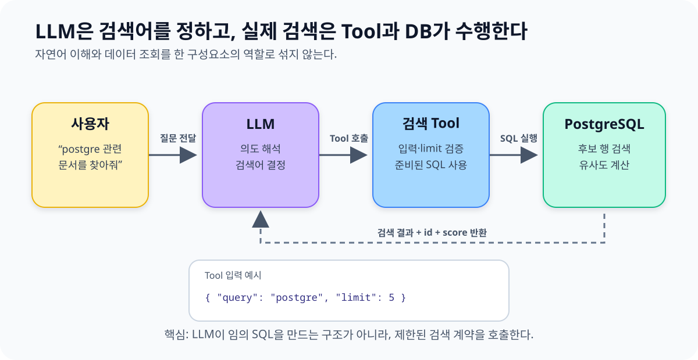
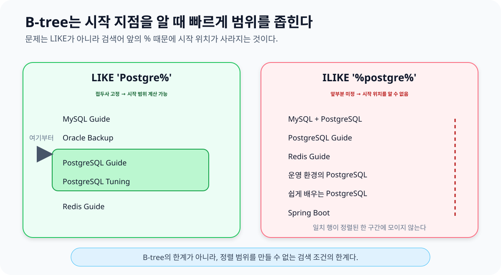
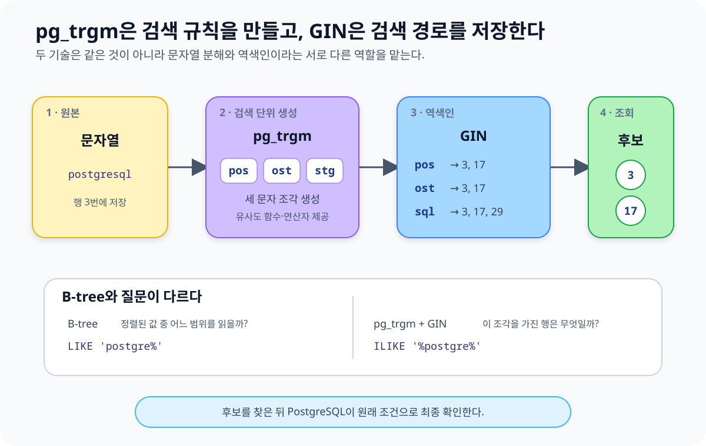
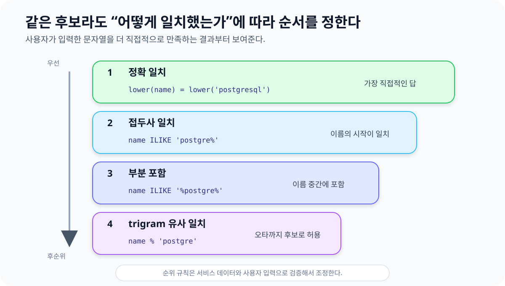
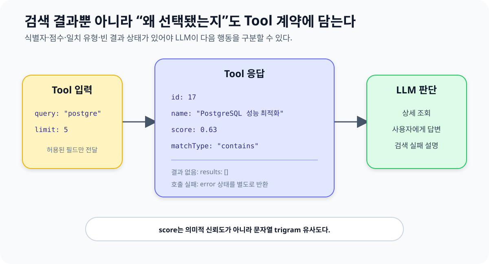
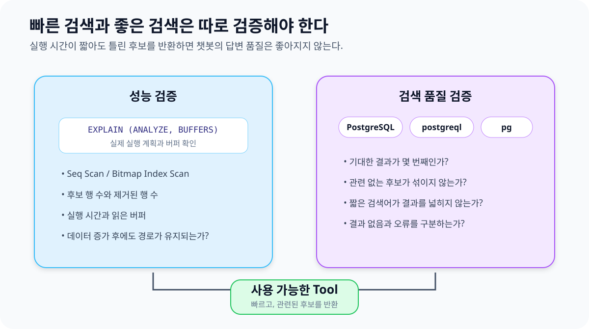
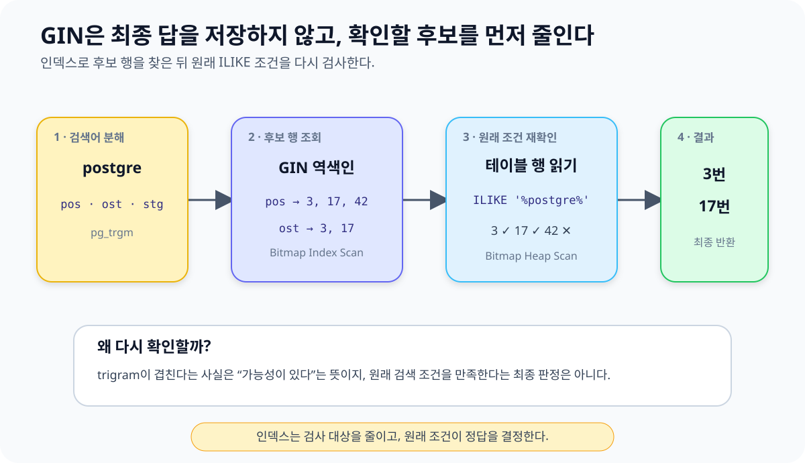
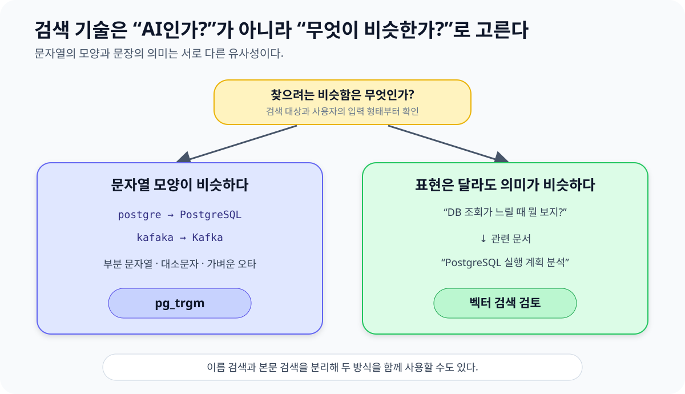

## 들어가며

AI 챗봇에 데이터베이스 검색 기능을 붙인다고 하면 먼저 벡터 검색부터 떠올리기 쉽습니다.

저도 처음에는 AI가 사용하는 검색이라면 임베딩과 벡터 DB가 자연스러운 선택이라고 생각했습니다. 그런데 검색하려는 대상이 긴 문서의 의미가 아니라 이름, 코드, 기술명처럼 짧고 구체적인 문자열이라면 이야기가 달라집니다.

예를 들어 데이터베이스에 다음과 같은 이름이 저장되어 있다고 해보겠습니다.

```text
Apache Kafka 운영 가이드
PostgreSQL 성능 최적화
Spring Boot 프로젝트
```

사용자는 이 이름을 정확히 알지 못합니다.

```text
카프카 관련 자료를 찾아줘
postgre 들어간 문서가 있어?
Spring으로 만든 프로젝트를 보여줘
```

챗봇이 사용자의 의도를 이해해도 실제 데이터를 찾는 작업은 검색 Tool과 데이터베이스가 수행합니다. 정확히 일치하는 문자열만 찾는다면 사용자가 이름을 조금 다르게 입력하는 순간 결과를 놓치게 됩니다.

이번 글은 이 문제를 큰 그림부터 하나씩 좁혀가며 살펴봅니다.

> AI 챗봇의 문자열 검색 Tool에는 왜 일반적인 B-tree 인덱스만으로 부족했고, `pg_trgm`과 GIN은 각각 어떤 역할을 했을까?

## 먼저 전체 그림부터 보면

전체 흐름은 생각보다 단순합니다.

```text
사용자 질문
  → LLM이 검색어 결정
  → 검색 Tool 호출
  → PostgreSQL이 후보 검색
  → Tool이 결과 반환
  → LLM이 사용자에게 답변
```

예를 들어 LLM은 사용자의 질문에서 `postgre`라는 검색어를 꺼내 다음과 같이 Tool을 호출할 수 있습니다.

```json
{
  "query": "postgre",
  "limit": 5
}
```

여기서 역할을 먼저 구분해야 합니다.

- **LLM**은 사용자의 말을 이해하고 검색어를 정합니다.
- **검색 Tool**은 입력값을 검사하고 정해진 검색만 허용합니다.
- **PostgreSQL**은 실제 후보 행을 찾습니다.
- **LLM**은 반환된 결과를 바탕으로 답변합니다.

LLM이 검색어를 잘 정했다고 해서 데이터베이스가 자동으로 비슷한 문자열을 찾아주는 것은 아닙니다. 데이터베이스에도 `postgre`로 `PostgreSQL 성능 최적화`를 찾을 수 있는 검색 방법이 필요합니다.



먼저 가져갈 그림은 이것입니다.

> LLM은 검색어를 정하고, 검색 Tool과 PostgreSQL이 실제 데이터를 찾는다.

이제 PostgreSQL 안에서 왜 B-tree만으로 이 검색을 풀기 어려웠는지 한 단계 더 들어가 보겠습니다.

## 정확히 일치하는 검색으로 시작해보면

가장 단순한 검색은 저장된 값과 검색어가 같은지 비교하는 것입니다.

```sql
SELECT id, name, description
FROM documents
WHERE name = $1
LIMIT $2;
```

`$1`에 `PostgreSQL 성능 최적화`가 들어오면 원하는 행을 찾을 수 있습니다. 하지만 사용자가 전체 이름을 알고 있어야 합니다.

```text
검색어: postgre
저장값: PostgreSQL 성능 최적화
결과: 없음
```

챗봇 사용자는 테이블에 어떤 값이 저장되어 있는지 모릅니다. 전체 이름 대신 일부만 말할 수도 있고 대소문자를 다르게 입력할 수도 있습니다.

그래서 부분 문자열 검색이 필요해집니다.

```sql
SELECT id, name, description
FROM documents
WHERE name ILIKE '%' || $1 || '%'
LIMIT $2;
```

이제 `postgre`로 `PostgreSQL 성능 최적화`를 찾을 수 있습니다.

기능은 해결됐습니다. 다음 문제는 데이터가 많아졌을 때입니다.

> `name` 컬럼에 B-tree 인덱스가 있어도 이 검색이 빨라질까?

## B-tree는 시작 지점을 알 때 강하다

B-tree는 값을 정렬된 상태로 관리합니다. 검색 조건에서 시작 지점과 끝 지점을 정할 수 있다면 전체 데이터를 읽지 않고 필요한 범위로 바로 이동할 수 있습니다.

```sql
WHERE name = 'PostgreSQL'
WHERE created_at >= '2026-08-01'
WHERE price BETWEEN 10000 AND 50000
```

문자열도 앞부분이 고정되어 있다면 비슷하게 생각할 수 있습니다.

```sql
WHERE name LIKE 'Postgre%'
```

`Postgre`로 시작한다는 사실을 알기 때문에 정렬된 값에서 확인할 범위를 좁힐 수 있습니다.

하지만 챗봇 Tool에 필요했던 조건은 앞에도 `%`가 있습니다.

```sql
WHERE name ILIKE '%postgre%'
```

이제 `postgre`가 문자열의 어디에 나올지 알 수 없습니다.

```text
PostgreSQL 성능 최적화
쉽게 배우는 PostgreSQL
운영 환경의 PostgreSQL 백업
```

B-tree 입장에서는 정렬된 인덱스의 어느 지점부터 읽어야 할지 정하기 어렵습니다. 일치하는 행들이 하나의 연속된 범위에 모이지 않기 때문입니다.



여기서 B-tree의 한계를 다음처럼 정리할 수 있습니다.

> B-tree가 문자열 검색에 약한 것이 아니다. `'%검색어%'`는 정렬된 탐색 범위를 만들기 어렵기 때문에 B-tree의 장점을 활용하기 힘든 것이다.

질문의 형태가 달라졌으니 다른 검색 단위가 필요합니다. 이 지점에서 `pg_trgm`이 등장합니다.

## 이제 pg_trgm과 GIN의 역할을 나눠보자

처음 보면 `pg_trgm`, trigram, GIN이 한꺼번에 등장해서 하나의 기술처럼 느껴질 수 있습니다. 하지만 역할은 서로 다릅니다.

```text
pg_trgm
  문자열을 검색할 작은 조각으로 나눈다
  문자열 유사도를 비교하는 규칙을 제공한다

GIN
  각 조각이 어느 행에 들어 있는지 저장한다
```

먼저 `pg_trgm`부터 보겠습니다.

### pg_trgm은 문자열 검색 규칙을 제공한다

`pg_trgm`은 PostgreSQL에서 필요할 때 활성화해서 사용하는 공식 확장 모듈입니다. 이름은 `PostgreSQL trigram`에서 왔습니다.

```sql
CREATE EXTENSION IF NOT EXISTS pg_trgm;
```

이 확장은 다음 기능을 제공합니다.

1. 문자열을 trigram으로 나누는 규칙
2. 두 문자열의 trigram이 얼마나 겹치는지 계산하는 함수와 연산자
3. trigram 검색을 인덱스로 가속할 때 필요한 연결 규칙

따라서 `pg_trgm` 자체가 인덱스인 것은 아닙니다. 문자열을 어떤 단위로 비교할지 정해주는 쪽에 가깝습니다.

### trigram은 이어지는 세 문자를 하나의 조각으로 본다

개념을 단순화하면 `postgresql`은 다음과 같이 나눌 수 있습니다.

```text
postgresql
  → pos
  → ost
  → stg
  → tgr
  → gre
  → res
  → esq
  → sql
```

`postgre`와 `PostgreSQL`은 여러 trigram을 공유합니다. 문자열 전체가 같지 않아도 겹치는 조각을 기준으로 비교할 수 있는 이유입니다.

```sql
SELECT similarity('PostgreSQL', 'postgre');
```

이 방식은 부분 문자열뿐 아니라 가벼운 오타가 있는 입력에도 사용할 수 있습니다.

```text
postgre  → PostgreSQL
sprng    → Spring
kafaka   → Kafka
```

다만 두 검색은 목적이 다릅니다.

- `ILIKE '%postgre%'`: `postgre`가 실제로 포함되어 있는지 찾습니다.
- `similarity(name, 'postgre')`: 두 문자열의 trigram이 얼마나 비슷한지 점수로 계산합니다.
- `%` 연산자: 유사도가 설정된 기준을 넘는 후보를 찾습니다.

검색 Tool은 단순한 부분 포함만 허용할지, 오타가 있는 유사 문자열까지 허용할지 결정해야 합니다.

### GIN은 trigram에서 행을 찾는 역색인이다

GIN은 `Generalized Inverted Index`의 약자입니다. 이름은 어려워 보이지만 방향을 반대로 저장한다고 생각하면 이해하기 쉽습니다.

일반적인 데이터는 행에서 문자열을 봅니다.

```text
3번 행  → PostgreSQL
17번 행 → PostgreSQL Guide
29번 행 → MySQL
```

GIN은 검색 조각에서 행을 찾을 수 있게 관계를 반대로 기록합니다.

```text
"pos" → 3번, 17번 행
"ost" → 3번, 17번 행
"sql" → 3번, 17번, 29번 행
```

검색어에서 `pos`, `ost` 같은 trigram이 나오면 그 조각을 가진 후보 행을 빠르게 찾을 수 있습니다.

인덱스는 다음과 같이 만듭니다.

```sql
CREATE INDEX idx_documents_name_trgm
ON documents
USING gin (name gin_trgm_ops);
```

지금 단계에서는 각 부분을 이렇게 읽으면 충분합니다.

- `gin`: 조각에서 행을 찾는 역색인 구조를 사용합니다.
- `name`: 검색할 문자열 컬럼입니다.
- `gin_trgm_ops`: `pg_trgm`의 검색 규칙을 GIN과 연결합니다.



여기까지의 구조를 한 문장으로 다시 묶으면 이렇습니다.

> `pg_trgm`이 문자열을 trigram으로 나누고, GIN이 각 trigram을 가진 행의 목록을 저장한다.

이제 이 구조를 실제 챗봇 Tool에 연결해보겠습니다.

## 실제 검색 Tool은 어떻게 구성할까?

검색 성능만큼 중요한 것이 Tool의 경계입니다.

LLM에게 SQL 전체를 만들게 하기보다 Tool의 입력을 제한하는 편이 안전하고 예측하기 쉽습니다.

```json
{
  "query": "postgre",
  "limit": 5
}
```

LLM은 검색어와 필요한 결과 수를 전달합니다. 서버는 허용할 테이블과 컬럼, 검색 조건을 미리 정한 SQL을 실행합니다.

```sql
SELECT
    id,
    name,
    description,
    similarity(name, $1) AS score
FROM documents
WHERE name ILIKE '%' || $1 || '%'
   OR name % $1
ORDER BY
    CASE
        WHEN lower(name) = lower($1) THEN 0
        WHEN name ILIKE $1 || '%' THEN 1
        WHEN name ILIKE '%' || $1 || '%' THEN 2
        ELSE 3
    END,
    score DESC
LIMIT $2;
```

이 예시는 결과의 우선순위를 다음처럼 잡습니다.

1. 정확히 일치하는 결과
2. 검색어로 시작하는 결과
3. 검색어를 포함하는 결과
4. 문자열이 유사한 결과



이 SQL이 모든 서비스의 정답이라는 뜻은 아닙니다. 검색 대상과 데이터 분포에 따라 포함 검색과 유사도 검색을 분리하는 편이 나을 수도 있습니다.

Tool이 책임질 범위도 정해야 합니다.

- 검색할 컬럼을 서버에서 고정합니다.
- SQL은 파라미터 바인딩을 사용합니다.
- `limit`의 최댓값을 제한합니다.
- 빈 검색어와 짧은 검색어를 처리합니다.
- 검색 결과 없음과 Tool 오류를 구분합니다.
- `%`, `_`, `\`를 검색 문법으로 허용할지 일반 문자로 처리할지 정합니다.

여기서 파라미터 바인딩은 SQL injection을 막는 데 필요하지만, 사용자가 입력한 `%`와 `_`의 `LIKE` 의미까지 자동으로 없애주지는 않습니다. Tool의 검색 의도에 맞는 입력 정책이 별도로 필요합니다.

## LLM에는 결과만 주지 말고 근거도 돌려준다

검색 Tool이 문자열 목록만 반환하면 LLM은 각 결과가 왜 선택됐는지 판단하기 어렵습니다.

가능하다면 식별자, 점수, 일치 유형을 함께 반환하는 편이 좋습니다.

```json
{
  "query": "postgre",
  "results": [
    {
      "id": 17,
      "name": "PostgreSQL 성능 최적화",
      "score": 0.63,
      "matchType": "contains"
    }
  ]
}
```

각 필드는 역할이 다릅니다.

- `id`: 상세 데이터를 다시 조회할 때 사용합니다.
- `name`: 사용자에게 보여줄 대표 문자열입니다.
- `score`: 문자열의 상대적인 유사도입니다.
- `matchType`: 정확 일치, 부분 일치, 유사 일치 중 어떤 방식으로 찾았는지 설명합니다.

여기서 `score`를 의미적 신뢰도로 해석하면 안 됩니다. `similarity`가 알려주는 것은 사용자의 질문과 문서 내용이 얼마나 관련 있는지가 아니라, 두 문자열의 trigram이 얼마나 비슷한지입니다.

검색 결과가 없을 때도 상태를 분명히 반환해야 합니다.

```json
{
  "query": "postgre",
  "results": [],
  "message": "일치하거나 유사한 항목을 찾지 못했습니다."
}
```

그래야 LLM이 검색 결과가 없는 상황과 Tool 호출이 실패한 상황을 구분할 수 있습니다.



여기까지 오면 처음의 단순한 흐름이 실제 Tool 계약으로 구체화됩니다.

```text
사용자 질문
  → LLM이 query 결정
  → Tool이 허용된 SQL 실행
  → pg_trgm + GIN으로 후보 검색
  → id, score, matchType 반환
  → LLM이 답변
```

이제 마지막으로 실제 운영에서 확인해야 할 한계와 검증 방법을 보겠습니다.

## 실제로 쓰려면 어디서 문제가 생길까?

### 검색어가 너무 짧으면 후보를 좁히기 어렵다

trigram은 세 문자 조각을 사용합니다. 검색어가 매우 짧으면 구분할 수 있는 조각이 적기 때문에 많은 행이 후보가 되거나 인덱스의 이점이 작아질 수 있습니다.

한글 검색에서도 이 문제가 눈에 띕니다.

```text
카프카 → trigram을 만들기 쉬움
카     → 후보를 좁히기 어려움
```

Tool에는 짧은 검색어를 위한 별도 정책이 필요합니다.

- 빈 검색어는 거부합니다.
- 한두 글자는 정확 일치나 접두사 검색을 사용합니다.
- 유사도 검색의 최소 길이를 정합니다.
- 반환 결과 수를 제한합니다.
- 자주 쓰는 별칭은 별도 컬럼이나 사전으로 관리합니다.

### GIN도 비용 없이 빨라지는 것은 아니다

GIN 인덱스를 추가하면 검색은 빨라질 수 있지만 다른 비용이 생깁니다.

- 인덱스 크기가 증가합니다.
- 데이터 삽입과 수정 비용이 늘어납니다.
- 검색 결과가 테이블 대부분과 일치하면 순차 탐색이 더 저렴할 수 있습니다.
- 데이터가 적으면 PostgreSQL이 인덱스를 사용하지 않을 수 있습니다.

따라서 인덱스를 만들었다는 사실만으로 적용이 끝난 것은 아닙니다.

### 성능과 검색 품질을 따로 검증한다

먼저 실행 계획으로 실제 인덱스 사용 여부를 확인합니다.

```sql
EXPLAIN (ANALYZE, BUFFERS)
SELECT id, name
FROM documents
WHERE name ILIKE '%postgre%'
LIMIT 10;
```

다음 항목을 볼 수 있습니다.

- `Seq Scan`인지 `Bitmap Index Scan`인지
- trigram 인덱스를 실제로 사용했는지
- 인덱스가 몇 개의 후보를 반환했는지
- 원래 조건을 다시 확인하면서 몇 행이 제거됐는지
- 실행 시간과 읽은 버퍼가 어떻게 달라졌는지

검색 품질은 대표 입력을 따로 만들어 확인합니다.

```text
정확한 이름: PostgreSQL
일부 문자열: postgre
대소문자 차이: postgresql
오타: postgreql
짧은 검색어: pg
관련 없는 검색어: redis
```

이때는 단순히 결과가 나왔는지만 보면 부족합니다.

- 기대한 결과가 몇 번째에 나왔는가?
- 관련 없는 결과가 함께 나오지는 않았는가?
- 결과 없음과 Tool 오류를 구분하는가?
- 짧은 검색어가 너무 많은 결과를 만들지는 않는가?



AI 챗봇의 검색 Tool은 빠르기만 해서는 부족합니다. 잘못된 후보를 빠르게 반환하면 LLM의 최종 답변도 좋아지기 어렵습니다.

## 조금 더 깊게 보면

여기까지는 전체 흐름과 실제 적용에 필요한 구조를 봤습니다. 이제 앞에서 단순화했던 부분을 조금 더 정확하게 보겠습니다.

### B-tree의 접두사 검색에도 조건이 있다

앞에서는 `LIKE 'Postgre%'`라면 B-tree가 검색 범위를 만들 수 있다고 설명했습니다.

실제로 B-tree가 접두사 검색에 사용되는지는 collation과 연산자 클래스 설정에 따라 달라질 수 있습니다. 따라서 “접두사 검색이면 항상 B-tree를 탄다”고 단정하기보다 실제 실행 계획을 확인해야 합니다.

중요한 핵심은 그대로입니다.

```text
접두사가 고정됨
  → 정렬 범위를 만들 가능성이 있음

선행 와일드카드가 있음
  → 문자열 시작 위치를 알 수 없음
```

### 실제 trigram에는 단어 경계도 포함된다

앞의 `postgresql → pos, ost, ...` 예시는 이해를 위해 단순화한 것입니다.

실제 `pg_trgm`은 단어 앞뒤에 공백을 덧붙여 경계를 표현하고, 단어가 아닌 문자는 trigram을 만들 때 제외합니다. 어떤 조각이 생성되는지는 직접 확인할 수 있습니다.

```sql
SELECT show_trgm('PostgreSQL');
```

이 경계 조각 때문에 단순히 눈에 보이는 연속 세 글자만 비교한다고 생각한 결과와 실제 유사도 점수가 조금 다를 수 있습니다.

### gin_trgm_ops는 pg_trgm과 GIN을 연결한다

다음 SQL에서 `gin_trgm_ops`는 단순한 장식이 아닙니다.

```sql
CREATE INDEX idx_documents_name_trgm
ON documents
USING gin (name gin_trgm_ops);
```

이 연산자 클래스는 `pg_trgm`의 연산을 GIN 인덱스가 처리할 수 있도록 연결합니다.

또한 GIN은 문자열 전용 인덱스가 아닙니다. 배열의 원소, `jsonb`의 키와 값, 전문 검색의 lexeme처럼 한 행에서 여러 검색 키가 나오는 데이터에도 사용됩니다. 이 글에서는 그 검색 키가 trigram인 것입니다.

### GIN은 최종 정답보다 후보를 먼저 찾는다

GIN이 trigram을 가진 후보 행을 찾으면 PostgreSQL은 원래의 `ILIKE`나 유사도 조건을 다시 확인합니다.

```text
trigram으로 후보 행 축소
  → 원래 검색 조건으로 재확인
  → 최종 결과 반환
```

실행 계획에서 `Bitmap Index Scan`과 `Bitmap Heap Scan`이 함께 나타날 수 있는 이유입니다.

이것은 `pg_trgm + GIN`이 문자열 검색의 답을 미리 저장한다는 뜻이 아니라, 전체 행을 보기 전에 가능성 있는 후보를 빠르게 줄인다는 뜻입니다.



## 왜 벡터 검색 대신 pg_trgm이었을까?

이제 처음 질문으로 돌아가 보겠습니다.

AI 챗봇인데 왜 벡터 검색부터 사용하지 않았을까요?

검색 대상이 긴 문서의 의미가 아니라 짧은 이름과 식별 가능한 키워드였기 때문입니다.

`pg_trgm`은 이런 검색에 잘 맞습니다.

- 이름, 기술명, 상품명, 코드처럼 짧은 문자열을 찾습니다.
- 사용자가 전체 이름 대신 일부만 입력합니다.
- 대소문자 차이나 가벼운 오타를 허용합니다.
- 왜 결과가 나왔는지 문자열 수준에서 설명할 수 있습니다.
- 이미 사용하는 PostgreSQL 안에서 해결할 수 있습니다.

반면 다음 검색은 문자열 모양보다 의미가 중요합니다.

```text
사용자 질문:
"DB 조회가 느릴 때 무엇을 확인해야 해?"

관련 문서:
"PostgreSQL 실행 계획 분석 가이드"
```

두 문장은 같은 단어를 많이 공유하지 않아도 의미상 관련되어 있습니다. `pg_trgm`은 단어의 의미를 이해하지 않고 trigram이 얼마나 겹치는지만 보기 때문에 이런 연결을 충분히 찾지 못할 수 있습니다.

```text
문자열의 일부나 오타를 찾는다
  → pg_trgm

표현이 달라도 의미가 비슷한 문서를 찾는다
  → 임베딩과 벡터 검색 검토
```

둘 중 하나만 선택해야 하는 것도 아닙니다. 이름 검색에는 `pg_trgm`을 사용하고 긴 본문 검색에는 전문 검색이나 벡터 검색을 함께 사용할 수 있습니다.



중요한 것은 AI라는 이유만으로 검색 기술을 먼저 결정하지 않는 것입니다.

## 마무리

처음에는 하나의 흐름만 잡았습니다.

```text
사용자 질문
  → LLM
  → 검색 Tool
  → PostgreSQL
  → 검색 결과
```

조금 더 가까이에서 보니 각 구성요소의 역할이 나뉘었습니다.

```text
LLM
  → 검색어 결정

pg_trgm
  → 문자열을 trigram으로 나누고 유사도 규칙 제공

GIN
  → trigram과 행의 관계를 역색인

검색 Tool
  → 입력과 SQL, 결과 형식을 제한
```

그리고 실제로 사용하려면 검색어 길이, 인덱스 비용, 실행 계획, 검색 품질까지 확인해야 했습니다.

이번 선택을 한 문장으로 정리하면 이렇습니다.

> 사용자가 정확한 이름을 모르는 문자열 검색에서는 `pg_trgm`이 비교 규칙을 만들고, GIN이 그 규칙에 맞는 후보 행을 빠르게 찾도록 도울 수 있다.

AI 챗봇이라고 해서 모든 검색에 벡터 DB가 필요한 것은 아닙니다. 먼저 무엇을 검색하는지, 사용자가 어떤 형태로 입력하는지, 어떤 종류의 오차를 허용할지 살펴봐야 합니다.

큰 그림을 먼저 잡고 구조와 내부 원리를 차례로 좁혀보면, `pg_trgm`과 GIN도 낯선 기술 이름이 아니라 검색 문제를 나누어 해결하는 두 역할로 이해할 수 있습니다.
