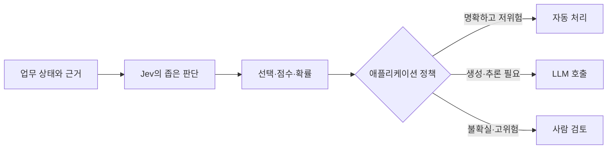

## 문장이 필요하지 않은 AI 호출도 있다

백엔드나 에이전트에 LLM을 붙이다 보면 결과를 사람이 읽지 않는 호출이 꽤 많습니다.

```text
이 문의는 결제 문제인가?
이 작업은 저렴한 모델로 처리해도 되는가?
검색한 문서에 질문의 답이 실제로 존재하는가?
지금 실행하려는 셸 명령은 사람의 확인이 필요한가?
```

필요한 것은 설명문이 아니라 분류값이나 확률입니다. 그런데 일반적인 LLM을 쓰면 모델은 먼저 문자열을 생성하고, 애플리케이션은 그 문자열을 JSON으로 파싱하고 스키마에 맞는지 검사합니다. Structured Outputs가 이 과정을 많이 안정시켰지만, 모델이 하는 일의 중심은 여전히 텍스트 생성입니다.

TypeSafe AI가 2026년 9월 공개한 **Jev**는 이 지점을 반대로 설계한 모델입니다. 텍스트를 생성한 뒤 구조화하는 것이 아니라, 처음부터 미리 정한 선택지와 점수의 확률을 반환합니다. TypeSafe는 이를 첫 번째 **System One Model**이라고 부릅니다.[1][3]

이 글은 Jev를 직접 벤치마크한 사용기가 아닙니다. 공개 직후의 공식 문서, TypeSafe가 공개한 예제와 평가, LangChain 통합 글을 바탕으로 구조와 사례를 분석했습니다. 따라서 성능 수치는 독립 검증 결과가 아니라 출처의 측정 결과로 구분해서 읽어야 합니다. 제품 사양은 2026년 9월 19일 확인한 기준입니다.

## Jev는 무엇을 반환할까?

Jev의 요청은 크게 두 부분으로 나뉩니다.

- `state`: 판단할 대상과 필요한 사실
- `questions`: 그 상태에 대해 내릴 판단과 허용된 답

질문은 세 종류입니다.[1]

| 타입     | 묻는 것                        | 반환값                            |
| -------- | ------------------------------ | --------------------------------- |
| `Choice` | 정해진 선택지 중 무엇인가?     | 선택값, 선택지별 확률, confidence |
| `Score`  | 정해진 척도에서 어느 수준인가? | 점수, 단계별 확률, confidence     |
| `Noul`   | 이 명제가 참인가?              | 참일 확률 0~1                     |

예를 들어 장애 문의 한 건을 다음처럼 나눌 수 있습니다.

```json
{
  "state": {
    "message": "배포 후 결제가 두 번 실패했고 고객에게 500 오류가 보입니다.",
    "service": "checkout-api"
  },
  "questions": {
    "owner": {
      "type": "choice",
      "instructions": "주된 담당 팀은 어디인가?",
      "criteria": {
        "billing": "청구·환불·결제 정책 문제",
        "technical": "서비스 오류나 기능 장애",
        "account": "로그인·권한·계정 보안"
      }
    },
    "urgency": {
      "type": "score",
      "instructions": "지금 대응해야 할 긴급도는 어느 수준인가?",
      "criteria": ["일반", "시간 민감", "긴급", "치명적"]
    },
    "needs_human": {
      "type": "noul",
      "instructions": "사람이 즉시 검토해야 하는 예외 상황인가?"
    }
  }
}
```

세 질문은 같은 `state`를 한 번 읽고 서로 독립적으로 평가됩니다. TypeSafe 문서는 여러 질문을 한 요청에서 병렬로 처리하며, 질문 수를 늘려도 지연 시간이 거의 늘지 않는다고 설명합니다.[1]

여기서 Jev를 단순히 “JSON을 잘 만드는 작은 LLM”으로 보면 차이를 놓치게 됩니다. Jev는 새 문장을 쓸 수 없습니다. 대신 애플리케이션이 미리 정한 답 공간 안에서 확률 분포를 반환합니다. 자유도와 생성 능력을 포기하고, 반복적인 판단을 코드 안에 넣기 쉬운 형태로 만든 셈입니다.



중요한 점은 마지막 행동까지 Jev가 소유하지 않는다는 것입니다. Jev는 판단 신호를 제공하고, 임계값·권한·실행·재시도·감사 로그는 코드가 관리해야 합니다.

## 사례 1: 고객 문의를 한 번에 분류하고 라우팅하기

TypeSafe 문서의 고객 지원 예시는 Jev가 가장 자연스럽게 들어가는 위치를 보여줍니다. 문의 한 건에 대해 다음 판단을 한 요청에 담습니다.[7][8]

- 문의 종류: 주문 조회, 상품 질문, 반품·교환, 불만
- 해결 복잡도: 단순 조회, 판단 필요, 예외·에스컬레이션
- 버그 심각도
- 재현 절차 존재 여부
- 환불 요청 여부
- 고객의 불만 수준

기존에는 문의 종류를 먼저 분류한 다음, 버그일 때만 심각도를 묻는 식으로 API 호출을 이어갈 수 있습니다. Jev의 `speculative fan-out` 패턴은 앞으로 필요할 가능성이 있는 질문도 처음부터 함께 보냅니다. 실제 분기가 버그가 아니면 심각도 결과를 코드에서 무시합니다.[8]

```text
문의 수신
  ├─ 주문 조회 + 높은 확신 → DB 조회 코드
  ├─ 상품 질문 → 상품 전문 LLM
  ├─ 단순 반품 → 정해진 워크플로
  └─ 복잡하거나 낮은 확신 → 상담원
```

이 사례에서 Jev가 맡는 것은 **언어의 의미를 업무 분기로 바꾸는 일**입니다. 주문 상태 조회, 환불 한도 계산, 고객 인증, 실제 환불 실행은 모델보다 코드가 잘합니다.

실무에서는 분류 정확도만 보면 부족합니다. 긴급 문의를 일반 문의로 보내는 오류와 일반 문의를 상담원에게 올리는 오류의 비용이 다르기 때문입니다. 클래스별 정밀도·재현율, 자동 처리 비율, 사람 검토율, 특히 높은 확률로 틀린 사례를 함께 측정해야 합니다.

## 사례 2: 에이전트 안에서 모델과 도구를 고르기

LangChain은 Jev를 `TypeSafeClassifier`와 실험적 미들웨어로 연결했습니다. 공개된 예시는 크게 두 가지입니다.[13]

### 모델 라우팅

간단한 조회나 작은 수정은 빠르고 저렴한 모델로, 아키텍처 판단이나 고위험 작업은 더 강한 모델로 보냅니다. Jev는 최신 사용자 요청을 보고 정해진 모델 후보 중 하나를 고릅니다.

```text
사용자 요청
  → Jev: fast / powerful / human 중 선택
  → 애플리케이션이 선택된 경로 실행
```

이 구조가 의미 있는 이유는 에이전트가 한 작업을 수행하는 동안 작은 판단을 여러 번 하기 때문입니다. 모든 분기마다 큰 LLM을 호출하면 실제 생성보다 제어 비용이 커질 수 있습니다.

### 도구 호출 전 위험 확인

LangChain의 `AutoModeMiddleware` 예시는 `bash` 같은 도구 호출을 실행하기 전에 Jev로 위험 여부를 확인하고, 필요한 호출을 차단하는 형태입니다.[13]

하지만 이것을 권한 시스템으로 해석하면 안 됩니다. 분류기는 위험한 호출을 안전하다고 오판할 수 있습니다. 허용 목록, 샌드박스, 최소 권한 자격 증명, 속도 제한, 사용자 승인은 여전히 코드와 실행 환경의 책임입니다.

또한 LangChain 글에 등장하는 브라우저 에이전트, 거래 에이전트, 이메일 분류 사례는 공개 직후의 프로젝트 사례입니다. 통합 가능성을 보여주지만 장기간의 운영 안정성이나 보안성을 입증하는 자료는 아닙니다.[13]

조금 더 구체적인 공개 코드로는 AI 콘텐츠 도구 **Notra**의 라우터가 있습니다. 단순한 인사와 명시적인 도구 요청은 정규식과 코드로 먼저 처리하고, 그 밖의 요청만 Jev로 `simple/complex`, 도구 필요 여부, 깊은 추론 필요 여부를 판정합니다. Jev 호출이 2.5초 안에 끝나지 않거나 실패하면 기존 LLM 라우터로 돌아가며, 확률과 소요 시간을 로그용 설명에 남깁니다.[14]

이 사례는 Jev를 모든 판단의 소유자로 두지 않고 **결정적 규칙 → Jev의 의미 판단 → LLM fallback** 순으로 배치했다는 점에서 참고할 만합니다. 다만 공개 저장소에서 실제 제품 경로에 연결된 코드를 확인할 수 있다는 것과, 운영 트래픽에서 정확도·절감액이 검증됐다는 것은 다릅니다. Notra는 후자에 해당하는 수치를 공개하지 않았습니다.

## 사례 3: 문서 검색에서 “가장 비슷함”과 “답이 있음”을 나누기

TypeSafe의 문서 검색 예제는 GitHub 이용약관 218개 조항에서 질문에 답하는 줄을 찾습니다. 구조는 두 질문의 조합입니다.[10]

1. `Choice`: 어느 줄이 질문과 가장 관련 있는가?
2. `Noul`: 이 문서에 답이 실제로 존재하는가?

왜 두 질문이 필요할까요? `Choice`의 확률은 선택지 전체에서 합이 1이 됩니다. 문서에 답이 없어도 어떤 줄 하나는 가장 높은 점수를 받습니다. 따라서 검색 순위만 보면 관련 없는 문장을 답으로 착각할 수 있습니다.

공개 예제에서 “분쟁을 중재로 해결해야 하는가?”라는 질문은 한 줄이 0.86으로 가장 높게 평가됐지만, 답의 존재 확률은 0.14였습니다. 반면 미성년자의 부모 허용 여부 질문은 관련 줄이 0.90이었지만 존재 확률이 0.46이라 “부분적으로 다룸”으로 처리됐습니다.[10]

```text
관련도 높은 줄 = 후보 위치
답의 존재 확률 = 그 후보를 답으로 사용할 수 있는가
```

이 패턴은 RAG에도 적용할 수 있습니다. 임베딩 검색 결과를 무조건 LLM에 넘기지 않고, 후보 문서가 질문을 실제로 뒷받침하는지 별도의 신호로 확인하는 방식입니다.

다만 이 예제의 `Choice`는 최대 255개 선택지를 사용합니다. 더 큰 문서는 구간을 먼저 고른 뒤 구간 안의 줄을 다시 고르는 2단계 검색이나 기존 검색 엔진과의 조합이 필요합니다.[10]

## 사례 4: 182개 에이전트 스킬 중 무엇을 읽을지 고르기

TypeSafe가 공개한 스킬 선택 cookbook은 이 글을 작성하는 환경과도 가까운 사례입니다. 에이전트가 가진 182개 스킬을 전부 자세히 프롬프트에 넣는 대신 두 단계로 줄입니다.[11]

1. 짧은 설명으로 182개 스킬의 관련도를 평가하고 상위 3개를 고릅니다.
2. 상위 후보의 긴 설명과 지침 일부를 다시 읽고, 실제로 사용할 스킬 하나를 고르거나 모두 거절합니다.

공개된 488개 요청 평가에서 에이전트가 짧은 목록만 읽었을 때 잘못된 스킬을 불러온 비율은 16.8%, 맞는 스킬이 없는데도 불러온 비율은 9.8%였습니다. Jev 제안을 추가한 조건에서는 각각 7.3%, 4.0%로 보고됐습니다.[11]

이 결과에서 더 흥미로운 부분은 “분류 모델로 에이전트를 대체했다”가 아닙니다. 비싼 생성 모델이 잘못된 컨텍스트를 읽기 전에, 값싼 판단 모델로 후보를 줄였다는 점입니다.

하지만 이 역시 TypeSafe가 만든 cookbook의 결과입니다. 요청은 각 스킬 문서로부터 생성됐고, 비교 대상과 평가 설계에도 제작자의 선택이 들어갑니다. 실제 에이전트에 도입한다면 자신의 요청 로그에서 다음을 다시 측정해야 합니다.

- 필요한 스킬을 후보에서 놓친 비율
- 불필요한 스킬을 넣어 컨텍스트를 흐린 비율
- 라우팅 호출 때문에 추가된 전체 지연 시간
- 잘못된 제안이 본 모델의 판단을 얼마나 강하게 바꾸는지

## 사례 5: 자유로운 텍스트를 전통적인 ML의 숫자 특성으로 바꾸기

AutoResearch cookbook은 Jev를 최종 예측기가 아니라 **특성 추출기**로 사용합니다.[12]

와인 시음 노트는 텍스트지만 CatBoost는 숫자 테이블을 입력으로 받습니다. 예제에서는 LLM이 시음 노트에서 물어볼 질문을 제안하고, Jev가 각 노트에 대해 29개 `Score`와 9개 `Noul`을 계산합니다. 이 확률과 불확실성을 67개 숫자 열로 바꾼 뒤 CatBoost가 평점을 예측합니다.[12]

```text
시음 노트
  → Jev의 의미 질문 38개
  → 확률·점수 기반 숫자 특성 67개
  → CatBoost
  → 평점 예측
```

공개된 800개 홀드아웃 결과에서 평균값만 예측한 RMSE는 3.09, 단어 빈도를 읽은 CatBoost는 2.47, Jev에 평점을 직접 물은 방식은 2.15였습니다. 다섯 번의 특성 탐색을 거친 38개 질문과 CatBoost 조합은 1.77로 보고됐습니다.[12]

이 사례는 “Jev가 CatBoost보다 좋다”는 비교가 아닙니다. 자연어 의미를 고정된 숫자 특성으로 바꿔 기존 ML 모델에 공급하는 역할입니다. 출력 열이 명시적이므로 어떤 질문이 예측에 기여했는지 살펴보고, 업무 지식에 맞지 않는 질문을 제거할 수도 있습니다.

반대로 모든 행에 같은 질문을 보내야 하므로 데이터가 커지면 요청 수와 비용도 행 수에 비례합니다. 학습용 특성의 유효성이 운영 데이터의 분포 변화 이후에도 유지되는지도 따로 감시해야 합니다.

## 사례 6: Doom과 Wikiracing은 무엇을 증명할까?

TypeSafe의 출시 글에는 Jev가 구조화된 게임 상태를 받아 초당 여러 번 행동을 선택하는 Doom 봇과, 현재 문서의 수백 개 링크 중 다음 이동을 고르는 Wikiracing 데모가 등장합니다.[3]

이 데모를 “Jev가 게임 AI를 대체한다”는 주장으로 읽을 필요는 없습니다. Doom은 짧은 지연 시간으로 판단을 반복할 수 있는지를 보여주고, Wikiracing은 선택지가 많아도 존재하지 않는 링크를 문자열로 지어내지 않는 인터페이스를 보여줍니다.

둘 다 구조의 장점을 시각적으로 보여주는 데모이지, 복잡한 업무의 정확도나 프로덕션 운영을 검증한 사례는 아닙니다. 특히 출시 글도 비AI Doom 봇이 더 잘할 수 있다고 밝힙니다.[3]

## “환각 0%”는 “오답 0%”가 아니다

TypeSafe는 Jev가 환각하지 않으며 타입 오류가 0%라고 표현합니다.[3] 이 문장을 그대로 받아들이기 전에 환각의 범위를 좁혀야 합니다.

Jev는 자유로운 문자열을 생성하지 않으므로 정의되지 않은 필드나 존재하지 않는 선택지를 새로 만들어낼 수 없습니다. 허용된 답의 타입과 형태를 지킨다는 의미의 **스키마 보장**입니다. 이 부분은 정확도 평가가 아니라 인터페이스 설계의 속성입니다.

다만 스키마 강제 자체가 Jev만의 기능은 아닙니다. 일반 LLM도 공급자의 Structured Outputs나 문법 제약 디코딩으로 형식을 강제할 수 있습니다. Jev의 차별점은 닫힌 답 공간, 확률 분포, 병렬 질문, 낮은 지연과 비용을 하나의 모델 계약으로 묶었다는 데 있습니다.

하지만 다음 오류는 여전히 가능합니다.

```text
허용된 선택지 중 틀린 것을 고른다.
위험한 도구 호출을 안전하다고 평가한다.
문서에 없는 답이 있다고 높은 확률을 준다.
낮은 긴급도의 문의를 긴급하다고 분류한다.
```

즉, **잘못된 형태의 답을 막는 것과 올바른 판단을 보장하는 것은 다릅니다.** TypeSafe의 모델 한계 문서도 Jev 1.13이 문자 그대로 해석하는 경향, 수치 정밀도, 계산·개수 세기, 날짜 비교, 여러 단계의 간접 참조, 불필요하게 긴 상태, 적대적 입력에서 어려움을 겪을 수 있다고 밝힙니다.[5]

따라서 “환각 0%”보다는 다음처럼 이해하는 편이 정확합니다.

> Jev는 답의 공간 밖으로 나가지는 않지만, 그 공간 안에서 틀릴 수 있다.

## 확률과 confidence는 어떻게 사용해야 할까?

`Choice`와 `Score`는 선택지별 확률 분포와 그 분포를 하나의 숫자로 요약한 `confidence`를 반환합니다. 한 선택지에 확률이 모이면 confidence가 높고, 여러 선택지에 퍼지면 낮아집니다. `Noul`은 참일 확률 자체를 사용하므로 별도의 confidence가 없습니다.[6]

애플리케이션은 이 값을 행동 정책으로 바꿀 수 있습니다.

```text
높은 확신 + 되돌릴 수 있는 행동 → 자동 처리
중간 확신                         → 추가 정보 요청 또는 샘플 검토
낮은 확신·고위험                 → 사람이나 다른 시스템으로 전달
```

여기서 확률 보정(calibration)은 개별 답의 정답 보장이 아닙니다. 0.8이라고 평가한 사례 집단이 장기적으로 약 80% 맞는지를 보는 집단적 성질입니다. 내 데이터에서도 그렇게 동작하는지는 별도의 라벨 데이터로 검증해야 합니다.

공식 예제의 0.5나 0.7 같은 임계값을 그대로 운영 정책에 복사해서도 안 됩니다. 환불, 보안 차단, 채용, 거래처럼 오판 비용이 큰 업무는 클래스별 오류 비용과 사람 검토 용량을 기준으로 임계값을 정해야 합니다.

## 193.6배 빠르고 444.6배 저렴하다는 수치는 어떻게 봐야 할까?

TypeSafe는 출시 페이지에서 Jev가 특정 워크플로 평가에서 193.6배 빠르고 444.6배 저렴했다고 소개합니다. 일반적인 응답 시간은 70~500ms라고 주장합니다.[3]

공개 평가에는 보안 사고, 에이전트 실행 기록 관측, 송장 처리, 고객 서비스라는 네 워크플로와 총 711개 사례가 포함됩니다. 긴 정책을 한 번에 모델에게 맡기지 않고, 좁은 질문과 코드 규칙으로 분해한 뒤 모델별 비용·시간·참조 확률과의 일치도를 비교합니다.[4]

평균값에서 Jev는 참조 확률과의 일치도 67.8%, 건당 약 0.0004달러, 0.4초로 표시됩니다. GPT-5.6 Terra는 67.9%, 약 0.0304달러, 10.1초였습니다. 거의 같은 일치도끼리 비교하면 이 평가에서는 약 25배 빠르고 76배 저렴한 셈입니다. 더 큰 헤드라인 배수는 비교 대상이 달라지며, 더 높은 일치도를 기록한 GPT-5.6 Sol 74.1% 같은 모델도 있었습니다.[4]

평가 사이트가 보여주는 또 하나의 결과는 **Jev가 아니라 LLM도 긴 프롬프트 하나보다 분해된 워크플로에서 더 나았다는 점**입니다. 따라서 성능 차이의 일부는 모델 자체뿐 아니라 정책을 좁은 질문과 코드로 바꾼 하네스 설계에서 옵니다.[4]

다만 이 평가에는 중요한 경계가 있습니다.

1. **실제 정답이 아니라 강한 모델들의 합의를 참조값으로 사용합니다.** GPT-6 Astra와 Claude Fable 5.1이 높은 추론 설정에서 낸 확률의 평균을 기준으로 삼습니다.[4]
2. **하네스가 맞다고 가정합니다.** 질문 분해와 코드 규칙 자체가 업무 정책을 올바르게 표현했는지는 평가 대상 밖입니다.[4]
3. **Jev에 잘 맞는 문제 모양입니다.** 출력이 미리 정해진 분류·점수·판정 작업이며, 글쓰기나 복합 계획과 비교하는 평가가 아닙니다.
4. **공급자가 설계하고 실행한 평가입니다.** TypeSafe도 홈페이지의 배수가 실제 이득 중 높은 편일 것으로 예상한다고 밝힙니다.[3]
5. **지연 시간은 환경에 따라 달라집니다.** 네트워크 위치, 요청 크기, 동시성, 재시도와 후속 LLM 호출까지 포함하면 애플리케이션의 체감 수치는 달라집니다.

따라서 이 숫자는 “모든 LLM 호출을 바꾸면 193배 빨라진다”는 약속이 아닙니다. **정해진 답 공간을 가진 좁은 판단에서는 생성 모델보다 전문화된 인터페이스가 훨씬 효율적일 수 있다**는 초기 근거에 가깝습니다.

## 어디에 쓰고, 어디에는 쓰지 말아야 할까?

Jev를 검토할 때는 “AI가 필요한가?”보다 다음 질문이 먼저입니다.

> 결과로 가능한 값을 입력을 보기 전에 열거할 수 있는가?

가능하고, 어려운 부분이 텍스트의 의미 판단이라면 Jev 후보가 됩니다. 반대로 정확한 계산이나 새로운 문장이 필요하다면 다른 도구가 맞습니다.

| 필요한 일                                | 먼저 선택할 도구 | 이유                           |
| ---------------------------------------- | ---------------- | ------------------------------ |
| 금액 계산, 날짜 비교, 권한 확인, DB 조회 | 코드             | 정확하고 테스트 가능함         |
| 분류, 점수화, 라우팅, 의미 검증          | Jev 후보         | 답 공간이 고정된 의미 판단     |
| 설명, 요약, 계획, 코드, 새로운 문장      | 생성형 LLM       | 열린 출력과 복합 추론이 필요함 |
| 규제·안전·금전이 걸린 모호한 예외        | 사람 검토        | 책임과 맥락 판단이 우선임      |

현재 Jev 1.13의 공식 사양은 텍스트 입력만 지원합니다. 가격은 입력 100만 토큰당 0.042달러이며 출력 토큰은 무료입니다. 한 요청의 전체 예산은 `state`와 모든 질문을 합쳐 64K 토큰이고, `state`와 가장 긴 질문의 조합에는 32K 제한이 적용됩니다. 영어가 주 학습 언어이며 CJK를 포함한 다른 언어도 처리하지만 정확도가 같지 않으므로 별도 평가가 필요합니다.[2]

한국어 서비스라면 영문 벤치마크와 영어 예제만으로 도입을 결정하기 어렵습니다. 실제 문의의 줄임말, 높임말, 오타, 혼합 언어, 도메인 표현을 포함한 평가 세트가 필요합니다.

## 도입한다면 가장 작은 분기부터 시험해야 한다

처음부터 결제 승인이나 보안 차단을 맡길 이유는 없습니다. 현재 LLM이 구조화 출력으로 수행하는 **빈도가 높고 되돌릴 수 있는 분류 하나**를 고르는 편이 안전합니다.

예를 들면 다음 순서로 검증할 수 있습니다.

```text
1. 과거 입력과 사람이 확정한 라벨을 준비한다.
2. 기존 규칙, 현재 LLM, Jev를 같은 데이터에서 비교한다.
3. 정확도뿐 아니라 클래스별 오류와 확률 보정을 측정한다.
4. 처음에는 결과를 저장만 하는 shadow mode로 운영한다.
5. 낮은 위험·높은 확신 구간만 자동화한다.
6. 분포 변화와 높은 확신의 오답을 계속 감시한다.
```

로그에는 모델 버전만 남겨서는 부족합니다. 판단 당시의 `state` 버전, 질문과 기준의 버전, 전체 확률 분포, 임계값과 정책 버전, 실제로 선택된 경로, 사람의 수정, 나중에 확인된 업무 결과까지 연결해야 합니다.

그래야 “모델이 0.91이라고 했다”에서 멈추지 않고, 그 0.91이 실제 업무에서 얼마나 믿을 만했는지 다시 계산할 수 있습니다.

## 마무리

Jev의 핵심은 더 작은 챗봇이 아닙니다. **사람에게 보여줄 문장을 만들지 않고, 코드가 사용할 좁은 판단만 반환하는 모델**입니다.

고객 문의 라우팅, 에이전트의 모델·도구 선택, 검색 후보 검증, 대규모 분류, 전통적인 ML의 특성 추출처럼 답의 모양을 미리 정할 수 있는 곳에서는 설계가 꽤 설득력 있습니다. 특히 여러 판단을 같은 상태 위에서 반복해야 할 때 병렬 질문과 낮은 단가가 의미를 가질 수 있습니다.

반면 타입 안전성은 사실의 정확성이 아니고, 보정된 확률도 개별 정답 보장이 아닙니다. 공개된 성능 자료는 아직 대부분 TypeSafe의 평가와 초기 통합 사례입니다. 한국어와 자신의 업무 분포에서 독립적으로 확인할 부분이 많이 남아 있습니다.

그래서 Jev를 가장 정확히 설명하는 문장은 “LLM을 대체한다”보다 이것에 가깝습니다.

> 코드로 쓰기에는 모호하고, 큰 LLM으로 처리하기에는 아까운 판단을 확률이 있는 타입으로 바꾼다.

## Sources

[1] https://docs.typesafe.ai/introduction — TypeSafe AI: Introduction
[2] https://docs.typesafe.ai/models — TypeSafe AI: Models
[3] https://typesafe.ai/blog/introducing-system-one-models-and-jev — Introducing System One Models & Jev
[4] https://evals.typesafe.ai — TypeSafe Workflow Evals
[5] https://docs.typesafe.ai/model-jaggedness/jev-1.13 — Jev 1.13 jaggedness
[6] https://docs.typesafe.ai/confidence — Confidence
[7] https://docs.typesafe.ai/patterns/intent-routing — Intent routing
[8] https://docs.typesafe.ai/patterns/fan-out — Speculative fan-out
[10] https://docs.typesafe.ai/cookbooks/semantic_find — Line-by-line search
[11] https://docs.typesafe.ai/cookbooks/skill_suggestion — Skill suggestion
[12] https://docs.typesafe.ai/cookbooks/autoresearch_feature_discovery — Autoresearch feature discovery
[13] https://www.langchain.com/blog/building-a-harness-with-jev — LangChain: Building a Harness with Jev
[14] https://github.com/usenotra/notra/blob/ca4c6e06d865037025345e992cb7c01ef272b451/packages/ai/src/orchestration/router.ts — Notra Jev router implementation
