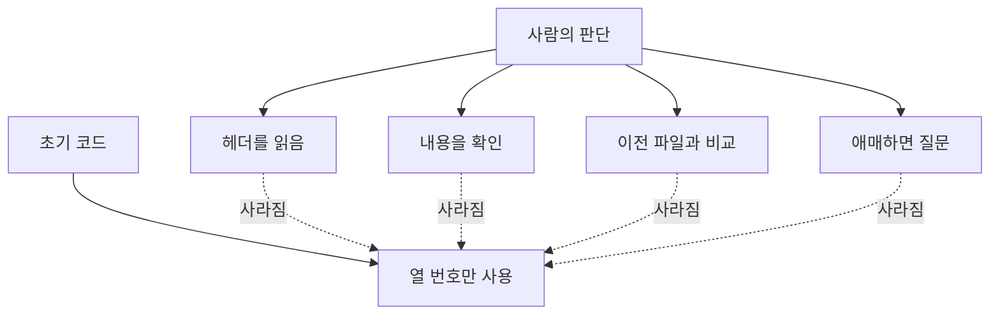
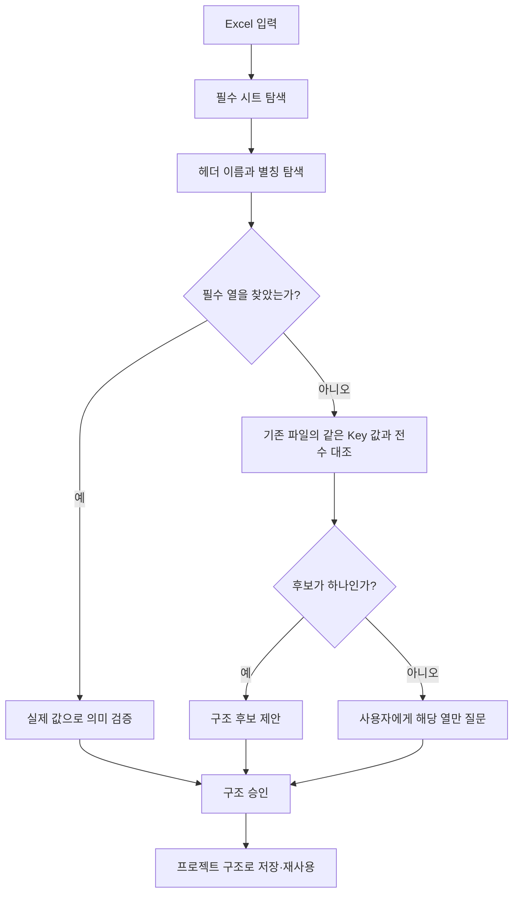
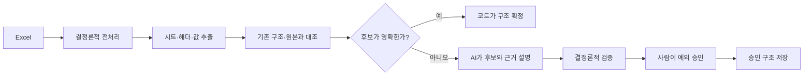
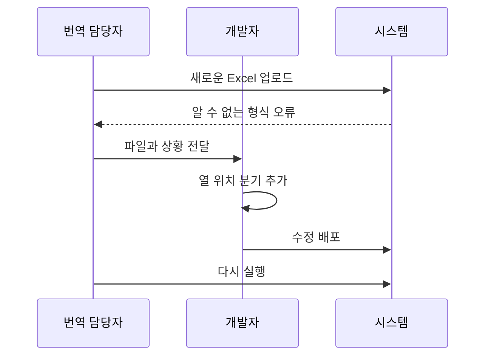
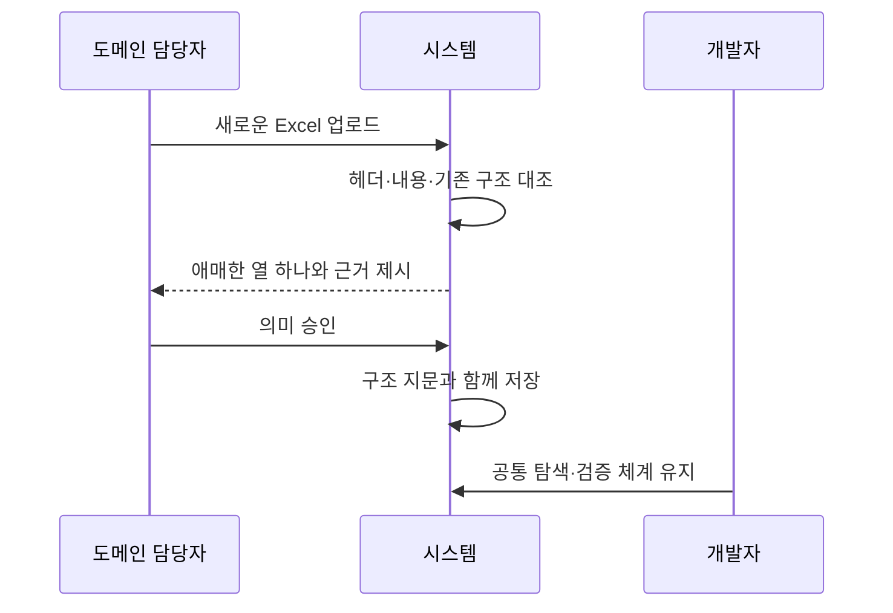
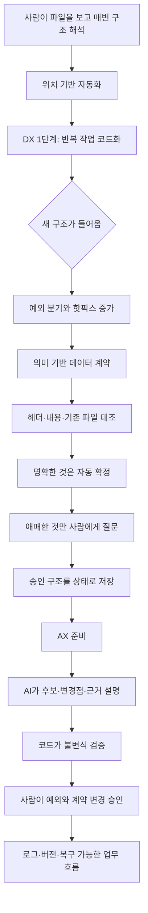
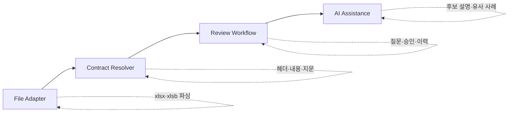

## 들어가며

게임 로컬라이제이션 검수 도구는 여러 Excel 파일을 입력으로 받습니다.

겉으로 보면 같은 종류의 파일입니다. 원문이 있고, 번역이 있고, 문맥과 식별자가 있습니다. 그래서 처음에는 코드에서 각 열의 위치를 정해 읽었습니다.

```text
A열 → Key
C열 → 원문
H열 → 번역
```

한 프로젝트에서 잘 동작했습니다. 다른 프로젝트의 열 배치가 다르면 대체 위치를 하나 추가했습니다. 파일 형식이 달라지면 형식별 분기를 넣었습니다.

당시에는 자연스러운 확장처럼 보였습니다.

그런데 같은 문제가 1년 동안 여섯 번 다른 얼굴로 돌아왔습니다.

- 업로드된 파일 객체를 경로로 바꾸는 과정에서 형식 판별이 깨졌습니다.
- 프로젝트마다 열 배치가 달라 대체 위치가 늘어났습니다.
- 실행 전에 시트와 열 개수를 검사하는 관문을 만들자 정상 파일까지 거부했습니다.
- 빈 열에 남은 서식 흔적 때문에 실제보다 넓은 시트로 판정했습니다.
- `xlsb` 파일에서는 헤더 행에 저장된 셀 수가 짧아 필수 열이 없는 것처럼 보였습니다.
- 같은 역할의 열 이름과 위치가 또 바뀌자 핫픽스가 필요했습니다.

문제는 새로운 Excel 형식이 계속 등장한다는 데 있지 않았습니다.

> 열 번호를 데이터 계약으로 사용한 것이 문제였습니다.

이 일을 정리하다 보니 DX와 AX의 경계도 조금 다르게 보였습니다.

Excel 작업을 웹 도구로 옮겼다고 DX가 끝나는 것은 아니었습니다. 사람이 암묵적으로 알고 있던 파일 구조를 코드의 열 번호로 옮기기만 했다면, 업무의 불확실성은 사라지지 않습니다. 단지 코드 안으로 숨을 뿐입니다.

그 상태에서 AI를 붙인다고 AX가 되는 것도 아닙니다. 계약이 없는 데이터에서 AI에게 열의 의미를 매번 추측하게 만들면, 자동화가 아니라 추측의 규모를 키우게 됩니다.

이번 글에서는 Excel 열 위치를 버리고 헤더와 실제 내용을 계약으로 바꾼 경험을 따라가며, 제가 생각하게 된 DX와 AX의 순서를 정리해보려고 합니다.

## 먼저 DX와 AX를 어떻게 구분했나

DX와 AX는 회사마다 다르게 쓰는 말이라, 이 글에서는 최소한의 의미로만 사용하겠습니다.

```text
DX
→ 사람이 하던 업무와 정보를 디지털 시스템 안에서
  반복 가능하고 추적 가능한 흐름으로 바꾸는 것

AX
→ 그 흐름 안에서 AI가 해석·제안·판단의 일부를 맡도록
  사람의 역할과 통제 방식을 다시 설계하는 것
```

DX는 종이를 Excel로 옮기거나 Excel을 웹으로 옮기는 것만 뜻하지 않습니다. 업무 규칙을 시스템이 이해할 수 있는 계약으로 바꾸고, 입력과 출력과 예외를 추적할 수 있어야 합니다.

AX도 챗봇이나 LLM API를 붙이는 것만 뜻하지 않습니다. AI가 실제 업무의 일부를 맡고, 사람은 어느 지점에서 기준을 제공하고 예외를 판단할지 다시 정해야 합니다.


이 정의로 보면 이번 Excel 구조 개선은 그 자체로 AI 기능은 아닙니다. 먼저 해야 했던 일은 DX의 미완성 부분을 고치는 일이었습니다.

다만 이 기반이 생기고 나서야 AI를 어디에 넣고 어디에는 넣지 말아야 하는지 말할 수 있었습니다.

## Excel을 웹으로 옮겼지만 암묵지는 그대로였다

기존 작업에서 번역 담당자는 Excel을 열어보면 어느 열이 원문이고 어느 열이 번역인지 알 수 있었습니다.

열 이름을 읽기도 하고, 값의 모양을 보기도 합니다. 같은 프로젝트에서 이전에 사용한 파일과 비교하기도 합니다. 조금 애매하면 파일을 만든 사람에게 묻습니다.

사람은 여러 단서를 함께 사용했습니다.

```text
헤더 이름
+ 값의 언어
+ Key의 반복 형태
+ 이전 파일과의 관계
+ 프로젝트 경험
```

하지만 최초 코드는 이 판단을 다음처럼 압축했습니다.

```text
원문은 3번째 열이다.
번역은 8번째 열이다.
```

여기서 DX의 첫 번째 함정이 보였습니다.

> 사람의 업무를 코드로 옮겼다고 생각했지만, 실제로는 사람의 판단 중 가장 눈에 잘 보이는 결과만 옮겼습니다.

사람이 `C열`을 선택한 이유는 C라는 위치 때문이 아닙니다. 그 열의 헤더와 내용이 원문처럼 보였기 때문입니다. 그런데 코드는 이유를 버리고 위치만 저장했습니다.



파일을 디지털 시스템에 넣었지만 업무 지식은 시스템의 계약이 되지 않았습니다. `if project == A: column = 8` 같은 분기로 흩어졌습니다.

이건 자동화가 부족한 문제가 아니라 업무를 설명하는 모델이 부족한 문제였습니다.

## 첫 대응은 알려진 배치를 계속 추가하는 것이었다

새 프로젝트 파일이 들어올 때마다 열 배치를 하나씩 추가하면 당장은 해결됩니다.

```python
if project_type == "A":
    source_column = 3
    translation_column = 8
elif project_type == "B":
    source_column = 5
    translation_column = 12
```

이 방식에는 장점도 있었습니다.

- 구현이 빠릅니다.
- 이미 아는 입력에서는 결정론적으로 동작합니다.
- 프로젝트가 적을 때는 이해하기 쉽습니다.

그래서 처음부터 틀린 선택이었다고 말하고 싶지는 않습니다. 프로토타입에서는 충분히 합리적이었습니다.

문제는 이 구조를 입력 계약처럼 계속 확장했다는 데 있었습니다.


열 위치 분기가 늘어날수록 시스템은 더 많은 프로젝트를 지원하는 것처럼 보였습니다. 하지만 실제로는 과거에 본 파일의 좌표를 외우고 있었습니다.

새로운 입력을 이해하는 능력은 생기지 않았습니다.

## 검증 관문을 만들자 정상 파일이 멈췄다

잘못된 파일을 뒤늦게 발견하는 문제를 막기 위해 실행 전 검증 관문을 추가했습니다.

- 필요한 시트가 있는가?
- 필요한 열 수가 있는가?
- 예상한 헤더가 있는가?
- 프로젝트에 맞는 배치인가?

오류를 일찍 보여준다는 방향은 맞았습니다. 실제 한 번의 측정에서는 이 관문을 추가한 뒤 대조 대기시간이 약 20% 늘었지만, 잘못된 입력을 작업 시작 전에 막는 비용으로 받아들일 수 있었습니다.

그런데 관문이 정상 파일을 거부하기 시작했습니다.

### 빈 열의 서식 흔적이 열 개수로 잡혔다

한 내보내기 도구는 값이 없는 열에도 서식 정보를 남겼습니다.

사람이 Excel에서 보면 데이터가 끝난 것처럼 보였지만, 파일 내부에는 더 오른쪽 열까지 사용된 흔적이 남아 있었습니다. 검증 코드는 시트의 저장 너비를 열 개수로 사용했기 때문에 예상보다 열이 많다고 판단했습니다.

```text
사람이 보는 시트
A B C D E [끝]

파일 내부에 저장된 범위
A B C D E F G H I J K
          └ 값은 없지만 서식 흔적 존재
```

### xlsb는 반대로 헤더 행이 짧게 저장될 수 있었다

다른 파일에서는 반대 문제가 생겼습니다.

`xlsb`는 행마다 실제 저장된 셀 수가 다를 수 있었습니다. 데이터 행에는 더 많은 열이 있지만, 헤더 행의 뒤쪽 빈 셀이 저장되지 않으면 헤더만 읽었을 때 열이 부족한 것처럼 보였습니다.

```text
헤더 행이 저장한 셀  : 7개
데이터 행이 가진 셀  : 15개
검증 코드의 결론     : 필수 열 부족
실제 파일             : 정상
```

두 장애는 방향이 반대였습니다.

- 하나는 저장된 범위가 실제 내용보다 넓었습니다.
- 하나는 특정 행에 저장된 셀 수가 전체 구조보다 좁았습니다.

하지만 수정 원칙은 같았습니다.

> 파일이 어떻게 저장됐는지가 아니라, 실제로 어떤 내용이 있는지를 봐야 했습니다.

이 사건은 DX에서 데이터 계약을 잘못 잡으면 검증도 잘못된 확신을 준다는 점을 보여줬습니다. 검증 코드가 있다는 사실보다 무엇을 검증하는가가 중요했습니다.

## 물리적 위치에서 의미 계약으로 옮겼다

최종적으로 입력 구조를 다음 순서로 해석하도록 바꿨습니다.



### 1. 헤더 이름과 별칭을 먼저 찾는다

원문, 번역, 문맥처럼 의미가 분명한 열은 위치가 아니라 이름으로 찾습니다.

헤더 표기가 바뀔 수 있으므로 승인된 별칭도 함께 관리합니다. 별칭은 아무 문자열이나 넓게 허용하지 않고 실제 입력에서 확인된 것만 추가합니다.

### 2. 헤더가 부족하면 실제 내용을 비교한다

헤더만으로 의미를 찾을 수 없는 열은 기존 파일과 비교합니다.

같은 Key를 가진 행에서 어느 열의 값이 기존 원문과 일치하는지 전수로 확인합니다. 열 하나가 안정적으로 같은 값을 가진다면 의미 후보로 볼 수 있습니다.

여기서 중요한 것은 AI가 느낌으로 고르는 것이 아니라, 현재 구현에서는 결정론적인 데이터 대조가 먼저라는 점입니다.

### 3. 하나로 좁혀지지 않으면 사용자에게 묻는다

후보가 둘 이상이거나 근거가 부족하면 시스템이 조용히 하나를 선택하지 않습니다.

전체 설정 화면을 다시 채우게 하는 대신, 애매한 열 하나만 물어봅니다.

```text
“원문이 들어 있는 열은 다음 중 어느 것인가요?”
```

이 질문은 자동화의 실패가 아닙니다. 잘못된 자동 선택이 17만 행 전체에 퍼지는 것을 막는 가장 싼 제어였습니다.

### 4. 한 번 승인한 구조는 지문과 함께 저장한다

사용자가 승인한 결과는 다음 정보와 함께 저장합니다.

```text
프로젝트
입력 역할
구조 버전
원본 해시
승인된 열 의미
```

같은 구조의 파일이 다시 들어오면 매번 묻지 않습니다. 파일 구조가 달라졌을 때만 다시 확인합니다.

이렇게 사람의 판단은 일회성 대화가 아니라 재사용 가능한 시스템 상태가 됐습니다.

## 여기까지는 AX가 아니라 잘 만든 DX였다

이 구조에는 자동 추론과 사용자 확인이 있지만, AI가 반드시 필요한 것은 아닙니다.

- 헤더 별칭 검색은 규칙입니다.
- 실제 값의 전수 대조는 결정론적 비교입니다.
- 후보가 애매할 때 질문하는 것도 일반적인 UX입니다.
- 승인한 구조를 저장하는 것은 상태 관리입니다.

그래서 이 개선을 “AI 기반 AX”라고 포장하면 안 됩니다.

```text
Excel 자동 분석
≠ AI

사용자 확인 UX
≠ AX

결정론적 구조 추론
= 신뢰할 수 있는 DX 기반
```

하지만 이 기반은 AX에 중요했습니다.

AI가 실제 업무에 들어오려면 먼저 다음 질문에 답할 수 있어야 하기 때문입니다.

- AI가 읽은 입력은 어떤 구조인가?
- 어떤 열을 원문으로 해석했는가?
- 그 판단의 근거는 무엇인가?
- 확신이 낮을 때 누구에게 무엇을 물을 것인가?
- 한 번 승인된 판단을 어떻게 재사용할 것인가?
- 잘못된 해석이 어디까지 영향을 미치는가?

열 번호 분기만 있던 때에는 이 질문에 답하기 어려웠습니다. 계약을 의미 중심으로 바꾼 뒤에야 AI가 들어갈 자리가 보였습니다.

## AX에서 AI가 맡을 자리는 계약 위의 해석이었다

앞으로 AI를 사용한다면, Excel 파서를 통째로 대체하게 만들고 싶지는 않습니다.

AI가 잘할 수 있는 일과 코드가 강제해야 하는 일을 나누는 편이 안전합니다.



### AI가 맡을 수 있는 일

- 처음 보는 헤더 표현을 기존 의미와 연결할 후보 제안
- 여러 단서가 충돌할 때 차이를 사람이 이해할 수 있게 설명
- 파일 구조 변경점을 요약
- 과거 승인 사례 중 비슷한 구조 검색
- 사용자에게 물어야 할 질문을 한 가지로 좁힘

### 결정론적으로 남겨야 할 일

- 파일 형식 파싱
- 행·열 범위 확인
- 원본 해시 계산
- 동일 Key 값의 전수 대조
- 필수 데이터 누락 검사
- 입력 원본 불변 확인
- 결과 행 누락 검사
- 승인되지 않은 구조의 자동 저장 차단

### 사람이 맡아야 할 일

- 애매한 열의 실제 업무 의미 결정
- 새 프로젝트 구조의 최초 승인
- 데이터 계약 변경 여부 판단
- 잘못된 추론의 영향과 복구 결정

AX는 사람을 없애는 구조가 아니라, 사람의 판단을 가장 필요한 지점으로 줄이는 구조에 가까웠습니다.

```text
기존 작업
→ 매번 전체 파일 구조를 사람이 해석

개선된 DX
→ 시스템이 명확한 부분을 처리하고 애매한 열만 질문

AX가 들어간다면
→ AI가 애매함의 이유와 후보를 설명하고
  사람은 의미를 승인
```

## 개발자만 알던 규칙을 사용자와 함께 관리해야 했다

열 위치 분기는 개발자가 소유했습니다.

파일 구조가 바뀌면 사용자는 오류를 제보하고, 개발자는 파일을 받아 코드를 수정하고, 배포한 뒤 다시 확인했습니다.



이 구조에서는 개발자가 모든 프로젝트의 Excel 암묵지를 번역하는 병목이 됩니다.

의미 계약으로 옮긴 뒤에는 역할이 바뀝니다.



- 도메인 담당자는 어떤 열이 실제 원문인지 판단합니다.
- 개발자는 파싱, 검증, 권한, 로그, 복구를 책임집니다.
- 시스템은 명확한 부분을 자동 처리하고 예외를 좁혀 보여줍니다.
- AI가 들어간다면 설명과 후보 제안을 돕되 최종 계약을 몰래 바꾸지 않습니다.

이 역할 분리가 제가 생각한 AX의 핵심에 가까웠습니다.

비개발자가 AI를 잘 쓴다는 것은 프롬프트를 잘 작성한다는 뜻만은 아닙니다. 자신의 업무에서 무엇이 정상이고, 무엇이 예외이며, 어떤 결과는 받아들이면 안 되는지를 설명할 수 있어야 합니다.

개발자는 그 판단이 안전하게 실행될 수 있는 환경을 만들어야 합니다.

## 결과 파일에서는 기존 Excel을 틀로 유지했다

입력 구조를 유연하게 읽게 만들었다고 출력 형식까지 마음대로 바꾸면 안 됐습니다.

번역 담당자에게 Excel은 단순한 데이터 컨테이너가 아니었습니다.

- 기존 시트 구성이 있습니다.
- 익숙한 헤더 순서가 있습니다.
- 알려지지 않은 열에도 다른 팀의 정보가 있을 수 있습니다.
- 서식이 검토와 전달 과정에서 의미를 가질 수 있습니다.
- 생성된 결과물이 다음 회차의 입력이 됩니다.

그래서 결과는 새 워크북을 처음부터 만드는 대신 기존 파일을 틀로 사용했습니다.

```text
기존 파일
├─ 시트 구성 유지
├─ 헤더 유지
├─ 모르는 열 유지
├─ 서식 유지
└─ 필요한 값만 갱신
```

DX를 한다며 기존 업무 도구를 모두 없애는 것이 답은 아니었습니다.


웹 화면은 실행과 판정을 돕고, Excel은 여전히 전달·보관·검토의 표면으로 남았습니다.

AX에서도 같은 원칙이 필요하다고 생각합니다. 채팅이 기존 업무 화면을 전부 대체할 필요는 없습니다.

```text
사람의 의도
→ AI·시스템 실행
→ 기존 문서와 데이터 갱신
→ 차이·근거·예외를 기존 작업 화면에서 확인
→ 사람 승인
```

## 어떻게 검증했나

구조를 유연하게 읽는 기능은 잘못되면 조용히 많은 데이터를 바꿀 수 있습니다. 그래서 “파일이 생성됐다”는 것만으로는 부족했습니다.

실제 172,982행 규모의 입력으로 다음 흐름을 확인했습니다.

```text
입력 구조 대조
→ DB 저장
→ 작업용 결과 생성
→ 생성 결과 재입력
```

측정 조건은 로컬 WSL2와 Python 3.12였습니다. 구조 승인 이후의 대조, DB 저장, 작업 파일 생성을 포함한 실행에서 90.66초를 기록했습니다.

이 수치를 과거에 기록된 184초와 동일 조건의 개선율로 비교하지는 않습니다. 과거 측정은 포함 범위가 남아 있지 않았기 때문입니다.

대신 다음 불변식을 따로 확인했습니다.

### 입력 원본은 바뀌지 않았는가?

처리 전후 입력 파일의 SHA-256이 동일했습니다.

```text
입력 원본 SHA-256
처리 전 = 처리 후
```

### 스트리밍 방식으로 바꿔도 결과가 같은가?

DB에서 결과를 한 그룹씩 읽는 구조로 바꾼 뒤, 기존 결과와 새 결과의 3개 시트 173,016행을 전수 셀 비교했습니다.

```text
비교 대상: 3개 시트, 173,016행
셀 불일치: 0
```

### 만든 결과를 다시 입력할 수 있는가?

생성한 작업 파일을 다시 입력해 구조 인식과 처리 흐름을 통과하는지 확인했습니다.

결과물은 한 번 내려받고 끝나는 문서가 아니라 다음 회차의 입력이기 때문입니다.

### 메모리는 얼마나 사용했는가?

같은 글에서 별도 측정으로 최대 RSS가 2.28GiB에서 1.74GiB로 감소한 결과도 기록할 수 있습니다. 약 23.9% 감소입니다.

다만 이 값도 시간 수치와 무리하게 합쳐 하나의 종합 개선율로 만들지 않습니다. 무엇을 언제 어떻게 측정했는지를 분리해야 합니다.

## DX 관점에서 배운 것

### 파일 형식과 데이터 계약은 다르다

`.xlsx`나 `.xlsb`는 데이터를 저장하는 형식입니다. 어느 열이 원문이고 어느 열이 번역인지까지 보장하지 않습니다.

```text
파일 형식
→ 어떻게 저장했는가

데이터 계약
→ 무엇을 의미하는가
```

이 둘을 섞으면 저장 구현의 차이가 업무 오류처럼 보입니다.

### 위치는 의미가 아니다

`8번째 열`은 좌표입니다. `번역문`은 의미입니다.

둘이 우연히 오래 일치할 수는 있지만 같은 계약은 아닙니다.

### 검증은 물리적 흔적보다 실제 내용을 봐야 한다

시트 너비, 헤더 행의 저장 셀 수, dimension 정보는 구현 단서일 뿐입니다. 실제 값과 업무 의미를 대신할 수 없습니다.

### 예외 처리를 추가하는 것과 일반화는 다르다

프로젝트별 위치를 계속 추가하면 지원 범위는 넓어 보이지만, 새로운 구조를 해석하는 규칙은 생기지 않습니다.

### 기존 작업 표면을 없애지 않아도 된다

웹 도구가 생겼어도 Excel은 여전히 전달과 검토와 다음 작업의 형식이었습니다. DX는 기존 도구를 모두 교체하는 일이 아니라, 반복되는 마찰과 오류를 줄이는 일이었습니다.

## AX 관점에서 배운 것

### AI보다 먼저 성공 조건이 필요하다

AI에게 “원문 열을 찾아줘”라고 말하기 전에 시스템은 무엇을 원문 후보로 인정할지 알아야 합니다.

- 헤더가 승인된 별칭인가?
- 값이 실제 원문과 얼마나 일치하는가?
- 필수 데이터가 비어 있지 않은가?
- 후보가 하나로 좁혀지는가?

이 기준이 없으면 AI의 답을 평가할 수 없습니다.

### 결정론적으로 풀리는 부분은 결정론적으로 남겨야 한다

전수 대조로 답이 나오는 문제를 LLM에게 맡길 이유는 적습니다.

AI는 규칙으로 표현하기 어려운 헤더 해석이나 설명에 사용할 수 있지만, 해시·행 누락·필수 값·승인 여부는 코드가 강제하는 편이 낫습니다.

### 확신이 낮으면 질문을 줄여야 한다

AX의 목표를 “사람에게 묻지 않기”로 잡으면 시스템은 애매한 상황에서도 답을 만들어냅니다.

이번 경험에서는 질문을 없애는 대신 전체 파일 설정을 한 칸의 질문으로 줄였습니다.

### 사람의 승인을 재사용 가능한 상태로 만들어야 한다

매번 채팅으로 다시 설명하면 업무 지식이 세션과 함께 사라집니다.

승인된 구조와 근거를 버전·해시와 함께 저장해야 사람의 판단이 조직의 자산이 됩니다.

### 도메인 담당자가 기준의 주인이어야 한다

개발자가 모든 Excel 의미를 대신 판단하면 AX가 아니라 중앙 개발팀의 자동화 병목이 됩니다.

도메인 담당자는 예외와 품질 기준을 정의하고, 개발자는 그 판단이 안전하게 실행되고 기록되고 되돌아갈 수 있는 환경을 만들어야 합니다.

## DX와 AX를 한 흐름으로 다시 그려보면



이 순서에서 AI는 가장 마지막에 나타납니다.

AI가 중요하지 않아서가 아닙니다. AI가 맡을 판단을 검증하려면 먼저 데이터 계약과 작업 흐름이 보여야 하기 때문입니다.

## 지금 다시 만든다면

현재 구조를 다시 설계한다면 다음 네 층으로 나누겠습니다.



### File Adapter

파일 형식의 차이만 책임집니다.

- xlsx·xlsb 읽기
- 실제 값이 있는 셀 추출
- 원본 보존
- 저장 형식 차이 흡수

### Contract Resolver

열의 의미를 결정론적으로 찾습니다.

- 헤더와 별칭
- 필수 열
- 실제 값 비교
- 기존 프로젝트 구조
- 원본 해시와 구조 버전

### Review Workflow

불확실성을 사람에게 안전하게 넘깁니다.

- 애매한 후보만 표시
- 근거 제공
- 최초 승인
- 변경 이력
- 소급 적용 여부
- 잘못된 승인 되돌리기

### AI Assistance

규칙으로 충분하지 않은 해석만 돕습니다.

- 처음 보는 헤더 설명
- 구조 변경 요약
- 비슷한 승인 사례 검색
- 질문 생성

이렇게 하면 AI가 없어도 핵심 흐름은 안전하게 동작합니다. AI가 추가되면 사람의 해석 비용을 줄이지만, 데이터 계약과 검증을 대체하지는 않습니다.

## 마무리

처음에는 열 배치가 다른 Excel을 하나 더 지원하는 문제라고 생각했습니다.

그래서 열 위치를 하나 더 등록하고, 형식별 예외를 추가하고, 실행 전 검증을 강화했습니다. 하지만 같은 문제는 계속 돌아왔습니다.

전환점은 질문을 바꾼 순간이었습니다.

```text
“원문은 몇 번째 열인가?”
```

대신,

```text
“이 열이 원문이라는 사실을 무엇으로 설명할 수 있는가?”
```

를 물었습니다.

그러자 헤더 이름, 실제 값, 이전 파일과의 관계, 사용자의 승인이라는 근거가 보였습니다. 열 번호는 그 결과 중 하나일 뿐 계약이 아니었습니다.

이 경험을 DX와 AX 관점에서 정리하면 다음과 같습니다.

> DX는 사람의 일을 화면으로 옮기는 것이 아니라, 사람이 사용하던 판단 근거를 반복 가능하고 검증 가능한 계약으로 바꾸는 일입니다.

그리고,

> AX는 그 계약이 없는 자리에 AI의 추측을 넣는 일이 아니라, 계약 위에서 AI가 해석 일부를 맡고 사람은 예외와 책임을 관리하도록 업무를 다시 설계하는 일입니다.

이번 개선에는 AI가 필요하지 않았습니다. 오히려 AI를 넣기 전에 해야 할 일이 무엇인지 보여줬습니다.

열 번호를 버리고 의미를 계약으로 만들자, 그제야 AI에게 맡겨도 되는 부분과 맡기면 안 되는 부분이 나뉘었습니다.

저는 그 순서가 DX에서 AX로 넘어갈 때 가장 먼저 지켜야 할 조건이라고 생각합니다.

---

**측정 범위**: 로컬 WSL2 · Python 3.12 · 172,982행 입력 · 구조 승인 후 대조·DB 저장·작업 파일 생성 90.66초 · 입력 SHA-256 불변 · 3개 시트 173,016행 전수 셀 비교 불일치 0건

**수치 해석 주의**: 과거 184초 기록은 측정 포함 범위가 남아 있지 않아 90.66초와 동일 조건의 개선율로 비교하지 않았습니다. 최대 RSS 2.28GiB → 1.74GiB는 별도 조건의 메모리 측정으로 구분했습니다.

**공개를 위해 바꾼 것**: 프로젝트명, 실제 시트·헤더·Key 문구, 파일명, 사내 경로와 계정 식별자는 일반 표현으로 익명화했습니다.
