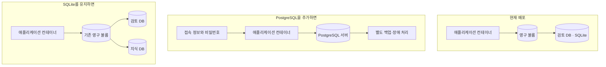

## 들어가며

게임 로컬라이제이션 검수 도구에 작은 도우미를 붙이고 있었습니다.

번역자가 원문 하나를 보고 이렇게 물을 수 있는 기능입니다.

> 이 원문, 다른 데서는 어떻게 번역했어?

겉으로 보면 단순한 검색처럼 보입니다. 하지만 답을 만들려면 Excel 원본에서 뽑은 **154만 쌍의 번역 기록**을 뒤져야 했습니다.

프로토타입은 PostgreSQL로 만들었습니다. 문자열이 조금 다른 원문까지 찾기 위해 `pg_trgm`을 사용했습니다. PostgreSQL에는 이미 이 문제를 풀 수 있는 기능이 있었고, 당시에는 자연스러운 선택이라고 생각했습니다.

그런데 제품으로 옮기려니 질문이 달라졌습니다.

> 이 검색 하나를 위해 데이터베이스 서버를 하나 더 운영해야 할까?

답을 내리기 전에 직접 재보기로 했습니다. 그리고 세 번 틀렸습니다. 마지막 한 번은 이 글을 쓴 뒤 다른 사람의 질문을 받고서야 알았습니다.

결론은 SQLite를 유지하는 것이었습니다. 하지만 처음 생각했던 이유와 마지막에 남은 이유는 달랐습니다.

이 글은 어느 데이터베이스가 더 뛰어난지 가리는 글이 아닙니다. 제가 무엇을 전제로 삼았고, 어떤 측정으로 그 전제를 고쳤는지 남긴 기록입니다.

## 먼저 어떤 데이터를 검색해야 했을까?

번역 검수는 문장 하나만 보고 맞고 틀림을 판단하는 일이 아닙니다. 판단하려면 옆에 놓고 비교할 근거가 필요합니다.

- 용어집에는 어떤 표현이 등록되어 있는가?
- 같은 원문을 다른 시트에서는 어떻게 번역했는가?
- 비슷한 원문에서는 어떤 표현을 사용했는가?

그래서 검수 화면의 도우미가 두 종류의 데이터를 조회하도록 만들었습니다.

하나는 이번 검사 결과와 사람의 판정이 담긴 **검토 DB**입니다. 다른 하나는 Excel 원본에서 추출한 용어와 번역 기록이 담긴 **지식 데이터**입니다.

| 데이터    |        건수 |
| --------- | ----------: |
| 등록 용어 |    35,393개 |
| 등록 번역 |   205,845개 |
| 번역 기록 | 1,543,102쌍 |
| 고유 원문 |   289,590건 |

검토 DB는 원래부터 SQLite였습니다. 파일 하나에 담을 수 있고, 컨테이너 하나에 볼륨 하나를 붙이는 현재 배포 구조에도 잘 맞았습니다.

지식 데이터를 붙이면서 PostgreSQL을 새로 세운 이유는 단 하나였습니다.

**비슷한 원문 찾기**였습니다.

## PostgreSQL이 아니라 `pg_trgm`이 필요했다

정확히 같은 값을 찾는 조회는 어렵지 않았습니다.

용어를 정확히 찾거나, 같은 원문의 번역을 모으는 일은 인덱스로 처리할 수 있습니다. 문제는 글자가 조금 다른 문장을 찾는 일이었습니다.

예를 들어 번역자가 다음 원문을 보고 있다고 해보겠습니다.

```text
트라움의 모험가({0}단계) 달성 시 획득
```

이때 아래 원문이 어떻게 번역되었는지 함께 볼 수 있다면 표현을 맞추는 데 도움이 됩니다.

```text
트라움의 수호자({0}단계) 달성 시 획득
```

두 문장은 구조가 거의 같지만 정확히 일치하지는 않습니다. 일반적인 동등 비교나 B-tree 인덱스로는 이런 이웃을 바로 찾기 어렵습니다.

PostgreSQL에는 `pg_trgm` 확장이 있습니다. 문자열을 세 글자 조각인 trigram으로 나누고, 두 문자열이 얼마나 비슷한지 비교할 수 있게 해줍니다.

프로토타입은 이 기능을 사용했습니다. 게임 대사에는 긴 원문도 있어서, 원문 전체에 B-tree 인덱스를 만들 때 키 길이 한계에 걸리는 문제는 해시 열을 따로 두어 우회했습니다.

돌이켜보면 제가 선택한 것은 PostgreSQL 전체가 아니었습니다.

> PostgreSQL이 필요했던 것이 아니라, `pg_trgm`이 제공하는 세 글자 색인과 유사도 검색이 필요했습니다.

하지만 당시에는 이 둘을 분리해서 생각하지 못했습니다.

## 첫 번째 측정: 전용 인덱스가 있어도 느렸다

제품에 PostgreSQL을 그대로 옮기면 배포에 데이터베이스 서버가 하나 더 생깁니다. 그 값을 치를 만한지 판단하려면 먼저 프로토타입이 얼마나 빠른지 알아야 했습니다.

실제 회차 데이터에 실제 원문 다섯 개를 넣고, 유사한 원문 상위 5건을 조회했습니다.

측정한 구성은 **PostgreSQL의 GiST 인덱스와 거리 정렬(`<->`)**이었습니다.

| 원문                                    | 응답 시간 |
| --------------------------------------- | --------: |
| `강해지고 싶어({0}단계) 달성 시 획득`   |     624ms |
| `트라움의 모험가({0}단계) 달성 시 획득` |     585ms |
| `룬 성장 {0}회 진행`                    |     428ms |
| `번개의 심판에 적들은 전율합니다.`      |     542ms |
| `불은 생명이자 죽음입니다.`             |     501ms |

다섯 번을 합치면 약 2.7초였습니다. 별도로 잰 다른 질의에서는 한 번에 5초가 걸리기도 했습니다.

채팅 도우미는 질문 하나에 검색 도구를 여러 번 호출할 수 있습니다. 한 번의 조회가 500ms 안팎이라면 사용자에게 답이 돌아오기까지의 시간이 금방 길어집니다.

여기서 첫 번째 전제가 깨졌습니다.

저는 막연히 이렇게 생각하고 있었습니다.

> 유사도 검색은 무거우니, 전용 인덱스가 있는 PostgreSQL이 필요하다.

그런데 제가 만든 구성에서는 전용 인덱스를 사용하고도 느렸습니다.

다만 이때 중요한 단서를 놓쳤습니다.

**PostgreSQL이 느린 것이 아니라, 제가 선택한 PostgreSQL 구성이 느릴 수도 있었습니다.**

저는 이 가능성을 끝까지 확인하지 않은 채 다음 선택지로 넘어갔습니다. 이것이 뒤에서 다시 고치게 된 세 번째 실수였습니다.

## 두 번째 측정: 이미 있는 코드를 재사용하면 될까?

PostgreSQL을 빼고 SQLite만 사용한다면 유사 원문 검색을 어떻게 만들 수 있을지 생각했습니다.

가장 먼저 떠올린 것은 새 코드를 쓰지 않는 방법이었습니다.

제품에는 이미 유사 문구를 묶는 검사가 있었습니다. 숫자를 `#`으로 바꿔서, 숫자만 다르고 나머지 틀이 같은 문장을 찾는 방식입니다.

```text
미션 3회 완료 → 미션 #회 완료
미션 5회 완료 → 미션 #회 완료
```

이미 운영하며 검증한 정규화 로직이었기 때문에, 이것을 재사용하는 것이 가장 단순한 답처럼 보였습니다.

하지만 실제 데이터로 확인한 결과는 **0건**이었습니다.

이유는 검색하려는 관계가 달랐기 때문입니다.

숫자 마스킹은 **틀은 같고 숫자만 다른 문장**을 찾습니다. 제가 필요했던 것은 `모험가`와 `수호자`처럼 **단어 하나가 다른 문장**을 찾는 일이었습니다.

게다가 번역 기록에서 숫자가 포함된 원문은 전체의 16.7%뿐이었습니다.

같은 이름 아래 “유사 문구”라고 부르고 있었지만 두 기능은 다른 문제를 풀고 있었습니다.

> 같은 목적처럼 보이는 코드가 이미 있다는 사실이, 그 코드가 지금 문제를 해결한다는 뜻은 아니었습니다.

재사용은 코드를 덜 쓰는 방법이지만, 문제까지 같을 때만 좋은 답이었습니다.

## 세 번째 측정: SQLite에도 trigram이 있었다

유사도 검색 자체가 필요하다면 SQLite로도 같은 재료를 만들 수 있는지 찾아봤습니다.

SQLite의 내장 전문 검색 엔진인 FTS5에는 `trigram` 토크나이저가 있습니다. `pg_trgm`처럼 문자열을 세 글자 조각으로 나누어 검색할 수 있습니다.

다만 FTS5가 유사도 순위까지 원하는 방식으로 계산해 주는 것은 아니었습니다. 그래서 검색을 두 단계로 나눴습니다.


1. 입력 원문을 여섯 글자 검색 창으로 나눕니다.
2. FTS5 trigram 인덱스로 후보를 최대 500개까지 좁힙니다.
3. Python 표준 라이브러리인 `difflib`으로 후보의 유사도를 계산합니다.
4. 점수가 높은 결과만 남깁니다.

새로운 외부 패키지는 설치하지 않았습니다.

같은 원문으로 PostgreSQL 프로토타입과 SQLite 구현의 결과를 비교했습니다.

```text
입력
트라움의 모험가({0}단계) 달성 시 획득

PostgreSQL · 585ms
1. 트라움의 수호자…             0.692
2. 트라움의 모험가({0}단계)…    0.636
3. 유레카!…                       0.500

SQLite · 9ms
1. 트라움의 수호자…             0.870
2. 힘의 원천…                     0.791
3. 트라움의 모험가({0}단계)…    0.789
```

PostgreSQL이 찾은 주요 이웃을 SQLite도 찾았습니다. 아무 이웃도 없는 원문에서는 양쪽 모두 0건을 반환했습니다. 이번 표본에서는 SQLite가 놓친 기대 결과가 없었습니다.

점수 자체를 서로 비교하면 안 됩니다. `pg_trgm`과 `difflib`은 서로 다른 방식으로 점수를 계산합니다. 두 점수는 같은 눈금이 아니고, 비슷한 문자열을 위로 올린다는 목적만 같습니다.

여기까지 측정했을 때는 SQLite가 훨씬 빠르다고 생각했습니다.

그리고 이 글을 정리한 뒤 한 가지 질문을 받았습니다.

> 그 색인의 이점은 무엇인가요?

## 네 번째 측정: PostgreSQL이 아니라 내 구성이 느렸다

`pg_trgm`은 GiST와 GIN 두 방식으로 인덱스를 만들 수 있습니다.

프로토타입에서 사용한 GiST는 거리 연산자(`<->`)로 가까운 결과부터 정렬할 수 있습니다. 반면 GIN은 거리 정렬을 직접 지원하지 않지만, 유사도 조건에 맞는 후보를 빠르게 찾는 데 강합니다.

제가 측정한 것은 GiST와 거리 정렬의 조합뿐이었습니다. GIN에 유사도 필터를 적용하는 구성은 재보지 않았습니다.

실행 계획을 열어보니 병목이 보였습니다.

```text
전체 424ms
└─ GiST 인덱스 스캔 421ms
```

정렬보다 인덱스 스캔에 대부분의 시간이 사용되고 있었습니다.

GIN 인덱스를 따로 만들고 같은 형태의 질의를 다시 측정했습니다.

| 구성                    | 5회 합계 | 측정 조건                     |
| ----------------------- | -------: | ----------------------------- |
| GiST + 거리 정렬        |  2,680ms | 프로토타입 구성               |
| GiST + 유사도 필터      |  2,210ms | 인덱스 스캔 421ms 관찰        |
| GIN + 유사도 필터       |     18ms | 한 언어·한 프로젝트, 5.6만 행 |
| SQLite FTS5 + `difflib` |     22ms | 번역 기록 154만 행 전체       |

GIN은 한 번의 조회에 한 자릿수 ms로 답했습니다. 인덱스 크기도 165MB로, 350MB였던 GiST보다 작았습니다.

여기서 세 번째 판단을 고쳤습니다.

> PostgreSQL이 느린 것이 아니었습니다. 제가 느린 구성을 측정하고 있었습니다.

GIN 수치는 5.6만 행만 담긴 테이블에서 측정했고, SQLite는 154만 행 전체에서 측정했습니다. 따라서 이 표만으로 둘의 절대 성능을 공정하게 비교하거나, 154만 행에서도 PostgreSQL이 반드시 같은 속도를 낸다고 단정할 수는 없습니다.

그래도 한 가지는 분명했습니다.

PostgreSQL을 포기해야 할 만큼 느린 것은 아니었고, GiST 구성의 421ms를 감수할 이유도 없었습니다. 제가 측정한 조건에서는 두 방식 모두 대화형 도구에 사용할 수 있을 만큼 빨랐습니다.

성능만으로 SQLite를 선택했다는 설명은 더 이상 성립하지 않았습니다.

## 성능 근거가 사라지고 나서 남은 것

측정 결과를 한곳에 모으면 다음과 같습니다.

| 항목                  |          PostgreSQL |        SQLite |
| --------------------- | ------------------: | ------------: |
| 유사 원문 검색        |       한 자릿수 ms¹ | 한 자릿수 ms² |
| 같은 원문의 번역 조회 |               617ms |         0.3ms |
| 저장 용량             |               963MB |        1.05GB |
| SQLite 적재와 색인    |                   — |          27초 |
| 배포에 추가되는 것    | 서버 또는 관리형 DB |          없음 |

¹ GIN, 한 언어·한 프로젝트의 5.6만 행에서 측정

² FTS5 후보 검색 구간, 154만 행 전체에서 측정

같은 원문의 번역 조회는 당시 프로토타입 쿼리와 SQLite 쿼리를 그대로 측정한 값입니다. PostgreSQL의 617ms가 PostgreSQL 자체의 한계라는 뜻은 아닙니다. 유사 원문 검색에서 했던 실수를 반복하지 않으려면 이 값 역시 실행 계획과 인덱스 구성을 더 확인해야 합니다.

그래서 이 표에서 제가 확실하게 말할 수 있는 것은 많지 않습니다.

- PostgreSQL과 SQLite의 유사 검색은 측정 조건이 다릅니다.
- 전체 154만 행에 GIN을 적용한 수치는 아직 없습니다.
- 실제 배포 환경과 동시 사용자 조건도 재지 않았습니다.
- 저장 용량은 비슷한 수준이었습니다.
- 두 방식 모두 현재 필요한 응답 속도에는 들어왔습니다.

결국 성능 비교에서 승자를 정할 수 없었습니다. 정확히는 **승자를 정할 만큼 같은 조건으로 재지 못했고, 지금 결정에 승자가 필요하지도 않았습니다.**

마지막까지 남은 차이는 운영 구조였습니다.

## 파일 하나를 더 둘 것인가, 서버 하나를 더 운영할 것인가

현재 배포 구조는 단순합니다.



컨테이너를 재배포하면 컨테이너는 새로 만들어지고 볼륨은 남습니다. 검토 DB가 파일이기 때문에 이 구조가 성립합니다.

여기에 PostgreSQL을 추가하면 검색 코드 밖의 일이 생깁니다.

- 데이터베이스 서버를 운영하거나 관리형 DB를 준비해야 합니다.
- 접속 정보를 관리해야 합니다.
- 비밀번호를 안전하게 저장해야 합니다.
- 백업과 복구 정책을 하나 더 만들어야 합니다.
- 데이터베이스에 연결하지 못했을 때의 화면을 설계해야 합니다.

실제로 마지막 항목을 만들고 있었습니다. 화면에는 “아직 연결되지 않았습니다”라는 경고와 접속 설정 폼이 있었고, 비밀번호가 평문으로 저장된다는 안내도 붙어 있었습니다.

그 화면을 만들고 있다는 사실 자체가 신호였습니다.

지식 데이터가 SQLite 파일이면 이 모든 것이 사라집니다. 기존 볼륨에 파일 하나를 더 두면 됩니다. 접속 설정도, 비밀번호 저장도, 연결 실패 경고도 필요 없습니다. 배포 구성 역시 바뀌지 않습니다.

성능이 요구사항을 만족하는 상황에서, PostgreSQL은 검색 기능보다 더 큰 운영 문제를 새로 만들고 있었습니다.

그래서 SQLite를 유지하기로 했습니다.

## 검토 DB와 지식 DB는 왜 한 파일에 합치지 않았을까?

SQLite를 사용한다고 해서 모든 데이터를 한 파일에 넣지는 않았습니다.

두 데이터는 생명주기가 다릅니다.

- **검토 DB**에는 사람이 내린 판정과 작업 기록이 들어 있습니다.
- **지식 DB**는 Excel 원본에서 다시 만들 수 있는 파생 데이터입니다.

지식 DB가 깨지거나 오래되면 원본 Excel에서 다시 생성하면 됩니다. 반면 검토 DB를 잃으면 사람이 한 작업을 잃습니다.

둘을 한 파일에 섞으면 백업과 복구 정책이 애매해집니다. 다시 만들어도 되는 데이터와 반드시 보존해야 하는 데이터를 같은 방식으로 다루게 되기 때문입니다.

따라서 배포에서는 같은 볼륨을 사용하되 파일은 분리하기로 했습니다.

```text
/data/review.db      # 사람의 판정 기록, 백업 대상
/data/knowledge.db   # Excel에서 재생성 가능한 파생 데이터
```

데이터베이스 제품을 하나로 유지하는 것과 데이터의 생명주기를 하나로 합치는 것은 다른 문제였습니다.

## 아직 남은 문제

SQLite를 선택했다고 구현이 끝난 것은 아닙니다.

### 후보 500개 안에 정답이 없을 수 있다

FTS5로 후보를 최대 500개까지 좁힌 뒤 `difflib` 점수를 계산합니다. 아주 흔한 문장 틀에서는 최종적으로 가장 비슷한 원문이 이 후보 집합에 들어오지 못할 수 있습니다.

후보 수는 조절할 수 있고 이번 표본에서는 놓친 결과가 없었습니다. 하지만 “표본에서 없었다”와 “항상 없다”는 다릅니다. 실제 사용 질의를 계속 모아 검색 품질을 확인해야 합니다.

### PostgreSQL용 적재 경로를 SQLite용으로 바꿔야 한다

현재 적재 코드는 프로토타입의 PostgreSQL에 맞춰져 있습니다. Excel 원본에서 지식 DB를 다시 만들 수 있는 SQLite 적재 경로를 새로 만들어야 합니다.

### 유사도 점수의 의미가 달라졌다

`pg_trgm`과 `difflib`의 점수는 같은 척도가 아닙니다. 점수를 사용자에게 보여주는 화면이 있다면 전후 값을 나란히 비교하거나, 예전 임계값을 그대로 적용하면 안 됩니다.

## 이번 측정에서 배운 것

처음에 저는 이렇게 물었습니다.

> PostgreSQL이 필요한가?

지금 다시 묻는다면 질문을 더 작게 나눌 것 같습니다.

> PostgreSQL의 어떤 기능이 필요한가?

필요했던 것은 데이터베이스 서버 전체가 아니라 세 글자 조각으로 후보를 찾는 기능이었습니다. 그 기능은 SQLite FTS5에도 있었습니다.

두 번째로 배운 것은, 같은 이름의 문제를 푸는 코드가 있다고 해서 지금 문제까지 풀어주지는 않는다는 점입니다. 숫자 마스킹도 “유사 문구”를 찾았지만, 제가 찾으려던 유사함과는 달랐습니다. 재사용 가능성보다 먼저 문제의 관계가 같은지 확인했어야 했습니다.

마지막으로 가장 아프게 남은 것은 비교 방법입니다.

> 상대는 그쪽의 좋은 구성으로 재야 합니다.

프로토타입이 GiST를 선택했다고 해서 그것이 PostgreSQL의 최선은 아니었습니다. 그 설정을 그대로 두고 SQLite와 비교하면, 제가 재고 있는 것은 PostgreSQL과 SQLite가 아니라 **과거의 설정과 새 구현**입니다.

세 번째 실수는 글을 정리한 뒤 질문을 받고서야 알았습니다. 결론은 그대로 남았지만, 결론을 지지한다고 믿었던 성능 근거의 절반은 사라졌습니다.

오히려 그래서 마지막 이유가 더 선명해졌습니다.

SQLite를 유지한 이유는 PostgreSQL이 느려서가 아니었습니다. 두 방식 모두 필요한 속도를 낼 수 있다면, 이 로컬 단일 인스턴스 도구에서는 별도의 서버와 비밀번호와 장애 지점을 만들지 않는 쪽이 더 단순했습니다.

이번 선택을 한 문장으로 정리하면 이렇습니다.

> 필요한 기능을 만족한 뒤에는, 더 많은 기능을 가진 데이터베이스보다 운영해야 할 것이 적은 구조를 선택했습니다.

---

**측정 조건**: 로컬 단일 인스턴스 · 번역 기록 1,543,102쌍 · 동일 장비

**아직 측정하지 않은 것**: 전체 154만 행에 GIN을 적용한 경우 · 실제 배포 환경 · 다중 사용자 동시 조회 · 데이터가 10배로 늘었을 때의 인덱스 크기
