## 들어가며

기업은 구성원에게 AI 도구를 지급하고 사용을 권장합니다. 곳곳에서 “10시간 걸리던 일을 1시간으로 줄였다”는 사례가 나옵니다. 그런데 개인의 업무 속도가 빨라진 만큼 조직 전체의 생산성도 올라갔는지는 분명하지 않습니다.

2026년 9월 3일, 인프런에서 스페이스와이 황현태 대표님의 엔터프라이즈 AX 강의를 들었습니다. 강의는 성공 공식을 설명하기보다 여러 대기업에서 AX를 추진하며 겪은 시행착오를 공유하는 자리였습니다.

강의 전체를 관통한 질문은 다음과 같았습니다.

> 개인의 생산성은 올라가는데, 조직의 생산성은 왜 올라가지 않는가?

AI를 잘 쓰는 사람 한 명이 있다고 조직문화가 바뀌지는 않습니다. 에이전트 하나가 업무 시간을 줄였다고 전사 AX가 완성되는 것도 아닙니다. 실제 문제를 풀고, 다른 구성원과 부서로 퍼지고, 만든 사람이 빠진 뒤에도 운영될 수 있어야 합니다.

이 글에서는 강의에서 제시된 관점을 다음 흐름으로 정리합니다.

```text
개인의 AI 활용
→ 실제 문제 해결
→ 업무 전 과정의 변화
→ 부서와 조직으로 확산
→ 컨텍스트·권한·품질 관리
→ 현업이 스스로 운영하는 AI Native 조직
```

강의자의 주장과 공개적으로 검증된 업계 표준은 구분해 읽을 필요가 있습니다. 이 글은 강의에서 제시된 문제의식과 운영 관점을 정리한 학습 기록입니다.

## AX는 에이전트를 만드는 일이 아니었다

강의에서는 AX를 Legacy Team이 AI Native Team으로 바뀌는 과정으로 설명했습니다.

기존 조직에 챗봇과 에이전트를 몇 개 추가하는 것으로는 부족합니다. AI가 업무의 실제 일부를 수행하면서 사람의 역할, 책임, 협업, 검증 방식이 달라져야 합니다.

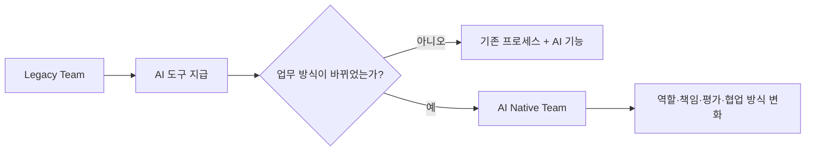

따라서 다음은 서로 다릅니다.

```text
AI 도입
→ 구성원이 사용할 도구가 생김

AI 업무 흐름
→ 업무 일부를 AI가 수행함

AX
→ AI를 중심으로 일하는 방식과 조직 운영이 바뀜
```

AX는 기술 설치 프로젝트보다 조직 변화에 가깝습니다. 모델과 도구를 배포하는 것은 시작일 뿐입니다.

## 되는가, 퍼지는가, 지속 가능한가

강의에서 AX를 판단하는 기준은 세 단계로 정리할 수 있었습니다.

### 1. 되는가

먼저 실제 문제를 해결해야 합니다.

- 결과가 업무에 사용할 수 있는가?
- 이전보다 시간이나 품질이 좋아졌는가?
- 사용자가 다시 사용하려고 하는가?
- 결과가 틀렸을 때 발견할 수 있는가?

에이전트의 데모가 인상적인 것과 실제 업무 결과가 나오는 것은 다릅니다.

### 2. 퍼지는가

한 사람의 사용법이 개인적인 노하우로 남지 않아야 합니다.

- 같은 팀의 다른 구성원도 사용할 수 있는가?
- 다른 부서가 자신의 업무에 적용할 수 있는가?
- 필요한 데이터와 도구가 연결돼 있는가?
- 교육 없이도 반복 가능한 흐름이 있는가?

### 3. 지속 가능한가

외부 AX팀이나 특정 개발자가 빠진 뒤에도 현업이 운영할 수 있어야 합니다.

- 결과 품질을 누가 관리하는가?
- 규정과 데이터가 바뀌면 누가 수정하는가?
- 비용과 권한을 누가 통제하는가?
- 불필요한 에이전트를 누가 폐기하는가?
- 장애가 나면 이전 방식으로 돌아갈 수 있는가?

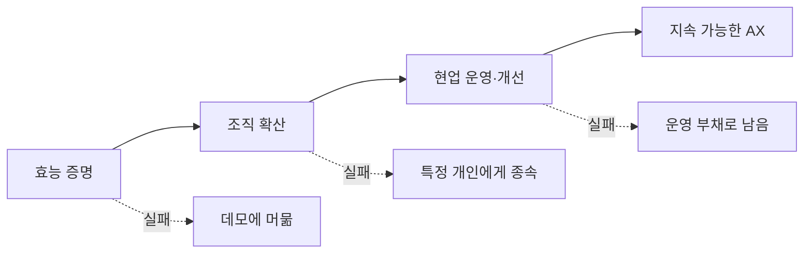

이 중 하나라도 빠지면 AX라고 부르기 어렵습니다.

> AX는 기능 구현이 아니라 효능 증명, 조직 확산, 지속 가능성 확보까지 이어지는 과정입니다.

## AI Native는 처음부터 끝까지 AI와 일하는 방식이다

강의에서는 AI로 초안만 만든 뒤 다른 사람에게 넘기는 것을 AI Native한 업무로 보지 않았습니다.

```text
요청
→ AI 초안
→ 동료에게 전달
→ 동료가 사실 확인·수정·완성
```

이 흐름에서는 AI를 사용한 사람이 시간을 절약했지만 검토 비용을 동료에게 넘겼을 수 있습니다.

AI Native한 방식은 업무 전체 사이클에 AI를 동반시키되 결과를 만든 사람이 끝까지 책임지는 것입니다.

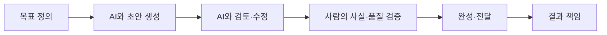

AI를 사용했다는 사실보다 다음이 중요합니다.

- 어떤 목표를 줬는가?
- 어떤 데이터를 사용했는가?
- 무엇을 검증했는가?
- 사람이 어디까지 확인했는가?
- 남은 불확실성은 무엇인가?

AI를 많이 사용하는 문화가 아니라 AI 결과를 끝까지 책임지는 문화가 필요합니다.

## 생산성은 멀티태스킹에서 나온다는 관점

강의에서는 AX의 생산성을 멀티태스킹과 연결했습니다.

사람이 한 작업을 붙잡고 AI의 모든 출력을 기다리는 방식보다 여러 실행을 병렬로 맡기고, 사람은 방향과 검토와 예외 처리에 집중하는 방식입니다.

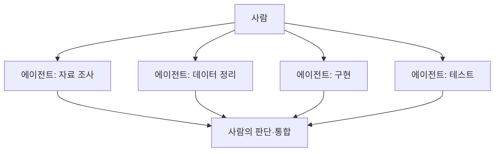

하지만 에이전트를 여러 개 띄운다고 멀티태스킹이 되는 것은 아닙니다.

- 진행 상태를 볼 수 있어야 합니다.
- 작업 간 의존성을 알아야 합니다.
- 결과 형식이 맞아야 합니다.
- 실패한 실행만 다시 맡길 수 있어야 합니다.
- 사람이 검토할 예외가 한꺼번에 몰리지 않아야 합니다.

개인의 멀티태스킹을 조직으로 확장하려면 에이전트 수보다 작업을 나누고 이어 붙이는 운영 체계가 먼저입니다.

## AI를 잘 쓰는 개발자보다 문제를 찾는 사람이 필요하다

강의에서 반복된 메시지 중 하나는 “문제를 풀어야 한다”였습니다.

AI를 잘 쓰는 개발자 한 명이 문화를 바꾸는 것이 아닙니다. 자동화할 문제가 미리 정확하게 주어지는 것도 아닙니다.

고객이나 현업에게 단순히 “무엇이 불편한가요?”라고 물으면 표면적인 요구가 돌아올 수 있습니다.

```text
현업의 요청
“이 Excel 버튼을 자동으로 눌러주세요.”

실제 문제
같은 정보를 세 시스템에 반복 입력하고
오류가 나면 어느 단계에서 틀렸는지 알 수 없음
```

말로 표현된 요구를 그대로 자동화하기보다 실제 업무를 관찰해야 합니다.

- 입력은 어디서 오는가?
- 사람이 어떤 순서로 도구를 사용하는가?
- 어디서 기다리는가?
- 어떤 예외를 눈으로 판단하는가?
- 결과를 누구에게 보고하는가?
- 보고를 받은 사람은 어떤 결정을 내리는가?
- 그 결정이 다음 실행으로 어떻게 이어지는가?

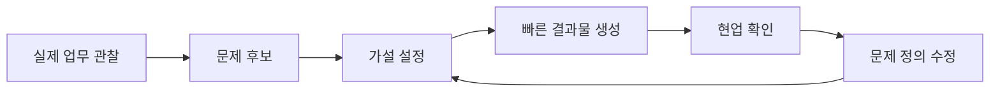

완벽한 요구사항 문서를 기다리기보다 에이전트로 결과물을 빠르게 만들어 보여주고, 현업의 반응으로 문제 정의를 수정하는 속도전이 중요하다는 관점입니다.

문제를 빨리 찾으려면 정답을 오래 고민하는 것보다 검증 가능한 시도 횟수를 늘려야 합니다.

## 왜 코딩 에이전트인가

강의에서는 업무 자동화에 코딩 모델을 적극적으로 사용해야 한다고 설명했습니다.

대화형 모델은 답변을 만들 수 있지만 코딩 에이전트는 필요한 프로그램을 만들고 실행하고 결과를 확인할 수 있습니다.

```text
대화형 답변
→ 설명이나 초안

코딩 에이전트
→ 파일 읽기
→ 코드 작성
→ 도구 실행
→ 테스트
→ 오류 수정
→ 실제 산출물 생성
```

코드는 상대적으로 맞고 틀림을 확인할 수 있는 신호가 많습니다.

- 컴파일되는가?
- 테스트가 통과하는가?
- 출력 스키마가 맞는가?
- 전후 데이터가 일치하는가?
- 배포 후 응답하는가?

물론 테스트가 통과했다고 업무 결과까지 옳다는 뜻은 아닙니다. 요구사항과 평가 기준이 잘못됐다면 에이전트는 틀린 목표를 정확하게 구현할 수 있습니다.

그래서 코딩 에이전트의 강점은 판단을 대신하는 데 있지 않습니다.

> 판단을 실행 가능한 프로그램으로 빠르게 바꾸고, 그 결과를 검증 가능한 형태로 만드는 데 있습니다.

## Build the agent보다 Power the agent

기업이 AX를 시작하면 업무별 에이전트가 빠르게 늘어날 수 있습니다.

```text
회의록 에이전트
보고서 에이전트
영업 에이전트
인사 에이전트
문서 검색 에이전트
데이터 분석 에이전트
```

처음에는 에이전트가 많을수록 AX가 빠르게 확산되는 것처럼 보입니다. 하지만 각 에이전트가 별도의 프롬프트, 지식베이스, 권한, 배포 방식, 소유자를 가지면 관리 대상만 늘어날 수 있습니다.

강의에서는 이를 “에이전트를 만들지 말고, 에이전트가 일하게 하라”는 문장으로 정리했습니다.

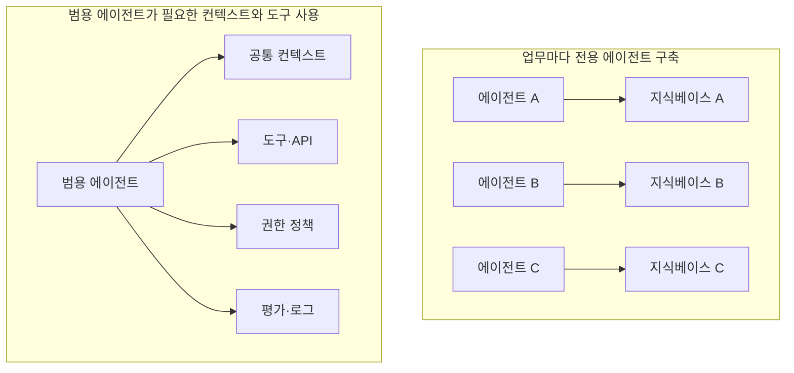

핵심 질문은 “새로운 에이전트를 무엇으로 만들까?”가 아닙니다.

- 에이전트가 읽을 회사 데이터가 있는가?
- 실제 업무를 끝낼 도구가 있는가?
- 도구마다 권한이 제한되어 있는가?
- 결과가 맞는지 확인할 수 있는가?
- 실패하면 중단하고 복구할 수 있는가?
- 다음 실행에 사용할 피드백이 남는가?

모델과 에이전트보다 이를 둘러싼 실행 환경이 더 중요해집니다.

## 지식베이스를 먼저 완성할 수는 없다

기업의 핵심 지식은 문서에만 있지 않습니다.

- 어떤 상황에서 규정의 예외를 허용하는가?
- 어떤 고객의 요청을 먼저 처리하는가?
- 같은 오류라도 언제 에스컬레이션하는가?
- 어떤 수치를 믿고 어떤 수치는 다시 확인하는가?
- 최종 승인자는 무엇을 보고 판단하는가?

이 지식은 숙련자의 경험과 대화와 행동 안에 암묵지로 남습니다.

과거에는 지식베이스를 먼저 완성하고 그 위에 에이전트를 만드는 접근이 많았습니다.

```text
문서 수집
→ 분류 체계 설계
→ 지식베이스 완성
→ RAG 구축
→ 에이전트 투입
```

하지만 지식은 계속 바뀌고, 기록되지 않은 예외는 실제 업무를 수행하기 전까지 드러나지 않습니다. 완벽한 지식베이스를 AX의 선행 조건으로 두면 시작이 끝없이 밀릴 수 있습니다.

강의에서는 두 트랙을 병렬로 운영하는 관점을 제시했습니다.

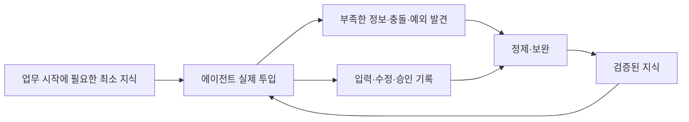

에이전트가 업무를 수행하는 동안 사람이 제공한 입력에는 다음 정보가 담깁니다.

- 업무 상황
- 판단 기준
- 예외 조건
- 기대 결과
- 수정 이유
- 승인과 반려 기준

이를 무조건 로그로 쌓는 것만으로는 부족합니다. 민감정보와 일회성 내용을 제거하고, 반복 가능한 규칙과 선례를 추출하고, 도메인 전문가가 검증해야 합니다.

```text
원시 프롬프트와 실행 기록
→ 민감정보 제거
→ 업무·역할·상황 메타데이터
→ 반복되는 기준과 예외 추출
→ 시니어 검증
→ 유효 기간과 책임자 부여
→ 다음 실행의 컨텍스트
```

지식베이스 구축은 별도의 대형 프로젝트가 아니라 실제 업무 실행에서 계속 갱신되는 과정이 됩니다.

## 컨텍스트 그래프는 결정의 흔적을 연결한다

문서를 많이 모았다고 에이전트가 회사의 업무 방식을 이해하는 것은 아닙니다.

Foundation Capital은 컨텍스트 그래프를 조직이 실제로 의사결정하는 방식에 대한 제도적 기억으로 설명합니다. 기존 시스템은 최종 가격, 승인된 할인, 에스컬레이션된 티켓 같은 결과는 저장하지만 어떤 예외와 선례가 적용됐고 누가 왜 승인했는지는 놓치기 쉽습니다. 이 빠진 기록을 decision trace라고 부르고, 이를 시스템과 시간에 걸쳐 연결한 검색 가능한 지도를 context graph로 설명합니다.[1]

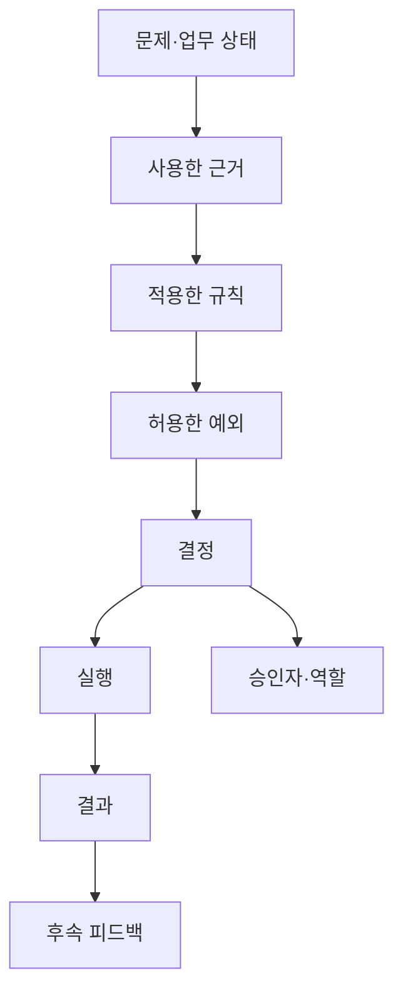

지식베이스와 컨텍스트 그래프는 질문이 다릅니다.

```text
지식베이스
→ 회사가 무엇을 알고 있는가?

RAG
→ 지금 질문에 필요한 지식을 어떻게 찾을까?

컨텍스트 그래프
→ 어떤 상황에서 어떤 근거와 예외를 거쳐
  누가 무엇을 결정했고 결과가 어땠는가?
```

RAG가 컨텍스트 그래프의 정보를 찾아 에이전트에 제공할 수는 있습니다. 하지만 문서 검색만으로 결정의 관계와 시간 흐름이 자동으로 생기지는 않습니다.

컨텍스트 그래프를 만든다는 말도 그래프 DB부터 도입한다는 뜻은 아닙니다.

> 좁은 실제 업무에서 판단과 실행의 흔적을 남기고, 검증한 뒤 다음 실행에 재사용하는 피드백 루프를 만드는 것이 먼저입니다.

## 에이전트 난립의 본질은 소유자 부재다

관리되지 않은 에이전트의 문제는 숫자가 많다는 데만 있지 않습니다.

### 소유자가 없다

오류가 발생해도 누가 고치고 중단하고 폐기할지 알 수 없습니다.

### 권한이 넓다

메일 발송, 문서 수정, DB 쓰기처럼 실제 결과를 만드는 권한이 목적보다 크게 부여될 수 있습니다.

### 지식과 프롬프트가 낡는다

정책과 데이터가 바뀌어도 과거 기준으로 계속 행동할 수 있습니다.

### 실행이 보이지 않는다

어떤 데이터를 읽고 어떤 도구를 사용했으며 왜 결과를 냈는지 추적할 수 없습니다.

### 비슷한 에이전트가 충돌한다

서로 다른 프롬프트와 지식으로 같은 업무를 처리해 결과가 달라질 수 있습니다.

### 폐기 기준이 없다

PoC가 끝난 뒤에도 서비스, 계정, 권한, 비용, 지식베이스가 남습니다.

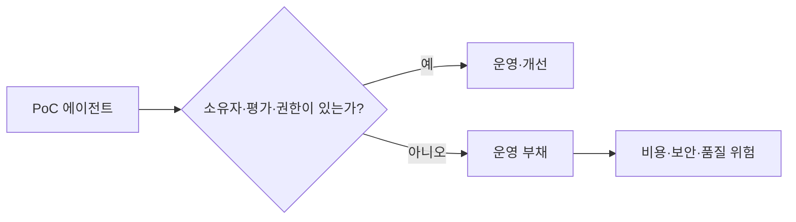

이 운영 문제를 보리스 체르니(Boris Cherny)가 제안한 다섯 역할로 보면, 전사 AX에는 Builder뿐 아니라 Maintainer와 Sweeper가 필요합니다.[2]

- Maintainer는 품질, 권한, 비용, 컨텍스트, 장애를 관리합니다.
- Sweeper는 중복된 기능을 통합하고 필요 없는 에이전트를 폐기합니다.

만드는 속도만 측정하면 운영 부채도 성과로 집계됩니다.

## AI First가 워크슬롭이 될 때

AI First는 구성원이 기존 습관으로 돌아가지 않고 AI를 실제 업무에 사용하게 만드는 강한 신호가 될 수 있습니다.

반대로 검증과 책임 없이 “무조건 AI부터”만 강조하면 워크슬롭이 생깁니다.

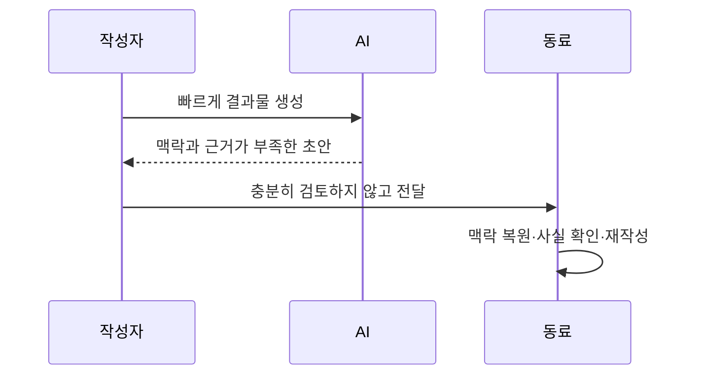

개인의 작성 시간은 줄었지만 조직 전체의 검토 시간은 늘어날 수 있습니다.

이를 막으려면 결과와 함께 검증 상태를 전달해야 합니다.

```text
AI 사용 범위
사람의 검토 범위
참고한 데이터와 근거
통과한 검사와 평가
확인하지 못한 부분
수신자에게 필요한 추가 검토
```

“AI를 사용했는가”보다 “결과를 누가 어느 수준까지 책임지는가”가 중요합니다.

## 리더가 먼저 AI Native해야 하는 이유

강의에서는 전 직원에게 같은 AI 교육을 제공하는 것보다 리더가 먼저 AI Native하게 일하는 것이 중요하다고 강조했습니다.

실무자가 AI로 결과를 빨리 만들어도 의사결정과 보고 체계가 그대로라면 조직의 속도는 바뀌지 않습니다.

```text
실행 속도 증가
→ 기존 보고서 형식으로 재가공
→ 기존 승인 회의 대기
→ 기존 의사결정 주기
→ 조직 리드타임은 그대로
```

리더가 바뀌면 업무 지시의 형태도 바뀔 수 있습니다.

- 완성된 보고서만 기다리지 않고 중간 산출물을 봅니다.
- 결과뿐 아니라 근거와 불확실성을 함께 요구합니다.
- 반복 보고를 에이전트가 읽을 수 있는 구조로 바꿉니다.
- 여러 실행을 병렬로 맡기고 예외에 집중합니다.
- 에이전트 사용의 품질과 비용을 조직 지표로 봅니다.

AX를 바텀업으로만 추진하면 실무 속도와 조직 의사결정 속도의 차이가 새로운 병목이 될 수 있습니다.

## Vertical Narrow Workflow가 필요한 이유

업무 하나만 자동화하면 그 앞뒤에서 사람이 다시 연결해야 합니다.

```text
실무 데이터 정리 자동화
→ 사람이 보고서 작성
→ 상위 조직 승인 대기
→ 사람이 후속 작업 전달
```

강의에서는 범위는 좁게 잡되 수직적인 흐름을 관통하는 Vertical Narrow Workflow를 제시했습니다.

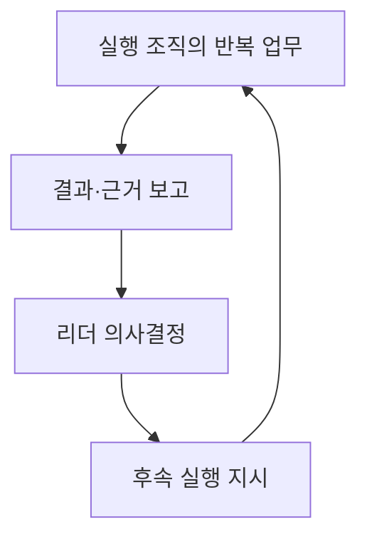

예를 들어 전사 영업 전체를 바꾸려 하기보다 하나의 좁은 승인 업무를 선택합니다. 그 안에서는 데이터 수집부터 보고, 의사결정, 후속 실행까지 연결합니다.

```text
범위
→ 좁게

업무 흐름
→ 실행부터 의사결정까지 끝까지
```

이 방식은 한 단계의 시간 절감이 전체 리드타임 개선으로 이어지는지 확인할 수 있게 합니다.

다만 강의에서는 이런 접근을 시도해도 조직 전체가 쉽게 바뀌지 않았다는 회고도 함께 나왔습니다. 자동화된 흐름이 있다는 사실만으로 역할과 평가와 문화가 따라 바뀌지는 않기 때문입니다.

## FDE는 쇄빙선이어야 한다

FDE는 현업에 깊이 들어가 문제와 해법을 함께 찾는 역할입니다.

- 실제 업무를 관찰합니다.
- 도메인을 공부합니다.
- 문제 가설을 세웁니다.
- 에이전트로 결과물을 빠르게 만듭니다.
- 현업 반응을 보고 문제 정의를 바꿉니다.
- 구현·배포·정착까지 이어갑니다.

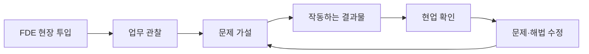

강의에서는 FDE를 쇄빙선으로 표현했습니다. 단단하게 굳은 프로세스와 기술·문화 장벽을 먼저 깨고 AX가 들어갈 첫 경로를 만드는 역할입니다.

그러나 진입 기준과 종료 기준이 없으면 FDE와 중앙 AX팀이 현업의 모든 일을 대신하는 팀이 될 수 있습니다.

FDE의 성공은 고객이나 현업이 계속 의존하는 상태가 아닙니다.

```text
첫 경로 개척
→ 현업과 공동 설계
→ 도구·규칙·지식·검증 방법 이전
→ 현업이 직접 운영
→ FDE 의존 감소
```

궁극적으로는 FDE가 필요 없어져야 합니다.

## AI Native 팀에서는 역할을 나누는 기준도 달라진다

이 다섯 역할은 강연자가 새로 만든 구분이 아닙니다. Claude Code를 만든 보리스 체르니가 Claude Code 팀을 관찰하며 제안한 다섯 가지 원형(archetype)이고, 강의에서는 이를 AI Native 팀의 역할 변화와 연결해 소개했습니다.[2]

체르니의 핵심 관찰은 엔지니어링·제품·디자인·데이터 사이의 경계가 흐려지면서 미래의 역할이 기존 직무명보다 제품에 기여하는 방식에 가까워질 수 있다는 것입니다.

```text
Prototyper
→ 새로운 아이디어를 많이 만들고 가능성을 빠르게 확인
→ 대부분은 실제 출시까지 이어지지 않을 수 있음

Builder
→ 프로토타입과 아이디어를 프로덕션 수준의 제품·인프라로 전환

Sweeper
→ UI와 코드·시스템을 단순화하고, 불필요한 기능을 걷어내며 성능 최적화

Grower
→ 이미 만들어진 제품을 반복 개선해 Product-Market Fit을 강화

Maintainer
→ 성숙한 시스템을 안전하고 안정적이며 빠르고 효율적으로 확장
```

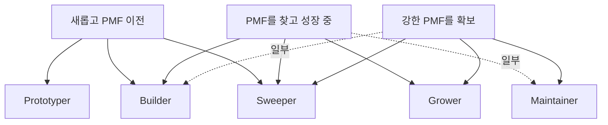

한 사람이 반드시 하나의 역할에만 속하는 것은 아닙니다. 체르니는 많은 사람이 두 역할, 때로는 세 역할에 걸쳐 있으며 이 원형들이 엔지니어·디자이너·PM·데이터 과학자 같은 직무에 고정되지 않는다고 설명했습니다.[2]

필요한 역할의 조합은 제품의 성숙도에 따라 달라집니다.[2]

| 제품 단계 | 필요한 역할 조합 |
| --- | --- |
| 새롭고 PMF 이전 | Prototyper + Builder + Sweeper |
| 성장 중이며 PMF를 찾음 | Builder + Sweeper + Grower, 일부 Maintainer |
| 강한 PMF를 확보함 | Sweeper + Grower + Maintainer, 일부 Builder |

즉 다섯 역할은 모든 사람이 차례로 거쳐야 하는 승진 단계가 아닙니다. 제품 상태에 따라 팀이 갖춰야 할 서로 다른 기여 방식입니다.

강의에서는 현재 AI 업계가 만드는 일에 많은 관심을 뒀지만, 엔터프라이즈에서는 유지보수와 폐기가 더 중요해지고 있다는 관점으로 이 구분을 확장했습니다.

시니어와 주니어의 역할도 다르게 볼 수 있습니다.

- 시니어는 도메인 지식, 판단 기준, 예외를 AI와 조직에 전달합니다.
- 주니어는 AI와 빠르게 결합해 실행 생산성을 높입니다.
- 장기적으로는 이미 만들어진 자동화를 이해하고 검증하고 운영하는 Maintainer 역량이 필요합니다.

시니어의 암묵지와 주니어의 실행 속도가 결합돼야 개인의 생산성이 조직의 생산성으로 이어집니다.

## 보안은 멈출 이유가 아니라 설계 조건이다

기업에서는 보안과 비용이 AX의 실제 장애물입니다.

- 외부 모델에 데이터를 보낼 수 없습니다.
- 사용량이 늘면 비용을 예측하기 어렵습니다.
- 망분리 환경에서 외부 API를 호출할 수 없습니다.
- 에이전트가 어떤 정보를 읽었는지 감사해야 합니다.
- 도구 호출이 실제 시스템을 변경할 수 있습니다.

강의에서는 보안을 AX를 하지 않는 이유가 아니라 풀어야 할 조건으로 봤습니다.

```text
민감 데이터
→ 로컬·사내 배포 모델 검토

도구 실행
→ 최소 권한과 승인 게이트

프롬프트·결과 로그
→ 마스킹·접근 제어·보존 기간

비용
→ 모델 라우팅·예산·중단 조건

망분리
→ 내부 도구와 모델 배포 방식
```

그렇다고 보안 요구를 낙관적으로 보면 안 됩니다. 로컬 모델을 사용해도 입력 로그를 외부 관측 서비스로 보내면 회사 데이터가 나갈 수 있습니다. 모델 위치뿐 아니라 전체 데이터 흐름을 봐야 합니다.

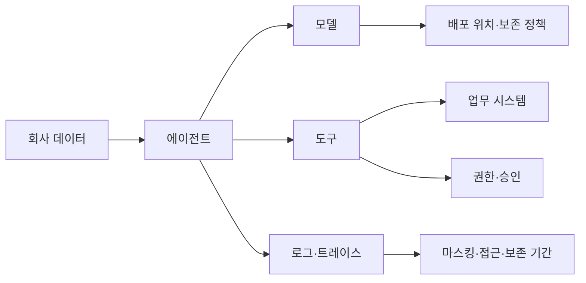

보안은 한 번의 승인 문서가 아니라 데이터, 권한, 실행, 로그를 잇는 아키텍처입니다.

## 전사 AX를 시작하는 현실적인 순서

강의 내용을 실행 순서로 다시 정리하면 다음과 같습니다.

### 1. 전사에 도구부터 뿌리지 않는다

에이전트가 난립하기 전에 좁은 업무와 책임자를 고릅니다.

### 2. 실제 업무를 관찰한다

요청받은 기능이 아니라 입력·판단·예외·보고·후속 실행을 봅니다.

### 3. 최소한의 데이터와 도구만 연결한다

완성된 지식베이스를 기다리지 않되 에이전트가 사용할 사실과 권한의 경계를 만듭니다.

### 4. 결과물을 빠르게 보여준다

가설을 프로그램과 산출물로 만들고 현업 반응으로 문제 정의를 갱신합니다.

### 5. 사람의 승인과 책임을 남긴다

AI 결과를 그대로 다음 사람에게 넘기지 않습니다. 검증 범위와 불확실성을 표시합니다.

### 6. 실행 흔적에서 지식을 증류한다

프롬프트, 수정, 반려, 예외, 승인에서 재사용 가능한 컨텍스트를 만듭니다.

### 7. 운영 역할과 폐기 기준을 정한다

Builder뿐 아니라 Maintainer와 Sweeper를 둡니다.

### 8. 부서의 수직 흐름까지 연결한다

실행 한 단계만 줄이지 않고 보고·의사결정·후속 실행까지 실제 리드타임을 봅니다.

### 9. 현업에 운영권을 넘긴다

외부 FDE와 중앙 AX팀이 빠져도 업무가 돌아가야 합니다.

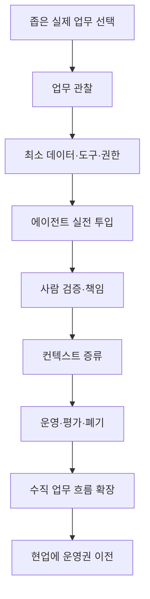

## 무엇을 측정해야 할까

에이전트 호출 수와 토큰 사용량만으로는 AX 성과를 알 수 없습니다.

### 업무 결과

- 처리량
- 전체 리드타임
- 오류와 재작업률
- 결과 품질
- 대기 시간

### 사람의 변화

- 수동 판단 횟수
- 검토에 걸리는 시간
- 예외 처리 부담
- 다른 구성원의 재사용률
- 원래 담당자 없이 운영 가능한지

### 에이전트 운영

- 성공·실패율
- 사람에게 에스컬레이션한 비율
- 잘못된 도구 호출
- 작업당 비용
- 중단과 복구 시간
- 오래된 지식으로 발생한 오류

### 조직 확산

- 한 팀의 성공이 다른 팀에서도 재현되는가?
- 새로운 업무에 적용할 때 원래 개발자가 필요한가?
- 현업이 기준과 지식을 직접 갱신하는가?
- 중복 에이전트가 줄어드는가?
- 운영 책임자가 명확한가?

```text
AX 성과
≠ AI 사용량

AX 성과
= 검증된 업무 결과
+ 사람의 역할 변화
+ 조직 확산
+ 지속 가능한 운영
```

## 마무리

개인의 AI 생산성이 조직의 AX로 이어지지 않는 이유는 AI 성능이 부족해서만은 아닙니다.

- 업무 전체가 아니라 한 단계만 빨라집니다.
- 결과 검토 비용을 동료에게 넘깁니다.
- 현업의 암묵지가 컨텍스트로 남지 않습니다.
- 에이전트의 소유자와 폐기 기준이 없습니다.
- 실무 속도는 빨라지지만 보고와 의사결정은 그대로입니다.
- 외부 AX팀과 특정 개발자에게 운영이 종속됩니다.

그래서 AX에는 개발만 필요한 것이 아닙니다.

```text
문제 발굴
+ 빠른 구현
+ 현업 교육
+ 조직문화 변화
+ 컨텍스트 축적
+ 권한과 보안
+ 품질 평가
+ 유지보수와 폐기
```

이 전체가 연결돼야 합니다.

강의의 핵심을 한 문장으로 줄이면 다음과 같습니다.

> 에이전트를 더 많이 만드는 것이 아니라, 에이전트가 실제 조직 안에서 안전하게 일하고 그 방식이 현업에 남도록 만들어야 합니다.

개인이 AI를 잘 쓰는 것은 출발점입니다. 조직이 바뀌려면 그 사용법이 데이터와 도구와 검증과 책임 구조로 바뀌어야 합니다.

```text
되는가
→ 퍼지는가
→ 지속 가능한가
```

세 질문에 모두 답할 수 있을 때 개인의 효능은 조직의 AX가 됩니다.

## Sources

[1] https://foundationcapital.com/ideas/the-case-for-context-graphs — Foundation Capital, The case for context graphs
[2] https://www.threads.com/@boris_cherny/post/DaJgVFVj2PB/as-engineering-product-design-ds-etc-melt-into-a-new-kind-of-role-i-was — Boris Cherny, Five archetypes on the Claude Code team
